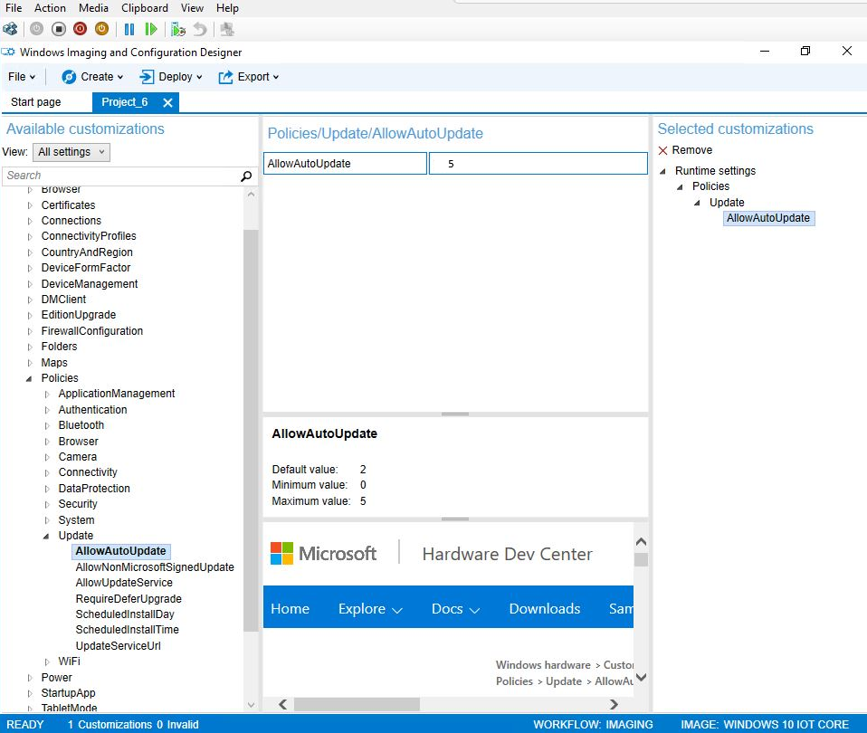
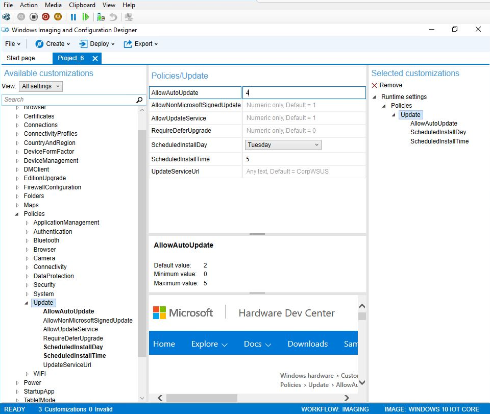
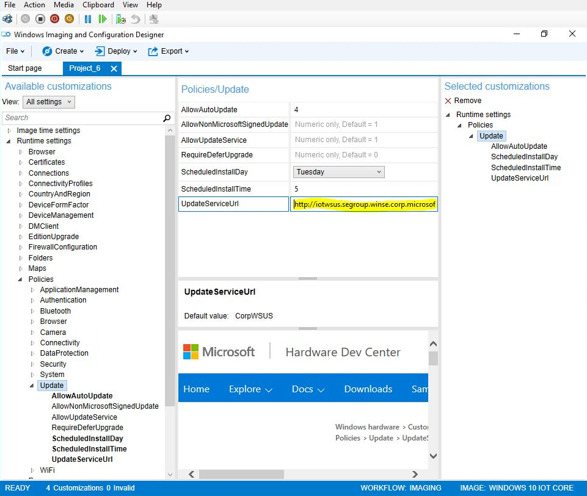
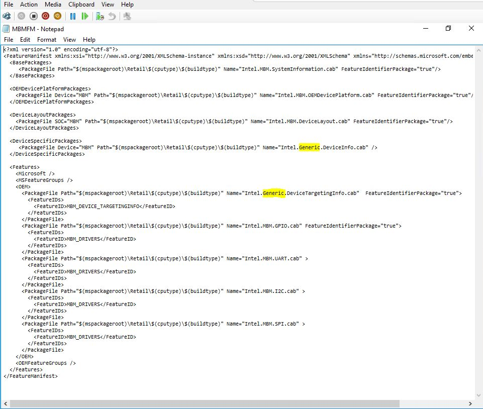

# Manage IoT Core device updates

OEM and enterprise customers using Windows 10 IoT Core Pro (IoT Core Pro) can take advantage of device management configuration service providers (CSPs) that allow some control over the device update process.

**Note**  Windows 10 IoT Core (IoT Core) update management only applies to Windows 10 IoT Core Pro. For more information about licensing Windows 10 IoT Core Pro, see [Microsoft Commercial Terms of Use for Windows 10 IoT Core](http://go.microsoft.com/fwlink/?LinkID=614849).

 

Device Management Policy can be set using either the Windows Imaging and Configuration Designer (ICD) tool or a mobile device management (MDM) service. See [Mobile Device Management](https://msdn.microsoft.com/windows/hardware/dn914769.aspx ) for more detail about device management protocols.

## AllowAutoUpdate to turn updates on or off

Updates for IoT Core Pro can be turned off by setting the AllowAutoUpdate policy.

-   If the AllowAutoUpdate policy is not configured, devices will get IoT Core updates as usual at 3am.
-   If the AllowAutoUpdate policy set to **5**, automatic updates for IoT Core are turned off.

## AllowAutoUpdate to control updates

The AllowAutoUpdate policy can also control the timing of updates for IoT Core:

If the AllowAutoUpdate policy is set to **4**, IoT Core updates will automatically install and the device will restart at a specified time. An IT administrator specifies the install day/time (i.e., every Sunday at 3am). If no day/time is specified, the install time defaults to 3 AM daily. All end-user updated related notifications are suppressed as well.
View the set time in ` <LocURI>./Vendor/MSFT/PolicyManager/Device/Update/ScheduledInstallDay</LocURI>` or ` <LocURI>./Vendor/MSFT/PolicyManager/Device/Update/ScheduledInstallTime</LocURI>` in **syncml**.

## Deferring updates

The AllowAutoUpdate policy can also control the timing of updates for IoT Core:

Non-critical updates for IoT Core can be deferred for a maximum of 120 days by using Windows Server Update Services (WSUS). In this process, the devices are configured to use the WSUS server for update service instead of Windows Update. The IT admin gets IoT Core updates from the Microsoft Update Catalog and downloads the updates for later deployment.
**Note**  When a WSUS server is configured on an IoT Core device, the trigger to ping the server for updates is suppressed.

 

To configure WSUS on an IoT Core image:

1.  On the **Windows ICD Start Page**, select the IoT Core project you’d like to modify.
2.  Under **Available Customizations**, expand to **Runtime settings**, then **Policies**, and then **Update**.
3.  In the **Policies/Update** info pane, change the **UpdateServiceURL** to the address of the WSUS server that will be used.

To select IoT Core updates in the WSUS catalog site:

1.  In the WSUS administrative console, select **Updates**, and in the Actions pane click **Import Updates**.
2.  A browser window will open at the Microsoft Update Catalog Web site.
3.  You can search this site for IoT Core updates by device, OEM, and firmware. When you find the ones you need, add them to your basket.
4.  Go to the basket and click **Import** to import your updates to the server. To download the updates directly without importing them, clear the **Import directly into Windows Server Update Services** checkbox and save the download.

## OS updates only

An IoT Core device can be set to receive OS updates from Microsoft and not OEM updates:

**For Windows 10, version 1607**: use IoT\_GENERIC\_POP in the OemInput XML. (You can no longer use the Intel.Generic.DeviceInfo.cab, this file has been removed.)

**For Windows 10, version 1511**: 
To configure a device to receive only OS updates, you must edit the OEM Feature Manifest XML for the device. The feature manifest for supported devices can be found at the following directory locations on the device:

-   **MinnowBoard Max:**` C:\Program Files (x86)\Windows Kits\10\FMFiles\x86\MBMFM.xml`
-   **Raspberry Pi 2:**` C:\Program Files (x86)\Windows Kits\10\FMFiles\arm\RPi2FM.xml`
-   **Qualcomm DragonBoard:** ` C:\Program Files (x86)\Windows Kits\10\FMFiles\arm\QCDB410CFM.xml`

In the **&lt;DeviceLayoutPackages&gt;** and **&lt;Features&gt;**sections, remove the device identifier and replace with **Generic**. For example **Intel.MBM.DeviceInfo.cab** becomes **Intel.Generic.DeviceInfo.cab**.

 

 

