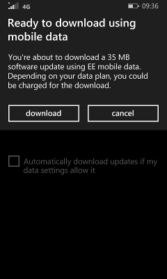

# Enable zero-rating (no-charge) downloads for device updates

Mobile Operators (MOs) can enable devices to receive updates without being charged for data usage by adding the Windows Update servers to their list of zero-rated sites.

This method only allows updates from the Windows Update servers to be zero-rated. Other network traffic, such as store updates or updates for devices using Internet Connection Sharing (ICS) are not zero-rated.

## Enabling zero-rating

Add the following two URLs to your network as zero-rated sites:

-   http://wp.download.windowsupdate.com

-   http://wp.ds.download.windowsupdate.com

Once those URLs are zero-rated, there are no more actions to take to get zero rating in place. It will be effective for alldevices (both operator variant and open market devices).

## Testing zero-rating

To test zero rating, you'll need to trigger an update over cellular which is small enough to stay under the limit defined by your MO. For example, an MO may limit zero-rating downloads to 100MB or less.

1.  Start with a retail device that's ready for an update.

2.  Remove the SIM card (if it has one). Check how much data usage it has associated with it for the current period. Consult with the MO for specific instructions.

3.  Disable all Wi-Fi options:

    1.  In Settings: **Wi-Fi**:

        Change **Wi-Fi networking** to **Off**.

        Change **Turn Wi-Fi back on** to **Manually**.

        Tap Wi-Fi sense, and change **Connect to Wi-Fi hotspots** to **Off**.

    2.  In **Settings** &gt; **Update & recovery** &gt; **Phone update**, clear the **Automatically download updates if my data settings allow it** checkbox.

4.  Force the update through the cellular connection:

    1.  Allow the device to boot up.

    2.  Turn off the device, and then insert a SIM card associated with a data plan.

    3.  Connect the device to power again, boot it up and sign in with your account.

    4.  Search for the update: **Settings** &gt; **Update & recovery** &gt; **Phone update**. You should be able to force the update through the cellular connection.

        Note, you may see a warning saying that you may be charged for the download:

        

    5.  After the download completes, check the data plan usage to see if the device was charged for the update.

## Related topics

[Update](index.md)

 

 

