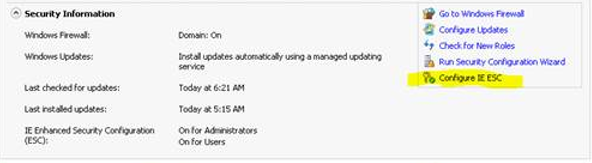
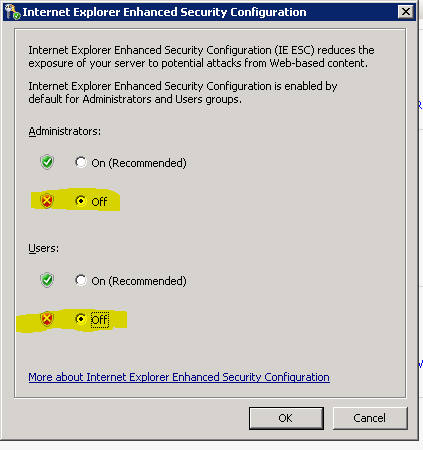

# Ingestion Client for Windows Phone


The ingestion client is a set of [Windows PowerShell](http://go.microsoft.com/fwlink/p/?LinkId=389794) cmdlets that are used to communicate with services to retrieve and submit code-signing and update requests to and from Microsoft.

-   [Initialize-FirmwareSubmission cmdlet](initialize-firmwaresubmission-cmdlet.md)

-   [New-FirmwareSubmission cmdlet](new-firmwaresubmission-cmdlet.md)

-   [Get-SignedFirmwareSubmission cmdlet](get-signedfirmwaresubmission-cmdlet.md)

-   [New-RequestForUpdate cmdlet](new-requestforupdate-cmdlet.md)

-   [New-RequestForMicrosoftUpdate cmdlet](new-requestformicrosoftupdate-cmdlet.md)

-   [Get-RequestForUpdate cmdlet](get-requestforupdate-cmdlet.md)

-   [Request-UpdateCancellation cmdlet](request-updatecancellation.md)

To use the ingestion client, the following tasks that are elaborated further in this topic must be completed.

1.  Follow the instructions in the [Sign up for retail package signing and updates](#provision-certs) section later in this topic to send the OEM x.509 certificates and manage the public and private key associated with each certificate.

2.  Follow the instructions in the [Install the prerequisite software](#install-pre) section later in this topic to install the pre-requisite software to use the ingestion client.

3.  Follow the instructions in the [Install the ingestion client](#install) section later in this topic to install the ingestion client and configure the ingestion client to use the provisioned certificate from the previous step.

<a name="provision-certs"></a>
## Sign up for retail package signing and update submissions


This section reviews the steps that you must perform to sign up for retail package signing and updates. When this process is complete, you will be able to submit packages and updates to Microsoft for retail signing. For general info about retail and test code signing, see [Code signing](https://msdn.microsoft.com/library/windows/hardware/dn756634).

To ensure that the communication between OEMs and Microsoft is secure, the ingestion client uses X.509 certificates for authentication. As part of signing up, the OEM is required to send a valid X.509 certificate public key to Microsoft before it can use the ingestion client. This allows Microsoft to identify the user of the client, and authorize corresponding access to their data. The private key is retained by the OEM and used to access the update server.

To sign up for package and update signing, submit a request via e-mail to <WPSignOB@Microsoft.com> with a subject title of "Onboarding Request for \[Your OEM Company Name\]". This e-mail must include the following attachments:

1.  The OEM onboarding form that you can download from [here](http://go.microsoft.com/fwlink/p/?LinkId=394161). For step-by-step guidance, see [Walkthrough for Onboarding for Code Signing and Updates](http://cmsresources.windowsphone.com/devcenter/oem/downloads/Onboarding-for-Code-Signing-and-Updates.pptx).

2.  One or more code signing authentication certificates. For each certificate, include:

    1.  The public portion of the key attached as a .CER file.

    2.  The certificate provisioning request form. The form includes details about the certificate requirements, and information about how to fill out the form. You can download the certificate provisioning request form from [here](http://go.microsoft.com/fwlink/p/?LinkId=394159).

It typically takes about one business week to complete these requests. Once you are onboarded, you will receive an e-mail that will include instructions about how to download the signing tools and documentation, how to submit update requests, and other additional information.

**X.509 certificate guidelines**

-   The OEM owns the certificate and is responsible for its security. The private key of the certificate represents the identity of the OEM. The OEM must manage it using industry best practices and protect it as an important and confidential asset. The OEM may provide multiple certificates, but they are encouraged to keep the number of certificates small. This ensures that the OEM will not be burdened by a frequent time-based revocation policy for certificates, and it will reduce operational overhead. Typically, an OEM geographic site is expected to have one or two certificates.

-   By default, the same certificate is provisioned for production and pre-production environments unless specifically requested otherwise by the OEM.

-   The OEM must notify Microsoft when a certificate is revoked, expires, or for any other reason that would require Microsoft to de-activate the certificate.


<a name="install-pre"></a>
## Install the prerequisite software


The ingestion client requires Windows Identity Foundation and Windows PowerShell 3.0.

The recommended steps to provision a machine for the client are as follows:

1.  Install Windows Server 2012 R2, Windows 8.1, or another supported OS.

2.  Apply all patches using Windows Update.

3.  If necessary, add the computer to an active directory domain.

4.  After the computer is joined to the domain, re-check Windows Update and apply all patches.

5.  For Windows Server editions, complete two additional steps:

    1.  Configure Internet Explorer Enhanced Security by clicking **Configure IE ESC**.

        

    2.  In the Internet Explorer Enhanced Security Configuration dialog, select **Off** for Administrators and set **Off** for Users.

        

6.  Install Windows Identity Foundation (WIF). In Windows 8, WIF is available as an OS feature. It can be installed by using “Turn Windows features on or off” in Control Panel, Programs and Features. For Windows Server 2008 R2, download and install WIF from <http://go.microsoft.com/fwlink/p/?LinkId=389793>.

7.  Install Windows PowerShell 3.0 (Windows Management Framework 3.0). In Windows 8, PowerShell is available as an OS feature. It can be installed by using **Turn Windows features on or off** in Control Panel, Programs and Features. For Windows Server 2008 R2, download and install Windows PowerShell from [http://go.microsoft.com/fwlink/p/?linkid=240290](http://go.microsoft.com/fwlink/p/?LinkID=240290).

8.  Use Windows Update to apply all patches.

9.  After the prerequisites are installed, the next steps are to provision an X.509 certificate and install the ingestion client using the instructions in this document.

## <span id="install"></span><span id="INSTALL"></span>Install the ingestion client


**Note**  
The 64-bit version of the ingestion client is no longer supported as of 12/9/2013. If the 64-bit version is installed, it must be uninstalled and then the 32-bit version must be installed.

 

The ingestion client can be installed on the following operating systems:

-   Windows Server 2012 R2

-   Windows 8.1

-   Windows Server 2012

-   Windows 8

-   Windows Server 2008 R2

-   Windows 7

The ingestion client must be installed by executing **msiexec** from an elevated command prompt. Information about the specific values that will be used is covered later in this document.

These values can be changed later by editing this XML configuration file that is created during installation, %ProgramFiles(x86)%\\Microsoft\\WP Ingestion Client\\Modules\\ Microsoft.Phone.PartnerServices.Client\\Microsoft.Phone.PartnerServices.Client.dll.config.

By default, the installation will provide a user interface. To prevent the UI from being displayed, use the /qn, quiet option. For more information about **msiexec**, see [Msiexec](http://go.microsoft.com/fwlink/p/?LinkId=389794).

**Installation Syntax**

The command to install the client requires the following parameters:

-   *BASEURI*: The URI of the Microsoft partner service.

-   *NAMESPACE*: Access control for the Microsoft partner service.

-   *MYCLIENTCERTIFICATEPATH*: The fully qualified path to a certificate file that contains the private key.

-   *PFXPASSWORD*: The password of the certificate file that is specified in the MYCLIENTCERTIFICATEPATH parameter.

The parameters are specified in the following format:

``` syntax
msiexec /I WPIngestionClient.msi 
    BASEURI="[Microsoft service environment URL]"
    NAMESPACE="[Microsoft access control identifier]" 
    MYCLIENTCERTIFICATEPATH="[Path of OEM PFX file]"
    PFXPASSWORD="[Password of PFX file]"
    /l*v install.log
```

After obtaining a valid X.509 certificate run the following install:

-   Production (retail image signing): Install the client to submit or retrieve requests to the Microsoft production environment:

    ``` syntax
    msiexec /I WPIngestionClient.msi 
        BASEURI="http://wp8partnerservicesv1.cloudapp.net:7159"
        NAMESPACE="wp8partnerservicesv1" 
        MYCLIENTCERTIFICATEPATH="C:\Certificates\OemSecretCertificateWithPrivateKey.pfx"
        PFXPASSWORD="Password-Of-OemSecretCertificateWithPrivateKey.pfx"
        /l*v install.log
    ```

In this example, “C:\\Certificates\\OemSecretCertificateWithPrivateKey.pfx” is used as a placeholder to represent the location of a valid X.509 certificate created by the OEM.

**Note**  
-   The certificate private key file and password specified as parameters to install are used to configure the X.509 certificate in the local machine’s certificate store. The password is not stored elsewhere and is not exchanged with Microsoft.

 

In addition to installing the ingestion client, the install command creates the folder %ProgramData%\\Microsoft\\WP Ingestion Client\\. This folder contains the subfolders Backup and Logs. The Backup subfolder is used to store the client configuration for uninstall. The Logs subfolder is used to store client cmdlet diagnostic log information.

## <span id="troubleshooting"></span><span id="TROUBLESHOOTING"></span>Troubleshooting the ingestion client


**Exceptions**

`Microsoft.Phone.PartnerServices.Exceptions.UnknownErrorException.` An error has occurred. The HTTP request was forbidden with client authentication scheme ‘Anonymous’…

If the “Microsoft.Phone.PartnerServices.Exceptions.UnknownErrorException” exception is thrown when any of the cmdlets are used, the issue is most likely caused by the HTTP proxy settings within the OEM’s network. Either the maximum message size limit configured in the HTTP proxy is too small to upload the submitted packages, or the port that is used to upload the packages is blocked. Try correcting the HTTP proxy settings within the OEM’s network and try again.

**Verbose option**

The cmdlets support additional information about command processing via the PowerShell common **Verbose** parameter.

By default, the verbose messages are not displayed, but this can be changed by specifying the common parameter on any command. When enabled, the cmdlet writes text to the verbose stream in Windows PowerShell.

Consider a typical example where an existing signed firmware submission is retrieved. This is the terse output of such a cmdlet:

``` syntax
PS> Get-SignedFirmwareSubmission –TicketId TKT-SIGN-TEST-BTUADL -DownloadDirectory C:\temp | Format-List

TicketId : TKT-SIGN-TEST-BTUADL
File     : c:\temp\OemTest.TKT-SIGN-TEST-BTUADL.zip
```

When the **Verbose** parameter is specified, additional information about the interaction with the service is displayed:

``` syntax
PS> Get-SignedFirmwareSubmission –Verbose –TicketId TKT-SIGN-TEST-BTUADL -DownloadDirectory C:\temp | Format-List

VERBOSE: Parameter assignment: 'TicketId' = TKT-SIGN-TEST-BTUADL.
VERBOSE: Downloading OemTest.TKT-SIGN-TEST-BTUADL.zip in 4194304 byte chunks.
 File is 17341441 bytes long.
VERBOSE: Start reading chunk 0, 0 - 4194303 bytes.
VERBOSE: Start reading chunk 1, 4194304 - 8388607 bytes.
VERBOSE: Start reading chunk 2, 8388608 - 12582911 bytes.
VERBOSE: Start reading chunk 3, 12582912 - 16777215 bytes.
VERBOSE: Start reading chunk 4, 16777216 - 17341440 bytes.
VERBOSE: Writing block number 0 of size 4194304.
VERBOSE: Writing block number 1 of size 4194304.
VERBOSE: Writing block number 2 of size 4194304.
VERBOSE: Writing block number 3 of size 4194304.
VERBOSE: Writing block number 4 of size 564225.
VERBOSE: File successfully downloaded to OemTest.TKT-SIGN-TEST-BTUADL.

TicketId : TKT-SIGN-TEST-BTUADL
File     : c:\temp\OemTest.TKT-SIGN-TEST-BTUADL.zip
```

**Diagnostic Logs**

The default location of diagnostic output from the ingestion client is: “C:\\ProgramData\\Microsoft\\WP Ingestion Client\\Logs”

**Escalating a problem to Microsoft**

To escalate a problem to Microsoft, send the following information by submitting a bug using the bug system you have been provided access to.

-   Description of the attempted scenario

-   Screen shots

-   Log files

-   Configuration file: Microsoft.Phone.PartnerServices.Client\\Microsoft.Phone.PartnerServices.Client.dll.config

-   Ticket ID

-   Correlation Value. This can be retrieved from the [Get-SignedFirmwareSubmission cmdlet](get-signedfirmwaresubmission-cmdlet.md).

 

 