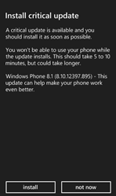
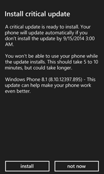
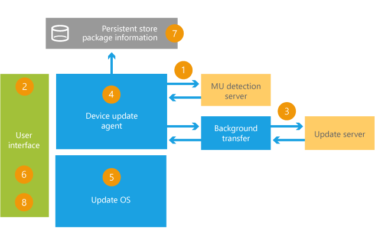

# Scan, download, and install updates

Devices can automatically scan for updates, download them, and prompt the user to install them at a time that’s right for them. They can also identify updates that are too important to pass by.

## Normal, strongly suggested, and mandatory updates

Some users don’t want to be bothered by updates. If they don’t know if they’re important, they may postpone them indefinitely.

To help identify important updates, mark them as strongly suggested updates (SSU) or mandatory updates by opening a Team Foundation Server (TFS) Update request and marking this in the notes.

We’ll set this up on the Windows Update server.

## Detecting updates

By default, the device regularly checks for updates. This process occurs in the background and does not interrupt the use of the device.

The automatic scan occurs on the following schedule:

-   Every 6.2 days when on a cellular connection. This will trigger up to one day earlier if a Wi-Fi connection is available.

-   Every day when the device is on AC power and when the user is not actively using the device.

-   Each time the device is rebooted, the scan starts 60 minutes after boot is complete.

The automatic scan uses either a Wi-Fi or a cellular connection:

1.  For the first scan, the device scans when either a Wi-Fi or a cellular connection is available.

2.  For the first scan after a successful update, the device scans when either a Wi-Fi or a cellular connection is available.

3.  If time since previous scan is less than 6.2 days, the phone will only scan if a Wi-Fi connection is available.

4.  If time since previous scan is 6.2 days or more, the phone will scan if either a Wi-Fi or a cellular connection is available.

5.  After an update completes, the device reboots and performs another immediate scan for updates.

Users can enable or disable automatic scan in the **Phone update** menu: **Tell me when updates are available for my phone**. By default, this setting is not visible, and the default setting is checked. OEMs can change whether the setting is visible, and change its default setting. Users can use the phone update menu to manually check for updates and track the progress of updates.

## Downloading updates

By default, if the device is on a Wi-Fi connection, the update downloads automatically. If automatic downloading isn’t checked, or if the device is on a cellular connection, then the device may prompt the user to download the update:

-   For cellular connections, if the device checks to see if the size of the update is less than the update size limit. The default size is 100 MB, configurable by the MO.

-   If the device is under the limit, they’ll be prompted with an option to download the update using their cellular connection.

    If the user chooses to download the update over their cellular connection, the user may be charged for that data depending on their data plan with their MO. The MO can configure updates to be free of charge to the user. To learn more, see [Enable zero-rating (no-charge) downloads for device updates](enable-zero-rating--no-charge--downloads-for-device-updates.md).

If they postpone the download, it will prompt them later:

-   **Normal updates**: Prompts every 27 hours.

-   **Strongly suggested updates**: Prompts every 27 hours for 3 retries. After that, it prompts every 4 hours.

-   **Mandatory updates**: Prompts every 4 hours.

If there is an unrecoverable error during the download (such as insufficient space), the update keeps retrying. For critical errors, the update stage goes back to scan for updates and starts again.

Users can enable or disable the automatic download in the **Phone update** menu: **Automatically download updates if my data settings allow it**. The default setting is checked. OEMs cannot change the default.

After the update has successfully downloaded the update, the device validates it and stages it for installation.

## Dealing with multiple updates at once

If there’s any preceding updates that require a full reboot (hard stop) of the device, it deals with those updates first.

If there’s more than one update pending, and if any of those updates are strongly suggested updates, and if none of those updates require a reboot, it treats them all as one big update, so the user can accept them all at once.

## Installing an update

1.  After the update is downloaded and staged, the device checks to see if it’s a good time to install the update. For non-SD card updates, the battery must be more than 30% charged. For SD updates, the battery must be more than 60% charged.
2.  Next, it asks the user if it’s a good time to install the update. Here’s what they’ll see:

    <table>
    <colgroup>
    <col width="33%" />
    <col width="33%" />
    <col width="33%" />
    </colgroup>
    <tbody>
    <tr class="odd">
    <td align="left">
Normal updates
</td>
    <td align="left">
Strongly suggested updates
</td>
    <td align="left">
Mandatory updates
</td>
    </tr>
    <tr class="even">
    <td align="left">
You write the notification when submitting the update. For small updates, we recommend a simple, encouraging description, like this:

    
<strong>&quot;This update can help your device work better.&quot;</strong>
</td>
    <td align="left"></td>
    <td align="left"></td>
    </tr>
    </tbody>
    </table>

     

    If there is an error during the install, the update stage goes back to scan for updates and starts again.

3.  When the user decides to install the updates, the device reboots into the Update OS and completes the installation process.

4.  During the installation, spinning gears are shown to indicate progress by the Update OS.

5.  Manifest files, which contain information about the installed OS, are updated to reflect the contents of the update packages. This allows for their use when the device is reset. For more information about device resetting, see [Updates and resetting the phone](updates-and-resetting-the-phone.md).

6.  After the update OS reboots into the main OS, the user’s data is migrated and a progress bar is shown. After the data migration is completed, a notification that indicates whether the update succeeded or failed is shown.

## Troubleshooting

-   If an error occurs while staging an update, the device won’t schedule the install.

-   If an error happens during an operating system update (user sees spinning gears), and the update is not successful, then the device will not show an “Update complete” message. The device boots back to the main OS and starts the process again, beginning with checking for updates.

-   If an install is scheduled, it may skip the install and reschedules for the next day in the following circumstances:

    -   The user is using the device 5 minutes before the preferred install time.

    -   There is an incoming or outgoing call in action at the preferred install time.

    -   The user hasn’t received a notification that an update is ready to install. We try sending this reminder 8 hours ahead and keep retrying until 1 hour before the preferred install time. The user only sees the notification once. They may not see this notification if the device is off.

## Related topics

[Submit an update](submit-an-update.md)

[Approve an update](approve-an-update.md)

 

 

