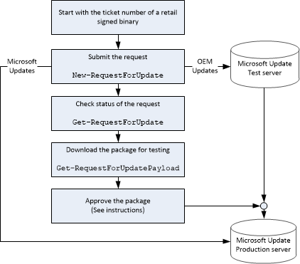

# Submit an update


Updates are created by finding the difference between the current firmware and the firmware to update to, and creating an update bundle that includes those differences. These differences are calculated, created, and hosted on Microsoft’s update servers.

Beginning with the release of Windows 10, OEMs can no longer submit OS-only updates for retail devices by using the [New-RequestForMicrosoftUpdate cmdlet](new-requestformicrosoftupdate-cmdlet.md). OS-only updates for retail devices will be provided by Microsoft on Windows Update.

OEMs can continue to submit OS-only updates for Trial and PartnerSelfHost preview environments.

## <span id="Submit_an_OEM_update"></span><span id="submit_an_oem_update"></span><span id="SUBMIT_AN_OEM_UPDATE"></span>Submit an OEM update


1.  Get the source firmware submission ticket ID from the last time you updated this package.

2.  Get a target firmware submission ticket ID: update the binaries in the package, and [submit the binaries to be retail signed](https://msdn.microsoft.com/library/windows/hardware/dn789223) to receive a new ticket ID.

3.  With both the old and new ticket IDs, submit the update request using the [New-RequestForUpdate cmdlet](new-requestforupdate-cmdlet.md):

    ``` syntax
    New-RequestForUpdate 
       -FirmwareSubmissionTicketId TKT-SIGN-PROD-ABCD56 
       -RequestForUpdateType RetailServicing 
       -SourceFirmwareSubmissionTicketId TKT-SIGN-PROD-XYZ123 
       -OemDeviceName P4301
       -MOId 000-22
    ```

    The output from this command gives you a request for update (RFU) ID.

4.  Use the RFU ID to check the status using the [Get-RequestForUpdate cmdlet](get-requestforupdate-cmdlet.md):

    ``` syntax
    Get-RequestForUpdate
       -RequestForUpdateTicketId TKT-RFU-PROD-ABCD56-1
    ```

    If everything looks OK, we’ll approve the request, and send it on to the Microsoft Preview test server.

5.  You and your mobile operator partner can test the update over the network.

6.  You and your mobile operator partner [approve the update](approve-an-update.md).

7.  We’ll publish the update on the Microsoft Update production server, where the device can [scan, download, and install the update](scan--download--and-install-updates.md).

The following diagram shows this procedure:



**Note**  You cannot change OS optional features in the OEMInput.xml file between updates. If a feature is changed, the update will be rejected by the publishing system.

 

## <span id="Submit_Microsoft_updates"></span><span id="submit_microsoft_updates"></span><span id="SUBMIT_MICROSOFT_UPDATES"></span>Submit Microsoft updates


1.  Use the [New-RequestForMicrosoftUpdate cmdlet](new-requestformicrosoftupdate-cmdlet.md), using the old and new version numbers, the type of the update (RetailServicing or Trial), and the OEM device name and Mobile Operator ID:

    With the ticket IDs for both the existing firmware and the new firmware, submit an update request using the [New-RequestForUpdate cmdlet](new-requestforupdate-cmdlet.md).

    ``` syntax
    New-RequestForMicrosoftUpdate
       -SourceOSVersion 8.10.12349.825
       -TargetOSVersion 8.10.12359.845
       -RequestForUpdateType Trial
       -OemDeviceName P4301
       -MOId 000-22
    ```

2.  The update is published to Microsoft’s production update server, where the device can [scan, download, and install the update](scan--download--and-install-updates.md).

 

 

