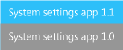
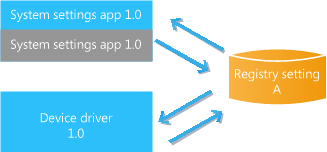
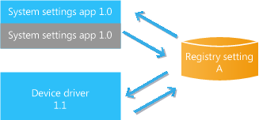
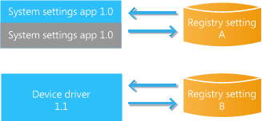
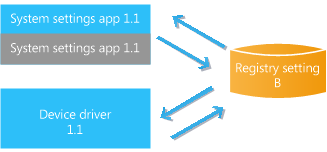

# System settings apps and updates

Preloaded system settings apps allow OEMs to expose custom settings for hardware components that they add to a device to differentiate it from other devices.

Updates to settings apps are delivered separately from the OS updates and must be initiated by the user. Because of this, the settings app must be designed to manage issues such as backward compatibility. In addition, the user may initiate a backup and restore sequence or reset the device, either of which may change the active version of the settings app. A strategy must be developed to test for and address all of the possible scenarios.

**Important**  
Because of the complexity of synchronizing the settings app and device drivers, registry setting changes for these apps should be avoided. Carefully review the guidance in this topic for strategies to avoid registry changes as well as important scenarios that must be addressed when preparing updates.

The example scenarios focus on settings stored in the registry; if the app uses other storage mechanisms such as isolated storage, similar analysis is required.

 

The following sections outline some of the important considerations for managing system settings apps in the course of updates, backup and restore operations, and resets:

-   [Managing updates to settings apps](#managing)

-   [Settings app OTA updates](#ota)

-   [Update scenarios](#update)

-   [Update scenarios with registry changes](#registry)

-   [Backup and restore scenarios](#backup)

-   [Reset scenarios](#reset)

-   [Summary of preloaded settings app scenarios](#summary)

## Managing updates to settings apps

Settings apps are updated by using the Store delivery mechanism. To make sure the settings app is up to date, a version number can be maintained on the device, and an external web service could be called to check to see if the latest version is installed. If an update is required, the user can be prompted to initiate an update for the settings app. Other equally effective approaches are possible.

A version number could be displayed in the settings app, to allow customer support to identify which version is in use. Alternatively, when the user runs the Store app, pending updates are displayed; these updates include available updates to settings apps. Store updates always upgrade the app from any previous version to the latest available version.

## Settings app OTA updates

To allow the latest version of the preloaded app to be installed if the device is reset, an over-the-air (OTA) package update can be prepared for the preloaded app. This OTA update will not update the current active version on the device; it will only update the stored version that is used if the device is reset. This means that there can be two different versions of the settings app on the device

In the following illustrations, the active version that the user interacts with is depicted in the upper box in blue, and the version that is stored on the device is depicted in gray. For example, if the device shipped with a preloaded version 1.0 of a settings app that has not been updated OTA, and the user downloads a version 1.1 of the settings app from the Store, the stored and active versions are illustrated as follows.

## Update scenarios

As OEMs prepare updates, they must identify the possible usage scenarios and test those to create the desired update and application user experience. Settings app update scenarios are summarized here. All of the scenarios start with a version 1.0 of a settings app and a version 1.0 device driver that both use registry setting A. The following diagram summarizes the start state for these scenarios.

### Driver update

1.  The device ships with settings app 1.0 and associated driver code 1.0.

2.  The over-the-air update did not include the updated 1.1 app, so the 1.0 settings app is stored and active on the device.

3.  An over-the-air update occurs, updating the driver code to 1.1.

If there are no breaking registry changes in the 1.1 device driver code delivered in the update, the user can continue to successfully run the 1.0 version of the settings app.

The following diagram summarizes the end state for this scenario.

## Update scenarios with registry changes

Because of the complexity of synchronizing the settings app and device drivers, registry setting changes should be avoided. To avoid the need to update existing registry data, your code could be updated to read the existing registry data and migrate it to a new subkey, so that any existing user settings are preserved. Alternatively, approaches such as adding a version number check when the settings app starts (to determine which registry values to use) may be appropriate.

If an update is being prepared for a registry value that may be changed as the device is used—for example, by a user altering a setting on a menu—provisioning XML (provxml) must be used. For more info, see [Using provisioning files to update registry settings that may change](using-provisioning-files-to-update-registry-settings-that-may-change.md).

If an update is being prepared to address a changed registry setting, OEMs must identify the possible usage scenarios and test those to create the desired update and application user experience. A strategy should be developed that address any need to coordinate updates to the versions of the settings app, OS, and device driver.

The following update scenario shows the undesirable situation when a registry setting change takes place that is used by both an OEM device driver and a settings app. Initially both the settings app and the device driver use the same registry setting A, as illustrated here.

### Driver update with registry change

1.  The device ships with settings app 1.0 and associated driver code 1.0, which reads registry setting A.

2.  An over-the-air update occurs, updating the driver code to 1.1, which now uses new registry setting B.

3.  The 1.0 settings app is on the device, which uses the older registry setting A.

When the user makes changes using the 1.0 settings app, but the 1.1 driver code is using registry setting B, the settings app will not work as intended. For example, a user may make changes in the settings app that do not actually change anything.

The following diagram summarizes the end state for this scenario.

The user may determine that they need to download a newer version of the settings app. If the user downloads the updated version 1.1, the settings app will work properly.

## Backup and restore scenarios

Preloaded apps are not restored from the cloud; rather, preloaded apps are reinstalled using the stored version on the device. If the stored version of the settings app has been updated OTA, the updated version will be installed when the phone is restored. If a user resets the device and does a restore, and the stored version has not been updated, the user will also need to check for updates in the Store for the preloaded settings apps.

This behavior is different from store apps that are not preloaded on the device. When a device is backed up, a list of the installed applications is stored as part of the backup. When the device is restored, the latest versions of the apps are installed, using the list of apps that was created when the phone was backed up. For more info about this feature, see [Back up your stuff](http://go.microsoft.com/fwlink/p/?LinkId=331631).

After the update is delivered and the user launches the settings app, the app could check a web server and see that an updated version of the settings app is available. The user could be prompted to download the update. If the user runs the Store application on the device, pending settings apps updates are displayed there. After some period of time, the user can download the settings app 1.1 and use it successfully.

### Backup and restore after update

1.  The device ships with settings app 1.0 and device driver code 1.0.

2.  An over-the-air update occurs, updating the driver code to 1.1.

3.  The user downloads and uses the newer 1.1 settings app.

4.  The user backs up the device using the backup feature.

5.  The user uses the restore feature to restore an earlier version of the OS. During the restore, the preloaded apps are reinstalled, and the 1.0 version of the settings app is active on the device.

As discussed earlier, if there are no dependencies between the updates and the settings app, the user can successfully run the older version 1.0 of the settings app until they download an updated version.

The following diagram summarizes the end state for this scenario.

### Backup and restore after update with registry change

1.  The device ships with settings app 1.0 and associated driver code 1.0, which reads registry setting A.

2.  The user backs up the device using the backup feature.

3.  An over-the-air update occurs, updating the driver code to 1.1, which now uses new registry setting B.

4.  The user downloads the newer settings app, and it successfully uses the new registry setting B.

5.  The user uses the restore feature to restore an earlier version of the OS. During the restore, the preloaded apps are reinstalled and the 1.0 version of the settings app is active on the device

When the user makes changes using the 1.0 settings app, the system settings will not work as intended.

The following diagram summarizes the end state for this scenario.

The user may determine that they need to update to a newer version of the settings app. If the user downloads version 1.1 of the settings app, the app will read the new registry setting B and will work properly.

## Reset scenarios

Additional scenarios exist—for example, when the device is reset by the customer using **Settings** &gt; **System** &gt; **About** &gt; **Reset your phone**. The user may reset the device, for example when it being serviced or when transferring ownership of the device. When the device is reset, the settings app will return to the version that is stored in an app package file on the device; this may be the version that shipped on the device. Any OS updates that the device has received are also active on the device after the reset. This means that the original settings app may need to operate with newer versions of the operating system and newer versions of any associated device drivers. These dependencies and interactions should be considered as updates to settings apps and device drivers are being prepared. For more info about the OS reset behavior, see [Resetting the device](https://msdn.microsoft.com/windows/hardware/commercialize/manufacture/mobile/resetting-a-phone-during-manufacturing).

### Reset after update

1.  The device ships with settings app 1.0 and associated device driver code 1.0.

2.  An over-the-air update occurs, updating the driver code to 1.1.

3.  The user downloads the newer 1.1 settings app.

4.  The over-the-air update did not include the updated 1.1 app, so the 1.0 settings app is on the device.

5.  The user resets the device.

6.  Updates to the device driver code persist after the reset, and version 1.1 of the device driver code is active on the device.

7.  Because the settings app is not part of the update, it is not updated automatically in the base image during reset.

As in the earlier scenarios, if there are no dependencies between the updates and the settings app, the user can run the older version 1.0 of the settings app until they download an update.

The following diagram summarizes the end state for this scenario.

### Reset after update with registry change

1.  The device ships with settings app 1.0 and associated driver code 1.0, which reads registry setting A.

2.  An over-the-air update occurs, updating the driver code to 1.1, which now uses new registry setting B.

3.  The user downloads the newer settings app, and it successfully uses the new registry setting B.

4.  The user resets the device.

5.  Updates to the device driver code persist after the reset, and version 1.1 of the device driver code is active on the device

6.  Because the settings app is not part of the update, it is not updated automatically in the base image during reset, and the 1.0 version is on the device.

As in the previous scenario, when the user makes changes using the 1.0 settings app, the system settings will not work as intended.

The following diagram summarizes the end state for this scenario.

The user may determine that they need to download a newer version of the settings app. If the user downloads the updated version 1.1, the settings app will work properly.

### Reset after update with registry change and preloaded app update

In this final scenario, the device is reset by the customer using **Settings** &gt; **System** &gt; **About** &gt; **Reset your phone**.

1.  The device ships with settings app 1.0 and associated driver code 1.0, which reads registry setting A.

2.  An over-the-air update occurs, updating the driver code to 1.1, which now uses new registry setting B.

3.  The over-the-air update also includes an update to the 1.1 settings app preloaded package. This update delivers a new app package that will only be used when the device is reset and the initial preloaded apps are installed. At this point in the scenario, the user has not reset the device, so version 1.0 of the settings app is in use.

4.  The user downloads the newer settings app, and it successfully uses the new registry setting B.

5.  The user resets the device

6.  Updates to the device driver code persist after the reset, and version 1.1 of the device driver code is active on the device. In addition, because the preloaded settings app 1.1 update was delivered OTA, it will be installed when the device is reset.

In this scenario, both the 1.1 settings app, and the device driver 1.1 will use registry setting B and the app will work properly.

The following diagram summarizes the end state for this scenario.

## Summary of preloaded settings app scenarios

The following table summarizes the preloaded apps scenarios.

<table>
<colgroup>
<col width="25%" />
<col width="25%" />
<col width="25%" />
<col width="25%" />
</colgroup>
<thead>
<tr class="header">
<th align="left">OTA update</th>
<th align="left">User-initiated Store update</th>
<th align="left">Backup and restore</th>
<th align="left">Reset</th>
</tr>
</thead>
<tbody>
<tr class="odd">
<td align="left">
Preloaded settings app update could be created by the OEM; the active installed app is not updated, only the stored one.
</td>
<td align="left">
Active app is updated; the stored app remains the same.
</td>
<td align="left">
Stored app on the phone is reinstalled. If the stored version has not been updated, the user will need to download the updated version from the Store.
</td>
<td align="left">
Stored app on the device is reinstalled. If the stored version has not been updated, the user will need to download the updated version from the Store.
</td>
</tr>
</tbody>
</table>

 

These example scenarios are illustrative and do not capture all possible customer usage scenarios or the combinations of update releases that are possible. OEMs must identify the possible usage scenarios and test those when preparing updates.

A strategy should be developed to coordinate the versions of the settings app and device driver when applying updates, to avoid a poor user experience.

## Related topics

[Using provisioning files to update registry settings that may change](using-provisioning-files-to-update-registry-settings-that-may-change.md)

 

 

