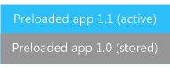

# Updates to preloaded apps and services

Partner app can be included in the image and installed to the user store during first boot.

Updates to preloaded apps are delivered separately from the OS updates and must be initiated by the user. Because of this, the preloaded app must be designed to manage compatibility with the Main OS and OEM BSP updates. In addition, the user may initiate a backup and restore sequence or reset the device, either of which may change the active version of the preloaded app. A strategy must be developed to test for and address all of the possible scenarios.

Preloaded *system settings* apps allow OEMs to expose custom settings for hardware components. There are additional important update considerations for system settings apps. For more info, see [System settings apps and updates](system-settings-apps-and-updates.md).

## Summary of preloaded app scenarios

The following table summarizes the preloaded apps scenarios.

<table>
<colgroup>
<col width="25%" />
<col width="25%" />
<col width="25%" />
<col width="25%" />
</colgroup>
<thead>
<tr class="header">
<th align="left">OTA update</th>
<th align="left">User-initiated Store update</th>
<th align="left">Backup and restore</th>
<th align="left">Reset</th>
</tr>
</thead>
<tbody>
<tr class="odd">
<td align="left">
Preloaded app update could be created by the OEM; the active installed app is not updated, only the stored one.
</td>
<td align="left">
Active app is updated; the stored app remains the same.
</td>
<td align="left">
Stored app on the device is reinstalled. If the stored version has not been updated, the user will need to download the updated version from the Store.
</td>
<td align="left">
Stored app on the device is reinstalled. If the stored version has not been updated, the user will need to download the updated version from the Store.
</td>
</tr>
</tbody>
</table>

 

These example scenarios are illustrative and do not capture all possible customer usage scenarios or the combinations of update releases that are possible. OEMs must identify the possible usage scenarios and test those when preparing updates.

## Managing updates to preloaded apps

Preloaded apps are updated by using the store delivery mechanism. When the user runs the Store app, pending updates are displayed; these updates include available updates to preloaded apps. Store updates always upgrade the app from any previous version to the latest available version.

## Preloaded app OTA updates

To allow the latest version of the preloaded app to be installed if the device is reset, an over-the-air (OTA) package update can be prepared for the preloaded app. This OTA update does not update the current active version of the app on the device; it only updates the stored version that is used if the device is reset. This means that there can be two different versions of the preloaded app on the device

For example, if the device shipped with a preloaded version 1.0 of a preloaded app that has not been updated OTA, and the user downloads a version 1.1 of the preloaded app from the Store, the stored and active versions are both present on the device, as shown in the following illustration.

## Backup and restore scenarios

Preloaded apps are not restored from the cloud; rather, preloaded apps are reinstalled by using the stored version on the device. If the stored version of the preloaded app has been updated OTA, the updated version is installed when the device is restored. If a user resets the device and does a restore, and the stored version has not been updated, the user will need to check the Store for updates to the preloaded apps.

This behavior is different from store apps that are not preloaded on the device. When a phone is backed up, a list of the installed applications is stored as part of the backup. When the device is restored, the latest versions of the apps are installed from the cloud, using the list of apps that was created when the phone was backed up. For more info about this feature, see [Backing up my stuff](http://go.microsoft.com/fwlink/p/?LinkId=331631).

## Reset scenarios

When the device is reset, a preloaded app returns to the version that is stored in an app package on the device; this may be the version that shipped on the device. Any OS updates that the phone has received are also active on the device after the reset. This means that the original preloaded app may need to operate with newer versions of the operating system and newer versions of the BSP. These dependencies and interactions should be considered as updates to preloaded apps are being prepared. For more information about the OS reset behavior, see [Resetting the device](https://msdn.microsoft.com/windows/hardware/commercialize/manufacture/mobile/resetting-a-phone-during-manufacturing).

## Updates to native services and service agents

OEMs can use native services and service agents in the OS to address continuously running code scenarios. Because native services and service agents are included in the OS by using two different methods, updates are created and managed differently.

### Native services

Native services are included in the OS by adding the related code to a package that is included in the image. They are updated like any other package in the OS.

### Service agents

Multiple service agents are contained in a single preloaded app. As with all preloaded apps, updates are delivered using the Store. Each service agent application can have multiple service agents running within it. If any one of the service agents needs to be updated, the app that contains the service agents needs to be updated. In general, service agents behave like preloaded apps in the update, reset, and restore scenarios.

## Related topics

[Update](index.md)

[System settings apps and updates](system-settings-apps-and-updates.md)

 

 

