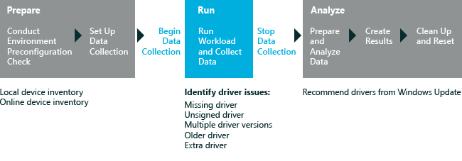

# Driver Verification

The Driver Verification assessment verifies that an offline Windows image or a running Windows operating system contains the correct set of drivers. The results include recommendations to help you resolve any issues that the assessment finds. These issues may include missing, duplicate, older, or unnecessary drivers. For more information about results and issues, see [Results for the Driver Verification Assessment](results-for-the-driver-verification-assessment.md).

The Driver Verification assessment can be used to:

-   Find device and driver issues without using Device Manager.

-   Find missing device drivers in either a Windows image or a running operating system.

-   Find driver issues before you deploy an image to a computer.

-   Find software drivers that are not associated with any hardware devices.

The following graphic illustrates the assessment process.

In this topic:

-   [System Requirements](#beforebegin)

-   [Settings](#settings)

## System requirements

The first-run help tips in Windows 8.1 can negatively affect assessment results. To disable these, run the following command from an elevated command prompt, and reboot the computer: `reg.exe add "HKLM\Software\Policies\Microsoft\Windows\EdgeUI" /v DisableHelpSticker /t REG_DWORD /d "1" /f`

You can run this assessment on the following operating systems:

-   Windows 8

-   Windows 10

Supported architectures include x86-based, x64-based, and ARM-based systems.

There are two ways to run this assessment on Windows RT:

-   Package the assessment job in the Windows Assessment Console and then run it on Windows RT. For additional information about this option, see [Package a job and run it on another computer](package-a-job-and-run-it-on-another-computer.md).

-   Use Windows Assessment Services to run assessments on Windows RT. For more information, see [Windows Assessment Services](windows-assessment-services-technical-reference.md).

## Settings

By default, this assessment uses the recommended settings. Microsoft defines these settings so that you can compare the results across multiple computer configurations or over time on the same computer. When you review the results, the run information includes metadata that indicates whether the assessment used the recommended settings.

You can also customize the settings if you want to gather data that's different from what the assessment captures by default. For example, you might identify specific data that can help you perform a detailed analysis of a particular aspect of the computer.

The following table describes the assessment settings, recommended setting values, and alternative values for each setting.

<table>
<colgroup>
<col width="50%" />
<col width="50%" />
</colgroup>
<thead>
<tr class="header">
<th>Setting</th>
<th>Description</th>
</tr>
</thead>
<tbody>
<tr class="odd">
<td>
Use recommended settings
</td>
<td>
Specifies whether the assessment uses the recommended settings. By default, this check box is selected. To change the settings for this assessment, you must first clear this check box.
</td>
</tr>
<tr class="even">
<td>
Devices Input Path
</td>
<td>
Specifies a path to a Device.xml file that contains an inventory of all the devices on the computer. By default, no path is provided and device information is collected from the computer that the assessment is running on. If you provide a path to a Device.xml file, the device information in the file will be used instead.
</td>
</tr>
<tr class="odd">
<td>
Silent Console
</td>
<td>
Specifies whether the job runs silently (without a console UI). This is the default behavior.
</td>
</tr>
<tr class="even">
<td>
Write Devices.xml
</td>
<td>
Specifies whether a Devices.xml file that contains an inventory of all the devices on the computer, should be generated. By default, this check box is cleared and the file is not generated. If you select this check box, a Devices.xml file is saved to the local computer in the assessment results folder, for later use.
</td>
</tr>
<tr class="odd">
<td>
Write Driver.xml
</td>
<td>
Specifies whether a Drivers.xml file, that lists the drivers found on the computer, is generated or not. By default, this check box is cleared, and the file is not generated. If you select this check box, a Drivers.xml file is saved to the local computer in the assessment results folder for later use.
</td>
</tr>
<tr class="even">
<td>
Mounted Image Path
</td>
<td>
Specifies the full path to a mounted Windows image if you want to run the assessment against an offline Windows image. By default, this box is empty and the assessment evaluates the drivers on the running operating system.
</td>
</tr>
</tbody>
</table>

 

## Related topics

[Results for the Driver Verification Assessment](results-for-the-driver-verification-assessment.md)

[Windows Assessment Toolkit](windows-assessment-toolkit-technical-reference.md)

[Assessments](assessments.md)

 

 

