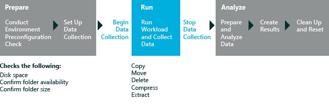

# File Handling

The File Handling assessment provides an automated way to exercise common file operations and capture metrics. This assessment measures durations and throughput while copying, moving, compressing, extracting, and deleting files and folders on your computer. The results help you understand how well the computer performs during these operations. For more information about the results, see [Results for the File Handling Assessment](results-for-the-file-handling-assessment.md).

**Warning**  
The File Handling assessment is only supported on English (United States) versions of Windows. Running this assessment on non-English (United States) versions of Windows might prompt you with an error and the assessment might stop running.

 

The following graphic illustrates the assessment process.

In this topic:

-   [System Requirements](#sysrqmnts)

-   [Workloads](#bkmk-fileworkloads)

-   [Settings](#assesssettings)

## System Requirements

The first-run help tips in Windows 8.1 can negatively affect assessment results. To disable these, run the following command from an elevated command prompt, and reboot the computer: `reg.exe add "HKLM\Software\Policies\Microsoft\Windows\EdgeUI" /v DisableHelpSticker /t REG_DWORD /d "1" /f`

Run this assessment only while the desktop is full screen. Do not run this assessment if you have another Windows Store app opened side-by-side with the desktop.

When running this assessment on Windows 8.1, make sure the **Collect Analysis Trace** setting is unchecked when assessing expected battery life. When checked, this option will produce an incorrect estimation.

Enable analysis trace collection only when you need additional information to investigate other energy-related problems.

You can run this assessment on the following operating systems:

-   Windows 8

-   Windows 10

Supported architectures include x86-based, x64-based, and ARM-based systems. The assessment isn't supported for use on virtual machines.

You can run this assessment on Windows RT in either of the following ways:

-   Package the assessment job in the Windows Assessment Console and then run it on Windows RT. For more information, see [Package a job and run it on another computer](package-a-job-and-run-it-on-another-computer.md).

-   Use Windows Assessment Services to run assessments on Windows RT. For more information, see [Windows Assessment Services](windows-assessment-services-technical-reference.md).

## Workloads

A workload is a set of automated tasks that simulate user activity in a predefined, repeatable manner. This assessment measures durations and throughput for the following workloads, and it captures the metrics in the results file.

-   **Programmatic Workloads.** These workloads use the API to perform file functions. These workloads measure only the underlying file functionality. File operations include **copypg**, **movepg**, and **deletepg**.

-   **Scripted Workloads.** These workloads simulate user activity in File Explorer on a computer running Windows 8. File operations include **copyuxxs**, **deleteuxs**, **moveuxs**, and **zipuxs**. Scripted workloads can't be used if you're running the assessment on a computer running Windows 7.

For more information about choosing a workload, see [Settings](#assesssettings).

**Note**  
You can also use the File Handling assessment as a workload in an energy-efficiency job. For more information about energy-efficiency jobs, see [Create and run an energy efficiency job](create-and-run-an-energy-efficiency-job.md).

 

## Settings

By default, this assessment uses the recommended settings. Microsoft defines these settings so that you can compare the results across multiple computer configurations or over time on the same computer. When you review the results, the run information includes metadata that indicates whether the assessment used the recommended settings.

You can also customize the settings if you want to gather data that's different from what the assessment captures by default. However, if you change the default source or destination folders or supply your own files, comparisons may no longer be relevant.

**Note**  
After you run the assessment, all files in the Recycle Bin may be permanently deleted. Therefore, before you run the assessment, review any files in the Recycle Bin because they won't be available or restorable after the assessment concludes.

 

The following table describes the assessment settings, recommended values, and alternative values for each setting.

<table>
<colgroup>
<col width="50%" />
<col width="50%" />
</colgroup>
<thead>
<tr class="header">
<th>Setting</th>
<th>Description</th>
</tr>
</thead>
<tbody>
<tr class="odd">
<td>
Use recommended settings
</td>
<td>
Specifies whether the assessment uses the recommended settings. By default, this check box is selected. To change the settings for this assessment, you must first clear this check box.
</td>
</tr>
<tr class="even">
<td>
Iterations
</td>
<td>
Specifies the number of times that the assessment runs. By default, the value is 1. To run the assessment multiple times and average the results, increase this value.
</td>
</tr>
<tr class="odd">
<td>
Source
</td>
<td>
Specifies the location that the assessment copies the workload files or folders from. To specify a location other than the default, enter a path to the source folder in the box. The assessment can use multiple computers, external devices and network locations for the Source folder.

Workloads can be configured to perform file functions in the Source folder alone, or you can specify a Source and Destination folder.
</td>
</tr>
<tr class="even">
<td>
Destination
</td>
<td>
Specifies the location that the assessment copies the workload files or folders to. You must have write access to the destination folder. To specify a location other than the default, enter a path to the destination folder in the box. If you provide a different destination folder, the destination folder must be empty before you start the assessment.

Workloads can be configured to perform file functions in the Source folder alone, or you can specify a Source and Destination folder. External devices and network locations are supported.
</td>
</tr>
<tr class="odd">
<td>
Enable Reboots
</td>
<td>
Specifies that the machine will be restarted before every file operation. Not enabled by default

Use this to ensure a clean system before timing every operation. This is especially useful for testing Anti-virus software behavior.
</td>
</tr>
<tr class="even">
<td>
Execution Delay
</td>
<td>
Specifies the time is seconds to wait after a reboot before performing the file operation. Only available when using the “Enable Reboots” parameter. The default is 300 seconds.

This parameter lets you control the amount of time for the machine to rest before running the particular file operation for that iteration.
</td>
</tr>
<tr class="odd">
<td>
Workload
</td>
<td>
Specifies which workloads to run. Programmatic and Scripted Workloads are available. By default, only Programmatic Workloads are run.

For more information about the file functions performed by each workload, see [Workloads](#bkmk-fileworkloads).
</td>
</tr>
<tr class="even">
<td>
Import data location
</td>
<td>
Specifies the location of the files you want to use during the assessment. When an import location is specified, the assessment copies the files from the <strong>Import data location</strong> to the Source folder. During the assessment process, the source content is copied to the Destination folder. For this reason, both the Source and Destination folders must be empty when the assessment starts.
</td>
</tr>
<tr class="odd">
<td>
Enable Minifilter Diagnostic Mode
</td>
<td>
Specifies whether to use the minifilter diagnostic option. By default, this check box is cleared. When the minifilter diagnostic mode is enabled, it produces metrics that help you evaluate the effect of minifilters on file handling. For more information about this setting, see [Minifilter Diagnostics](minifilter-diagnostics.md).

<strong>Note</strong>  

The minifilter diagnostic option is supported only on Windows 8.

 

</td>
</tr>
</tbody>
</table>

 

## Related topics

[Results for the File Handling Assessment](results-for-the-file-handling-assessment.md)

[Windows Assessment Toolkit Technical Reference](windows-assessment-toolkit-technical-reference.md)

[Assessments](assessments.md)

[Connected Standby Energy Efficiency](connected-standby-energy-efficiency.md)

[Minifilter Diagnostics](minifilter-diagnostics.md)

 

 

