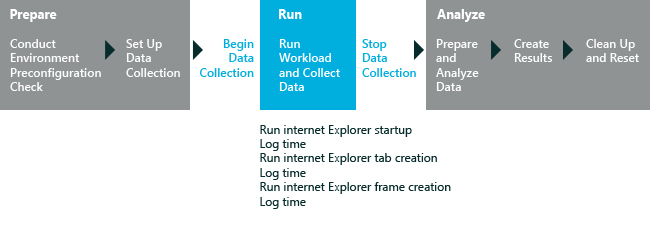

# Internet Explorer Startup Performance

The Internet Explorer Startup Performance assessment helps identify components that may affect the time to start Internet Explorer. The assessment measures the time to fully render a new Internet Explorer window on the desktop, with a single tab and simple content. This measurement includes the load time of the IExplore.exe process and the frame-creation and tab-creation intervals. The assessment also measures the performance of extensions that are loaded and initialized during startup. It doesn't measure network or browsing performance. For more information about results and issues that this assessment produces, see [Results for the Internet Explorer Startup Performance Assessment](results-for-the-internet-explorer-startup-performance-assessment.md).

The assessment follows this workflow:

1.  Creates a custom local page that notifies you that the assessment is running and instructs you not to interact with the computer

2.  Prepares for tracing and metric collection

3.  Starts Internet Explorer and starts to collect metrics

**Note**  
The assessment launches Internet Explorer 4 times. The first time is a training iteration, and the next 3 are timing iterations. The training iteration ensures that the timing iterations load from the system cache and not a cold start. The results that are produced are aggregate results from the timing iterations. You can change the number of timing iterations in the assessment settings.

 

The following graphic illustrates the assessment process.

In this topic:

-   [System Requirements](#sysrqrmts)

-   [Settings](#assesssettings)

## System Requirements

The first-run help tips in Windows 8.1 can negatively affect assessment results. To disable these, run the following command from an elevated command prompt, and reboot the computer: `reg.exe add "HKLM\Software\Policies\Microsoft\Windows\EdgeUI" /v DisableHelpSticker /t REG_DWORD /d "1" /f`

Run this assessment only while the desktop is full screen. Do not run this assessment if you have another Windows Store app opened side-by-side with the desktop.

You can run this assessment on the following operating systems:

-   Windows 8

-   Windows 10

Supported architectures include x86-based, x64-based, and ARM-based systems.

There are two ways to run this assessment on Windows RT:

-   Package the assessment job in the Windows Assessment Console and then run it on Windows RT. For more information, see [Package a job and run it on another computer](package-a-job-and-run-it-on-another-computer.md).

-   Use Windows Assessment Services to run assessments on Windows RT. For more information, see [Windows Assessment Services](windows-assessment-services-technical-reference.md).

## Settings

By default, this assessment uses the recommended settings. Microsoft defines these settings so that you can compare the results across multiple computer configurations or over time on the same computer. When you review the results, the run information includes metadata that indicates whether the assessment used the recommended settings.

You can also customize the settings if you want to gather data that's different from what the assessment captures by default. For example, you might identify specific data that can help you perform a detailed analysis of a particular aspect of the computer.

The following table describes the assessment settings, recommended values, and alternative values for each setting.

<table>
<colgroup>
<col width="50%" />
<col width="50%" />
</colgroup>
<thead>
<tr class="header">
<th>Setting</th>
<th>Description</th>
</tr>
</thead>
<tbody>
<tr class="odd">
<td>
Use recommended settings
</td>
<td>
Specifies whether the assessment uses the recommended settings. By default, this check box is selected. To change the settings for this assessment, you must first clear this check box.
</td>
</tr>
<tr class="even">
<td>
Iterations
</td>
<td>
Specifies the number of times that the assessment launches Internet Explorer. By default, the value is 4. The first time is always a training iteration, and the next 3 are timing iterations. The training iteration ensures that the timing iterations load from the system cache and not a cold start. The results that are produced are aggregate results from the timing iterations.
</td>
</tr>
<tr class="odd">
<td>
Use alternate WPR profile
</td>
<td>
Specifies an alternative Windows® Performance Recorder (WPR) Profile to use. The assessment uses the WPR tool to create a trace. You can use the default profile that is provided or specify a path to a different profile.

To specify an alternative profile, select the <strong>Use alternate WPR profile</strong> check box, and then type the path in the <strong>Path to alternate profile</strong> box. You can use the Windows Performance Analyzer (WPA) tool to view or analyze the trace file.
</td>
</tr>
<tr class="even">
<td>
Path to alternate profile (.wprp)
</td>
<td>
Specifies the path to an alternate Windows Performance Recorder (WPR) profile. This setting is enabled only if you select the <strong>Use alternate WPR profile</strong> check box.
</td>
</tr>
<tr class="odd">
<td>
Enable Minifilter Diagnostic Mode
</td>
<td>
Specifies whether to use the minifilter diagnostic option. By default, this check box is cleared. When the minifilter diagnostic mode is enabled, it produces metrics that help you evaluate the effect of minifilters on Internet Explorer startup. For more information about this setting, see [Minifilter Diagnostics](minifilter-diagnostics.md).
</td>
</tr>
</tbody>
</table>

 

## Related topics

[Results for the Internet Explorer Startup Performance Assessment](results-for-the-internet-explorer-startup-performance-assessment.md)

[Assessments](assessments.md)

 

 

