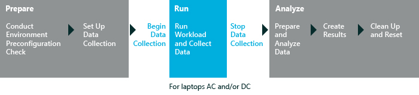

# Media Transcoding Performance

The Media Transcoding Performance assessment measures the process of changing a video file to a different format or bit rate. This assessment runs a series of transcode operations that have common input and output file formats and resolutions. For more information about the assessment results and issues that might be found, see [Results for the Media Transcoding Performance Assessment](results-for-the-media-transcoding-performance-assessment.md)

The following graphic illustrates the assessment process.

In this topic:

-   [System Requirements](#bkmk-sysreq)

-   [Settings](#assesssettings)

## System Requirements

The first-run help tips in Windows 8.1 can negatively affect assessment results. To disable these, run the following command from an elevated command prompt, and reboot the computer: `reg.exe add "HKLM\Software\Policies\Microsoft\Windows\EdgeUI" /v DisableHelpSticker /t REG_DWORD /d "1" /f`

Run this assessment only while the desktop is full screen. Do not run this assessment if you have another Windows Store app opened side-by-side with the desktop.

You can run this assessment on the following operating systems:

-   Windows 8

-   Windows 10

Supported architectures include x86-based, x64-based, and ARM-based systems.

There are two ways to run this assessment on Windows RT:

-   Package the assessment job in the Windows Assessment Console, and then run it on Windows RT. For more information, see [Package a job and run it on another computer](package-a-job-and-run-it-on-another-computer.md).

-   Use Windows Assessment Services to run assessments on Windows RT. For more information, see [Windows Assessment Services](windows-assessment-services-technical-reference.md).

## Settings

By default, this assessment uses the recommended settings. Microsoft defines these settings so that you can compare the results across multiple computer configurations or over time on the same computer. When you review the results, the run information includes metadata that indicates whether the assessment used the recommended settings.

The following table describes the assessment settings, recommended values, and alternative values for each setting.

<table>
<colgroup>
<col width="50%" />
<col width="50%" />
</colgroup>
<thead>
<tr class="header">
<th>Setting</th>
<th>Description</th>
</tr>
</thead>
<tbody>
<tr class="odd">
<td>
Content Path
</td>
<td>
Specifies the source directory for the media files to transcode. By default, the folder is <code>..\content based assessments\Content\Streaming Media Assessment</code>. You can use different media files or specify a different local or network folder.
</td>
</tr>
<tr class="even">
<td>
Test pass type
</td>
<td>
Specifies a power option for the assessment. Select one of the following options from the drop-down list. By default, the power option on a laptop is <strong>Tests on AC and DC</strong>.

<ul>
<li>
<strong>Tests on AC and DC</strong>
</li>
<li>
<strong>Tests on AC only</strong>
</li>
<li>
<strong>Tests on DC only</strong>
</li>
</ul></td>
</tr>
</tbody>
</table>

 

## Related topics

[Results for the Media Transcoding Performance Assessment](results-for-the-media-transcoding-performance-assessment.md)

[Windows Assessment Toolkit](windows-assessment-toolkit-technical-reference.md)

[Assessments](assessments.md)

 

 

