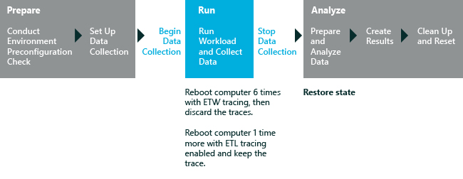

# Memory Footprint

You can use the Memory Footprint assessment to quantitatively compare a baseline operating system image against another operating system image. You can then identify the specific components that affect the memory footprint of the physical system. These components can include drivers, add-in applications, preloaded software packages, and antivirus programs.

By using the Memory Footprint assessment, you can compare the effect that different hardware configurations and associated software have on system memory. After you compare two system images in a side-by-side review, you can decide to change drivers or optimize the memory footprint of your system in other ways.

**Note**  
This assessment creates a snapshot of memory use during a series of assessment boots of the system and immediately after the appearance of the desktop in Windows 10 or the start screen in Windows 10 Enterprise. It does not evaluate memory use during ordinary computer operations. For more information about the results this assessment produces, see [Results for the Memory Footprint Assessment](results-for-the-memory-footprint-assessment.md).

 

The following graphic shows the assessment process. As the graphic illustrates, the assessment requires multiple system reboots to generate all the assessment results.

In this topic:

-   [Before You Begin](#beforebegin)

-   [Settings](#assesssettings)

## Before You Begin

This assessment includes system reboots as a regular part of the assessment process. To configure your computer to run assessment jobs automatically without manual reboots or system prompts, see [Automate reboots before you run an assessment](automate-reboots-before-you-run-an-assessment.md).

### System Requirements

You can run this assessment on the following operating systems:

-   Windows 8

-   Windows 10

Supported architectures include x86-based, x64-based, and ARM-based systems.

There are two ways to run this assessment on Windows RT:

-   Package the assessment job in the Windows Assessment Console and then run it on Windows RT. For more information about this option, see. [Package a job and run it on another computer](package-a-job-and-run-it-on-another-computer.md).

-   Use Windows Assessment Services to run assessments on Windows RT. For more information, see [Windows Assessment Services](windows-assessment-services-technical-reference.md).

## Settings

Microsoft defines the recommended settings so that you can compare the results across multiple computer configurations or over time on the same computer. When you review the results, the run information includes metadata that indicates whether the assessment used the recommended settings.

You can also customize the settings for an assessment, if you want to gather data that is different from the default data. For example, you might identify specific data that would help you perform a detailed analysis of a particular aspect of the computer.

The following table describes the assessment settings, recommended setting values, and alternative values for each setting.

<table>
<colgroup>
<col width="50%" />
<col width="50%" />
</colgroup>
<thead>
<tr class="header">
<th>Setting</th>
<th>Description</th>
</tr>
</thead>
<tbody>
<tr class="odd">
<td>
Use recommended settings
</td>
<td>
Specifies whether the assessment uses the recommended settings. By default, this check box is selected. To change the settings for this assessment, you must first clear this check box.
</td>
</tr>
<tr class="even">
<td>
Configuration
</td>
<td>
Specifies options that you can select to configure the type of memory testing that the assessment performs. These options are as follows:

<ul>
<li>
<strong>Full Run.</strong> This option provides more-precise results but takes longer to finish. This option uses six preparatory computer reboots followed by a seventh measuring boot to ensure the most accurate measurement of memory usage.
</li>
<li>
<strong>Quick Run.</strong> This option does not include the system preparatory steps of the full run. Therefore, it shortens the time that the job takes to run. The information that it delivers is less comprehensive but still useful.
</li>
</ul></td>
</tr>
<tr class="odd">
<td>
Symbol Path
</td>
<td>
Shows the path of the Microsoft public symbol server for Windows. The assessment uses symbols to make sure that its results show driver memory as driver allocations instead of kernel allocations. Without the use of symbols, the assessment analysis may incorrectly identify a memory allocation source. This can disguise issues and hide driver problems. For more information about the symbol server, see [How to: Use a Symbols Server](http://go.microsoft.com/fwlink/?LinkId=242234).

<strong>Note</strong>  

If you cannot connect to the symbol server, you can take one of the following steps to ensure assessment accuracy:

<ul>
<li>
Download the symbols and copy them to the computer that you want to assess. This option requires that you provide the path to the local symbols.
</li>
<li>
Run the assessment on one computer and then load the trace on another computer that has access to symbols (because it is connected to the Internet or already contains downloaded symbols). Then, run the analysis by using the analysis-only mode.
</li>
</ul>

 

For more information about missing symbols and assessment accuracy, see [Common In-Depth Analysis Issues](common-in-depth-analysis-issues.md).
</td>
</tr>
</tbody>
</table>

 

## Related topics

[Results for the Memory Footprint Assessment](results-for-the-memory-footprint-assessment.md)

[Windows Assessment Toolkit](index.md)

[Assessments](assessments.md)

[Windows Assessments Console step-by-step guide](windows-assessment-console-step-by-step-guide.md)

 

 

