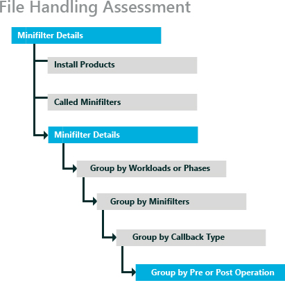
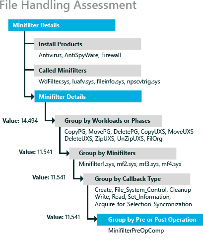

# Minifilter Diagnostics

This topic can help you interpret the results produced by running one of the minifilter diagnostic assessments, or results that are produced by enabling the minifilter diagnostic mode in an assessment. It also provides guidance on how to use the results to identify and resolve common issues that negatively affect the end user’s experience and perceived performance of a computer.

A minifilter driver is a file system filter that intercepts requests that are targeted at a file system or another file system filter. By intercepting the request before it reaches its intended target, the filter driver can extend or replace functionality provided by the original target of the request. Examples of file system filter drivers include anti-virus filters, backup agents, and encryption/decryption products. Filter drivers are made possible by a legacy driver that is named Filter Driver.

A minifilter exposes callbacks for pre and post processing of file I/O. The filter driver communicates with the minifilter through these callbacks. Minifilters are used to process standard I/O. For scenarios when an application uses memory mapped files, see [Memory Mapped Files in a File System Filter Driver](https://msdn.microsoft.com/windows/hardware/drivers/ifs/memory-mapped-files-in-a-file-system-filter-driver).

In this topic:

-   [About Minifilter Diagnostic Mode](#bkmk-minifilterabout)

-   [Metrics](#bkmk-minifiltermetrics)

## About Minifilter Diagnostic Mode

Minifilters were designed to make intercepting file I/O easier than it would be using other profiling software. Without minifilters, developers must write legacy drivers which can be challenging and error-prone.

Since minifilters run code on most file I/O, their performance can significantly affect applications and the end-user experience. A poorly implemented minifilter can cause perceived slowness of the computer. Minifilter diagnostic mode is designed to help identify such drivers by running three I/O intensive tasks, which include the following:

-   Standard file system operations such as moving, copying, and deleting a file.

-   Load an application and monitor the I/O required to load all of its dependencies.

-   Boot the computer and monitor I/O to assist in finding minifilters that may have a negative effect on boot and shutdown performance.

There are three assessments that include an assessment setting to **Enable Minifilter Diagnostic Mode** while the assessment is running. By default, the minifilter diagnostic mode is disabled for these assessments:

-   File Handling

-   Internet Explorer Startup Performance

-   Boot Performance (Fast Startup)

These three assessments are also available with minifilter diagnostics enabled by default. They are listed with other available assessments as:

-   Minifilter Diagnostic: File Handling

-   Minifilter Diagnostic: Internet Explorer

-   Minifilter Diagnostic: Boot Performance (Fast Startup)

Running all three assessments (with minifilter diagnostics enabled), provides a broad view of how minifilters affect the system. Each assessment runs a particular scenario and collects data on the behavior of the minifilters installed on the system. This data can then be analyzed using the Windows Assessment Console, the Windows Assessment Services - Client (Windows ASC) or Windows Performance Analyzer (WPA). The assessment tools group the data in a different way than WPA does, but all of these tools enable you to drill down to see the effect of the minifilters.

**Minifilter Diagnostic: File Handling assessment**

The Minifilter Diagnostic: File Handling assessment performs file system actions such as moving, copying and deleting files on the file system. This assessment measures wall clock time and throughput for each of these types of I/O. For more information about this assessment, see [File Handling](file-handling.md).

The Minifilter Diagnostic: File Handling assessment collects data such as the wall clock time required to copy, move or delete a file on the file system, in addition to throughput, where applicable. When you drill down to see all the major minifilter callback routines, you can find the number of times that each was called, the time it took to complete the calls, and the average and maximum times.

**Minifilter Diagnostic: Internet Explorer**

The Minifilter Diagnostic: Internet Explorer assessment opens a single tab with simple content, in a new Internet Explorer window. Internet Explorer is a medium to large size application that has a long list of dependent DLLs. The assessment serves as a proxy for starting any application and then monitoring how well the installed minifilters behave. For more information about this assessment, see [Internet Explorer Startup Performance](internet-explorer-startup-performance.md).

The Minifilter Diagnostic: Internet Explorer assessment provides data such as the time that it takes to create a frame, create a tab, and start the application. When you drill down to see all the major mini filter callback routines, you can find the number of times that each was called, the time it took to complete the calls, and the average and maximum times.

**Minifilter Diagnostic: Boot Performance (Fast Startup)**

The Minifilter Diagnostic: Boot Performance (Fast Startup) assessment boots the system and monitors I/O activity during this critical time period. The results data is organized by the phase of the boot. There are 17 phases to the boot process. A given mini filter may affect the boot in more than one phase. For more information about this assessment, see [On/Off Transition Performance](onoff-transition-performance.md).

When you drill down to see all the major mini filter callback routines, you can find the number of times each was called, the time that it took to complete the calls, and the average and maximum times.

For more information about result specific to each assessment, see:

-   [Results for the File Handling Assessment](results-for-the-file-handling-assessment.md)

-   [Results for the Internet Explorer Startup Performance Assessment](results-for-the-internet-explorer-startup-performance-assessment.md)

-   [Results for the On/Off Assessments](results-for-the-onoff-assessments.md)

There are two types of issues generated by assessments. There are pre-configuration issues that you can control by addressing the errors and warnings that appear before the assessment starts. If you don’t address these before the assessment starts, issues are generated and added to the assessment results. The other type of issue is generated when a metric value is compared to the goal for that metric. You often begin your analysis with these issues. Some issues require reconfiguring the computer and running the assessment again, and others are measurements taken during the assessment that reveal potential issues.

By running these three assessments you can see the affect that minifilters have on startup, and common usage of the computer. The results might highlight issues specific to the assessment scenario, but the results can also be used to identify minifilter issues and compare results. For example, you can compare the affect that various anti-virus (AV) packages have on the system by running the assessments on two identical systems that differ only because of the AV software that is installed. You can also compare two different computers that have the same AV software installed. Or, you can use just one computer and run the assessments with one AV program installed, and then uninstall it and install a different AV program, before you run the three assessments again. Either way, you can open all the results for a side-by-side comparison, and begin your analysis.

## Metrics

This section describes the key minifilter metrics, common causes of poor results for these metrics, and common remediation for issues. This section also attempts to identify the audience that has the most influence on each of these metrics.

In this section:

-   [Minifilter Metric Hierarchy](#bkmk-minifiltermetrichierarchy)

-   [Longest Delay](#bkmk-minifiltermetriclongest)

-   [Minifilter Delay](#bkmk-minifiltermetricdelay)

-   [Average Call Length](#bkmk-minifiltermetricavgcall)

-   [Minifilter Callbacks](#bkmk-minifiltermetriccallback)

### Minifilter Metric Hierarchy

The minifilter diagnostic mode produces duration metrics. For example, when the minifilter diagnostic is enabled for the File Handling assessment, the duration for the copy workload is displayed, in addition to sub-metrics grouped by minifilter or grouped by callback type. The basic hierarchy of the minifilter metrics is displayed in the following diagram:

Minifilter metric values are deeply nested under logical groupings. This hierarchy of results enables you to view the details of an assessment workload or phase that generated the results that you are interested in. Once you expand the results for a workload, you can see the list of minifilters and the results that they each provide that are aggregated to the workload level. Select a particular minifilter from the list, and you can see the list of calls made against that minifilter. Select an interesting call, and you can review the pre- or post-operations that generated the results that you find interesting. Here’s an example:

**Note**  
In the File Handling Performance assessment, the first level of detail is called the *Workload* level. In Boot Performance assessment or in the Internet Explorer Startup Performance assessment, the first level of detail is called the *Phase* level.

 

In this scenario, the CopyPG workload had a value of 14.494. When you expand that result, you find that it was the minifilter1.sys driver that contributed a value of 11.541 to the CopyPG workload value. When you expand the minifilter1.sys result, you see that the Cleanup callback type was the source of the value of 11.541. When you expand the Cleanup callback type, you find that it was the MiniFilterPreOpComp operation that was measured at a value of 11.541.

Using this method, you can establish exactly which operation, callback type, minifilter, or workload/phase produced any particular result. In addition, each **Group By** drop-down button shows other metrics that are not visible by default. Select any of these additional categories to see more metrics for your analysis.

### Longest Delay

The longest delay metric is the longest delay found in the trace while the assessment was running. This metric is available for all the major I/O operations such as the Create, Control, Cleanup, Information, Read, Write and Acquire lock operations. Large values for this metric can indicate perceivable stalls when performing file operations, Internet Explorer startup and boot.

**Most applicable to:** Minifilter ISVs have the largest direct influence on this metric by the way they implement the minifilter. End users and OEMs have indirect influence on this metric based on the minifilter products that they install.

**Typical Influencing Factors**

Large values in this metric are typically caused by background activity on the system while the assessment is running, but it can also be caused by an incorrect minifilter design. For certain workloads (such as, copy), the size of the files can also affect this metric.

**Analysis and Remediation Steps**

When using minifilter results to identify regressions in a single software component, it is most relevant to compare results created by running the assessment against two versions of the same component, or to compare the results of two similar products from different application writers.

The first step is to find the longest delay. To do this, expand the Minifilter Details, right-click the Longest Delay column and choose Sort by Descending.

To ensure the fidelity of results data:

-   Close any applications that are running in the background.

-   Once the primary component has been identified, consider isolating the impact by stopping other optional services and running the assessment again for comparison.

-   Ensure that the system is not under any memory pressure when running this assessment.

-   Run the assessment multiple times to confirm that the metric value was not the result of a transient file system event (such as a cache flush).

-   Address any warnings or issues that occur because of the assessment so that they no longer appear.

-   Minifilters are often associated with a service.

If these steps do not resolve the issue, consider replacing the minifilter product with a different product that offers similar functionality or test for a different version of the minifilter.

An application developer who wants to find the root cause of the issue can perform a deeper analysis, by opening the trace in WPA. The analysis view of minifilter delays in WPA is a good starting point for deep analysis. There will be several ETL files if you run all three assessments, FileOrg.etl, IELaunch\_Warm\_1, IELaunch\_Warm\_2, IELaunch\_Warm\_3, IELaunch\_Cold\_1, and several ETL files for the boot assessment named FastStartup\_Analysis-\*. These .etl files can be used by anyone who understands WPA.

### Minifilter Delay

Minifilter Delay is the measure of the cumulative duration of time spent by the minifilter. This metric shows how much time is utilized by the minifilter and how much time is utilized by other activity that ran during the assessment. Large values in this metric can indicate that the user may experience poor responsiveness when performing file operations.

**Most applicable to:** Minifilter ISVs have the largest direct influence on this metric by the way they implement the minifilter. End users and OEMs have indirect influence on this metric based on the minifilter products that they install.

**Typical Influencing Factors**

Large values in this metric are typically caused by a less effective minifilter design. For certain workloads (such as copy), the size, number and type of files can also affect this metric. For example, the difference between a media file and a text file.

**Analysis and Remediation Steps**

To ensure the fidelity of results data

-   Close any applications that are running in the background.

-   Once the primary component has been identified, consider isolating the impact by stopping other optional services and running the assessment again for comparison.

-   Ensure that the system is not under any memory pressure when running this assessment.

-   Run the assessment multiple times to confirm that the metric value was not the result of a transient file system event (such as a cache flush).

-   Address any warnings or issues that occur because of the assessment so that they no longer appear.

-   Look for patterns in the top delays.

If these steps do not resolve the issue, consider replacing the minifilter product with a different product that offers similar functionality or test for a different version of the minifilter.

The application developer trying to discover the root cause of the issue can perform a deeper analysis by opening the trace in in WPA. The mini filter delays analysis view is a good starting point for deeper analysis. There will be several ETL files if you run all three assessments, FileOrg.etl, IELaunch\_Warm\_1, IELaunch\_Warm\_2, IELaunch\_Warm\_3, IELaunch\_Cold\_1 and A host of ETL files for the boot assessment named FastStartup\_Analysis-\* These etl files can be used by anyone that understands WPA.

### Average Call Length

This metric is the average time that is spent in each callback. Large values in this metric can indicate perceivable delays when performing file operations. Where the longest delay metric can indicate a specific problem or cause, the average is a good measure of the overall behavior of the minifilter. However, just using the average could cause you to overlook extremes such as a large number of identical calls or one very large delay.

**Most applicable to:** Minifilter ISVs have the largest direct influence on this metric by the way that they implement the minifilter. End users and OEMs have indirect influence on this metric based on the minifilter products that they install.

**Typical Influencing Factors**

Large values in this metric can be caused by an incorrect minifilter design. For certain workloads (copy), the size of the files being operated on can also affect this metric.

**Analysis and Remediation Steps**

When using minifilter metrics to identify regressions in a single software component, it is most relevant to create and compare the results that are created from two versions of the same component and look for regressions or to compare the results of two similar products from different application writers.

Average call length provides objective contextual information to apply perspective to the result returned in the Minifilter Delay metric. When comparing results, if the Minifilter Delay metric increases and the average does not increase, then the increase in the Minifilter Delay metric does not usually indicate a problem. If Minifilter Delay and Average Call Length trend in the same direction, then the increase in the Minifilter Delay metric generally indicates a change in performance.

To find the root cause for this type of issue, look for patterns in the top delays.

If these steps do not resolve the issue, consider replacing the minifilter product with a different product that offers similar functionality or test for a different version of the minifilter.

### Minifilter Callbacks

This metric is the number of times the minifilter is called by the operating system or other applications and services that are running on the system. You can drill down to see this number for the various types of callbacks.

**Most applicable to:** End users and OEMs have indirect influence on this metric based on the minifilter products that they install, and their ability to uninstall services and applications that affect this metric.

There are no remediation steps as this metric is only dependent on the applications that are installed on the system.

## Related topics

[Windows Assessment Toolkit](windows-assessment-toolkit-technical-reference.md)

[Assessments](assessments.md)

[On/Off Transition Performance](onoff-transition-performance.md)

 

 

