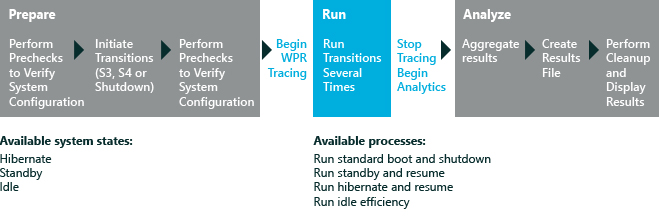

# On/Off Transition Performance

The On/Off Transition Performance assessments measure the transitions from various computer states, like:

-   Power-on transitions, including boot, resume from standby (S3), and resume from hibernate (S4).

-   Power-off transitions, including shut down, enter standby (S3), and enter hibernate (S4).

-   The boot interval, which is the interval between the time the power button is pressed, and the time when the computer reaches the desktop and processes all startup tasks.

-   The shutdown interval, which is the interval between when the shutdown process is initiated, and when the computer is turned off.

Four On/Off Transition Performance assessments are available. This topic describes the Boot Performance (Fast Startup), Hibernate Performance, and Standby Performance assessments.

This graphic illustrates the assessment process:

In this topic:

-   [About On/Off Transition Performance Assessments](#bkmk-aboutonoff)

-   [Before You Begin](#beforeyoubegin)

-   [Settings](#settings)

-   [Results](#results)

-   [Issues](#bkmk-issues)

For more information about how to analyze results for the Boot (Fast Startup) assessment, see [Results for the On/Off Assessments](results-for-the-onoff-assessments.md).

## About On/Off Transition Performance Assessments

Each On/Off Transition Performance assessment evaluates one of these transitions:

<table>
<colgroup>
<col width="50%" />
<col width="50%" />
</colgroup>
<thead>
<tr class="header">
<th>Transition</th>
<th>Description</th>
</tr>
</thead>
<tbody>
<tr class="odd">
<td>
Boot (fast startup)
</td>
<td>
The Boot Performance (Fast Startup) assessment measures the performance of a new fast-startup transition. Windows 8introduces a boot process that enables faster startup of your computer under most conditions. The shutdown process has been updated to include writing data to disk, in a way that resembles how hibernate works. You initiate this process by shutting down the computer. When you press the power button, the computer will turn on and Windows will start by using the fast startup process.

<strong>Note</strong>  

If fast startup is turned off in <strong>Power Options</strong>, both shutdown and restart occur as full reboots.

 

</td>
</tr>
<tr class="even">
<td>
Standby
</td>
<td>
The Standby Performance assessment helps you identify the components that have the most impact on the transition between the system states of on and suspend. Suspend is the sleep state in which the computer enters a low-power state (S3) and consumes a very low amount of power. Standby is the act of entering the suspend state. The transition from standby-sleep back to standby-resume is the interval between the time when the computer initiates wake-up and the time when the computer becomes usable and responsive. This is the time after the user presses the power button or a USB device button (if the computer is configured for wake-on-USB), which is sometime after the desktop appears.
</td>
</tr>
<tr class="odd">
<td>
Hibernate
</td>
<td>
The Hibernate Performance assessment helps you identify the components that have the most impact on the transition between the system states of hibernate and resume. Hibernate is the sleep state in which system and user data is written to disk in a hiberfile. Then, the system enters the lowest sleep state (S4), and the power is cut. The transition from hibernate back to wake-up from hibernate is the interval between the time when the user initiates wake-up from hibernate (by pressing the power button or a USB device button if the computer is configured for wake-on-USB) and the time when the computer becomes usable and responsive (sometime after the desktop appears).

<strong>Note</strong>  

A hiberfile (Hiberfil.sys) is a file that the operating system creates when the computer enters hibernate mode. When the computer is turned on, Windows uses this file to return the system to its pre-hibernate state.

 

</td>
</tr>
</tbody>
</table>

 

### Effect of fast startup on boot performance

The default shutdown and reboot scenario has changed in Windows 8. The shutdown process now includes writing data to disk in a way that resembles how the hibernate state works. A key difference between the shutdown and reboot of Windows 8 and the shutdown and reboot of previous Windows versions is that all user sessions are logged off normally and the remaining information is written to a hiberfile. Logon remains the same as it was in the previous Windows versions. The new boot process in Windows 8 is usually much faster, as shown here:

.jpg)
The traditional Windows boot process loads the operating system's kernel, device drivers, and other system component files into memory and loads the logon screen and desktop. Fast startup provides performance benefits by avoiding some of the work that's traditionally required at boot time. The benefits of this new shutdown/boot transition are immediately noticeable.

There are still several areas where device drivers, services, applications, and other features can adversely affect this scenario. The Boot Performance (Fast Startup) assessment enables you to measure the time of each phase in the scenario, provides insight into what is being run during each subphase, identifies potential issues, and provides remediation guidance for ecosystem partners to improve their products.

**Note**  
The traditional Windows boot is still sometimes required on a computer that's running Windows 8. You can initiate it by pressing Ctrl+Alt+Delete, choosing the power icon, and then choosing **Restart**. When the computer reboots, it uses the traditional boot process.

 

## Before You Begin

The first-run help tips in Windows 8.1 can negatively affect assessment results. To disable these, run the following command from an elevated command prompt, and reboot the computer: `reg.exe add "HKLM\Software\Policies\Microsoft\Windows\EdgeUI" /v DisableHelpSticker /t REG_DWORD /d "1" /f`

To obtain the most accurate and reproducible results from these assessments, set up and prepare the system by performing these actions:

**Note**  
Before the On/Off Transition Performance assessments run, they verify that the supported sleep states are available. If a precheck confirms that a required sleep state is not enabled, the assessments won't run.

 

-   Because these assessments perform several reboots, we recommend that you set up your system to automate the logon process. To do this, see [Automate reboots before you run an assessment](automate-reboots-before-you-run-an-assessment.md).

    **Warning**  
    Don't interact with your computer while the assessment is running. This might adversely affect the results. Automating the logon process can help prevent unwanted interaction.

     

-   Make sure that all device drivers are correctly installed. Results may vary significantly if your computer has missing or incorrect drivers. You can use the [Driver Verification](driver-verification.md) assessment to identify driver issues on the computer that you want to assess.

-   Verify that the correct video card and driver are installed. If you have only the Microsoft® Basic Display Adapter installed, the Standby Performance assessment can't run.

-   Determine whether your system BIOS has been configured to boot from the network, have a CD/DVD inserted into optical drive, BitLocker enabled, or have a multi-boot scenario. These configurations can cause delays in the boot path, and are likely to adversely affect your results.

-   If your system has a multi-boot configuration, a menu for selecting an operating system will appear at startup. The presence of this menu will affect the job results.

### System requirements

You can run the assessments on these operating systems:

-   Windows 8

-   Windows 10

Supported architectures include x86-based and x64-based systems.

## Settings

By default, these assessments use the recommended settings. Microsoft defines these settings so that you can compare the results across multiple computer configurations or over time on the same computer. When you review the results, the run information includes metadata that indicates whether the assessment used the recommended settings.

You can also customize the settings for an assessment, if you want to gather data that's different from the default data. For example, you might identify specific data that would help you perform a detailed analysis of a particular aspect of the computer.

The following table describes the assessment settings that are available for these assessments, in addition to recommended values, and alternative values for each setting.

<table>
<colgroup>
<col width="50%" />
<col width="50%" />
</colgroup>
<thead>
<tr class="header">
<th>Setting</th>
<th>Description</th>
</tr>
</thead>
<tbody>
<tr class="odd">
<td>
Use recommended settings
</td>
<td>
Specifies whether the assessment runs by using the default values. By default, this check box is selected. To change the settings for this assessment, you must first clear this check box.
</td>
</tr>
<tr class="even">
<td>
Number of Iterations
</td>
<td>
Specifies the number of times that the assessment performs reboots to time the shutdown and boot process. By default, the value is 3.
</td>
</tr>
<tr class="odd">
<td>
Perform an initial reboot
</td>
<td>
Specifies whether to reboot the system before the assessment runs. This setting is used in the Hibernate Performance and Standby Performance assessments, but not in the Boot Performance (Fast Startup) assessment.
</td>
</tr>
<tr class="even">
<td>
Use alternate WPR profile
</td>
<td>
By default, this check box is cleared. Select it if you want to use a Windows Performance Recorder (WPR) profile other than the default. If this check box is selected, you must enter the path of another WPR profile.
</td>
</tr>
<tr class="odd">
<td>
Path to alternate trace profile (.wprp)
</td>
<td>
Provides the path of an alternative WPR profile. To specify an alternative path, select the <strong>Use alternate WPR profile</strong> check box, and then type the path in the <strong>Path to alternate trace profile</strong> box.
</td>
</tr>
<tr class="even">
<td>
Enable Minifilter Diagnostic Mode
</td>
<td>
Specifies whether to use the minifilter diagnostic option. By default, this check box is cleared. When the minifilter diagnostic mode is enabled, it produces metrics that help you evaluate the effect of minifilters on boot performance. For more information about this setting, see [Minifilter Diagnostics](minifilter-diagnostics.md). This setting is available only in the Boot Performance (Fast Startup) assessment.
</td>
</tr>
<tr class="odd">
<td>
Collect I/O trace file
</td>
<td>
By default, this check box is cleared. Select it if you want to collect a storage IO trace in addition to the default CPU trace. This setting is available only in the Boot Performance (Fast Startup) assessment.
</td>
</tr>
</tbody>
</table>

 

**Note**  
The minifilter results appear only if you select the **Enable Minifilter Diagnostic Mode** check box before you run the assessment.

 

## Results

The results show metrics for the boot, standby, and hibernate performance of the computer. Some of the metrics have additional information that you can view by expanding them.

The On/Off Transition assessments perform a series of on/off transitions while the assessment is running. A single series of transitions performed by an assessment is referred to as an iteration. There are three different types of iterations: Timing, Analysis, and I/O Analysis.

-   **Timing iterations.** These iterations serve as a basis for the metric values for all shutdown and boot metrics that are captured. Each On/Off transition assessment performs three timing iterations by default and collects three Timing ETL traces. The metric values presented are the average values between all timing iterations. To see the values for individual iterations, in the Results View, right-click the results column header and then choose **Show iterations**.

-   **Analysis iteration.** This iteration collects information while the assessment is running and serves as basis for issues generated by the assessments. Because of the additional tracing overhead, the operations in this iteration can take longer than in a general use case. Keep this discrepancy (metrics arising from the timing iterations and issues arising from the analysis iteration) in mind when triaging and analyzing assessment results.

-   **I/O Analysis Iteration.** This iteration collects a trace with very detailed information about the I/O subsystem and registry accesses. This trace type is not collected by default, to enable it select the **Collect I/O trace file** assessment settings before running the assessment. The assessments perform 3 reboots by default to capture the actual timing duration for each iteration of the shutdown and boot process.

This table provides a brief description of the metrics that the On/Off Transition Performance assessments capture:

<table>
<colgroup>
<col width="33%" />
<col width="33%" />
<col width="33%" />
</colgroup>
<thead>
<tr class="header">
<th>Metric</th>
<th>Description</th>
<th>Assessment</th>
</tr>
</thead>
<tbody>
<tr class="odd">
<td>
Bios Initialization Duration
</td>
<td>
The time, in seconds, to initialize the BIOS, including the Pre-Boot Execution Environment (PXE).
</td>
<td>
Boot Performance, Standby Performance, Hibernate Performance
</td>
</tr>
<tr class="even">
<td>
Explorer Initialization Duration
</td>
<td>
The time to initialize Internet Explorer. Includes details to show total CPU use, in milliseconds, and total disk use, in kilobytes. Also shows details for all processes for Internet Explorer initialization.
</td>
<td>
Boot Performance
</td>
</tr>
<tr class="odd">
<td>
Flush Storage Volumes Duration
</td>
<td>
The time, in seconds, to flush all dirty data and persistent storage.
</td>
<td>
Boot Performance, Standby Performance, Hibernate Performance
</td>
</tr>
<tr class="even">
<td>
Hiberfile Initialize Duration
</td>
<td>
The time, in seconds, to initialize the hiberfile.
</td>
<td>
Boot Performance, Hibernate Performance
</td>
</tr>
<tr class="odd">
<td>
Hiberfile Read Duration
</td>
<td>
The time, in milliseconds, that the operating system took to read the hiberfile.
</td>
<td>
Boot Performance, Hibernate Performance
</td>
</tr>
<tr class="even">
<td>
Hiberfile Write Duration
</td>
<td>
The total time, in milliseconds, that the operating system took to write the hiberfile.
</td>
<td>
Boot Performance, Hibernate Performance
</td>
</tr>
<tr class="odd">
<td>
Main Path Boot Duration
</td>
<td>
For the Boot Performance assessment, this is the time, in seconds, to resume from the end of BIOS initialization until Windows is initialized. This does not include the Post On/Off Duration metric time.

For Standby and Hibernate Performance assessments, this is the time, in seconds, to resume from the end of BIOS initialization until Windows is resumed, not including the Post On/Off Duration metric time.
</td>
<td>
Boot Performance, Standby Performance, Hibernate Performance
</td>
</tr>
<tr class="even">
<td>
Main Path Resume Duration
</td>
<td>
The time, in seconds, to resume from end of BIOS to an initialized Windows desktop.
</td>
<td>
Boot Performance, Standby Performance, Hibernate Performance
</td>
</tr>
<tr class="odd">
<td>
Post On/Off Duration
</td>
<td>
The time, in milliseconds, that Windows took to complete all startup tasks after the desktop appeared.
</td>
<td>
Boot Performance, Hibernate Performance
</td>
</tr>
<tr class="even">
<td>
Query Devices Duration
</td>
<td>
The time, in seconds, to query all devices for a suspend power transition.
</td>
<td>
Boot Performance, Standby Performance, Hibernate Performance
</td>
</tr>
<tr class="odd">
<td>
Resume Devices Duration
</td>
<td>
The time, in seconds, that the operating system took resume devices during the Resume Devices process.
</td>
<td>
Boot Performance, Standby Performance, Hibernate Performance
</td>
</tr>
<tr class="even">
<td>
Superfetch Prepare Memory Duration
</td>
<td>
The time, in seconds, to prepare system memory for an optimized resume experience.
</td>
<td>
Boot Performance, Standby Performance, Hibernate Performance
</td>
</tr>
<tr class="odd">
<td>
Suspend Devices Duration
</td>
<td>
The time, in seconds, to suspend all devices.
</td>
<td>
Boot Performance, Standby Performance, Hibernate Performance
</td>
</tr>
<tr class="even">
<td>
Suspend Processes Duration
</td>
<td>
The time, in milliseconds, that the operating system took to suspend processes during the assessment. If available, expand it to see more information about the processes for the Suspend phase. This information includes details about subphase durations, CPU use, and disk use.
</td>
<td>
Boot Performance, Standby Performance, Hibernate Performance
</td>
</tr>
<tr class="odd">
<td>
Suspend Services Duration
</td>
<td>
The time, in milliseconds, that the operating system took to suspend services during the assessment. If available, expand it to see more information about the time that each subphase took.
</td>
<td>
Boot Performance, Standby Performance, Hibernate Performance
</td>
</tr>
<tr class="even">
<td>
System Session Shutdown Processes Duration
</td>
<td>
The time, in seconds, to shut down the processes in the system session.
</td>
<td>
Boot Performance
</td>
</tr>
<tr class="odd">
<td>
Total Boot [Excluding BIOS] Duration
</td>
<td>
The total time, in seconds, to boot the system, including Post On/Off.
</td>
<td>
Boot Performance
</td>
</tr>
<tr class="even">
<td>
Total Resume [Excluding BIOS] Duration
</td>
<td>
The total time, in seconds, to resume the system, including Post On/Off.
</td>
<td>
Boot Performance, Hibernate Performance
</td>
</tr>
<tr class="odd">
<td>
User Session Shutdown Processes Duration
</td>
<td>
The time, in seconds, to shut down the processes in the user session.
</td>
<td>
Boot Performance
</td>
</tr>
<tr class="even">
<td>
WinLogon Resume Duration
</td>
<td>
The time, in seconds, that the operating system took to resume the Resume Winlogon process.
</td>
<td>
Boot Performance, Hibernate Performance
</td>
</tr>
<tr class="odd">
<td>
Winlogon Suspend Duration
</td>
<td>
The time, in seconds, to log off the user, including processing of logoff notifications and notifying Winlogon subscribers, like Group Policy.
</td>
<td>
Boot Performance, Hibernate Performance
</td>
</tr>
</tbody>
</table>

 

If you enabled the **Enable Minifilter Diagnostic Mode** setting, the assessment results will include minifilter metrics. For more information about minifilter metrics and results, see [Minifilter Diagnostics](minifilter-diagnostics.md).

For more information about how to analyze results for the Boot (Fast Startup) assessment, see [Results for the On/Off Assessments](results-for-the-onoff-assessments.md).

## Issues

The On/Off Transition Performance assessments perform advanced issue analysis and provide links to Windows® Performance Analyzer (WPA) to troubleshoot the issues that the assessments have identified. When WPA opens, additional details about disk activity or CPU activity might be available, depending on the type of issue. For more information about in-depth analysis issues and recommendations, see [Common In-Depth Analysis Issues](common-in-depth-analysis-issues.md).

## Related topics

[Results for the On/Off Assessments](results-for-the-onoff-assessments.md)

[Windows Assessment Toolkit](windows-assessment-toolkit-technical-reference.md)

[Assessments](assessments.md)

 

 

