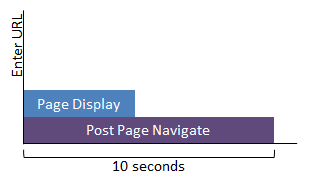

# Results for Internet Explorer Security Software Impact Assessment

The Internet Explorer security software impact assessment measures aspects of Internet Explorer that are typically impacted by antimalware and other browser add-ins. The assessment measures the impact of security software on the display time, CPU time, and resource utilization of Internet Explorer.

This topic helps you interpret the results produced by the Internet Explorer security software impact assessment. It also provides guidance on how to use the results to identify and resolve common issues that negatively impact browser performance.

In this topic:

-   [Goals File](#bkmk-goals)

-   [Metrics](#bkmk-metrics)

-   [Issues](#bkmk-issues)

For more information about the system requirements and assessment settings, see [Internet Explorer Security Software Impact](internet-explorer-security-software-impact.md).

## Goals File

You can create custom goals to measure your improvements in the Results View. Goals files are a triage tool that can help you understand how a PC is performing and to compare PCs in your business.

For example, goals for a basic laptop might be different than the goals you set for a high end desktop computer, or market expectations might change in such a way that you want the flexibility to define different goals and key requirements as time passes and technology improves.

When a metric value is compared to the goal for that metric, the status is color coded in the Result View as follows:

-   Light purple means that the system has a great user experience and that there are no perceived problems.

-   Medium purple means that the user experience is tolerable and you can optimize the system. Review the recommendations and analysis to see what improvements can be made to the system. These can be software changes, configuration changes or hardware changes.

-   Dark purple means that the system has a poor user experience and that there is significant room for improvements. Review the recommendations and analysis to see the improvements that can be made to the system. These can be software changes, configuration changes or hardware changes. You might have to consider making tradeoffs to deliver a high quality Windows experience.

-   No color means that there are no goals defined for the metric.

**Note**  
In the Windows Assessment Toolkit for Windows 8, some assessments include default goals files. The first time you view results using this version of the tools, the default goals file is used. However, you can also define custom goals for Windows 8 the same way that you can for Windows 8.1 and Windows 10.

 

You can set the goals file location and add a goals file to that location before you can use the UI to apply the custom goals. Once a goals file is selected it will continue to be the goals file that is used for any results that are opened.

Only one goals file can be used at a time. Goals for all assessments are set in a single goals file. The assessment tools will search for goals in the following order:

1.  A custom goals file

2.  Goals that are defined in the results file

3.  Goals that are defined in the assessment manifest

You can use the sample goals file that is provided at %PROGRAMFILES%\\Windows Kits\\10\\Assessment and Deployment Kit\\Windows Assessment Toolkit\\SDK\\Samples\\Goals to create your own goals file.

**Note**  
You cannot package a goals file with a job, but you can store it on a share for others to use.

 

## Metrics

The following metrics are reported by the Internet Explorer security software impact assessment.

### Page Display Time

Measures the time in milliseconds that Internet Explorer takes to display initial page content after the assessment navigates to the webpage.  There may be additional activity performed by Internet Explorer after the page is initially displayed but before the page has finished loading. Page Display Time is a subset of Post Page Navigation.

### Post Page Navigation

Resource usage is measured for ten seconds after the assessment navigates to the webpage. Post Page Navigation includes the Page Display time. Both metrics start when navigation, such as entering a URL or clicking on a link, occurs.

<table>
<colgroup>
<col width="50%" />
<col width="50%" />
</colgroup>
<thead>
<tr class="header">
<th>Metric</th>
<th>Description</th>
</tr>
</thead>
<tbody>
<tr class="odd">
<td>
Total CPU Usage
</td>
<td>
Time in milliseconds that the page load impacted the CPU.
</td>
</tr>
<tr class="even">
<td>
Total Disk Usage
</td>
<td>
Size in kilobytes of the disk space used to load the webpage.
</td>
</tr>
<tr class="odd">
<td>
Total Network Duration
</td>
<td>
Time in milliseconds of the duration of network activity required to load the page.
</td>
</tr>
<tr class="even">
<td>
Total JavaScript Duration
</td>
<td>
Time in milliseconds of the duration of JavaScript engine activity required to load the page.
</td>
</tr>
<tr class="odd">
<td>
Total Document Composition Duration
</td>
<td>
Time in milliseconds to compose a webpage including applying CSS.
</td>
</tr>
<tr class="even">
<td>
Total Document Render Duration
</td>
<td>
Time in milliseconds to render a webpage once it is loaded.
</td>
</tr>
<tr class="odd">
<td>
Processes
</td>
<td>
Number of processes required to load the webpage.
</td>
</tr>
</tbody>
</table>

 

### Antimalware Products Count

The number of antimalware software products installed on the PC.

## Issues

This assessment performs advanced issue analysis and provides links to Windows Performance Analyzer (WPA) to troubleshoot the issues that are identified. In most cases, you can click the WPA Analysis link to troubleshoot the issues that appear. When WPA opens additional details about disk activity or CPU activity might be available depending on the type of issue identified. For more information about in-depth analysis issues and recommendations, see [Common In-Depth Analysis Issues](common-in-depth-analysis-issues.md).

 

 

