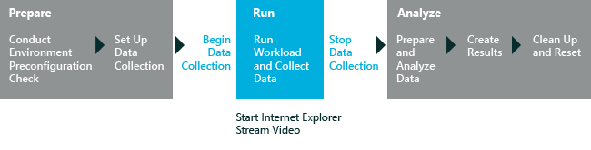

# Streaming Media Performance

The Streaming Media Performance assessment helps you assess the performance of a particular computer configuration when you stream media using Internet Explorer. You can use the assessment results to understand, compare, and improve the streaming media experience.

The Streaming Media Performance assessment uses a streaming server application that is deployed either on a local computer or on a remote server. The assessment starts Internet Explorer and plays back the media content from start to finish or to a specified time. Then, Internet Explorer closes and results are generated. The following graphic illustrates the assessment process.

The focus of the assessment is on video playback using Internet Explorer. The assessment mimics a user who is watching a movie and reports any glitches that it detects. The assessment plays video content from several workloads that range from low resolution to high resolution. When it is run on a single computer, the process uses HTML 5.0 pages that are available in the Content path folder. These files contain embedded media such as the 360p.html, 480p.html, 720p.html, and 1080p.html files. Each video workload plays for one minute.

A glitch is any detectable visual or auditory defect in the user experience. The assessment provides test results for video glitches. It reports glitches for one-second intervals throughout the running of the video content. The video glitches are categorized as minor, medium, and major. The assessment also reports the placement of the glitches. Viewers are likely to notice when three or more consecutive frames are dropped. Additionally, although the audio stream is less likely to be interrupted than the video stream, a series of consecutive dropped video frames affect the viewer experience because the audio track is briefly not synchronized with the video track. For more information about the results and issues produced by this assessment, see [Results for the Streaming Media Performance Assessment](results-for-the-streaming-media-performance-assessment.md).

**Warning**  
Note that when the Streaming Media Assessment is configured to stream to the same device that is playing back the video (default settings), there may be audio or video glitches that are not actionable. The ideal scenario to test streaming media is to set up a remote server described here: [Streaming media assessment: set up a remote server](set-up-a-remote-server-for-the-streaming-media-performance-assessment.md).

 

In this topic:

-   [Before You Begin](#beforebegin)

-   [Workloads](#bkmk-streamingworkloads)

-   [Settings](#settings)

## Before You Begin

The first-run help tips in Windows 8.1 can negatively affect assessment results. To disable these, run the following command from an elevated command prompt, and reboot the computer: `reg.exe add "HKLM\Software\Policies\Microsoft\Windows\EdgeUI" /v DisableHelpSticker /t REG_DWORD /d "1" /f`

When running this assessment on Windows 8.1, make sure the **Collect Analysis Trace** setting is unchecked when assessing expected battery life. When checked, this option will produce an incorrect estimation.

Enable analysis trace collection only when you need additional information to investigate other energy-related problems.

To prepare to run the assessment, follow these steps:

1.  Exit any open applications.

    **Important**  
    Do not touch the mouse or keyboard after the assessment job starts. Running other applications or jobs at the same time as the assessment job can affect your results. Also, the Streaming Media Performance assessment does not include any measurement of seeking or pausing functionality. Do not seek or pause the video during the assessment.

     

2.  Complete the appropriate steps to set up the assessment job on a single computer or on two computers that are connected over a network, as shown in the following table.

    <table>
    <colgroup>
    <col width="50%" />
    <col width="50%" />
    </colgroup>
    <thead>
    <tr class="header">
    <th>Job type</th>
    <th>Description</th>
    </tr>
    </thead>
    <tbody>
    <tr class="odd">
    <td>
Run the job on a single computer
</td>
    <td>
To run the job on a single computer, install the Windows Assessment and Deployment Kit (Windows ADK) Technical Reference and open Windows Assessment Console. Then, follow the instructions that are provided in the introduction to run the Streaming Media Performance assessment.

    
The job runs automatically in Internet Explorer 10 or later versions. The job runs in the Internet Explorer Media pipeline in full-screen mode. We do not recommend user interaction.

    

    <strong>Note</strong>  
    
By default, a 1080p, 30-fps video is available to the job. The assessment plays on the full computer screen. Additional workloads include 360p at 30 fps, 480p at 30 fps, and 720p at 30 fps.

    

    

     
    

    
When the job runs on a single computer, the job results include the number of video or audio glitches that occur.
</td>
    </tr>
    <tr class="even">
    <td>
Run the job on two computers
</td>
    <td>
To run the job on two networked computers, install the Windows ADK Technical Reference on both computers, open Windows Assessment Console, select the Streaming Media Performance assessment, and then configure the settings as shown in [Settings](#settings).

    
The local computer streams content from the HTTP streaming server application that is installed on the second or remote computer.
</td>
    </tr>
    </tbody>
    </table>

     

Before the assessment starts, the Streaming Media Performance assessment runs some pre-checks on the system. When these pre-checks fail, the assessment will generate errors and warnings. Although errors block the assessment from running, warnings do not block the assessment from running. You can make the adjustments that are recommended in the warning message, and continue to run the job. Unaddressed warnings and errors are reported in the results. For more information about the results and issues produced by this assessment, see [Results for the Streaming Media Performance Assessment](results-for-the-streaming-media-performance-assessment.md#bkmk-precheck).

### System Requirements

You can run this assessment only on a computer that is running Windows 8 and Internet Explorer 10.

Supported architectures include x86-based, x64-based systems, and ARM-based systems.

There are two ways to run this assessment on Windows RT:

-   Package the assessment job in the Windows Assessment Console (WAC) and then run it on Windows RT. For more information, see [Package a job and run it on another computer](package-a-job-and-run-it-on-another-computer.md).

-   Use Windows Assessment Services to run assessments on Windows RT. For more information, see [Windows Assessment Services](windows-assessment-services-technical-reference.md).

## Workloads

A workload is a set of automated tasks that simulate user activity in a predefined, repeatable manner. The workloads run independent of each other. The assessment plays video content from several workloads that range from low resolution to high resolution.

You can select any combination of these workloads to run during the assessment.

-   360p (30 FPS) Workload

-   480p (30 FPS) Workload

-   720p (30 FPS) Workload

-   1080p (30 FPS) Workload

The “p” in the video resolution indicates Progressive scan, which is used in computer monitors and digital televisions. An “i” in video resolution indicates Interlaced scan, used in standard television formats. Interlaced video content is not used in this assessment.

**Note**  
You can also use the Streaming Media assessment as a workload in an energy-efficiency job. For more information about energy-efficiency jobs, see [Connected Standby Energy Efficiency](connected-standby-energy-efficiency.md) and [Create and run an energy efficiency job](create-and-run-an-energy-efficiency-job.md).

 

## Settings

By default, this assessment uses the recommended settings. These settings are defined by Microsoft to ensure that the results can be compared across different computer configurations or over time on the same computer. When you review the results, the run information includes metadata that indicates that the recommended settings were used so that you can easily identify results that use recommended settings in addition to those that don’t.

You can also customize these settings if you want to gather different data than what is captured by default. For example, you might identify specific data that would help you do a more detailed analysis of a particular aspect of the computer.

The following table describes the assessment settings, recommended setting values, and alternative values for each setting.

<table>
<colgroup>
<col width="50%" />
<col width="50%" />
</colgroup>
<thead>
<tr class="header">
<th>Setting</th>
<th>Description</th>
</tr>
</thead>
<tbody>
<tr class="odd">
<td>
Use recommended settings
</td>
<td>
Specifies whether the assessment uses the recommended settings. By default, this check box is selected. To change the settings for this assessment, you must first clear this check box.
</td>
</tr>
<tr class="even">
<td>
Iterations
</td>
<td>
Specifies the number of times that the assessment runs. By default, the value is 3. You will see the video play 5 times during 3 iterations. The first is a 15 second to initialize Internet Explorer, 3 video playbacks are for calculating the metrics and one is for assessing the results.
</td>
</tr>
<tr class="odd">
<td>
Content Path
</td>
<td>
Specifies the path of the source directory for the workload dataset that contains media and HTML files that the assessment uses. By default, the content is picked up from <code>../Content/Streaming Media</code>. You can specify you own value.
</td>
</tr>
<tr class="even">
<td>
Server Name
</td>
<td>
Specifies the name of the server on the local network. Even though the box appears to be blank, the path of the default server is defined. If the setting is not specified, the assessment will start the streaming server on the local computer.
</td>
</tr>
<tr class="odd">
<td>
Port
</td>
<td>
Specifies the port on which the server accepts requests. By default, the port on which the server accepts requests is defined as 80. You can also specify your own value.
</td>
</tr>
<tr class="even">
<td>
Streaming Time
</td>
<td>
Specifies the maximum time, in seconds, that the assessment waits for a video workload to finish playing. By default, the value for this setting is 65. You can also specify your own value.
</td>
</tr>
<tr class="odd">
<td>
ETW Trace File Name
</td>
<td>
Specifies the name of the trace file that collects the Event Tracing for Windows (ETW) events that the assessment generates. Even though the box appears to be blank, the trace file for collecting events is defined. You can also specify your own value.
</td>
</tr>
<tr class="even">
<td>
Disable ETW Tracing
</td>
<td>
Disables ETW tracing. By default, this check box is cleared. If this check box is selected, ETW tracing is disabled and the assessment job does not generate an ETW trace file.
</td>
</tr>
</tbody>
</table>

 

## Related topics

[Results for the Streaming Media Performance Assessment](results-for-the-streaming-media-performance-assessment.md)

[Windows Assessment Toolkit Technical Reference](windows-assessment-toolkit-technical-reference.md)

[Assessments](assessments.md)

[Connected Standby Energy Efficiency](connected-standby-energy-efficiency.md)

 

 

