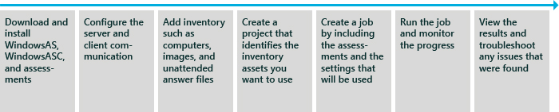

# Windows Assessment Services

Windows Assessment Services is a test framework used to automate running assessments that measure performance, reliability and functionality on multiple computers in a lab environment. It helps you eliminate fragmented, error-prone, expensive, pre-deployment test processes, and enables you to replace multiple steps and inconsistent tools with just one tool.

Windows Assessment Services is included with the Windows ADK.

The Windows Assessment Services - Client (Windows ASC) is the graphical user interface that interacts with Windows Assessment Services. This enables you to manage settings and assets, such as which lab computers to test, which images should be applied to those computers, and which assessments should be run on the test computers. You can use Windows ASC to monitor the progress of a running job, and to view and compare the results that were produced. Additional benefits include being able to import results into a central database for consolidated report generation.

The following diagram shows the workflow for the first-time use of Windows Assessment Services and the client UI:

The Windows Assessment Services Technical Reference provides technical details, advanced how-to information, troubleshooting and related resources. To learn how to use Windows ASC in an end-to-end scenario, see the [Windows Assessment Services step-by-step guide](windows-assessment-services-step-by-step-guide-was.md).

## In This Section

<table>
<colgroup>
<col width="50%" />
<col width="50%" />
</colgroup>
<tbody>
<tr class="odd">
<td>
[Installing Windows Assessment Services](installing-windows-assessment-services-wastechref.md)
</td>
<td>
Learn about system requirements and the installation process for server and client computers.
</td>
</tr>
<tr class="even">
<td>
[Windows Assessment Services setup and configuration](windows-assessment-services-setup-and-configuration-wastechref.md)
</td>
<td>
Configure Windows Assessment Services server, prepare Windows PE, and add inventory such as computers, images and drivers.
</td>
</tr>
<tr class="odd">
<td>
[Windows Assessment Services overview](windows-assessment-services-overview--wastechref.md)
</td>
<td>
Learn the benefits, common scenarios, limitations, and dependencies for Windows Assessment Services.
</td>
</tr>
<tr class="even">
<td>
[Windows Assessment Services step-by-step guide](windows-assessment-services-how-to-topics--wastechref.md)
</td>
<td>
Learn how to install the Windows Assessment Toolkit, configure Windows Assessment Services and the Windows ASC, assess multiple computers, and review results.
</td>
</tr>
<tr class="odd">
<td>
[Windows Assessment Services common scenarios](windows-assessment-services-how-to-topics--wastechref.md)
</td>
<td>
Automate deployment, running assessments and collecting results. This section includes several advanced how-to topics.
</td>
</tr>
<tr class="even">
<td>
[ResultsUtil Command-Line options](resultsutil-command-line-options.md)
</td>
<td>
Use the ResultsUtil command-line options to import results into a SQL database.
</td>
</tr>
<tr class="odd">
<td>
[Troubleshooting Windows Assessment Services](troubleshooting-windows-assessment-services--wastechref.md)
</td>
<td>
Learn about common problems and solutions.
</td>
</tr>
</tbody>
</table>

 

 

 

