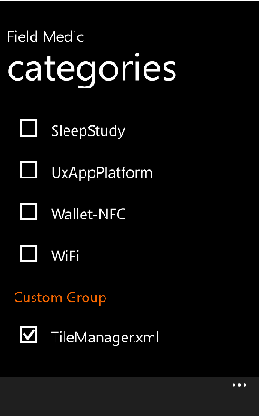

# Custom logging with Field Medic


You can configure Field Medic to generate reports from custom loggers that are not part of the default group of loggers. To specify a custom logger, create a profile XML file and copy it to Phone\\Documents\\FieldMedic\\CustomProfiles.

On development device, T-shell can be used to place XML files into the OEM shared folder. A simple package can be created to place the files there. For more info about the structure of XML that a custom profile XML file has to contain, see [Authoring Recording Profiles](http://msdn.microsoft.com/library/windows/hardware/hh448223.aspx).

## Create a custom profile XML file


Here is an example how to create of a custom profile XML file. Suppose you want to create a custom category that includes these two ETW providers.

| ETW provider name                          | ETW provider GUID                    |
|--------------------------------------------|--------------------------------------|
| Microsoft-WindowsPhone-TileHelper          | B3448AD3-4BE8-4F7C-892B-EA1D69B14ADB |
| Microsoft-WindowsPhone-AccessoryManagerSvc | 68EC658D-C373-4166-996F-D8A757108B27 |

 

This custom profile XML file describes an event collector that has an ID of EventCollector\_TileManager. The event collector contains your two providers, which are specified in the &lt;EventProvider&gt; and &lt;EventProviderId&gt; elements.

``` syntax
<?xml version="1.0" encoding="utf-8" standalone='yes'?>

<WindowsPerformanceRecorder Version="1.0" Author="You" Team="Your team" Comments="Your comments" Company="Your company" Copyright="Your company" Tag="WPDiet">
  <Profiles>
    <!-- Event Collectors -->
    <EventCollector Id="EventCollector_TileManager" Name="WPDiet TileHelper Category Event Collector" Private="false" ProcessPrivate="false" Secure="false" Realtime="false">
      <BufferSize Value="128"/>
      <Buffers Value="40"/>
      <MaximumFileSize Value="5" FileMode="Circular"/>
      <FileMax Value="3"/>
    </EventCollector>

    <!-- Event Providers -->
    <EventProvider Id="EventProvider_Microsoft-WindowsPhone-TileHelper" Name="B3448AD3-4BE8-4F7C-892B-EA1D69B14ADB" Level="5"/>
    <EventProvider Id="EventProvider_Microsoft-WindowsPhone-AccessoryManagerSvc" Name="68EC658D-C373-4166-996F-D8A757108B27" Level="5"/>

    <!-- Profiles -->
    <Profile Id="TileHelperCategory.Verbose.File" LoggingMode="File" Name="TileManagerCategory" DetailLevel="Verbose" Description="WPDiet TileHelper category profile">
      <Collectors>
        <EventCollectorId Value="EventCollector_TileManager">
          <EventProviders>
            <EventProviderId Value="EventProvider_Microsoft-WindowsPhone-TileHelper"/>
            <EventProviderId Value="EventProvider_Microsoft-WindowsPhone-AccessoryManagerSvc"/>
          </EventProviders>
        </EventCollectorId>
      </Collectors>
    </Profile>
  </Profiles>
</WindowsPerformanceRecorder>
```

**Note**  The ETW providers listed in the preceding XML are user-mode components. If your custom profile XML file lists a kernel-mode provider, add NonPagedMemory=”true” to the &lt;EventProvider&gt; element.

 

For more information about the structure of a custom profile XML file, see [Authoring Recording Profiles](http://msdn.microsoft.com/library/windows/hardware/hh448223.aspx).

## Add your custom profile to Field Medic


1.  Create your custom profile XML file as described previously.
2.  Copy your custom profile XML file to Phone\\Documents\\FieldMedic\\CustomProfiles.
3.  Open the FieldMedic app, and tap **Advanced.**
4.  Tap the box under **Choose which ETW providers to use**. Scroll down to **Custom Group**.
5.  Under **Custom Group**, Field Medic displays the names of the custom profile XML files that are in Phone\\Documents\\FieldMedic\\CustomProfiles. Select your custom profile.
6.  Generate a report as described in [Use Field Medic to generate a report](use-field-medic-to-generate-a-report.md). The resulting ETL files have a prefix of “Custom-“ and are placed in root of the device or the SD card.

Custom profiles can be selected together, separate from, or mixed with the regular profiles depending on your logging requirements.

**Note**  
Windows 10 Mobile has a limitation of 64 total parallel profiles, of which a variable number is always taken by the standard OS logging. This reserved amount depends on the type of image. For example, on retail phones, the reserved amount is going to be much lower than on test devices. Therefore, we recommend bundling multiple ETW providers together in a custom profile XML file if possible, or avoid selecting too many ETW providers in parallel. If an error still occurs when running reports, try and unselect some of the profiles.

Another consideration to take into account is that each running profile takes an amount of system memory away from the rest of the OS. So having too many parallel logging sessions may impact performance, especially on low memory devices. This amount of memory can be configured in the profile XML file. The standard included profiles use 8 MB per XML file. When investigating low-memory issues, we recommend running only the profiles that are needed for that specific investigation.

 

 

 


