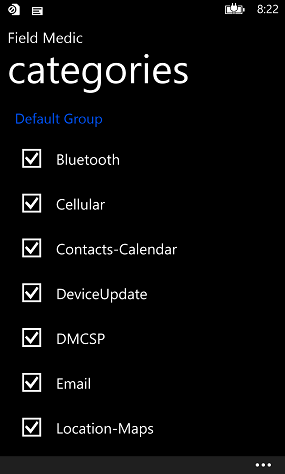
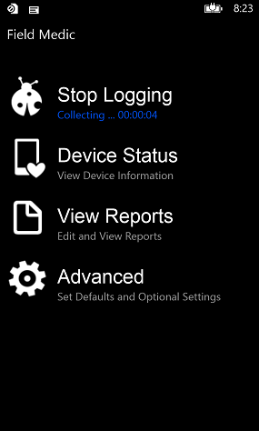
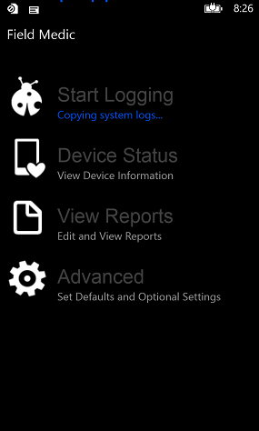
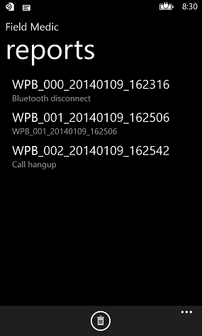
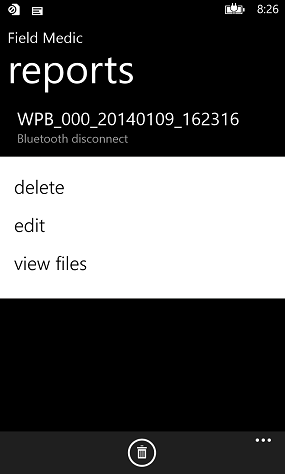
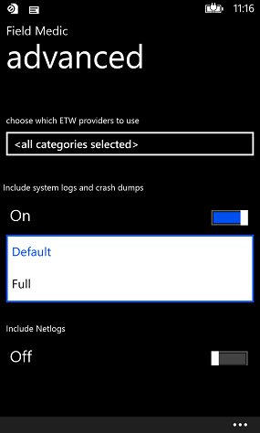

# Use Field Medic to generate a report


This topic explains how to create a report (called "recording" a report). For information about Field Medic, see [Field Medic](field-medic.md).

## Recording a Field Medic report


To record device information in a Field Medic report, use the following steps.

1.  Run the Field Medic app.

2.  Tap **Advanced**. Select the categories that you want to include in the report.

    

3.  Press the **Back** button to return to the main Field Medic screen.

4.  Tap **Start Logging**.

    

5.  After you start logging, Field Medic displays the elapsed capture time under the **Stop Logging** option. Close Field Medic by pressing the **Back** or **Start** button. Reproduce the problem that you want to collect information about.

    **Note**  
    ETW logging for the selected categories remains enabled, even after the device reboots, until you stop logging.

     

    

6.  After you have reproduced the problem, run Field Medic and tap **Stop Logging**.

    **Note**  
    It can take five seconds or longer for Field Medic to stop ETW sessions and create the report files.

     

    

7.  You can view, edit, and delete the list of captured reports by tapping **View Reports** on the main screen.

    

8.  By default, reports shown in the reports screen are named with the format of “WPB\_\#\#\#\_Date\_Time.”

    You can press and hold a report in the list to **delete**, **edit**, or **view** the files associated with the report.

9.  

You can use tools such as Xperf and Tracerpt, and ETWDump to examine the ETL files.

## <a href="" id="view-log-files-in-a-field-medic-report-"></a>View log files in a Field Medic report


1.  To extract a Field Medic report, connect the device to a computer with a USB cable. Copy the Field Medic report from your device (either the root of the device or the root of the SD card) to your PC. Each folder in this directory represents a different report and contains several ETW log files.
2.  On your computer, locate ETWDump in the Windows Driver Kit.

    Example: C:\\Program Files (x86)\\Windows Kits\\10\\ToolFunnel\\EtwDump\\2.0\\EtwDump.exe

3.  Locate the ETW manifest files in the Windows Driver Kit.

    Example: C:\\Program Files (x86)\\Windows Kits\\10\\Manifests

    The mainifest (.mc) files contain formatting information that ETWDump uses to decode the log (.etl) files.

4.  Open a Command Prompt window, and make sure the path to ETWDump.exe is on your Path environment variable.

    Here’s an example of using EtwDump to decode the FieldMedic-Contacts-Calendar.etl log file.

    ``` syntax
    etwdump FieldMedic-Contacts-Calendar.etl -import "C:\Program Files (x86)\Windows Kits\10\Manifests" -o FmCC.csv –of CSV
    ```

ETWDump is one of several tools you can use to decode ETW log files. Here are some other tools you can use to decode ETW log files:

[Xperf](https://msdn.microsoft.com/library/windows/hardware/hh162920.aspx)

XPerf is included in the Windows Adaptation and Deployment Kit (ADK).

[Tracerpt](https://technet.microsoft.com/library/cc732700.aspx)

Tracerpt is included in Windows.

## Specify advanced options


Open the Field Medic app and tap **Advanced**. As shown previously, you can select the ETW provider categories that you want to include in your report. You can also specify whether to include these items in your report:

-   System logs and crash dumps (Default or Full)
-   Netlogs
-   QXDM logs

**Note**  To get crash dumps, you must opt in for feedback in the main OS settings screen. After you opt in, crash dump information is periodically sent to Microsoft when the device is charging and connected to a Wi-Fi network. When a Field Medic report is in session, the crash reports are not sent to Microsoft, but are included in the Field Medic reports. Any crash dumps that are currently not uploaded to Microsoft before a Field Medic report is recorded are also included in the next Field Medic report and will not be uploaded to Microsoft afterwards.

 



You can also specify that reports be stored on an SD card if one is available on the device. This is useful for devices that don’t have much space to store reports.

Tap **Choose where to store reports**, and then choose **SDCard**


## <a href="" id="specify-custom-loggers-"></a>Specify custom loggers


Field Medic can include reports from custom loggers that you specify. For more information, see [Custom logging with Field Medic](custom-logging-with-field-medic.md).

## Related topics


[Field Medic](field-medic.md)

 

 


