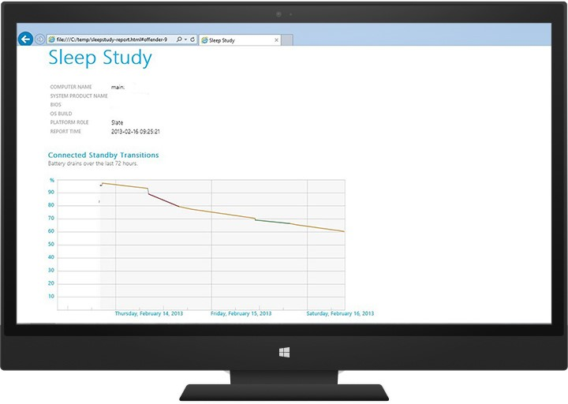
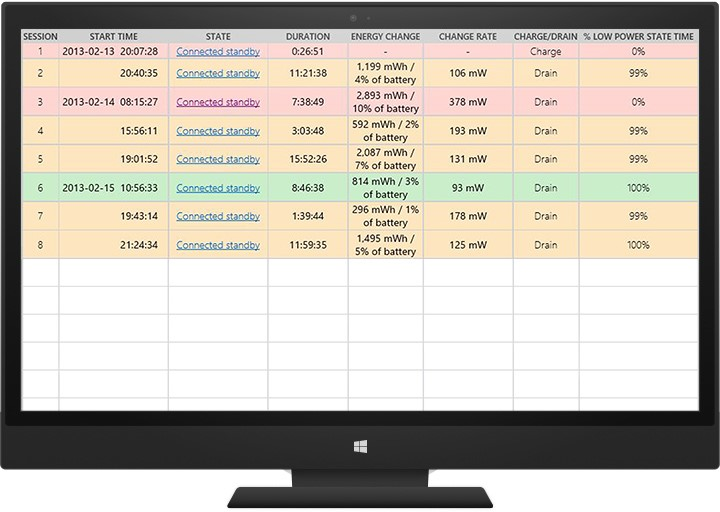
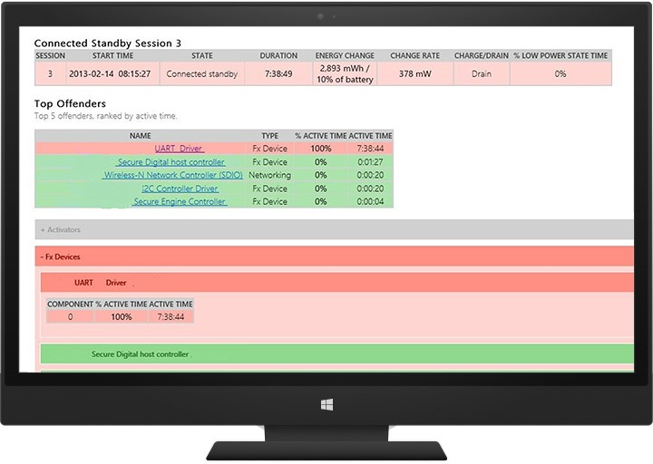

# Delivering a great energy efficiency experience with Modern Standby

The number of systems capable of S0 low power idle is dramatically increasing and it is expected that more systems will use the always on, instantly available power model instead of the traditional S3/S4 power model. To support this trend, Windows 10 has introduced some changes.

The new power model in Windows 10, called Modern Standby (MS), allows systems that have a hard disk drive, and/or a NIC that doesn’t support all the requirements for Windows 8.x Connected Standby to still be able to take advantage of the low power idle model. 

> [!NOTE]
> Windows 8.x Connected Standby can be considered as a special case of Windows 10 Modern Standby.

To learn more about this new power mode, see [Modern Standby](https://msdn.microsoft.com/en-us/windows/hardware/commercialize/design/device-experiences/modern-standby).

*Deepest run-time idle platform state* (DRIPS) occurs when the system is consuming the lowest amount of power possible, limited by the power floor. When the screen is turned off, the connected standby session starts and the system goes through multiple phases to move into a low-power state. When the system is in the lowest-power state, the system is considered to be in DRIPS. The system is not considered to be in DRIPS when performing such tasks as receiving emails, updating live tiles with fresh content, receiving VoIP calls, or any other background task that consumes power. The more time the system spends in DRIPS before the screen is turned back on, the longer the battery life.

> [!NOTE]
> Total Modern Standby session time = DRIPS time + non-DRIPS time

The Performance WEG provides information to help you:

-   Demonstrate that a system has great battery life when running in Modern Standby.

-   Identify and resolve issues that affect Modern Standby.

For more information about how Modern Standby works, see the resources in the following table.

| Resource title                                                       | Content type | Description                                                                                                                                                                                                                                                                        | Download link |
|----------------------------------------------------------------------|--------------|------------------------------------------------------------------------------------------------------------------------------------------------------------------------------------------------------------------------------------------------------------------------------------|--------------------------------------------------------------------------------------------------------------------------------------------------------------------------------------------|
| Introducing to Modern Standby                                       | White paper  | Describes Modern Standby, the new power model in Windows 10                        | [MSDN](https://msdn.microsoft.com/en-us/windows/hardware/commercialize/design/device-experiences/modern-standby) |
| WinHEC 2015 Battery Life Optimization Overview Talk                  | Video        | Covers power modeling and tuning, and optimizing the power floor during screen on and standby                                                                                                                                                                                                 | [Channel 9](http://channel9.msdn.com/Events/WinHEC/2015/OWD202) |
| WinHEC 2015 Battery Life: Debugging Power Problems with Standby Talk | Video        | Covers Windows 10 CS/MS power transition flow, system integration, the impact of subcomponents on a system, power management of storage, networking and USB connected devices, process for analyzing battery drain issues, and a SleepStudy and Windows Performance Analyzer (WPA) tools overview | [Channel 9](http://channel9.msdn.com/Events/WinHEC/2015/OWD200) |
| WinHEC 2015 Battery Life: Debugging Power Problems with Standby Lab  | Lab document | Demonstrates how to validate the energy efficiency of a Connected Standby or Modern Standby system                                                                                                                                                                        | [Channel 9](http://channel9.msdn.com/Events/WinHEC/2015/OWDHOL304) |
| Introduction to Connected Standby                                    | Document     | Details the connected standby experience, software impacts of connected standby, and hardware requirements to enable connected standby on qualified systems.                                                                                                                       | [MSDN](https://msdn.microsoft.com/en-us/windows/hardware/commercialize/design/device-experiences/modern-standby)  |
| Understanding Connected Standby                                      | Video        | Provides an overview of connected standby, including key user scenarios, system architecture, and technical requirements                                                                                                                                             | [Channel 9](http://channel9.msdn.com/events/BUILD/BUILD2011/HW-456T) |
| Desktop Activity Moderator                                           | Article      | Provides an overview of the DAM feature                                                                                                                                                                                                                                                            | [MSDN](https://msdn.microsoft.com/en-us/library/hh848040.aspx) |

## Considerations

To optimize your platform power efficiency, consider the following:

- [How hardware affects Modern Standby](#how-hardware-affects-modern-standby)
- [How to design an OEM image to improve the Modern Standby experience](#how-to-design-an-oem-image-to-improve-the-modern-standby-experience)
- [How apps affect Modern Standby](#how-apps-affect-modern-standby)
- [How to get realistic test results](#how-to-get-realistic-test-results)
- [How to calculate power consumption](#how-to-calculate-power-consumption)

### How hardware affects Modern Standby

Hardware components use varying rates of power in active modes and Modern Standby. You can assess the performance of hardware components to see if they degrade the Modern Standby experience and work with the manufacturer to improve efficiency.

### How to design an OEM image to improve the Modern Standby experience

The design of a complete Windows image can improve or degrade the Modern Standby experience. You can run tests during all phases of image design and development to identify performance problems early and make design decisions based on the results.

### How apps affect Modern Standby

Windows Store apps connect to many sources and integrate with hardware devices directly. Apps can perform certain tasks during Modern Standby, like updating live tiles or playing background music. These tasks draw more power from the battery.

In some cases, a Windows Store app needs to finish an operation started by the user before being suspended for Modern Standby. For this type of activity, there are specific affordances that let the app continue running for a period of time. Some apps can also prevent a device from entering Modern Standby. You can assess apps in your Windows image to see if they degrade the Modern Standby experience and work with the app developer to improve efficiency.

### How to get realistic test results

You can customize tests based on the hardware and software configuration of your PC to get more accurate results. For example, you can run tests with anti-malware software enabled on your PC.

### How to calculate power consumption

You can estimate the rate of power consumption for your PC in different scenarios, including Modern Standby. You can then use tests to verify these estimates and identify performance problems caused by individual components. To learn how to calculate power consumption, see the Battery Considerations document.

## Self-hosting and user testing

We recommend that you have a self-host program to find bugs and improve final quality for Modern Standby systems. Some bugs can be identified only through self-host and real user testing. Focus on the following scenarios:

-   CS enter/exit reliability and performance
-   Thermals
-   Responsiveness/performance
-   Connectivity
-   Battery life

## Recommended goals

The device's battery capacity and power draw should be carefully analyzed to meet your battery life goals. Measure reasonable consumer usage scenarios and environments to accurately project your device’s battery life.

The following table shows minimum targets for battery life, based on our user research. You should also compare your battery life goals with in-market products.

| Scenario/workload            | Target |
|------------------------------|------------------------------|
| Modern Standby               | >= 9 days of battery life |
| audio playback (display off) | >= 125 hours |

DRIPS percentage is a key metric to determine if a given system exhibits good or bad battery life during a Modern Standby session.

| DRIPS %   | Evaluation |
|-----------|------------|
| 98 – 100  | Excellent |
| 95 – 97.9 | Very good |
| 90 – 94.9 | Good |
| 80 – 89.9 | Fair |
| < 80   | Poor |

## Validation and testing

### Generating a report on battery life estimates and history by using PowerCfg.exe

You can use the PowerCfg.exe tool to identify battery life inconsistencies on your PC. The PowerCfg.exe tool is installed with Windows and uses system tracing in the Windows operating system to report details of battery usage, including power states over a 72-hour period. The battery usage report shows power usage data even when the PC was not in an active state.

To generate a battery usage report, open an elevated command prompt and run the following command: **powercfg.exe /batteryreport /output c:\\reports\\batterylife.html**

The battery usage report provides information about batteries installed in the PC, power states and battery drains over the last 72 hours, a history of battery usage and changes in charge capacity of the battery going back several months, and a battery life estimate based on the actual history of the PC.

For more information about the PowerCfg.exe tool, see [PowerCfg command-line options](https://technet.microsoft.com/en-us/library/hh824902.aspx).

### Generating a report on Modern Standby issues by using SleepStudy

SleepStudy is a new Windows diagnostics tool that supports Modern Standby. It monitors a Modern Standby PC’s behavior and provides actionable diagnostics on Modern Standby battery life. It’s available only on CS-enabled PCs.

SleepStudy generates a summary of top issues causing poor Modern Standby battery life. To get the report, run the **powercfg /sleepstudy** command in an elevated command prompt. This tool can be useful if you plan to have a self-hosting program to find and triage bugs.

For more information about the PowerCfg /SleepStudy tool, see [Connected standby SleepStudy](https://msdn.microsoft.com/windows/hardware/commercialize/design/device-experiences/modern-standby-sleepstudy).

The following screen shot shows PC info, including device name, firmware, and build version. The chart shows the drain rate while in Modern Standby.

The following screen shot shows an example of a per-session table. In this example, session 3 has the highest drain rate. Clicking it opens the next level of detail to identify the possible offenders.

The **Energy Change** column represents the amount of energy drained from the battery (in mWh) during a specific CS session. The **Change Rate** column represents the average power consumption (in mW) during a specific CS session.

In the following screen shot, a UART driver is active throughout the session. This example can be used as a starting point for a more thorough investigation.

#### Automating connected standby testing by using PwrTest.exe

You can use the PwrTest.exe tool in the Microsoft Windows Drivers Kit (WDK) to cycle through power states, including connected standby, to record processor power management and battery information from the system over a period of time.

**To run a connected standby scenario with PwrTest.exe:**

1. Install the [WDK](https://developer.microsoft.com/en-us/windows/hardware/windows-driver-kit).

2. At a command prompt, navigate to the PwrTest.exe version that matches the architecture of the PC. For example, type: **cd C:\\WDK\\Tools\\PowerManagement\\i386**

3. Run PwrTest.exe with the **/cs** option. You can also specify the number of cycles (**/c**), delay time between transitions in seconds (**/d**), and exit time in seconds (**/p**). For example, type: **pwrtest.exe /cs /c:4 /p:120 /d:150**

> [!NOTE]
> The connected standby scenario requires the virtual power button driver. This driver is installed by the Windows Device Testing Framework (WDTF), which is found in WDK 8.

The PwrTest.exe connected standby scenario log file provides information about transitions between power states.

The Connected Standby Stress hardware compatibility test also lets you specify parameters like the number of test cycles and delays between test cycles.

For more information, see [PwrTest](https://msdn.microsoft.com/en-us/library/windows/hardware/ff550682.aspx).

