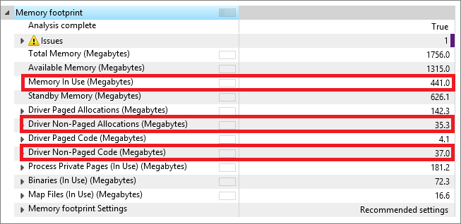
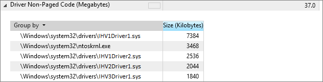
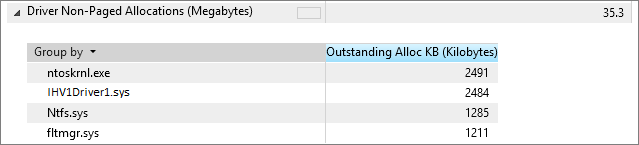
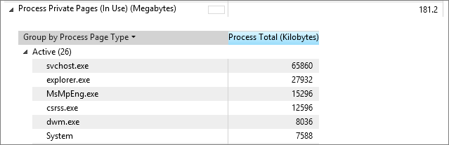

# Delivering a great experience with low memory

The amount of memory available has a significant affect on the overall user experience, ranging from overall responsiveness of the system, responsiveness when switching between Windows Store style apps, and battery life. These are all important factors to consider when evaluating the overall experience with low memory. (Low memory is 1 GB of RAM on 32-bit Windows and 2 GB of RAM on 64-bit Windows.)

## Considerations

There are several things that an OEM, IHV, and ISV need to consider when targeting a low-memory device.

### Drivers and apps

#### Overall baseline memory footprint

The typical baseline 32-bit retail Windows image consumes approximately 400 MB of in-use memory post-boot (as measured by using the Memory Footprint assessment in the ADK). Allowing for 10% headroom or 100 MB on 1 GB, this leaves enought memory for 2-3 apps to be in physical memory, enabling fast switching between the apps. The larger the base operating system memory footprint, the lesser the memory available to the user and apps.

Key factors that impact baseline OS memory footprint are drivers and pre-loaded software, including anti-malware apps, device desktop apps, and software updaters.

-   **Driver footprint:** This includes driver code and associated allocations. Because most drivers exist in memory at all times, non-pageable memory (or contents that need to be in physical memory and cannot be paged out) is extremely important as it constitutes a fixed cost in terms of memory utilization throughout the lifetime of the system. Current hardware certification requirements cover non-pageable allocations: MDL/Contiguous memory allocations, non-paged driver code, and non-paged pool on a per-driver basis. For more information, see [Device.DevFund.Memory.DriverFootprint](https://msdn.microsoft.com/en-us/library/windows/hardware/jj124553.aspx).

-   **Hardware Memory Reservation:** This includes memory ”carve-outs,” which reduces the amount of OS visible memory that is available to Windows and is extremely important in the context of low memory devices. Current hardware certification requirements provide budgets for different RAM configurations: 
[System.Fundamentals.Firmware.HardwareMemoryReservation](http://msdn.microsoft.com/en-us/library/windows/hardware/jj128256.aspx).

-   **Pre-loaded software and anti-malware apps:** These include services/additional processes that start up during boot and remain active during the lifetime of a session. The set of pre-loaded software that introduces processes at startup need to be carefully considered and budgeted.

From an OS perspective, several improvements have been made to reduce run-time memory footprint on Windows to make more memory available for users and their apps. For more information, see [Reducing runtime memory in Windows 8](https://blogs.msdn.microsoft.com/b8/2011/10/07/reducing-runtime-memory-in-windows-8/). It is important to ensure that OEMs, IHVs, ISVs, and Microsoft partners improve the footprint in each of these areas and configure devices with careful consideration to deliver a great customer experience.

### Storage

#### Disk performance

In a low-memory configuration, Windows relies on paging and swapping of content from memory and thus the performance of the underlying disk is critical in delivering a smooth and responsive user experience. Hardware certification requirements provide guidance on key performance metrics for storage on Connected Standby devices. For more information, see [Device.Storage Requirements](https://msdn.microsoft.com/en-us/library/windows/hardware/jj134356.aspx).

Windows has mechanisms to reduce memory usage of suspended Windows Store apps and resume them via efficient sequential disk IO. For more information, see [Reclaiming memory from Metro style apps](https://blogs.msdn.microsoft.com/b8/2012/04/17/reclaiming-memory-from-metro-style-apps/). For example,
consider a 120-MB app that needs to be read from disk on resume; a disk that delivers sequential read performance of 60 MB/s will take 2 seconds for that app to be read back off the disk whereas a disk that delivers 120 MB/s will take only 1 second to bring its contents into memory. eMMC and SSD storage provide sequential read rates of approximately 120-150 MB/s, while typical rotational disks have speeds of approximately 50 MB/s. Run-time policies in Windows make trade-offs based on storage performance and slower disks (e.g., HDD and HHDD), which will result in a potentially slower app switch/multitasking experience and increased app terminations.

#### Disk endurance

The endurance or lifetime of non-rotational storage like SSDs and eMMC disks are proportional to the total volume of data written to the device along with several other factors, such as workload and alignment of writes. On a 1-GB device, there will be a larger volume of writes to storage given the memory constraints, which is an important consideration when selecting parts.

Endurance varies significantly based on manufacturers (block size selection, types of flash memory, etc.); currently, there are no standardized ways of measuring endurance. It is recommended that partners evaluate disk endurance before making device selection decisions.

## Recommended goals

> [!IMPORTANT]
> The following table provides goals for systems running 32-bit Windows. The storage performance guidance is applicable to the boot storage media and tested with the smaller of 2% or 1 GB of free disk space.

<table>
<thead>
<tr class="header">
<th><strong>Category</strong></th>
<th><strong>Metric</strong></th>
<th><strong>Goals</strong></th>
</tr>
</thead>
<tbody>
<tr class="odd">
<th rowspan="9"><strong>Baseline memory footprint</strong></th>
<td colspan="2"><strong>System level</strong></td>
<!--Empty cell in colspan-->
</tr>
<tr class="even">
<!--Empty cell in rowspan-->
<td>

&nbsp;&nbsp;&nbsp;Driver non-paged code

</td>
<td>&lt; 20 MB</td>
</tr>
<tr class="odd">
<!--Empty cell in rowspan-->
<td>

&nbsp;&nbsp;&nbsp;Driver non-paged allocations

</td>
<td>&lt; 30 MB</td>
</tr>
<tr class="even">
<!--Empty cell in rowspan-->
<td>

&nbsp;&nbsp;&nbsp;Hardware memory reservation

</td>
<td>&lt; 130 MB</td>
</tr>
<tr class="odd">
<!--Empty cell in rowspan-->
<td>

&nbsp;&nbsp;&nbsp;Total active private pages of startup apps, services, tasks

</td>
<td>&lt; 40 MB</td>
</tr>
<tr class="even">
<!--Empty cell in rowspan-->
<td colspan="2"><strong>Per Driver (Non-paged allocations)</strong></td>
<!--Empty cell in colspan-->
</tr>
<tr class="odd">
<!--Empty cell in rowspan-->
<td>&nbsp;&nbsp;&nbsp;Driver locked/contiguous memory allocations</td>
<td>12 MB for all driver types</td>
</tr>
<tr class="even">
<!--Empty cell in rowspan-->
<td>&nbsp;&nbsp;&nbsp;Non-paged allocations</td>
<td>

&lt;= 6 MB for GPU driver

&lt;= 4 MB for other drivers

</td>
</tr>
<tr class="odd">
<!--Empty cell in rowspan-->
<td>&nbsp;&nbsp;&nbsp;Non-paged driver code</td>
<td>&lt;= 10 MB for GPU drivers, &lt;= 1.66 MB for other drivers</td>
</tr>
<tr class="even">
<th><strong>Startup apps memory footprint</strong></th>
<td><strong>Startup applications, services, and tasks (including anti-malware)</strong></td>
<td>&lt; 40 MB</td>
</tr>
<tr class="odd">
<th rowspan="13"><strong>Disk performance</strong></th>
<td colspan="2"><strong>Random performance</strong></td>
<!--Empty cell in colspan-->
</tr>
<tr class="even">
<!--Empty cell in rowspan-->
<td>

&nbsp;&nbsp;&nbsp;4 KB write IOPs, measured over a 1-GB area

</td>
<td>&gt;= 200 IOPs</td>
</tr>
<tr class="odd">
<!--Empty cell in rowspan-->
<td>

&nbsp;&nbsp;&nbsp;4 KB write IOPs, measured over a 10-GB area

</td>
<td>&gt;= 50 IOPs</td>
</tr>
<tr class="even">
<!--Empty cell in rowspan-->
<td>

&nbsp;&nbsp;&nbsp;64 KB write IOPs, measured over a 1-GB area

</td>
<td>&gt;= 25 IOPs</td>
</tr>
<tr class="odd">
<!--Empty cell in rowspan-->
<td>

&nbsp;&nbsp;&nbsp;4 KB read IOPs, measured over a 10-GB area

</td>
<td>&gt;= 2000 IOPs</td>
</tr>
<tr class="even">
<!--Empty cell in rowspan-->
<td>

&nbsp;&nbsp;&nbsp;4 KB 2:1 read/write mix IOPs, measured over 1-GB area

</td>
<td>&gt;= 500 IOPs</td>
</tr>
<tr class="odd">
<!--Empty cell in rowspan-->
<td>

&nbsp;&nbsp;&nbsp;4 KB 2:1 read/write mix IOPs, measured over a 10-GB area

</td>
<td>&gt;= 140 IOPs</td>
</tr>
<tr class="even">
<!--Empty cell in rowspan-->
<td colspan="2"><strong>Sequential performance</strong></td>
<!--Empty cell in colspan-->
</tr>
<tr class="odd">
<!--Empty cell in rowspan-->
<td>

&nbsp;&nbsp;&nbsp;Write speed (64 KB I/Os), measured over a 10-GB area

</td>
<td>&gt;= 40 MB/s</td>
</tr>
<tr class="even">
<!--Empty cell in rowspan-->
<td>

&nbsp;&nbsp;&nbsp;Write speed (1 MB I/Os), measured over a 10-GB area

</td>
<td>&gt;= 40 MB/s</td>
</tr>
<tr class="odd">
<!--Empty cell in rowspan-->
<td>

&nbsp;&nbsp;&nbsp;Read speed (64 KB I/Os), measured over a 10-GB area

</td>
<td>&gt;= 60 MB/s (120 MB/s)</td>
</tr>
<tr class="even">
<!--Empty cell in rowspan-->
<td colspan="2"><strong>Device I/O latency</strong></td>
<!--Empty cell in colspan-->
</tr>
<tr class="odd">
<!--Empty cell in rowspan-->
<td>

&nbsp;&nbsp;&nbsp;Max latency

</td>
<td>&lt; 500 milliseconds</td>
</tr>
<tr class="even">
<th><strong>Disk endurance</strong></th>
<td><strong>Lifetime</strong></td>
<td>&gt;= 2-3 years</td>
</tr>
</tbody>
</table>

## Measuring memory using the Windows Assessment and Deployment Kit (ADK)

Compared to a retail OS image, the memory footprint assessment in the ADK provides a quantitative evaluation of baseline memory footprint for different configurations.

### Related resources

-   Guidance on running the Memory Footprint assessment and collecting data: [Memory Footprint](http://msdn.microsoft.com/en-us/library/windows/hardware/hh825365.aspx)

-   Understanding the results: [Goals File](http://msdn.microsoft.com/en-us/library/windows/hardware/jj130826.aspx#BKMK_Goals)

## Guidance

### For OEM

OEMs have a significant influence over the choice of hardware/drivers and pre-loaded software, which directly impacts the memory footprint of the system:

-   Before you deploy, understand and quantify the impact of drivers and software you install on top of a clean image and ensure that they are within the recommended goals previously described:

    -   Reduce the driver footprint by lessening the number of drivers or selecting hardware/drivers that have lower memory requirements.

    -  Reduce the number of default "run-always" startup processes (introduced by pre-loaded software and antivirus programs) and provide guidance, if needed, to consumers about enabling specific applications or functionality.

-   Consider using a different driver or software vendor that can supply you with equivalent functionality with lower impact on system memory.

-   Consult your driver and software vendors for the latest versions of their software. Also, provide feedback to your partners on specific drivers or software that have higher than recommended memory usage and provide traces and logs from the assessment toolkit.

### For IHV/ISV

IHVs that can deliver memory efficient drivers enable OEMs to build 1-GB systems that provide a great experience to consumers:

-   Ensure that hardware parts meet the certification requirements described previously (particularly nonpageable footprint for drivers, performance for storage hardware, and memory usage of run-always apps for applications).

-   Be efficient with memory usage that uses a "pay for play" model by enabling functionality only as needed:

    -   Avoid configuring drivers to support features that are needed only for 1-GB systems (for example, create platform-specific driver packages that detect hardware and load code specific to it).

    -   Minimize runtime cost by allocating the minimum memory required when needed and freeing it as soon as you are done (for example, buffers for supporting RAID storage are not required unless the user explicitly configures it).

-   Leverage tools to understand and improve memory footprint. The following talk describes the approach to reducing footprint along with available tools: [Reducing the memory footprint of drivers and apps](http://channel9.msdn.com/events/BUILD/BUILD2011/HW-141T).

### For anti-malware app ISV

Anti-malware apps can significantly impact baseline the OS memory footprint and user experience when not optimized for performance:

-   Ensure that the number and footprint of "run-always" services and processes are as minimal as possible. For example:

    -   Ideally, run only one process/service for real-time scanning.

    -   Other processes for updating antivirus definitions, such as displaying the UI for the user, should be created only when needed in response to user input or notifications, and should exit after operations are complete.

-   Be efficient with memory usage for "run-always" processes:

    -   Maintain a data structure to represent signatures and only load specific portions on demand.

    -   UI should not be launched unless explicitly requested by the user (for example, popups that open immediately after boot).

-   Windows provides a core set of Windows APIs and associated documentation to optimize for performance:

    -   Optimize signature loading and maintenance via the use of compression: [Xpress Compression](http://msdn.microsoft.com/en-us/library/ee915356(v=PROT.13).aspx).

    -   Maintain caches for previously scanned files to minimize work.

    -   Use low CPU/disk and memory priorities for minimizing impact. For example:

        -   [SetPriorityClass](http://msdn.microsoft.com/en-us/library/ms686219.aspx)

        -   [SetThreadPriority](http://msdn.microsoft.com/en-us/library/ms686277.aspx)

-   Focus on idle memory footprint to ensure that memory footprint at idle as well as during full system scans and 
    real time scanning is < 15 MB. Doing so will reduce the memory footprint as much as possible during those scenarios.

## Validation

To evaluate and validate memory usage by processes and drivers, use the Memory Footprint assessment in the ADK. After the assessment has executed, open the report in the Windows Assessment Console (WAC) tool and extract the relevant metrics by using the following guidance.

### System level 

You can find system-wide memory metrics in the assessment report. The following screenshot highlights **Total In-Use Memory**, **Driver Non-Paged Code** and **Allocations** metrics.

### Per driver

#### Non-Paged code

To obtain the specific non-paged code contribution of individual drivers, expand the **Driver Non-Paged Code** metric.

#### Non-Paged allocations

To obtain the specific non-paged allocations of individual drivers, expand the **Driver Non-Paged Allocations** metric and select **Group by -> (None)**.

### Per process

To obtain the amount of active private pages of individual processes (applications, services, or tasks) on the system, expand the **Process Private Pages** metric, and select the **Active** sub-metric.

In the following screenshot, Windows Defender (MsMpEng.exe process) consumes 14.9 MB of memory through its private working set.

In order to validate that the 40-MB target for startup applications, services, and tasks is achieved, identify every process in this list associated with preloaded software and calculate the sum.

