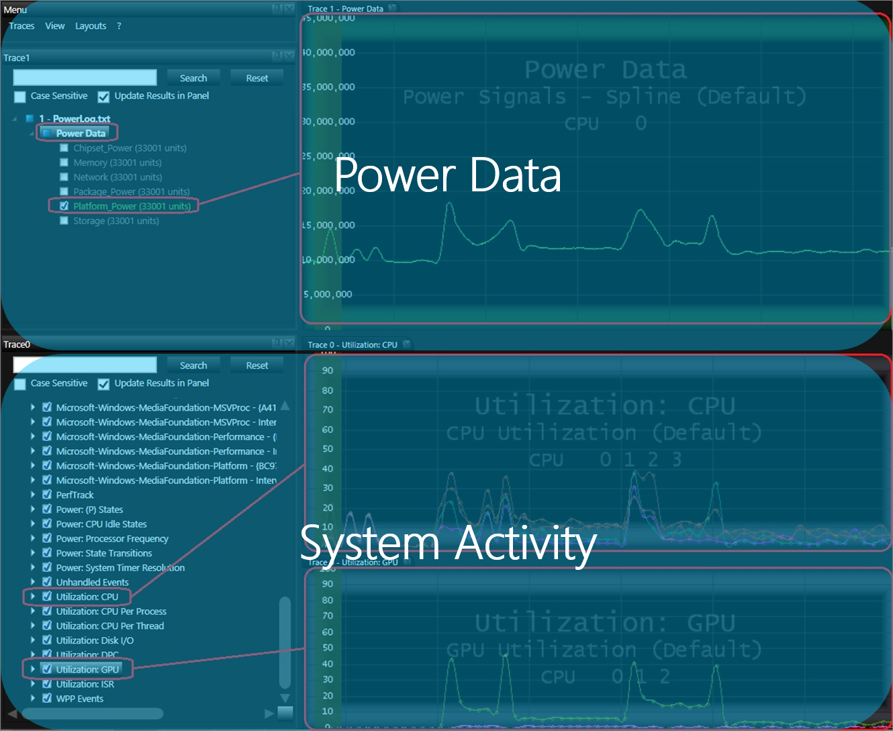
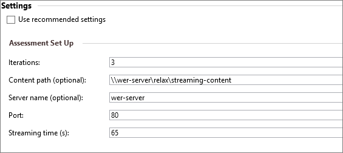
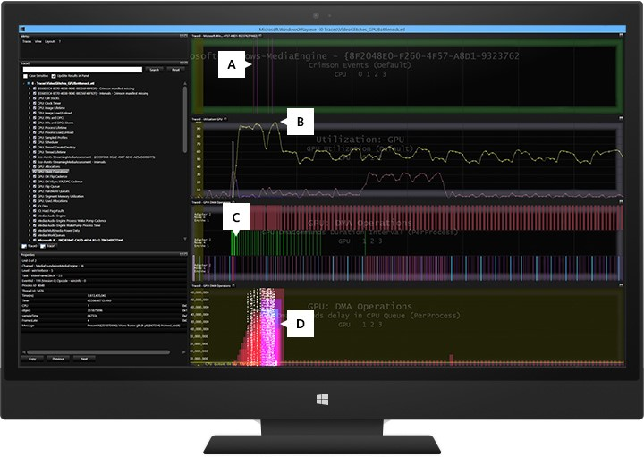

# Delivering a great media experience

An exceptional media playback and capture experience is glitch free, low latency, and energy efficient. You can assess the performance of media playback, real-time communications, and webcam capture scenarios on your Windows devices by using tests in the ADK and HLK.

## Considerations

A device that delivers a great media experience delivers on glitch-free audio and video, and long battery life.

### Glitch-free audio

For real-time communication scenarios, the audio must be glitch-free and also meet the same low latency that users experience when talking on a traditional phone. To achieve glitch-free audio, there must be no audible pops or discontinuities in the audio stream. 

Some audio glitches occur during the processing of the audio samples before they are rendered to the audio driver. The media pipeline is instrumented with events to log these glitches by using Event Tracing for Windows (ETW). YOu can use tools such as Media eXperience Analyzer (MXA) to narrow down the cause of the glitches.

### Glitch-free video

There are two types of video quality:

-   **Temporal quality** - Temporal quality is degraded when the media engine pipeline is stalled and there is a discontinuity in the processing of video frames. Video frames are either dropped or presented late, which might be noticeable to the human eye.

	Examples of temporal video glitches include delays in the hardware and media pipeline threads that are introduced by bottlenecks or higher priority work on the system.

	Temporal quality affects:

	-   Fast startup. How quickly the video loads and starts to play.

	-   Audio/Video sync. Whether the audio and video streams start and stop simultaneously and keep the same pace.

	-   Seek latency. How quickly advance and reverse functions respond to user commands.

		The playback and capture pipelines are instrumented with video glitch and data drop events that can be used to measure the temporal video quality. The pipeline takes advantage of the Multimedia Class Scheduler (MMCSS) service. This service is built into the scheduler and ensures that time-sensitive processing in the media pipeline receives prioritized access to CPU resources. Multimedia apps can use as much of the CPU as possible without denying CPU resources to lower-priority apps. For more information about MMCSS, see [Multimedia Class Scheduler Service](http://msdn.microsoft.com/en-us/library/windows/desktop/ms684247.aspx).

-   **Spatial quality** - Spatial quality refers to any corruption in the video stream during media playback or when the content is encoded. The decoding or video processing phases of video playback can introduce horizontal or vertical tearing or macro blocking.

### Long battery life

Windows supports hardware offload and several other power savings features that enable you to deliver competitive battery life during media workloads. These features include:

-   **Audio Offload** - Leverage audio offload on platforms that have offload support.

-   **Multi-plane overlay (MPO)** - Several chipsets provide support for MPO, which offloads video processing to hardware. This feature reduces memory bandwidth requirements by approximately 50%, resulting in power savings and increased glitch resilience.

-   **[Direct Flip](https://msdn.microsoft.com/en-us/library/windows/hardware/dn653329.aspx)** and **[Independent Flip](http://msdn.microsoft.com/en-us/library/windows/hardware/dn457716.aspx)** - Bypassess the DWM and flips surfaces directly to the GPU, removing memory copies during full screen video playback.

-   **Low refresh rate playback** - Media engine apps drop the refresh rate to the lowest multiple that the panel supports when in full screen. For example, when 24fps video content is played in the XBox video app on a system that has an LCD that supports 48hz refresh rates, the media pipeline will drop the refresh rate from 60 to 48hz.

-   **Batching** - In full screen playback mode, media engine-based apps process and queue-up several frames to be presented. 

You can use Media eXperience Analyzer, an analysis tool, to validate whether the features listed above are engaged. This tool also enables you to correlate power usage generated by power instrumented systems with system activity captured in an ETW log.

### Impact of third-party drivers and apps

Third-party drivers and apps are often designed to perform a task quickly and, to accomplish these tasks, might run at a priority that introduces resource constraints for the media pipeline. In some cases, there are third-party drivers that run at dispatch level for long periods of time (10+ ms) and, in other cases, utilities hard code the priority of their threads to run at priority 22. As described in the following validation and testing section, third-party apps and drivers can introduce delays in the media pipeline and cause audio and video glitches.

## Recommended goals

To deliver a great media playback experience, a Windows device should meet the goals in the following table. These performance and quality goals apply to Windows Store apps and desktop apps. They apply to both inbox and third-party playback apps.

|   Metric priority   |   Metric                                                   | Exceptional          |
|---------------------|------------------------------------------------------------|----------------------|
| 0                   | Audio glitches during steady state playback                | 0                    |
| 0                   | Video glitches and data drops during steady state playback | 0                    |
| 1                   | Audio & video glitches, data drops at startup or shutdown  | 0                    |
| 1                   | Audio/video sync                                           | &lt; 25 ms           |
| 1                   | ISR/DPC duration                                           | &lt; 25 microseconds |
| 2                   | Startup latency                                            | &lt; 1 sec           |
| 2                   | Seek latency                                               | &lt; 500 ms          |

To deliver a great real-time communication and capture experience, a Windows device should meet the performance goals outlined in the Windows Hardware and Certification (HCK) tests listed in the validation and testing section below.

## Validation and testing

You can use the Hardware Lab Kit (HLK) to ensure that your Windows device meets Windows requirements.

HLK tests related to media playback include:

<dl>
<dt>**Glitch-Free HD Playback Test**</dt>
<dd>

Plays back 1080p video content and reports the number of audio and temporal video glitches. This test can optionally generate verbose performance traces that can be analyzed in performance tools like Media eXperience Analyzer.

</dd>
</dl>

You can use the Windows Assessment Toolkit to improve the performance of your Windows device beyond minimum requirements. Windows assessments related to media playback include: 

<dl>
<dt>**Streaming Media Performance**</dt>
<dd>

Measures the streaming media quality of HTML5 video playback in Internet Explorer. Verbose ETW logs contain information necessary for diagnosing the cause of the performance issues identified by the test. We recommend that you set up the streaming server on a system that is different from the client.

<ul>
<li>Requires second system on the network to host streaming server process
</li>
<li>To set up the server, follow the instructions in [Set Up a Remote Server for the Streaming Media Performance Assessment](http://msdn.microsoft.com/en-us/library/windows/hardware/hh825310.aspx).
</li>
<li>Change the assessment parameters to reflect the server configuration. For example:

</li>
</ul>
</dd>
<dt><strong>Local Media Playback Energy Efficiency Workload</strong></dt>
<dd>

Measures the battery life during HTML5 playback of 1080p H.264 content.

</dd>
</dl>

### Analyzing audio and video glitches

Media eXperience Analyzer is a trace visualization tool available on MS Download Center. It can be used to identify the root cause of temporal quality issues. The general approach to glitch analysis can be summarized by the following steps:

1.  Collect an ETW log using the Windows Performance Recorder (WPR) during a Media playback workload.

2.  Zoom into audio and video glitch or data drop events.

3.  Search for bottlenecks or unexpected delays in the CPU, GPU, disk, or network.

4.  Collect supporting information like call stacks and analysis screen shots.

5.  Notify and follow up with owners of the components introducing delays or glitches.

Audio and video data drops or glitches can be broken down into three categories: downstream, midstream, and upstream.

#### Downstream

Occurs when the source can’t read from the disk or network fast enough to keep up with real-time decoding and rendering. For example, the disk might be pegged by a hard page fault and as a result, samples can’t be read from the disk in real-time or faster. Source-side starvation often results in data drop events.

#### Midstream

In this phase, there are delays decrypting a protected stream, decoding is slower than real-time, or there are delays presenting the frames to the GPU. These delays can be caused by a bottleneck in the hardware or software decoder, or when other system activity interferes with these media components.

#### Upstream

At this phase, the pipeline has decoded and presented the frame, but there might be delays in the Desktop Window Manager (DWM) or the graphics stack. Upstream bottlenecks can happen when the GPU is pegged or experiencing slow memory transfers. This Media eXperience Analyzer screenshot is an example of how to visualize an upstream bottleneck in an ETW log.

<dl>
<dt>Panel A</dt>
<dd>

The vertical lines are video glitch events fired by the Media Engine.

</dd>
<dt>Panel B</dt>
<dd>

This graph shows one of the GPU nodes is running at 99% utilization.

</dd>
<dt>Panel C</dt>
<dd>

Each row shows the GPU DMA operations on each node. The node in the middle with the events marked in green are memory transfers.

</dd>
<dt>Panel D</dt>
<dd>

This graph shows the amount of time spent in the GPU’s CPU queue while it is processing the DWM operations. This is an example of an upstream bottleneck in which the GPU is too busy processing memory transfers and render operations to keep pace with the real-time requirement of presenting the video frames to the screen.

</dd>
</dl>

You can use Media eXperience Analyzer, a performance analysis and visualization tool, to analyze issues with media performance on your Windows device. Media eXperience Analyzer contains specialized views for diagnosing performance issues during capture and playback scenarios. Some of the common causes for audio and video glitches that you might find with this tool include:

<dl>
<dt>Long-running Interrupt Service Routines (ISR) and Deferred Procedure Calls (DPC)</dt>
<dd>

An *ISR* happens when the kernel's interrupt dispatcher transfers control to a device driver routine when a device issues an interrupt. In the Windows I/O model, ISRs run at a high device interrupt request level (IRQL), so that they perform as little work as possible to avoid blocking lower-level interrupts unnecessarily. An ISR usually queues a DPC, which runs at a lower IRQL, to execute the rest of interrupt processing. DPCs shouldn't run longer than 100 microseconds, and ISRs shouldn’t run longer than 25 microseconds.

In addition to other system performance effects, long-running ISRs and DPCs can cause delays in the audio engine that result in audio glitches. An ISR or DPC running for longer than 1 to 3 ms can affect media performance on a system. Like long-running ISRs and DPCs, frequent ISRs and DPCs (an ISR/DPC storm) can have similar effects on performance. Usually such ISR and DPC problems are found in network, storage, and graphics drivers. The assessment generates a warning for long-running ISR/DPCs between 1 and 3 ms and an error for durations longer than 3 ms.

</dd>
<dt>Kernel worker thread running at dispatch level</dt>
<dd>

In addition to DPCs, some kernel worker threads might also be running at dispatch level (IRQL = 2). These can also cause delays that result in audio glitches. To detect such delays, look for low priority system threads that run non-stop for long durations without being preempted.

</dd>
</dl>

The following guidance checklists should be integrated into OEM’s design and test phases of new Windows devices.

Power Savings guidance checklist:
-   Use hardware offload and low refresh rate panels.

-   Optimize Content Adaptive Backlight Control (CABC) settings.

-   Optimize default screen brightness settings.

-   Remove printf debug logging from drivers.

-   Run the Windows ADK energy efficiency local video playback assessment, a comparable energy efficiency test tool or a comparable test to measure reasonable consumer usage scenarios and environments.

-   Minimize heavy background activity during key media scenarios.

-   Test key media experiences on AC and DC.

Glitch-free guidance checklist for media playback:
-   Stream premium content with HDMI out to TV.

-   Play premium content on DLNA TV using Play To and Miracast.

-   Verify Xbox Video and Xbox Music experiences.

Glitch-free guidance checklist for real-time communications and webcam capture:
-   Fine-tune firmware to optimize audio and video quality processing.

-   Validate front and back cameras using inbox & 3rd-party capture apps.

-   Use the HLK and Skype/Lync certification tests to deliver an exceptional experience.

-   Refer to the Hardware Windows Engineering Guidance document for detailed guidance on how to resolve spatial quality issues like cameras capturing blurry or dark images.

## Tools and technical reference

### Media eXperience Analyzer

Media eXperience Analyzer is the recommended performance analysis tool for diagnosing audio and video glitches. This tool is a performance analysis tool that provides specialized views for diagnosing discontinuities in the multimedia space and delays in the graphics stack. It enables a broader set of performance analysts to diagnose temporal performance and quality issues that are reported by HCK tests or manual testing. Media eXperience Analyzer processes ETW traces that are collected during the execution of audio and video playback scenarios. The tool visualizes a wide range of kernel and user-mode events fired during the tracing session. You can easily correlate instrumentation data from various components and perform root cause analysis. This tool
does not suggest concrete resolutions for the identified issues, but it does provide in-depth data and evidence for developers, partners, or component owners.

| Resource title and link                          | Content type            | Description                           | 
|--------------------------------------------------|-------------------------|---------------------------------------|
| [Optimizing Windows Devices Overview](http://channel9.msdn.com/Events/WinHEC/2015/OWD204)    | Video & Slide Deck   | Introduces the performance tools and test kits used to optimize performance on Windows devices. This overview lays the groundwork for building a Windows device that delivers fast boot and browser launch, snappy and responsive UI, and glitch free multimedia experiences. |
| [Optimizing Windows Devices for Multimedia Experiences Lab](http://channel9.msdn.com/Events/WinHEC/2015/OWDHOL301)      | Doc        | WinHEC Media lab that covers Delivering a low latency and glitch-resilient experience, Audio & video playback quality, Glitch Free Playback test in the Hardware Lab Kit (HLK), and How to verify audio is offloaded. |
| [Battery Life Optimization Overview](http://channel9.msdn.com/Events/WinHEC/2015/OWD202)                                                          | Video & Slide Deck     | Overview of the various aspects of designing and shipping a system that delivers a long battery life when the system is on and in standby. Topics include: Power modeling and tuning, Optimizing the power floor during screen on and standby, Standby modes: Connected Standby (CS), and Modern Standby (MS), Energy Estimation Engine and reporting the impact software pre-loads have on battery life, and Introduction to Battery Saver UX. |
| [Audio and video performance (HTML)](https://msdn.microsoft.com/en-us/library/windows/apps/xaml/hh848311.aspx)    | Article          | When you develop an app that uses audio and video, you should be aware of some important performance considerations. This document summarizes key design areas for getting high-performing media playback in Windows Store apps using JavaScript. |
| [How to optimize video rendering (HTML)](https://msdn.microsoft.com/library/windows/apps/hh452785.aspx)  | Article    | Includes information about the msIsLayoutOptimalForPlayback attribute.    |
| [Hardware-Offloaded Audio Processing](https://msdn.microsoft.com/en-us/library/windows/hardware/dn302038.aspx)   | Article              | Provides information about audio offloading in Windows 8 and how this support allows an audio driver to expose offloaded audio capabilities to the Windows audio stack.    |

