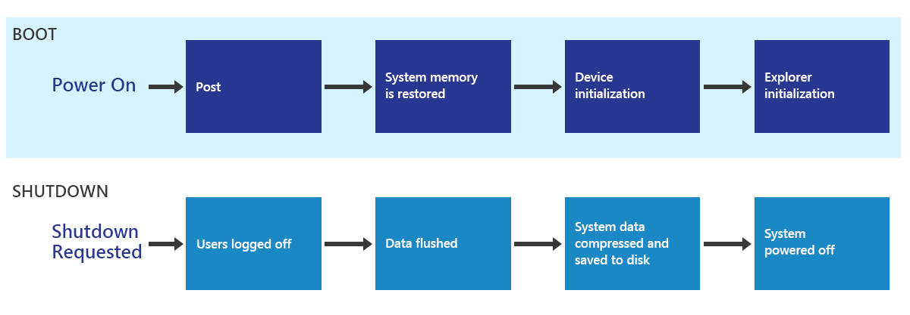
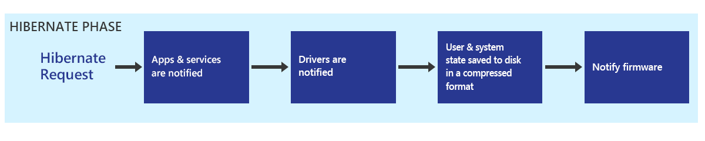
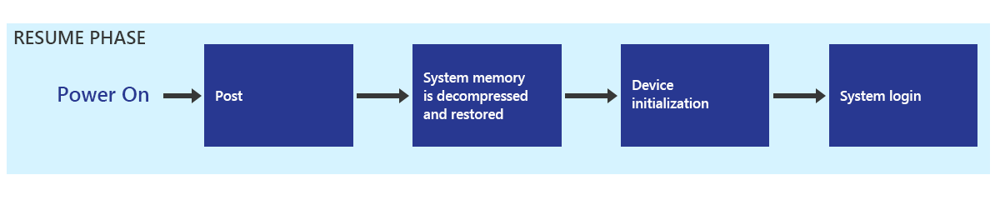
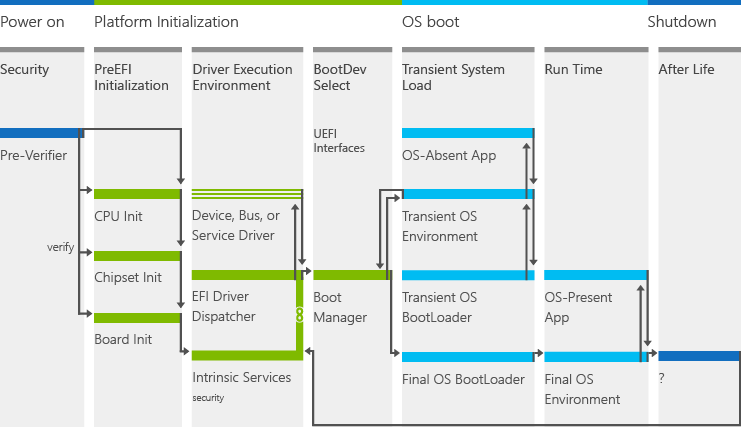

# Delivering a great startup and shutdown experience

This section provides an overview of the fast startup experience and our recommendations to partners to deliver the best on/off experience for customers.

PCs can be turned on and off many times a day. Depending on usage patterns and the battery life capability of the device, a PC might shut down, sleep, or hibernate. System boot is the first experience users have with their device and is a recurrent experience for the lifetime of the device. Customer telemetry tells us that users boot and shut down their PC at least once a day. Although connected standby capability reduces the frequency with which a device must be booted, booting might still be required for software and firmware updates, low battery states, and major configuration changes to the device.

Starting with Windows 8.x, the speed of the on/off transition is significantly faster than previous Windows versions. The user
interaction model used previously was to interrupt a boot with key presses to indicate alternate boot paths. With a much faster boot time, boot interruptions are impractical and negatively affect the boot experience. In previous releases, it was important to stop the boot process as early as possible for decision points, such as booting to an alternative operating system, because moving backwards was a long and slow process. It was also much easier with slow boot times to create periods of time in which key presses could be detected and activated. In Windows 8.x and Windows 10, this is no longer the case.

The default boot performance has improved dramatically with the leveraging of hibernation technology. For information about the improvements made to the performance of the on/off experience, see [Hibernate (S4) suspend and resume](#hibernate-s4-suspend-and-resume). The considerations in this topic outline the user model for the fast on/off transitions, options related to those transitions, and the components required by OEMs/ODMs to deliver the experience.

## Considerations

The main source of boot delays is the OEM software preload. Fast startup represents about 50% of the overall boot time and is directly affected by the following first- and third-party processes started on boot:

-   Services that are resuming

-   Startup apps, such as tray-running shortcuts, OEM status indicators, and so on

-   Antivirus activity

These processes consume CPU and disk system resources and can result in bottlenecking, which can make the device unresponsive, delay app launch times, or make apps run slowly.

When optimizing on/off performance, consider the following suggestions:

-   Determine what non-inbox 1st- or 3rd-party processes are loaded and running on your systems.

-   Determine what is started on boot through registry run keys; typically, these are IHV hardware–related processes.

-   Avoid including managed code processes in the boot path.

-   Use techniques to delay start processes on boot.

-   Consider converting traditional desktop apps to Windows Store apps, which do not cause an impact on boot. Work with IHVs to leverage Windows Store device apps.

-   Understand how memory consumption effects on/off transition times and follow these suggestions:

	-   Optimize memory consumption to reduce the size of the hiberfile.

	-   Use the new Hiberfile Diagnostics mode.

	-   Refrain from enabling hybrid sleep on laptops and ultraportables, because it generates a hiberfile on Standby suspend (S3).

-   Migrate updater processes to use AM to reduce the number of loaded processes.

-   Understand that disk throughput is critical to on/off performance. For example:

	-   On average, the hiberfile read/write times represent 50% of the boot to Start screen time.

	-   Most systems are disk-bound on boot.

	-   A faster HDD/SSD can mitigate the effect of a significant software preload being loaded and initialized on boot.

	-   Consider balancing CPU, disk performance, and memory capacity.

-   Understand that hybrid drives are beneficial to on/off performance and consider using the new Hybrid Drive Hinting feature.

### Fast startup

Starting with Windows 8.x, the default shutdown and restart scenario has been updated and named fast startup. Fast startup begins with the shutdown process and includes writing data to disk similar to the hibernate process. A key difference is that all user sessions (Session 1) are logged off and the remaining information is written to the hiberfile. When you boot the PC from this state,  Windows loads the previously initialized state by reading from the hiberfile, instead of running the full boot process in which Windows, drivers, devices, and services are initialized. This method speeds up the process of initializing the lock or Start screen. 

In addition, the use of hibernate technology has been expanded to create a new default startup and shutdown experience that is much faster than a full boot. For details, see the following diagram:

The faster startup and shutdown sequence uses the hibernate infrastructure to place the PC in hibernate. Unlike a full shutdown and boot, the user session is closed and a hibernate is performed. As a result, the hibernate file is much smaller, ensuring that the hibernate and resume process is faster. This sequence also takes advantage of the parallelization optimizations.

Developers creating drivers or apps with a system service and system integrators should monitor driver quality issues, such as memory leaks. Although driver quality has always been important, note that the up-time between kernel reboots might be significantly longer than on previous versions of Windows because during user-initiated shutdowns, the kernel, drivers, and services are preserved and restored, not just restarted.

### Full boot

For the best startup experience, consider the following suggestions:

-   Balance CPU performance, disk performance, and memory capacity.

-   Optimize the UEFI read routing performance.

-   Ensure that drivers of leaf node devices follow fast resume guidelines.

-   Ensure that drivers complete their S0 set-power IRPs as quickly as possible to prevent other devices from starting their S0 set-power IRPs.

-   Validate drivers and services against memory leaks.

-   Refrain from registering a service to receive power management event notifications, unless absolutely necessary.

-   Ensure that drivers do not wait to complete their S\_IRP until their D\_IRP is completed. Doing so will prevent other devices from receiving their S\_IRPs, which will cause serialization delays and increase overall suspend time.

### Shutdown API behavior

To ensure the best compatibility with apps while enabling the best possible experience for new apps, new flags to request a shutdown for fast startup have been created. The following table describes the new flags and the behavior of the shutdown APIs. Details on these APIs and flags are available on MSDN.

| API                          | Shutdown behavior |
|------------------------------|------------------------------------------------------------------------------------|
| **InitiateSystemShutdownEx** | Always performs a full shutdown |
| **InitiateSystemShutdown**   | Always performs a full shutdown |
| **InitiateShutdown**         | Performs a shutdown for fast startup with the use of the SHUTDOWN\_HYBRID flag |
| **ExitWindowsEx**            | Performs a shutdown for fast startup with the use of the EWX\_HYBRID\_SHUTDOWN flag |

### Distinguishing when a hibernate or a shutdown for fast startup will occur

Device drivers will receive a notification to transition to an S5 target power state on shutdown rather than a hibernate state of S4, which is the actual power state. This allows the drivers to set a different wake behavior for fast startup after a shutdown. Target and effective states are found in the System\_Power\_State\_Context structure.

For most devices, the distinction between S4 and S5 wake behavior is controlled at the bus driver layer. If you implement your own bus driver and need to distinguish between these two behaviors, contact your Microsoft representative for additional information. To deliver a fast startup experience, follow these best practices:

-   Balance CPU performance, disk performance, and memory capacity.

-   Optimize the UEFI read routing performance.

-   Ensure that drivers of leaf node devices must fast resume guidelines.

-   Ensure that drivers complete their S0 set-power IRPs as quickly as possible to prevent other devices from getting their S0 set-power IRPs.

-   Avoid launching apps on boot, except for antimalware and device apps.

-   Never launch apps on boot by using RunOnce.

-   Avoid managed code apps in the boot path.

-   Delay startup of non-critical apps by using Task Scheduler.

-   Validate drivers and services against memory leaks.

-   Register a service to receive power management events notification only if absolutely necessary.

-   Ensure that drivers do not wait to complete their S\_IRP until their D\_IRP is completed. Doing so will prevent other devices from receiving their S\_IRPs, which will cause serialization delays and increase overall suspend time.

### Hibernate (S4) suspend and resume

In a hibernate transition, all the contents of memory are written to a file on the primary system drive. This process preserves the state of Windows, apps, and devices. If the combined memory footprint consumes all the physical memory, the hibernate file must be large enough to ensure that there is enough space to save all the contents of physical memory. Because data is written to non-volatile storage, the DRAM does not need to maintain self-refresh and can be powered off. This behavior results in very low power draw, similar to the PC being in the off state.

#### User scenarios for hibernate 

These are the critical scenarios that require hibernate technology in PCs running modern version of Windows:

-   **Doze to Hibernate:** A system is left idle and transitions to hibernate automatically.

-   **Critical Battery:** Windows automatically hibernates the PC to prevent data loss when battery power has run out.

-   **Thermal Condition:** A system reaches a predefined temperature that requires automatic system power down to protect circuitry.

-   **User Initiated:** A user selects hibernate to save the current user state with very minimal power draw.

Although this list may evolve as the needs and capabilities of PCs evolve, it is expected that many PCs will continue to use hibernate, especially when connected standby is not possible.

#### Hibernate phase

In the hibernate phase, Windows notifies the various components that a hibernate phase is occuring and then saves the user's context and system state. The data is compressed and written to the disk; the system uses all the processor cores on the system to compress the data in memory and uses one processor when writing the data to disk. After all of the data is written to disk, Windows notifies the firmware that it is ready for power down.

The firmware notification is done by writing to the sleep-type registers with values that were provided in the S4 object as defined in ACPI 4, Section 4.5, Table 4-13, and Section 7.3.4. This indicates to the firmware that on next power-on, a resume will be attempted rather than a full boot.

#### Resume phase

Hibernate resume starts with the firmware POST, which is similar to a full boot. The Windows boot manager detects that a resume from hibernate is required by detecting a valid hibernate file and directs the system to resume, restoring the contents of memory and all architectural registers. In the case of a hibernate resume, the contents of the memory are read from the disk, decompressed, and restored, putting the system in the exact state it was in when it was hibernated. After the memory content is restored, the devices are restarted and the machine returns to a running state, ready for login.

Note that although device drivers and services are notified, they are not restarted; they are restored to the state they were in when the hibernate phase occurred.

The restoration of the system memory is broken into two phases. The first phase is done to restore a minimal portion of the kernel, which is then used to complete the memory restore for the rest of the system. The first phase must be done with a single processor environment core. However, after the minimal portion of the system memory is restored, all processor
cores can be used to parallelize the decompression and restoration of data for the remainder of the resume, thereby significantly speeding up the process.

The process is further improved by right-sizing the encryption/decryption algorithm, based on the capabilities of the processor.

The parallelization optimizations are available only on systems on which the system can guarantee that it will have all the data it might need from the minimal environment available to it. Therefore, it cannot be used if components added to the crash dump stack, which is used during the hibernate resume operation, have not also been declared to be part of that minimal environment. If you are creating such a component, such as a crash dump filter driver or a device that uses a separate crash dump path, contact Microsoft so that they can lead you through this process.

### Firmware POST

Faster POST times reduce the overall time from power on to usable state. Because Windows fast startup is significantly faster, POST time can become a more significant proportion of the total boot time. Additional information on POST time requirements is documented in the Windows Hardware Certification requirements. The analysis shows that the POST time requirements are achievable on platforms that fully enumerate and enable a full complement of hardware components in the pre–operating system environment.

Since Windows 8, all PCs are required to ship their firmware based on the Unified Extensible Firmware Interface (UEFI) specification 2.3.1 or later. Because many systems are based on older, legacy firmware designs, there are opportunities to optimize the firmware design to better accommodate faster POST times.

The UEFI architecture flows through several phases of firmware and platform initialization. Based on these well-defined phases, there are several design considerations that might reduce POST time.

#### Security (SEC)

In the SEC phase, a platform performs extraction, decompression, and validation of platform microcode stored on a SPI NOR flash. At this point of power-on, the platform has initialization RAM and its bus. The following list includes some questions to consider for this phase:

-   Is the microcode specific to the SKU or general to multiple platforms? The size of the microcode will affect decompression transfer to RAM, and validation.

	Consider refactoring microcode to be as small as possible.

-   Can the SPI NOR flash bus speed be increased? Many platforms support multiple clock speeds for the SPI NOR flash part. They are often operating at a lower clock frequency (for example, 16 MHz) and can be increased.

	Consider increasing bus speed to reduce latency in microcode transfer from NOR flash to RAM.

-   Does the platform have enough NOR flash? To save costs, many platforms are designed with the bare minimum NOR part, resulting in higher compression of microcode and greater cost for decompression.

-   Consider a larger NOR flash part to store code with less compression.

Balancing compression, design, and transfer of microcode might improve performance of POST times. At the end of SEC, the validated microcode copies the rest of the UEFI kernel and environment from NOR flash into RAM.

#### Pre-EFI Initialization (PEI)

After the kernel is in RAM, the platform initializes the kernel and starts to validate the integrity of the code, system table, and other elements. Consider designing a UEFI kernel that is optimized for your platform instead of a generic non-optimized kernel. Optimizations can include:

-   Compiling flags during kernel builds that optimize memory buffers

-   Linking to modules that aren’t required for platform initialization

Consult with your firmware designers for ideas on how to optimize the UEFI kernel.

#### Driver Execution Environment (DXE)

At this point of initialization, core UEFI drivers and 3rd party DXE drivers are loaded. Using tools provided by your firmware designers, the owner can identify which are the least performant DXE drivers and assess whether that code can be optimized.

Another consideration in this phase rests in the number of DXE drivers loaded. The platform should load only those drivers that it needs to guarantee a boot and not depend on optional hardware. Final design depends on target boot selection.

#### Boot Device Selection (BDS)

Boot device selection is the final step in platform initialization before hand-off to Windows. During this step, the firmware determines which boot devices are present and which ones to hand off to execution. Careful design and optimizations of the boot variables will affect the transition to the Windows boot loader.

#### USB Enumeration

The USB enumeration portion of POST can take a long time. With new changes introduced in Windows 8, USB enumeration will no longer be required in the default boot case. For additional POST time optimizations, contact your silicon and firmware vendor.
We recommend that the USB be enumerated if the boot sequence is set to boot to any other path, such as in the following scenarios:

-   There are other options higher in the boot order, such as when Windows To Go Startup Options inserts a USB class boot entry at the top of the boot order.

-   A boot next variable is set, causing a different boot device to be used.

-   Failures occur on the immediately preceding boots.

### Apps

Desktop apps that are in the boot path will impact on/off transition and energy efficiency. Task Manager will flag desktop apps that have a high impact and notify the user about desktop apps that are always running. For more information, see [Startup apps](https://msdn.microsoft.com/windows/compatibility/startup-apps). Instead of automatically starting desktop apps, we strongly recommend that you use automatic maintenance and run them only when needed.

## Recommended goals

> [!IMPORTANT]
> All goals defined exclude BIOS initialization time.

To deliver a great on/off experience, it is recommended that a PC meets the goals in the following tables.

| **Scenario**             | **Tablet (CS)** | **Convertible** | **Notebook** | **All-in-One** |
|--------------------------|-----------------|-----------------|--------------|----------------|
| Fast startup (seconds)   | &lt; 25         | &lt;= 15        | &lt;= 15     | &lt;= 15       |
| Hiberfile size (MB)      | &lt; 300        | &lt;= 300       | &lt;= 300    | &lt;= 300      |
| Standby resume (seconds) | Not applicable  | &lt;= 7         | &lt;= 7      | &lt;= 5        |

 
<table>
<tr>
<th>Metric</th>
<th>Unit</th>
<th>Goal</th>
</tr>
<tr>
<td>

<strong>Number of processes started through registry Run keys</strong>

Defined as the total number of processes started on every boot using Run keys. Has a direct impact on post-on/off resource utilization (CPU and disk).

Can be found by looking at some ETW events in the fast startup traces (by using the Generic Events table):

Provider Name: Microsoft-Windows-Shell-CoreTask: Explorer\_ExecutingFromRunKeyOpcode: win:Start

Field \#1 of the event (Command) provides the command line that is used to launch the processes.

</td>
<td>

count

</td>
<td>

&lt; 10

</td>
</tr>
<tr>
<td>

<strong>Normal priority read disk IO during fast startup Post On/Off</strong>

This metric can be obtained directly from the assessment results in the Windows Assessment Console, under:

Total Boot &gt; Post On/Off &gt; Total Disk Usage &gt; Normal Priority Reads (Bytes)

</td>
<td>

MB

</td>
<td>

&lt; 30

</td>
</tr>
</table>

## Validation and testing

You can use the Windows Assessment Toolkit to improve the performance of your PC beyond minimum requirements. Windows assessments related to on/off experience include:

-   Fast Startup assessment

-   Full Boot and Shutdown assessment

-   Standby assessment

-   Hibernate assessment

The new versions of the Fast Startup and Hibernate assessments include a *Hiberfile Diagnostics* mode. This mode helps detect drivers and apps that contribute to large hiberfile size and detects storage drivers that do not implement multi-stage resume.

There are two main categories of memory pages that are stored in the hiberfile with respect to system evaluation: driver non-paged pool pages and app/services private working sets pages.

The new mode will help you to understand which software components must be improved for memory usage.

Tools and technical reference
-----------------------------

You can learn more about the on/off experience, and download tools for you to analyze performance from these resources:

| Resource title and link                    | Content type | Description                                                                                                                                                                                                                 |	
|------------------------------------|--------------|-----------------------------------------------------------------------------------------------------------------------------------------------------------------------------------------------------------------------------|----------------------------------------------------------------------------------------------------------------------------------------------------------|
| [Startup apps](https://msdn.microsoft.com/windows/compatibility/startup-apps)                       | Article      | Highlights some of the effects that startup apps have on a Windows device, and provides guidance to developers (ISV/IHV) and OEMs to rethink the usage patterns of startup apps to improve battery life and responsiveness. | 
| [Results for the On/Off Assessments](http://msdn.microsoft.com/en-us/library/windows/hardware/jj130812.aspx) | Document     | Helps you interpret the results produced by the On/Off assessments (Boot Performance (Fast Startup), Boot Performance (Full Boot), Standby Performance, and Hibernate Performance.                                          | 

