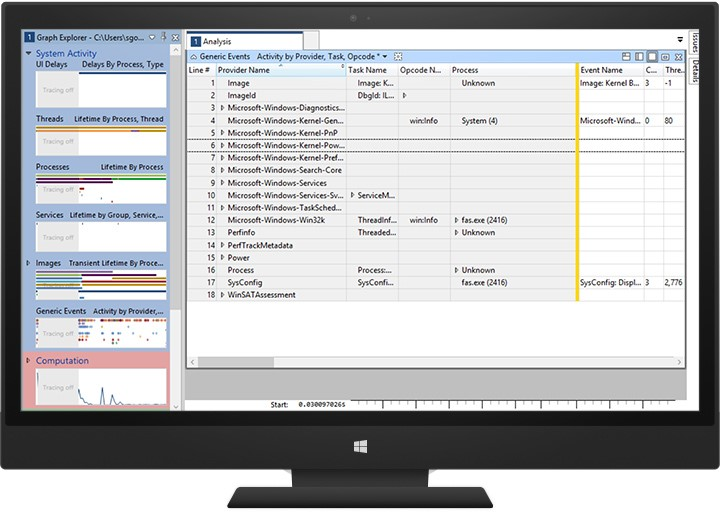

# Instrumenting Your Code with ETW

Event Tracing for Windows (ETW) is a high speed tracing facility built into Windows. Using a buffering and logging mechanism implemented in the operating system kernel, ETW provides an infrastructure for events raised by both user mode (apps) and kernel mode components (drivers). ETW can be used for system and app diagnosis, troubleshooting, and performance monitoring. 

Historically, tracing was used to diagnose unexpected behavior both in hardware and apps. However, recently there has been an increasing demand for managing and monitoring system stability and performance to meet business demands. As a result, performance analysis in development and production environments have become a critical part of the computing world. In contrast to failures and errors, performance-related issues are difficult to detect and diagnose because they’re often dependent on configuration and workload. Tracing in a production environment provides valuable data for detecting root-cause performance-related issues, as well as capacity planning and evaluation.

The ETW mechanism lets you control tracing sessions dynamically, which makes it possible to capture detailed tracing in production environments without system reboot or app restart.

The following section demonstrates how to use ETW to do precise performance measurement and analysis:

-   Kernel-mode driver code
-   Traditional desktop processes and services
-   Windows Store apps (C\#)

## Overview

The following list shows some of the beneficial characteristics of ETW:

<dl>
<dt>**Robust**</dt>
<dd>
<p>It provides efficient buffering and logging mechanisms. The tracing buffer is managed by the kernel. Tracing through ETW is immune to app crashes and hangs. In case of system failure, unsaved events are accessible in a memory dump file.</p>
</dd>
<dt>**Dynamic**</dt>
<dd>
<p>Tracing sessions can be started, stopped, reconfigured, and paused dynamically without system reboot or app restarts. ETW offers multiple modes to meet various demands.</p>
</dd>
<dt>**Built into Windows**</dt>
<dd>
<p>Other than the controller app, you don’t need additional tools. Windows has a few inbox controllers as well as consumer apps.</p>
</dd>
<dt>**Lightweight**</dt>
<dd>
<p>Because the overhead of historical tracing and saved log files are highly optimized, they don’t affect app or system performance. The logging mechanism uses kernel mode buffers, which are written to disk by a separate writer thread so that overhead from tracing is limited.</p>
</dd>
</dl>

Before Windows 2000, only basic text-based tracing mechanisms were available in Windows: **DbgPrint()** and **DebugPrint()** APIs. They required debuggers and typically weren’t dynamically controllable. The Windows tracing mechanism evolved over time; today, four different tracing mechanisms are available. ETW and Event Log API sets have been merged into the Unified Event Logging API set in Windows Vista, which gives users and developers a unified mechanism for raising events.

There are three types of events:

1.  Windows software trace preprocessor (WPP) and Classic ETW

2.  Managed Object Format (MOF): The MOF is a way to describe WMI objects and enable and decode events.

3.  Manifest based: An XML-based unified tracing definition was introduced in Windows Vista. An XML file contains elements for events that a provider writes. For more information, see [Writing an Instrumentation Manifest](https://msdn.microsoft.com/library/dd996930.aspx).

> [!NOTE]
> The guidance in this section focuses solely on manifest-based event instrumentation.

ETW has the following important characteristics:

-   Developers can choose the right sets of implementation based on intended usage (e.g., Printf, like WPP implementation, is easy to add for debugging purpose events).

-   The infrastructure manages commonly used information like timestamps, function names, and source file line numbers.

-   The same implementation is used for user mode apps and kernel mode components.

-   ETW is accessible in crash dumps and live debug.

-   ETW can be redirected to the kernel debugger for a real-time view.

-   ETW has a real-time view.

-   Log files are saved in a binary log file (an ETL file).

-   ETW supports multiple processes logging.

-   ETW has a high throughput.

-   Log files can be viewed on another machine.

-   ETW supports circular buffering for continuous logging and monitoring.

-   ETW can be grouped into one of the channels based on the target audience.

## ETW architecture

There are four main components in ETW: provider, session, controller, and consumer.


### Provider

A *provider* is an instrumented component that generates events. A provider can be a user mode app, a kernel mode driver, or the Windows kernel itself. In addition to fixed event data (header), an event can carry user data.

An *event* is an event-based representation of data. The data can be used for in-depth analysis. An event can also be used to produce counters. *Counters* provide a sample-based view of data. They typically contain a small set of data to show current state, for example I/O bytes per second and interrupts per second.

A provider must register with ETW and send events by calling the ETW Logging APIs. Providers register a callback function for enable and disable notifications so that tracing can be enabled and disabled dynamically.

### Session

The ETW session infrastructure works as an intermediate broker that relays the events from one or more providers to the consumer. A session is a kernel object that collects events into kernel buffer and sends them to a specified file or real-time consumer process. Multiple providers can be mapped to a single session, which allows users to collect data from multiple sources.

### Controller

A controller starts, stops, or updates a trace session. A session is a unit for tracing. Providers are mapped (or enabled) to a specific session. A controller enables and disables providers so that they can start sending events to ETW. Controller functionalities can be invoked with tools provided by Microsoft or you can write your own app.

Logman.exe is an in-box controller app. Windows Performance Recorder (WPR) in the Windows Performance Toolkit is the recommended controller process.

### Consumer

A *consumer* is an app that reads a logged trace file (ETL file) or captures events in an active trace session in real time, and processes events. Event Viewer and Resource Monitor are in-box ETW consumer apps.

Windows Performance Analyzer (WPA) in the Windows Performance Toolkit is the recommended consumer process.

## Implementing ETW instrumentation

### Plan your instrumentation

Decide where to log ETW events in your code. This logging should correlate with important user scenarios or frequent use cases that you want to measure, analyze, and eventually improve. The following list shows some examples of what could be instrumented:

-   State changes
-   Begin/End of significant operations
-   Resource creation/deletion
-   Other events related to performance or reliability
-   Debug events

### Create a manifest file and implement your provider

Manifest-based ETW events can be implemented in user-mode apps, including services, and in kernel mode components like drivers, by using an XML file called the *event manifest*. For more information, see [Event Tracing Functions](https://msdn.microsoft.com/library/windows/desktop/aa363795.aspx).

An event manifest is divided into the following sections:

<dl>
<dt>**Provider definition: <provider>**</dt>
<dd>
<p>Contains the name and GUID of the provider you’re creating, and the location of the binary that’s instrumented (eventually containing the instrumentation resources needed by the ETW framework).</p>
</dd>
<dt>**Event payload: <templates>**</dt>
<dd>
<p>Contains definitions of the data types that will be included as payload in the events. Available types include:</p>
<ul>
<li>
<p>Signed and unsigned 8-bit, 16-bit, 32-bit, and 64-bit integers</p>
</li>
<li>
<p>ANSI and Unicode strings</p>
</li>
<li>
<p>Float and double</p>
</li>
<li>
<p>Boolean, Binary, GUID, Pointer, FILETIME, SYSTEMTIME, SID, and HexInt32</p>
</li>
</ul>
</dd>
<dt>**Static event data**</dt>
<dd>
Used to help interpret, sort, and group the events.
<ul>
<li>Defines the names of the operations (or tasks) that are being instrumented.
</li>
<li>Defines the types of operations that you want to create for your events, like the Start event, the Stop event for delimiting operations in time, the Informational event for logging debug data, and so on.
</li>
<li>
<p>Event definition: <events></p>
<p>Ties together payload and static data. Your code will emit events as defined by what is listed in this section.</p>
</li>
</ul>
</dd>
</dl>


Here’s an example of an event manifest:

```
<provider
    guid="{3877cf22-0702-4dfc-965e-7fdc7780cd74}"
    name="MyEventProvider"
    symbol="MY_EVENT_PROVIDER"
    messageFileName="%temp%\MyProviderBinary.exe"
    resourceFileName="%temp%\MyProviderBinary.exe“
    >
  <templates>
    <template tid="T_MyProvider_1">
      <data inType="win:Int32" name="Operation Id" />
      <data inType="win:Int32" name="Memory Allocated (MB)" />
    </template>
  </templates>
  <opcodes>
    <opcode name="DebugInfo" symbol="_DebugInfo" value="10"/>  
  </opcodes>
  <tasks>
    <task name="OpMemAllocation" symbol="OpMemAllocation_Task" value="1“
          eventGUID="{87ebca33-bf25-442c-9256-82ba484586e8}"/>
  </tasks>
  <events>
    <event symbol="DebugInfo" template="T_MyProvider_1" value="200" 
       task="OpMemAllocation" opcode="DebugInfo" />
  </events>
```

To write your manifest file, you can use:

-   Manifest Generator (ECManGen.exe), available in the Platform SDK

-   Visual Studio (Eventman.xsd), available in the Platform SDK

### Compile the event manifest

The next step is to compile the manifest by using the [Message Compiler tool (mc.exe)](<https://msdn.microsoft.com/library/windows/desktop/aa385638.aspx>), which is available in the Platform SDK. This tool generates a few files needed to instrument, compile, and build your instrumented code:

<dl>
<dt>**ManifestFileName.h**</dt>
<dd>Contains event descriptors to use in code.</dd>

<dt>**ManifestFileName.rc**</dt>
<dd>A resource compiler script.</dd>

<dt>**MSG00001.bin**</dt>
<dd>A language resource.</dd>

<dt>**ManifestFileNameTEMP.bin**</dt>
<dd>A template resource (provider and metadata).</dd>
</dl>

To compile user mode code, type the following:

&nbsp;&nbsp;&nbsp;&nbsp;&nbsp;**mc.exe -um** \[*ManifestFileName*\]

To compile kernel mode code, type the following:

&nbsp;&nbsp;&nbsp;&nbsp;&nbsp;**mc.exe -km** \[*ManifestFileName*\]

To compile managed or JavaScript code, type the following:

&nbsp;&nbsp;&nbsp;&nbsp;&nbsp;**mc.exe -cs** \[*ManifestFileName*\]<br/>
&nbsp;&nbsp;&nbsp;&nbsp;&nbsp;**mc.exe -css** \[*ManifestFileName*\]<br/>
&nbsp;&nbsp;&nbsp;&nbsp;&nbsp;**mc.exe -generateProjections** \[*ManifestFileName*\]

### Update your code

The next step is to add instrumentation to your code. Run Visual Studio, add the header file generated by the Message Compiler, and build the resource file into your program.

Search for the following in the header to find what macros (or class methods) to call in your code:

-   EventRegister&lt;*YourProviderName*&gt;

	Used to register your provider (at app start).

-   EventUnregister&lt;*YourProviderName*&gt;

	Used to unregister your provider (at app finish).

-   EventWrite

One macro (or method) for each event is defined in your manifest (in the <events> node).

After your code is properly instrumented, you can build your binary.

For drivers, review the [EventDrv](https://code.msdn.microsoft.com/windowshardware/Eventdrv-42894135) sample available on MSDN. Register the driver as an event provider by using the ETW kernel mode EtwRegister function:

-   Add this function in your DriverEntry routine after the code that creates and initializes the device object.

-   Match the call to the EtwRegister function with a call to EtwUnregister in your driver's Unload routine.

### Log and visualize events

After you have a properly instrumented component, you can start logging events on a test system. You first need to prepare that system for logging by registering your provider by using wevtutil, the inbox tool.

1.	Copy your component to the location that was specified in your manifest by the resourceFileName attribute:

	**xcopy /y** *MyProviderBinary.exe* **%temp%**

2.	Register the providers:

	**wevtutil um** *etwmanifest.man*<br/>
	**wetvutil im** *etwmanifest.man*

3.	Verify that the provider is visible:

	**logman query providers** 

	Your provider name/GUID will appear in the list.

Note that event metadata is stored in the instrumented binary, not in the manifest file. Using wevtutil to install a manifest on the PC puts a link into the registry connecting the provider GUID to the binary that contains the event metadata. The name and path of that binary is taken from the manifest file provided. You can discard the manifest file afterwards.

Because it is on the machine you’re using to decode, the binary that contains the event metadata also needs to be accessible and loadable. WPR/xperf makes the process more portable by injecting the metadata in the trace.

After your provider is properly installed on this system, you can start a tracing session to gather events from your component into an ETL file. You can use either Windows Performance Recorder (WPR) or Xperf, the command-line tool, both available in the Windows Performance Toolkit:

1.  Start tracing:

	**xperf** **-start** *MySession* **-on** *MyEventProvider* **-f** *MySession.etl*

	In that command line, **-start** gives the event collection session a name, and **-on** tells ETW that you want to collect events from your provider in this session. (There can be multiple **-on** arguments.)

2.	Execute your workload.

3.	Stop tracing:

	**xperf** **-stop** *MySession*

After you have an ETL file, you can open it with the Windows Performance Analyzer tool and visualize your events with the Generic Events graph and table.



