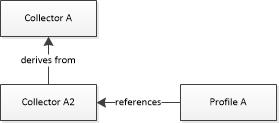
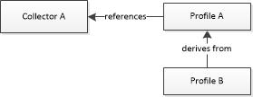
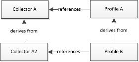

# 1. Collector Definitions


Windows Performance Recorder (WPR) currently supports three kinds of collectors: the system collector, event collectors, and a heap event collector. The system collector definition specifies buffer sizes and other attributes for Event Tracing for Windows (ETW) system logger sessions that work together with the NT Kernel Logger. Event and heap collector definitions specify buffer sizes and other attributes for ETW user sessions.

Collector definition order is restricted by the WPR schema. In the .wprp file, system collector definitions must precede event collector definitions. These definitions must both precede the heap collector definition (if a heap collector definition is present). The WPR schema is defined in [WPRControlProfiles Schema](wprcontrolprofiles-schema.md).

## Collector Attributes


Collectors have the following mandatory attributes:

-   **Id**: Unique string identifier that refers to the collector definition in the .wprp file.

-   **Name**: Name of the collector; for example, "WPR Collector". The system collector name must be "NT Kernel Logger".

Collector definitions must contain the following buffer size definitions:

-   **BufferSize**: Specifies the size of a single buffer, in kilobytes (KB).

-   **Buffers**: Specifies the number of buffers or, if the **PercentageOfTotalMemory** attribute is set to "true", the percentage of total memory to use for buffering.

For more information about buffers, see [Logging Mode](logging-mode.md).

## Collector Definition Examples


The following code example shows a system collector definition and an event collector definition.

``` syntax
<SystemCollector
  Id="WPRSystemCollector"
  Name="NT Kernel Logger"
  FileName="WPRKernel.etl">
  <BufferSize
    Value="512"/>
  <Buffers
    Value="3"
    PercentageOfTotalMemory="true"/>
</SystemCollector>

<EventCollector
  Id="WPREventCollector"
  Name="WPR Event Collector"
  FileName="somefilename.etl">
  <BufferSize
    Value="128"/> 
  <Buffers
    Value="64"/>
</EventCollector>

<HeapEventCollector
  Id="Base_Heap_Collector"
  Name="Base Heap Collector"
  FileName="heap.etl">
</HeapEventCollector>
```

## Inheritance Examples


Windows Performance Recorder supports inheritance of its objects by using the `Base=""` attribute in the WPR profile XML schema. This allows additions or specializations of objects to be built progressively while adding re-use of common definitions.

Unintended complexity and side effects can occur in certain scenarios; this section describes examples and recommended best practices.

### Example 1



If a profile **Profile A** wants to use the event collector **Collector A** with some modifications, it can define a collector **Collector A2** that derives from **Collector A** (Base="Collector A"), and then references that collector **Collector A2**. This is recommended because only the collector object derives from another collector object and it is referenced directly.

### Example 2



A profile **Profile A** references a collector **Collector A**. Another profile **Profile B** requires changes to **Profile A** so it derives from it, and specifies its changes directly in its definition. This is recommended because only the profile object derives from another profile object.

### Example 3



A profile **Profile A** references a collector **Collector A**. A collector **Collector A2** derives from **Collector A**. Finally, the profile **Profile B** derives both from **Profile A** and also references **Collector A** that is already referenced in the parent profile of **Profile B**.

In this case it’s ambiguous how the definition for **Collector A2** should be evaluated. In one case, the profile derivation take precedence, and in another the collector derivation takes precedence. This is not recommended practice because the ordering is undefined and may lead to different outcomes based on ordering of operations.

Based on this, you should never combine derivations across multiple types of objects.

## Related topics


[Authoring Recording Profiles](authoring-recording-profiles.md)

[2. System and Event Provider Definitions](2-system-and-event-provider-definitions.md)

[Recording Profile XML Reference](recording-profile-xml-reference.md)

 

 


