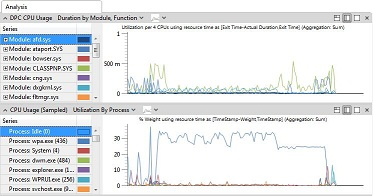

# Analysis Tab

The **Analysis** tab is the central workspace of Windows Performance Analyzer (WPA). To analyze a recording, you can drag graph thumbnails from the Graph Explorer window onto this tab. At the left side of each graph is a legend that labels the lines or bars on the graph and an associated data table. The data table shows the graph data in tabular form.

The following illustration shows the **Analysis** tab with two graphs open.

## Using the Analysis Tab

On the right side of the graph title bar are three layout icons. To view the graph and table, click the left-most icon. To view the data table with a thumbnail view of the graph, click the middle icon. To view the graph alone, click the right-most icon.

At the bottom of the **Analysis** tab is a timeline that applies to all graphs on the tab. If you zoom in to a time interval on one graph, WPA synchronizes all graphs, the timeline, and the data tables. You can zoom in on a time interval repeatedly to view fine detail. For more information about zooming, see [Zoom In on a Time Interval](zoom-in-on-a-time-interval.md).

To search for text in the data tables or to filter the data that is displayed in the graphs and tables, right-click the data table. For more information, see [Customize a Data Table](customize-a-data-table.md) and [Search or Filter Data](search-or-filter-data.md).

To increase the size of the **Analysis** tab, you can drag the surrounding panes into separate windows or close them altogether. For more information, see [Change the View Layout](change-the-view-layout.md).

## Opening a New Analysis Tab

You can open a new **Analysis** tab without losing the one that you already have open. For more information, see [Change the View Layout](change-the-view-layout.md).

## Use the Analysis tab to view Issue Details

Layout options are available on the right edge of the **Issue Details** title bar. To view only the Issue Details, click the **Maximize** icon. Additionally, you can use **Display table only**. To increase the size of the **Analysis** tab, you can drag the surrounding panes into separate windows or close them altogether. For more information, see [Change the View Layout](change-the-view-layout.md).

When the search options in the **Issues Window** change, the same list of issues is presented in the **Issue Details** window. Your search will also change the zoom level of all the graphs on the tab to reflect the time intervals that are impacted by the Issues that are displayed.

To search for specific issues, or to filter by a particular Issue category, see [Issues Window](issues-window.md).

For more information about the contents of each detected issue, see [Windows Assessment Toolkit Technical Reference](http://go.microsoft.com/fwlink/?LinkId=214554).

## Related topics

[WPA User Interface](wpa-user-interface.md)

[Graph Explorer](graph-explorer.md)

 

 

