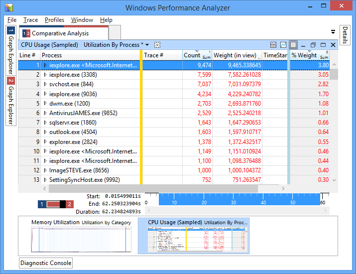
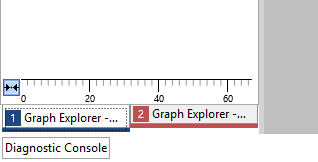
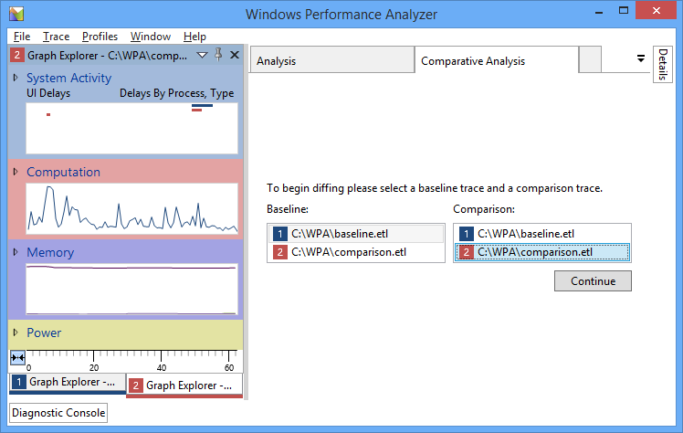
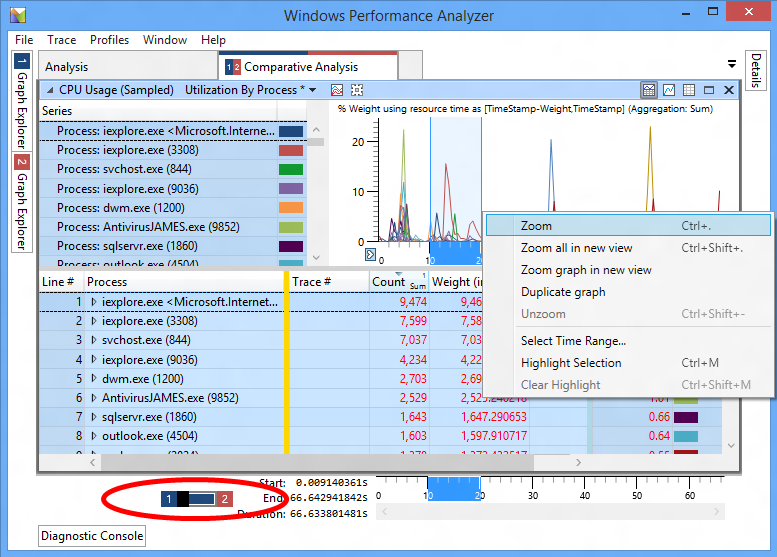

# Comparative Analysis Views

When analyzing system performance, it is useful to periodically create traces that can be used to identify sources of regression. For example, you can create a baseline trace immediate after installing an operating system. Later, after installing additional applications, drivers, or hardware, you can create another trace and determine how the changes affect system performance.

Previously in WPA, each tab contained information about only one trace. To compare two traces, you would need to either switch back and forth between tabs or open each trace in a separate instance of WPA.

You can now compare the results of two traces by creating a *comparative analysis view*. This view allows you to easily identify areas where performance has been negatively impacted by highlighting differences between the traces.

In a comparative analysis view, WPA creates a comparison table that contains value differences between two traces. One trace is specified as a *baseline trace*, usually a trace that is captured before hardware or software changes are made. The other trace is called the *comparison trace*, the trace captured after the system changes are made.

The table that WPA creates contains the value differences between the baseline and comparison traces (comparison value – baseline value). If a metric is higher in the comparison trace, the difference is shown as a positive number. If the count is higher in the baseline trace, the difference is shown as a negative number. An example is shown below:

**Image 1:** Positive numbers in the table indicate that these processes were more active in the comparison trace. Negative numbers would indicate that the processes were more active in the baseline trace.

**Note**  
Although you can have any number of traces open in a single WPA session, WPA can compare the results of only two traces at a time.

 

## Creating a Comparative Analysis View

1.  In WPA, open the first trace by choosing **File**, **Open**, navigating to the location of the trace, and choosing **OK**.

2.  Open the second trace by using the method in step 1.

    **Note**  
    To help differentiate open traces, WPA assigns each trace a unique identifier and color. In the **Graph Explorer** pane on the left, you can switch between the open traces by using the tabs at the bottom.

     

    

    **Image 2:** Each trace is represented by a unique identifier and color.

3.  Create a new comparative analysis view by choosing **Window**, **New Comparative Analysis View**.

4.  In the new tab, select the baseline and comparison traces by choosing them in the **Baseline:** and **Comparison:** listboxes and choosing **Continue** on the right.

    

    **Image 3:** Choosing baseline and comparison traces.

Once you choose **Continue**, WPA creates a new **Comparative Analysis** tab in the **Analysis** pane. On the left side of the tab is an image that shows the two traces used to create the comparative analysis view. The left half of the image represents the baseline trace, while the right half represents the comparison trace.

**Image 4:** A comparative analysis tab showing that trace 1 is used as a baseline trace and trace 2 is used as a comparison trace.

You can also use WPA to create a comparative analysis view to compare two sections of the same trace. To do this, when creating the comparative analysis view, choose the same trace for both the baseline and the comparison traces.

## Analyzing a Comparative Analysis View

While viewing either of the traces, drag a relevant graph from the **Graph Explorer** pane onto the **Analysis** pane in the center. Make sure that both the graph and table are shown by choosing the **Display graph and table** button in the top-right corner of the pane.

The graph area contains information about only one trace at a time. As with single-trace analysis, zoom to a specific time span by highlighting a region, right-clicking, and choosing **Zoom**. The table includes data only from the current zoomed time spans for the trace.

To compare different ranges of time from the baseline and comparison traces, use the toggle in the bottom-left corner of the pane. This toggles which trace is active so that you can zoom to different regions in the graph for each trace. After zooming to a region in one trace, you can switch to the other trace, and WPA highlights the same zoomed region to allow you to zoom to the same time span for both traces.

**Image 5:** Use the toggle to switch between open traces.

Now that we’ve zoomed in on an area in each trace, we no longer need the graph view. Switch to a table-only view by choosing the **Display table only** button in the top-right corner of the pane. The table contains comparison information from the zoomed time spans of both traces. Numeric values are calculated as differences between the comparison trace values and the baseline trace values (comparison value – baseline value). In **Image 1** above, the **CPU Usage (Sampled)** table shows that several processes were more active in the comparison trace.

## Using Profiles with Comparative Analysis Views

You can also apply a profile that contains a comparative analysis view to two open traces:

1.  From the menu, choose **Profiles**, **Apply**.

2.  If you have a custom profile, choose **Browse...**, choose your profile, and then choose **Open**.

    **Note**  
    Alternatively, WPA comes with a comparative analysis profile that you can use to jumpstart your analysis. To use this profile, choose **Browse Catalog…**, and choose the **PresetsForComparativeAnalysis.wpaProfile** file.

     

3.  Select the appropriate traces for **Profile Trace Slot \#1** and **Profile Trace Slot \#2**.

4.  Choose **Apply** to apply the profile.

 

 

