# CPU Analysis


This guide provides detailed techniques that you can use to investigate Central Processing Units (CPU)-related issues that impact assessment metrics.

The individual metric or issue sections in the assessment-specific analysis guides identify common problems for investigation. This guide provides techniques and tools that you can use to investigate those problems.

The techniques in this guide use the Windows Performance Analyzer (WPA) from the Windows Performance Toolkit (WPT). The WPT is part of the Windows Assessment and Deployment Kit (Windows ADK) and it can be downloaded from the [Windows Insider Program](https://insider.windows.com/). For more information, see [Windows Performance Toolkit Technical Reference](windows-performance-toolkit-technical-reference.md).

This guide is organized into the following three sections:

<table>
<colgroup>
<col width="50%" />
<col width="50%" />
</colgroup>
<tbody>
<tr class="odd">
<td><p>[Background](#cpu-guide-background)</p></td>
<td><p>This section describes how CPU resources are managed in Windows 10.</p></td>
</tr>
<tr class="even">
<td><p>[Windows ADK Tools](#cpu-guide-adktools)</p></td>
<td><p>This section explains how to view and interpret CPU information in the Windows ADK Toolkit.</p></td>
</tr>
<tr class="odd">
<td><p>[Techniques](#cpu-guide-techniques)</p></td>
<td><p>This section contains a collection of techniques that you can use to investigate and solve common problems that are related to CPU performance.</p></td>
</tr>
</tbody>
</table>

 

## <a href="" id="cpu-guide-background"></a>Background


This section contains simple descriptions and a basic discussion on CPU performance. For a more comprehensive study on this topic, we recommend the book Windows Internals, Fifth Edition.

Modern computers can contain multiple CPUs that are installed in separate sockets. Each CPU can host multiple physical processor cores, each capable of processing one or two separate instruction streams simultaneously. These individual instruction stream processors are managed by the Windows operating system as logical processors.

In this guide, both processor and CPU refer to a logical processor — that is, a hardware device that the operating system can use to execute program instructions.

Windows 10 actively manages processor hardware in two main ways: *power management*, to balance power consumption and performance; and *usage*, to balance the processing requirements of programs and drivers.

### Processor Power Management

Processors do not always exist in an operating state. When no instructions are ready to execute, Windows will put a processor into a target idle state (or C-State), as determined by the Windows Power Manager. Based on CPU usage patterns, a processor’s target C-state will be adjusted over time.

Idle states are numbered states from C0 (active; not idle) through progressively lower-power states. These states include C1 (halted but the clock is still enabled), C2 (halted and the clock is disabled), and so forth. The implementation of idle states is processor-specific. However, a higher state number in all processors reflects lower power consumption, but also a longer wait time before the processor can return to instruction processing. Time that is spent in idle states significantly affects energy use and battery life.

Some processors can operate in performance (P-) and throttle (T-) states even when they are actively processing instructions. P-states define the clock frequencies and voltage levels the processor supports. T-states do not directly change the clock frequency, but can lower the effective clock speed by skipping processing activity on some fraction of clock ticks. Together, the current P- and T- states determine the effective operating frequency of the processor. Lower frequencies correspond to lower performance and lower power consumption.

The Windows Power Manager determines an appropriate P- and T- state for each processor, based on CPU usage patterns and system power policy. Time that is spent in high-performance states versus low-performance states significantly affects energy use and battery life.

### Processor Usage Management

Windows uses three major abstractions to manage processor usage.

-   Processes

-   Threads

-   Deferred Procedure Calls (DPCs) and Interrupt Service Routines (ISRs)

### Processes and Threads

All user-mode programs in Windows run in the context of a *process*. A process includes the following attributes and components:

-   A virtual address space

-   Priority class

-   Loaded program modules

-   Environment and configuration information

-   At least one thread

Although processes contain the program modules, context and environment, they are not directly scheduled to run on a processor. Instead, threads that are owned by a process are scheduled to run on a processor.

A thread maintains execution context information. Almost all computation is managed as part of a thread. Thread activity fundamentally affects measurements and system performance.

Because the number of processors in a system is limited, all threads cannot be run at the same time. Windows implements processor time-sharing, which allows a thread to run for a period of time before the processor switches to another thread. The act of switching between threads is called a *context-switch* and it is performed by a Windows component called the *dispatcher*. The dispatcher makes thread scheduling decisions based on *priority*, *ideal processor and affinity*, *quantum*, and *state*.

### Priority

Priority is a key factor in how the dispatcher selects which thread to run. Thread priority is an integer from 0 to 31. If a thread is executable and has a higher priority than a currently running thread, the lower-priority thread is immediately preempted and the higher-priority thread is context-switched in.

When a thread is running or is ready to run, no lower-priority threads can run unless there are enough processors to run both threads at the same time, or unless the higher-priority thread is restricted to run on only a subset of available processors. Threads have a base priority that can be temporarily elevated to higher priorities at certain times: for example, when the process owns the foreground window, or when an I/O completes.

### Ideal Processor and Affinity

A thread’s *ideal processor and affinity* determine the processors on which a given thread is scheduled to run. Each thread has an ideal processor that is set either by the program or automatically by Windows. Windows uses a round-robin methodology so that an approximately equal number of threads in each process are assigned to each processor. When possible, Windows schedules a thread to run on its ideal processor; however, the thread can occasionally run on other processors.

A thread’s processor affinity restricts the processors on which a thread will run. This is a stronger restriction than the thread’s ideal processor attribute. The program sets affinity by using **SetThreadAffinityMask**. Affinity can prevent threads from ever running on particular processors.

### Quantum

Context switches are expensive operations. Windows generally allows each thread to run for a period of time that is called a *quantum* before it switches to another thread. Quantum duration is designed to preserve apparent system responsiveness. It maximizes throughput by minimizing the overhead of context switching. Quantum durations can vary between clients and servers. Quantum durations are typically longer on a server to maximize throughput at the expense of apparent responsiveness. On client computers, Windows assigns shorter quantums overall, but provides a longer quantum to the thread associated with the current foreground window.

### State

Each thread exists in a particular execution state at any given time. Windows uses three states that are relevant to performance; these are: *Running*, *Ready*, and *Waiting*.

Threads that are currently being executed are in the *Running* state. Threads that can execute but are currently not running are in the *Ready* state. Threads that cannot run because they are waiting for a particular event are in the *Waiting* state.

A state to state transition is shown in Figure 1 Thread State Transitions:

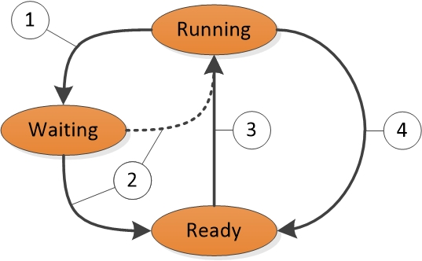

**Figure 1 Thread State Transitions**

Figure 1 Thread State Transitions is explained as follows:

1.  A thread in the Running state initiates a transition to the Waiting state by calling a wait function such as **WaitForSingleObject** or **Sleep(&gt; 0)**.

2.  A running thread or kernel operation readies a thread in the Waiting state (for example, **SetEvent** or timer expiration). If a processor is idle or if the readied thread has a higher priority than a currently running thread, the readied thread can switch directly to the Running state. Otherwise, it is put into the Ready state.

3.  A thread in the Ready state is scheduled for processing by the dispatcher when a running thread waits, yields **(Sleep(0))**, or reaches the end of its quantum.

4.  A thread in the Running state is switched out and placed into the Ready state by the dispatcher when it is preempted by a higher priority thread, yields **(Sleep(0))**, or when its quantum ends.

A thread that exists in the Waiting state does not necessarily indicate a performance problem. Most threads spend significant time in the Waiting state, which allows processors to enter idle states and save energy. Thread state becomes an important factor in performance only when a user is waiting for a thread to complete an operation.

### DPCs and ISRs

In addition to processing threads, processors respond to notifications from hardware devices such as network cards or timers. When a hardware device requires processor attention, it generates an *interrupt*. Windows responds to a hardware interrupt by suspending a currently running thread and executing the ISR that is associated with the interrupt.

During the time that it is executing an ISR, a processor can be prevented from handling any other activity, including other interrupts. For this reason, ISRs must complete quickly or system performance can degrade. To decrease execution time, ISRs commonly schedule DPCs to perform work that must be done in response to an interrupt. For each logical processor, Windows maintains a queue of scheduled DPCs. DPCs take priority over threads at any priority level. Before a processor returns to processing threads, it executes all of the DPCs in its queue.

During the time that a processor is executing DPCs and ISRs, no threads can run on that processor. This property can lead to problems for threads that must perform work at a certain throughput or with precise timing, such as a thread that plays audio or video. If the processor time that is used to execute DPCs and ISRs prevents these threads from receiving sufficient processing time, the thread might not achieve its required throughput or complete its work items on time.

## <a href="" id="cpu-guide-adktools"></a>Windows ADK Tools


The Windows ADK writes hardware information and assessments to *assessments results files*. WPA provides detailed information about CPU usage in various graphs. This section explains how to use the Windows ADK and WPA to collect, view, and analyze CPU performance data.

### <a href="" id="-------------windows-adk-assessment-results-files"></a> Windows ADK Assessment Results Files

Because Windows supports symmetric multiprocessing systems only, all information in this section applies to all installed CPUs and cores.

Detailed CPU hardware information is available in the `EcoSysInfo` section of an assessment result files under the `<Processor><Instance id=”0”>` node.

For example:

``` syntax
<Processor>
  <Instance id="0">
    <ProcessorName>The name of the first CPU</ProcessorName>
    <TSCFrequency>The maximum frequency of the first CPU</TSCFrequency>
    <NumProcs>The total number of processors</NumProcs>
    <NumCores>The total number of cores</NumCores>
    <NumCPUs>The total number of logical processors</NumCPUs>
    ...and so on...
```

### WPA Graphs

After you load a trace into WPA, you can find processor hardware information under the **Trace/System Configuration/General** and **Trace/System Configuration/PnP** sections of the WPA UI.

**Note**  
All procedures in this guide occur in WPA.

 

### CPU Idle States Graph

If idle state information is collected in a trace, the **Power/CPU Idle States** graph will display in the WPA UI. This graph always contains data on the *Target* idle state for each processor. The graph will also contain information on each processor’s *Actual* idle state if this state is supported by the processor.

Each row in the following table describes an idle state change for either the Target or Actual state of a processor. The following columns are available for each row in the graph:

<table>
<colgroup>
<col width="50%" />
<col width="50%" />
</colgroup>
<thead>
<tr class="header">
<th>Column</th>
<th>Details</th>
</tr>
</thead>
<tbody>
<tr class="odd">
<td><p>CPU</p></td>
<td><p>The processor that is affected by the state change.</p></td>
</tr>
<tr class="even">
<td><p>Entry Time</p></td>
<td><p>The time that the processor entered the idle state.</p></td>
</tr>
<tr class="odd">
<td><p>Exit Time</p></td>
<td><p>The time that the processor exited the idle state.</p></td>
</tr>
<tr class="even">
<td><p>Max:Duration(ms)</p></td>
<td><p>The time that is spent in the idle state (default aggregation:maximum).</p></td>
</tr>
<tr class="odd">
<td><p>Min:Duration(ms)</p></td>
<td><p>The time that is spent in the idle state (default aggregation:minimum).</p></td>
</tr>
<tr class="even">
<td><p>Next State</p></td>
<td><p>The state to which the processor transitioned after the current state.</p></td>
</tr>
<tr class="odd">
<td><p>Prev State</p></td>
<td><p>The state from which the processor transitioned before the current state.</p></td>
</tr>
<tr class="even">
<td><p>State</p></td>
<td><p>The current idle state.</p></td>
</tr>
<tr class="odd">
<td><p>State (Numeric)</p></td>
<td><p>The current idle state as a number (for example, 0 for C0).</p></td>
</tr>
<tr class="even">
<td><p>Sum:Duration(ms)</p></td>
<td><p>The time that is spent in the idle state (default aggregation:sum).</p></td>
</tr>
<tr class="odd">
<td><p>Table</p></td>
<td><p>Unused</p></td>
</tr>
<tr class="even">
<td><p>Type</p></td>
<td><p>Either <strong>Target</strong> (for the Power Manager’s selected target state for the processor) or <strong>Actual</strong> (for the actual idle state of the processor).</p></td>
</tr>
</tbody>
</table>

 

The default WPA profile provides two presets for this graph: **State by Type, CPU** and **State Diagram by Type, CPU**.

### State by Type, CPU

The Target and Actual states of each CPU are graphed together with the state number on the **Y** axis in the **State by Type, CPU** graph. Figure 2 CPU Idle States State by Type, CPU shows the Actual state of the CPU as it fluctuates between Active and Target idle states.

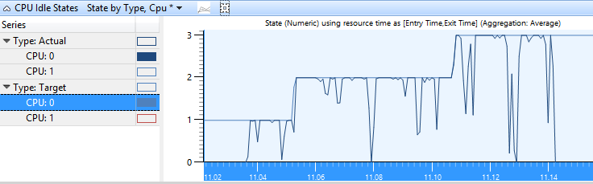

**Figure 2 CPU Idle States State by Type, CPU**

### State Diagram by Type, CPU

In this graph, the Target and Actual states of each CPU are presented in timeline format. Each state has a separate row in the timeline. Figure 3 CPU Idle States State Diagram by Type, CPU shows the same data as Figure 2 CPU Idle States State by Type, CPU, in a timeline view.

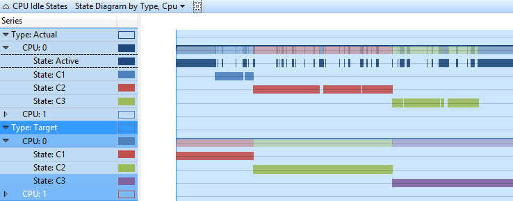

**Figure 3 CPU Idle States State Diagram by Type, CPU**

### CPU Frequency Graph

If CPU frequency data was collected on a system that supports multiple P- or T-states, the **CPU Frequency** graph will be available in the WPA UI. Each row in the following table represents time at a particular frequency level for a processor. The **Frequency (MHz)** column contains a limited number of frequencies that correspond to the P-states and T-states that are supported by the processor. The following columns are available for each row in the graph:

<table>
<colgroup>
<col width="50%" />
<col width="50%" />
</colgroup>
<thead>
<tr class="header">
<th>Column</th>
<th>Details</th>
</tr>
</thead>
<tbody>
<tr class="odd">
<td><p>% Duration</p></td>
<td><p>Duration is expressed as a percentage of total CPU time over the currently visible time period.</p></td>
</tr>
<tr class="even">
<td><p>Count</p></td>
<td><p>The number of frequency changes (always 1 for individual rows).</p></td>
</tr>
<tr class="odd">
<td><p>CPU</p></td>
<td><p>The CPU that is affected by the frequency change.</p></td>
</tr>
<tr class="even">
<td><p>Entry Time</p></td>
<td><p>The time that the CPU entered the P-state.</p></td>
</tr>
<tr class="odd">
<td><p>Exit Time</p></td>
<td><p>The time that the CPU exited the P-state.</p></td>
</tr>
<tr class="even">
<td><p>Frequency (MHz)</p></td>
<td><p>The frequency of the CPU during the time that it is in the P-state.</p></td>
</tr>
<tr class="odd">
<td><p>Max:Duration(ms)</p></td>
<td><p>The time that is spent in the P-state (default aggregation:maximum).</p></td>
</tr>
<tr class="even">
<td><p>Min:Duration(ms)</p></td>
<td><p>The time that is spent in the P-state (default aggregation:minimum).</p></td>
</tr>
<tr class="odd">
<td><p>Sum:Duration(ms)</p></td>
<td><p>The time that is spent in the P-state (default aggregation:sum).</p></td>
</tr>
<tr class="even">
<td><p>Table</p></td>
<td><p>Unused</p></td>
</tr>
<tr class="odd">
<td><p>Type</p></td>
<td><p>Additional information on the P-State.</p></td>
</tr>
</tbody>
</table>

 

The default profile defines the **Frequency by CPU** preset for this graph. Figure 4 CPU Frequency by CPU shows a CPU as it transitions between three P-states:

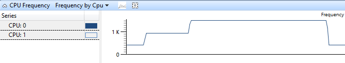

**Figure 4 CPU Frequency by CPU**

### CPU Usage (Sampled) Graph

The data that is displayed in the **CPU Usage (Sampled)** graph represents samples of CPU activity that are taken at a regular sampling interval. In most traces, this is one millisecond (1ms). Each row in the table represents a single sample.

The weight of the sample represents the significance of that sample, relative to other samples. The weight is equal to the timestamp of the current sample minus the timestamp of the previous sample. The weight is not always exactly equal to the sampling interval because of fluctuations in system state and activity.

Figure 5 CPU Sampling represents how data is collected:


**Figure 5 CPU Sampling**

Any CPU activity that occurs between samples is not recorded by this sampling method. Therefore, activities of very short duration such as DPCs and ISRs are not well represented in the **CPU Sampling** graph.

The following columns are available for each row in the graph:

<table>
<colgroup>
<col width="50%" />
<col width="50%" />
</colgroup>
<thead>
<tr class="header">
<th>Column</th>
<th>Details</th>
</tr>
</thead>
<tbody>
<tr class="odd">
<td><p>% Weight</p></td>
<td><p>Weight is expressed as a percentage of total CPU time that is spent over the currently visible time range.</p></td>
</tr>
<tr class="even">
<td><p>Address</p></td>
<td><p>The memory address of the function that is at the bottom of the stack.</p></td>
</tr>
<tr class="odd">
<td><p>All Count</p></td>
<td><p>The number of samples represented by a row. This number includes samples that are taken when a processor is idle. For individual rows, this column is always 1.</p></td>
</tr>
<tr class="even">
<td><p>Count</p></td>
<td><p>The number of samples represented by a row, excluding samples that are taken when a processor is idle. For individual rows, this column is always 1 (or 0, for cases when the CPU was in a low power state).</p></td>
</tr>
<tr class="odd">
<td><p>CPU</p></td>
<td><p>The 0-based index of the CPU on which this sample was taken.</p></td>
</tr>
<tr class="even">
<td><p>Display Name</p></td>
<td><p>The display name of the active process.</p></td>
</tr>
<tr class="odd">
<td><p>DPC/ISR</p></td>
<td><p>Whether the sample measured regular CPU usage, a DPC/ISR, or a low power state.</p></td>
</tr>
<tr class="even">
<td><p>Function</p></td>
<td><p>The function at the bottom of the stack.</p></td>
</tr>
<tr class="odd">
<td><p>Module</p></td>
<td><p>The module that contains the function at the bottom of the stack.</p></td>
</tr>
<tr class="even">
<td><p>Priority</p></td>
<td><p>The priority of the running thread.</p></td>
</tr>
<tr class="odd">
<td><p>Process</p></td>
<td><p>The image name of the process that owns the running code.</p></td>
</tr>
<tr class="even">
<td><p>Process Name</p></td>
<td><p>The full name (including Process ID) of the process that owns the running code.</p></td>
</tr>
<tr class="odd">
<td><p>Stack</p></td>
<td><p>The stack of the running thread.</p></td>
</tr>
<tr class="even">
<td><p>Thread ID</p></td>
<td><p>The ID of the running thread.</p></td>
</tr>
<tr class="odd">
<td><p>Thread Start Function</p></td>
<td><p>The function with which the running thread started.</p></td>
</tr>
<tr class="even">
<td><p>Thread Start Module</p></td>
<td><p>The module that contains the Thread Start Function.</p></td>
</tr>
<tr class="odd">
<td><p>TimeStamp</p></td>
<td><p>The time that the sample was taken.</p></td>
</tr>
<tr class="even">
<td><p>Weight</p></td>
<td><p>The time (in milliseconds) that is represented by the sample (that is, the time since the last sample).</p></td>
</tr>
</tbody>
</table>

 

The default profile provides the following presets for this graph:

-   Utilization by CPU

-   Utilization by Priority

-   Utilization by Process

-   Utilization by Process and Thread

### Utilization by CPU

The **CPU Usage Utilization by CPU** graph shows how work is distributed between processors. Figure 6 CPU Usage Utilization by CPU shows this distribution for two CPUs:

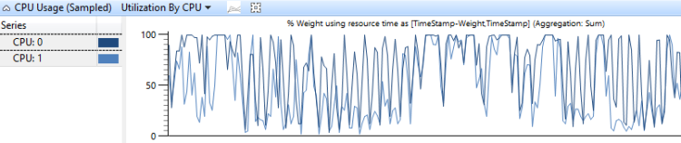

**Figure 6 CPU Usage Utilization by CPU**

### Utilization by Priority

**CPU Usage** grouped by thread priority shows how high-priority threads impact lower-priority threads. Figure 7 CPU Usage (Sampled) Utilization by Priority displays this graph:

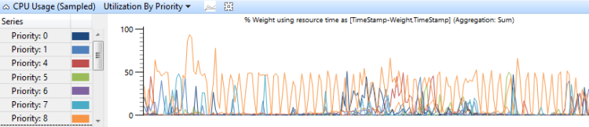

**Figure 7 CPU Usage (Sampled) Utilization by Priority**

### Utilization by Process

**CPU Usage** that is grouped by process shows the relative usage of processes. Figure 8 CPU Usage (Sampled) Utilization by Process shows this preset. In this sample graph, one process is shown to be consuming more CPU time than the other processes.

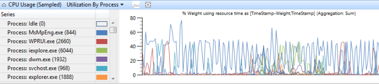

**Figure 8 CPU Usage (Sampled) Utilization by Process**

### Utilization by Process and Thread

**CPU Usage** that is grouped by process and then grouped by thread shows the relative usage of processes and the threads in each process. Figure 9 CPU Usage (Sampled) Utilization by Process and Thread shows this preset. The threads of a single process are selected in this graph.

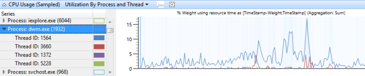

**Figure 9 CPU Usage (Sampled) Utilization by Process and Thread**

### CPU Usage (Precise) Graph

The **CPU Usage (Precise)** graph records information that is associated with context switching events. Each row represents a set of data that is associated with a single context switch; that is, when a thread started running. Data is collected for the following event sequence:

1.  The new thread is switched out.

2.  The new thread is made ready to run by the readying thread.

3.  The new thread is switched in, thereby switching out an old thread.

4.  The new thread is switched out again.

In Figure 10 CPU Usage Precise Diagram, time flows from left to right. The diagram labels correspond to column names in the **CPU Usage (Precise)** graph. Labels for **Timestamp** columns display at the top of the diagram, and labels for **Interval Duration** columns display at the bottom of the diagram.


**Figure 10 CPU Usage Precise Diagram**

Breaks in the timeline in Figure 10 CPU Usage Precise Diagram divide the timeline into regions that can occur simultaneously on different CPUs. These timelines can overlap as long as the order of the numbered events is not modified. For example, the Readying Thread can run on Processor-2 at the same time that a new thread is switched out and then back in on Processor-1).

Information is recorded for the following four targets on the timeline:

-   *New thread*, which is the thread that was switched in. It is the primary focus of this row in the graph.

-   *NewPrev thread*, which refers to the previous time that the new thread was switched in.

-   *Readying thread*, which is the thread that prepared the new thread to be processed.

-   *Old thread*, which is the thread that was switched out when the new thread was switched in.

The data in the following table relates to each target thread:

<table>
<colgroup>
<col width="50%" />
<col width="50%" />
</colgroup>
<thead>
<tr class="header">
<th>Column</th>
<th>Details</th>
</tr>
</thead>
<tbody>
<tr class="odd">
<td><p>% CPU Usage</p></td>
<td><p>The CPU usage of the new thread after it is switched. This value is expressed as a percentage of total CPU time over the currently visible time period.</p></td>
</tr>
<tr class="even">
<td><p>Count</p></td>
<td><p>The number of context switches that are represented by the row. This is always 1 for individual rows.</p></td>
</tr>
<tr class="odd">
<td><p>Count:Waits</p></td>
<td><p>The number of waits that are represented by the row. This is always 1 for individual rows except when a thread is switched to an idle state; in this case, it is set to 0.</p></td>
</tr>
<tr class="even">
<td><p>CPU</p></td>
<td><p>The CPU on which the context switch occurred.</p></td>
</tr>
<tr class="odd">
<td><p>CPU Usage (ms)</p></td>
<td><p>The CPU usage of the new thread after the context switch. This is equal to the NewInSwitchTime, but is displayed in milliseconds.</p></td>
</tr>
<tr class="even">
<td><p>IdealCpu</p></td>
<td><p>The ideal CPU selected by the scheduler for the new thread.</p></td>
</tr>
<tr class="odd">
<td><p>LastSwitchOutTime (s)</p></td>
<td><p>The previous time that the new thread was switched out.</p></td>
</tr>
<tr class="even">
<td><p>NewInPri</p></td>
<td><p>The priority of the new thread that is switched in.</p></td>
</tr>
<tr class="odd">
<td><p>NewInSwitchTime(s)</p></td>
<td><p>NextSwitchOutTime(s) minus SwitchInTime(s)</p></td>
</tr>
<tr class="even">
<td><p>NewOutPri</p></td>
<td><p>The priority of the new thread when it switches out.</p></td>
</tr>
<tr class="odd">
<td><p>NewPrevOutPri</p></td>
<td><p>The priority of the new thread when it was previously switched out.</p></td>
</tr>
<tr class="even">
<td><p>NewPrevState</p></td>
<td><p>The state of the new thread after it was previously switched out.</p></td>
</tr>
<tr class="odd">
<td><p>NewPrevWaitMode</p></td>
<td><p>The Wait Mode of the new thread when it was previously switched out.</p></td>
</tr>
<tr class="even">
<td><p>NewPrevWaitReason</p></td>
<td><p>The reason that the new thread was switched out.</p></td>
</tr>
<tr class="odd">
<td><p>NewPriDecr</p></td>
<td><p>The priority boost that affects the thread.</p></td>
</tr>
<tr class="even">
<td><p>NewProcess</p></td>
<td><p>The process of the new thread.</p></td>
</tr>
<tr class="odd">
<td><p>NewProcess Name</p></td>
<td><p>The name of the process of the new thread, including PID.</p></td>
</tr>
<tr class="even">
<td><p>NewQnt</p></td>
<td><p>Unused.</p></td>
</tr>
<tr class="odd">
<td><p>NewState</p></td>
<td><p>The state of the new thread after it is switched in.</p></td>
</tr>
<tr class="even">
<td><p>NewThreadId</p></td>
<td><p>The thread ID of the new thread.</p></td>
</tr>
<tr class="odd">
<td><p>NewThreadStack</p></td>
<td><p>The stack of the new thread when it is switched in.</p></td>
</tr>
<tr class="even">
<td><p>NewThreadStartFunction</p></td>
<td><p>The start function of the new thread.</p></td>
</tr>
<tr class="odd">
<td><p>NewThreadStartModule</p></td>
<td><p>The start module of the new thread.</p></td>
</tr>
<tr class="even">
<td><p>NewWaitMode</p></td>
<td><p>The wait mode of the new thread.</p></td>
</tr>
<tr class="odd">
<td><p>NewWaitReason</p></td>
<td><p>The reason that the new thread was switched out.</p></td>
</tr>
<tr class="even">
<td><p>NextSwitchOutTime(s)</p></td>
<td><p>The time when the new thread was next switched out.</p></td>
</tr>
<tr class="odd">
<td><p>OldInSwitchTime(s)</p></td>
<td><p>The time that the old thread was switched in before it was switched out.</p></td>
</tr>
<tr class="even">
<td><p>OldOutPri</p></td>
<td><p>The priority of the old thread when it was switched out.</p></td>
</tr>
<tr class="odd">
<td><p>OldProcess</p></td>
<td><p>The process that owns the old thread.</p></td>
</tr>
<tr class="even">
<td><p>OldProcess Name</p></td>
<td><p>The name of the process that owns the old thread, including PID.</p></td>
</tr>
<tr class="odd">
<td><p>OldQnt</p></td>
<td><p>Unused.</p></td>
</tr>
<tr class="even">
<td><p>OldState</p></td>
<td><p>The state of the old thread after it is switched out.</p></td>
</tr>
<tr class="odd">
<td><p>OldThreadId</p></td>
<td><p>The thread ID of the old thread.</p></td>
</tr>
<tr class="even">
<td><p>OldThreadStartFunction</p></td>
<td><p>The start function of the old thread.</p></td>
</tr>
<tr class="odd">
<td><p>OldThreadStartModule</p></td>
<td><p>The start module of the old thread.</p></td>
</tr>
<tr class="even">
<td><p>OldWaitMode</p></td>
<td><p>The wait mode of the old thread.</p></td>
</tr>
<tr class="odd">
<td><p>OldWaitReason</p></td>
<td><p>The reason that the old thread was switched out.</p></td>
</tr>
<tr class="even">
<td><p>PrevCState</p></td>
<td><p>The previous CState of the processor. If this is not 0 (Active), the processor was in an idle state before the new thread was context-switched in.</p></td>
</tr>
<tr class="odd">
<td><p>Ready(s)</p></td>
<td><p>SwitchInTime(s) minusReadyTime (s)</p></td>
</tr>
<tr class="even">
<td><p>Readying ThreadId</p></td>
<td><p>The thread ID of the readying thread.</p></td>
</tr>
<tr class="odd">
<td><p>Readying ThreadStartFunction</p></td>
<td><p>The start function of the readying thread.</p></td>
</tr>
<tr class="even">
<td><p>Readying ThreadStartModule</p></td>
<td><p>The start module of the readying thread.</p></td>
</tr>
<tr class="odd">
<td><p>ReadyingProcess</p></td>
<td><p>The process that owns the readying thread.</p></td>
</tr>
<tr class="even">
<td><p>ReadyingProcess Name</p></td>
<td><p>The name of the process that owns the readying thread, including PID.</p></td>
</tr>
<tr class="odd">
<td><p>ReadyThreadStack</p></td>
<td><p>The stack of the readying thread.</p></td>
</tr>
<tr class="even">
<td><p>ReadyTime (s)</p></td>
<td><p>The time when the new thread was readied.</p></td>
</tr>
<tr class="odd">
<td><p>SwitchInTime(s)</p></td>
<td><p>The time when the new thread was switched in.</p></td>
</tr>
<tr class="even">
<td><p>TimeSinceLast (s)</p></td>
<td><p>SwitchInTime(s) minus LastSwitchOutTime (s)</p></td>
</tr>
<tr class="odd">
<td><p>Waits (s)</p></td>
<td><p>ReadyTime (s) minus LastSwitchOutTime (s)</p></td>
</tr>
</tbody>
</table>

 

The default profile uses the following presets for this graph:

-   Timeline by CPU

-   Timeline by Process, Thread

-   Usage by Priority at Context Switch Begin

-   Utilization by CPU

-   Utilization by Process, Thread

### Timeline by CPU

**CPU Usage** on a per-CPU timeline shows how work is distributed among processors. Figure 11 CPU Usage (Precise) Timeline by CPU displays the timeline on an eight-processor system:

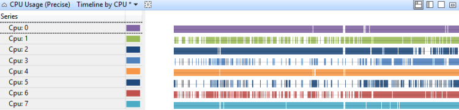

**Figure 11 CPU Usage (Precise) Timeline by CPU**

### Timeline by Process, Thread

**CPU Usage** on a per-process, per-thread timeline, shows which processes had threads running at certain times. Figure 12 Usage (Precise) Timeline by Process, Thread shows this timeline across several processes:

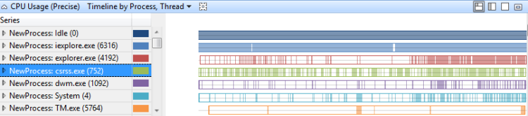

**Figure 12 Usage (Precise) Timeline by Process, Thread**

### Usage by Priority at Context Switch Begin

This graph identifies bursts of high-priority thread activity at each priority level. Figure 13 CPU Usage (Precise) Usage by Priority at Context Switch Begin shows the distribution of priorities:

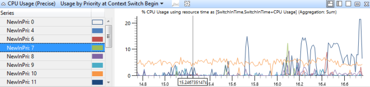

**Figure 13 CPU Usage (Precise) Usage by Priority at Context Switch Begin**

### Utilization by CPU

In this graph, CPU usage is grouped and graphed by CPU to show how work is distributed among processors. Figure 14 CPU Usage (Precise) Utilization by CPU shows this graph for a system that has eight processors.

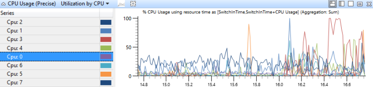

**Figure 14 CPU Usage (Precise) Utilization by CPU**

### Utilization by Process, Thread

In this graph, CPU usage is grouped first by process and then by thread. It shows the relative usage of processes and the threads in each process Figure 15 CPU Usage (Precise) Utilization by Process, Thread shows this distribution across multiple processes:

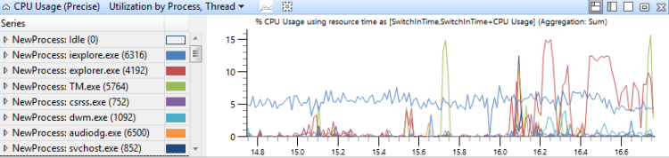

**Figure 15 CPU Usage (Precise) Utilization by Process, Thread**

### DPC/ISR Graph

The DPC/ISR graph is the primary source for DPC/ISR information in WPA. Each row in the graph represents a fragment, which is a period of time during which a DPC or ISR ran uninterrupted. Data is collected at the start and end of fragments. Additional data is collected when a DPC/ISR is complete. Figure 16 DPC/ISR Diagram shows how this works:

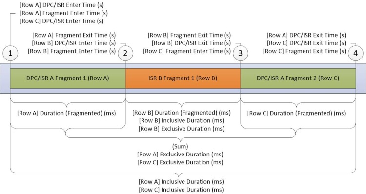

**Figure 16 DPC/ISR Diagram**

Figure 16 DPC/ISR Diagram describes data that was collected during the following activities:

1.  **DPC/ISR-A** starts to run.

2.  A device interrupt that has a higher interrupt level than **DPC/ISR-A** causes **ISR-B** to interrupt **DPC/ISR A**, thereby ending the first fragment of **DPC/ISR-A**.

3.  **ISR-B** completes and thereby ends the fragment of **ISR-B**. **DPC/ISR-A** resumes execution in a second fragment.

4.  **DPC/ISR-A** completes, thereby ending the second fragment of **DPC/ISR-A**.

A row for each fragment is displayed in the data table. The fragments for **DPC/ISR-A** share identical information with non-fragment columns.

The columns for the DPC/ISR graph describe fragment-level information, or DPC/ISR level columns. Each fragment dissimilar data in fragment-level columns, and identical data in DPC/ISR columns.

<table>
<colgroup>
<col width="50%" />
<col width="50%" />
</colgroup>
<thead>
<tr class="header">
<th>Column</th>
<th>Details</th>
</tr>
</thead>
<tbody>
<tr class="odd">
<td><p>% Duration (Fragmented)</p></td>
<td><p>Duration (fragmented) that is expressed as a percentage of total CPU time over the currently visible time period.</p></td>
</tr>
<tr class="even">
<td><p>% Exclusive Duration</p></td>
<td><p>Exclusive duration that is expressed as a percentage of total CPU time over the currently visible time period.</p></td>
</tr>
<tr class="odd">
<td><p>% Inclusive Duration</p></td>
<td><p>Inclusive duration that is expressed as a percentage of total CPU time over the currently visible time period.</p></td>
</tr>
<tr class="even">
<td><p>Address</p></td>
<td><p>The memory address of the DPC or ISR function.</p></td>
</tr>
<tr class="odd">
<td><p>Count (DPCs/ISRs)</p></td>
<td><p>The count of DPCs/ISRs that are represented by this row. This is always 1 for rows that represent the final fragment of a DPC/ISR; otherwise, this count is 0.</p></td>
</tr>
<tr class="even">
<td><p>Count (Fragments)</p></td>
<td><p>The number of fragments that are represented by the row. This is always 1 for individual rows.</p></td>
</tr>
<tr class="odd">
<td><p>CPU</p></td>
<td><p>The index of the logical processor on which the DPC or ISR ran.</p></td>
</tr>
<tr class="even">
<td><p>DPC Type</p></td>
<td><p>For DPC, the type of DPC,- either Regular or Timer. This value is blank for an ISR.</p></td>
</tr>
<tr class="odd">
<td><p>DPC/ISR Enter Time (s)</p></td>
<td><p>The time in the trace when the DPC/ISR started.</p></td>
</tr>
<tr class="even">
<td><p>DPC/ISR Exit Time (s)</p></td>
<td><p>The time from the beginning of the trace to when the DPC/ISR completed.</p></td>
</tr>
<tr class="odd">
<td><p>Duration (Fragmented) (ms)</p></td>
<td><p>Fragment Exit Time (s) minus Fragment Enter Time (s) in milliseconds.</p></td>
</tr>
<tr class="even">
<td><p>Exclusive Duration (ms)</p></td>
<td><p>The sum of fragmented durations in ms. for all fragments of this DPC/ISR.</p></td>
</tr>
<tr class="odd">
<td><p>Fragment</p></td>
<td><p>If the DPC/ISR of this row had multiple fragments, this value is <strong>True</strong>; otherwise, it is <strong>False</strong>.</p></td>
</tr>
<tr class="even">
<td><p>Fragment</p></td>
<td><p>If this was not the only fragment for this DPC/ISR, this value is <strong>True</strong>; otherwise, it is <strong>False</strong>.</p></td>
</tr>
<tr class="odd">
<td><p>Fragment Enter Time (s)</p></td>
<td><p>The time that the fragment started to run.</p></td>
</tr>
<tr class="even">
<td><p>Fragment Exit Time (s)</p></td>
<td><p>The time that the fragment stopped running.</p></td>
</tr>
<tr class="odd">
<td><p>Function</p></td>
<td><p>The DPC or ISR function that ran.</p></td>
</tr>
<tr class="even">
<td><p>Inclusive Duration (ms)</p></td>
<td><p>DPC/ISR Exit Time (s) minus DPC/ISR Enter Time (s) in milliseconds.</p></td>
</tr>
<tr class="odd">
<td><p>MessageIndex</p></td>
<td><p>The interrupt index for message-signaled interrupts.</p></td>
</tr>
<tr class="even">
<td><p>Module</p></td>
<td><p>The module that contains the DPC or ISR function.</p></td>
</tr>
<tr class="odd">
<td><p>Return Value</p></td>
<td><p>The return value of the DPC/ISR</p></td>
</tr>
<tr class="even">
<td><p>Type</p></td>
<td><p>The type of event; this is- either DPC or Interrupt (ISR).</p></td>
</tr>
<tr class="odd">
<td><p>Vector</p></td>
<td><p>The value of the interrupt vector on the device.</p></td>
</tr>
</tbody>
</table>

 

The default profile uses the following presets for this graph:

-   \[DPC,ISR,DPC/ISR\] Duration by CPU

-   \[DPC,ISR,DPC/ISR\] Duration by Module, Function

-   \[DPC,ISR,DPC/ISR\] Timeline by Module, Function

### <a href="" id="-dpc-isr-dpc-isr--duration-by-cpu"></a>\[DPC,ISR,DPC/ISR\] Duration by CPU

DPC/ISR events are aggregated by the CPU on which they ran and are sorted by duration. This graph shows the allocation of DPC activity across CPUs. Figure 17 DPC/ISR Duration by CPU shows this graph for a system that has eight processors.

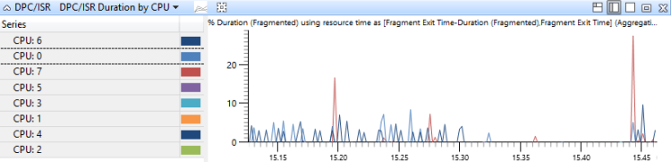

**Figure 17 DPC/ISR Duration by CPU**

### <a href="" id="-dpc-isr-dpc-isr--duration-by-module--function"></a>\[DPC,ISR,DPC/ISR\] Duration by Module, Function

DPC/ISR events are aggregated in this graph by the module and function of the DPC/ISR routines, and are sorted by duration. This shows which DPC/ISR routines consumed the most time Figure 18 DPC/ISR Duration by Module, Function shows a period of time that incurs DPC/ISR activity in two modules:

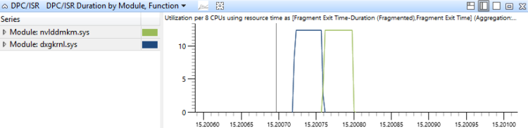

**Figure 18 DPC/ISR Duration by Module, Function**

### <a href="" id="-dpc-isr-dpc-isr--timeline-by-module--function"></a>\[DPC,ISR,DPC/ISR\] Timeline by Module, Function

DPC/ISR events are aggregated in this graph by the module and function of the DPC/ISR routines. They are graphed as a timeline. This graph provides a detailed view of the time period over which DPCs/ISRs ran. This graph can also show how single DPC/ISRs can be fragmented. Figure 19 DPC/ISR Timeline by Module, Function shows a timeline of activity in three modules:


**Figure 19 DPC/ISR Timeline by Module, Function**

### Stack Trees

Stack trees are displayed in the **CPU Usage (Sampled)**, **CPU Usage (Precise)** and **DPC/ISR** tables in WPA, and in issues that are reported in assessment reports. Stack trees portray the call stacks that are associated with multiple events over a period of time. Each node in the tree represents a stack segment that is shared by a subset of the events. The tree is constructed from the individual stacks and is shown in Figure 20 Stacks from Three Events:

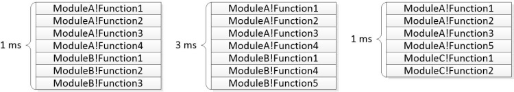

**Figure 20 Stacks from Three Events**

Figure 21 Common Segments Identified shows how common sequences are identified for this graph:

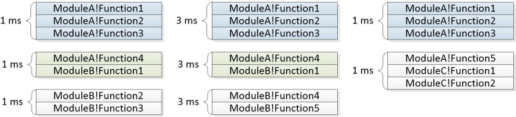

**Figure 21 Common Segments Identified**

Figure 22 Tree Built from Stacks shows how the common segments are combined to form the nodes of a tree:

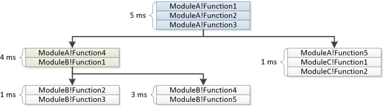

**Figure 22 Tree Built from Stacks**

The **Stacks** column in the WPA UI contains an expander for each non-leaf node. In assessment-reported issues, the tree is displayed together with the aggregate weights. Some branches can be removed from the graph if their weights do not meet a specified threshold. The sample stack below shows how the events represented above are displayed as part of an assessment-reported issue.

``` syntax
5ms   ModuleA!Function1
5ms   ModuleA!Function2
5ms   ModuleA!Function3
      |
4ms   |-ModuleA!Function4
4ms   |   ModuleB!Function1
      |   |
1ms   |   |-ModuleB-Function2
1ms   |   |    ModuleB-Function3
      |   |
3ms   |   |-ModuleB!Function3
3ms   |        ModuleB!Function4
      |
1ms   |-ModuleA!Function5
1ms        ModuleC!Function1
1ms        ModuleC!Function2
```

The `<itself>` node in a stack represents the time that a function itself is at the bottom of the stack. The `<itself>` node does not include the time that is spent in functions that are called by the parent function. That duration is called the *exclusive* time spent in the function.

For example, **Function1** calls **Function2**. **Function2** spent 2ms in a CPU-intensive loop and called another function that ran for 4ms. This can be represented by the following stack:

``` syntax
6ms   ModuleA!Function1
      |
2ms   |-<itself>
4ms   |-ModuleA!Function2
4ms        ModuleB!Function3
4ms        ModuleB-Function4
```

## <a href="" id="cpu-guide-techniques"></a>Techniques


This section describes a standard approach to performance analysis. It provides techniques that you can use to investigate common CPU-related performance problems.

Performance analysis is a four-step process:

1.  Define the scenario and the problem.

2.  Identify the components that are involved and the relevant time range.

3.  Create a model of what should have happened.

4.  Use the model to identify problems and investigate root causes.

### Define the Scenario and the Problem

The first step in performance analysis is to clearly define the scenario and the problem. Many performance problems affect scenarios that are measured by assessment metrics. For example:

Scenario 1: A physical resource is not being fully utilized. For example, a server cannot fully utilize a network connection because it cannot encrypt packets quickly enough.

Scenario 2: A physical resource is being utilized more than it should be. For example, a system uses significant CPU resources during an idle period that uses battery power.

Scenario 3: Activities are not being completed at a required rate. For example, frames are dropped during video playback because the frames are not being decoded quickly enough.

Scenario 4: An activity was delayed. For example, the user launched Internet Explorer but it took longer than expected to open a tab.

Scenarios 3 and 4 as they related to CPU resources are covered in this guide. Scenarios 1 and 2 are out of scope and are not covered. To analyze these problems, you can start with an ambiguous observation such as “it is too slow” and ask additional questions to identify the scenario and the exact problem.

### <a href="" id="identify-the-components-and-the-time-period-"></a>Identify the Components and the Time Period

After the scenario and the problem are identified, you can identify the components that are involved and the time period of interest. The components include hardware resources, processes, and threads.

You can often find the time range of interest by identifying the associated activity in the analysis guide. An activity is an interval between a start event and a stop event that you can select and zoom into, in WPA. If an activity is not defined, you can find the time range by looking for specific generic events that are associated with the scenario, or by looking for changes in resource utilization that might mark the beginning and end of a scenario. For example, if the CPU was idle for two seconds and then fully utilized for four seconds and then idle again for two seconds, the four seconds of full utilization might be the area of interest in a trace that captures video playback.

### Create a Model

To understand the root causes of a problem, you must have a model of what should have happened. The model starts with the problem or any associated goal for the metric; for example, “This operation should have completed in less than 5 seconds.”

A more complete model contains information about how the components should perform. For example, what communication is expected between components? What resource utilization is typical? How long do operations usually take?

Information for the model can often be found in the assessment analysis guide. If that resource is not available, you can produce a trace from similar hardware and software that does not exhibit the performance problem, to create a model.

### Use the Model to Identify Problems, and then Investigate Root Causes

After you have a model, you can compare a trace to the model to identify problems. For example, a model for a particular activity called **Suspend Devices** might suggest that the entire activity should complete in three seconds, while each instance of a sub-activity called **Suspend &lt;Device Name&gt;** should take no more than 100ms. If two instances of the sub-activity **Suspend &lt;Device Name&gt;** each take 800ms, you should investigate those instances.

Each deviation from the model can be analyzed to find a root cause. You should examine the state of the involved threads and look for common root causes. A few major CPU-related root causes, for activities that do not complete at a required rate or are delayed, are described here:

Direct CPU usage: The appropriate threads received full CPU resources but the required program did not execute quickly enough. This can be caused by a program malfunction or by slow hardware.

Thread Interference: A thread did not get enough running time because other threads were running instead. In this case, the thread is considered to be starved or preempted.

DPC/ISR Interference: Threads did not get enough running time because CPUs were busy processing DPCs or ISRs.

In many cases, one of these root causes does not noticeably affect the thread, and the thread spends most of its time in a waiting state. In this case, you must identify and investigate the event for which the thread is waiting. This recursive type of investigation is called *wait analysis*, and it starts by identifying the critical path.

### Advanced Technique: Wait Analysis and the Critical Path

An activity is a network of operations, some sequential and some parallel, that flow from a start event to an end event. Any start/end event pair in a trace can be viewed as an activity. The longest path through this network of operations is known as the critical path. Reducing the duration of any operation on the critical path directly reduces the duration of the overall activity, although it can also change the critical path.

Figure 23 Activity Operations shows the activity of three threads. Thread-1 sends the activity start event and then waits for Thread-2 and Thread-3 to complete their tasks. Thread-2 completes its task first, followed by Thread-3. When both threads have completed their tasks, Thread-1 is readied and completes the activity event.

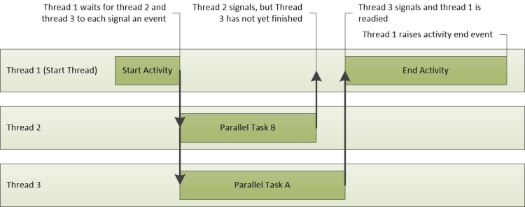

**Figure 23 Activity Operations**

In this scenario, the critical path includes parts of Thread-3 and Thread-1. These are traced in Figure 24 Critical Path. Because Thread-2 is not on the critical path, the time that it takes to complete its task does not affect the overall activity time.

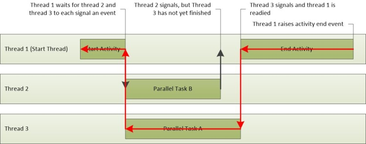

**Figure 24 Critical Path**

The critical path is a low-level literal answer to the question of why an activity took as much time as it did. After key segments of critical path are known, they can be analyzed to find the problems that contribute to the overall delay.

### General Approach to Finding the Critical Path

The first step to finding the critical path is to review the scenario model to understand the purpose and implementation of the activity.

Understanding an activity can help identify specific operations, processes, and threads that might be on the critical path. For example, a delay in the **Fast Startup Resume Explorer Init** activity can be caused by **RunOnce** applications and the Explorer initialization process, both of which require a significant amount of I/O.

After you review the scenario model, check to see whether the assessment reported any issues for the affected activity. Many times, an approximation of the critical path is included in assessment-reported delay issues. The critical path is shown as a sequence of waits and ready actions. It can be read from start to finish as a sequence of events, with the primary delayed segment of the critical path in the middle of the list. The last entry in the list is the action that readied the thread that completed the activity.

If you must manually look for the critical path, we recommend that you identify the process and the thread that completed the activity and work backwards from the instant that the activity completed. You can identify the process and thread that started an activity, and the process and thread that completed an activity, through the **Activities** graph in WPA.

The **Activities** graph displays when the trace is loaded through an assessment results XML file. To identify the process and the thread that are associated with a particular activity, expand the graph to the Activity of interest and then switch the view to **Graph+Table**. Set the graph mode to **Table**. The **Start Process**, **Start Thread Id**, **End Process**, and **End Thread Id** columns display for each activity in the table.

After you know the start and end process, the thread, and the implementation of the activity, the critical path can be traced backwards. Start by analyzing the thread that completed the activity, to determine how that thread spent most of its time: running, ready, or waiting.

Significant running time indicates that direct CPU usage might have contributed to the duration of the critical path. Time spent in ready mode indicates that other threads contribute to the duration of the critical path by preventing a thread on the critical path from executing. Time spent waiting points to I/O, timers, or other threads and processes on the critical path for which the current thread was waiting.

Each thread that readied the current thread is probably another link in the critical path, and can also be analyzed until the duration of the critical path is accounted for.

**Procedure: Finding the Critical Path in WPA**

The following procedure assumes that you have identified an activity in the Activities graph for which you want to find the critical path.

1.  You can identify the process that completed the activity by hovering over the activity in the **Activities** graph.

2.  Add the **CPU Usage (Precise)** graph. Zoom to the affected activity, and apply the **Utilization by Process, Thread** preset.

3.  Right-click the column headers and make the **ReadyThreadStack** and **CPU Usage (ms)** columns visible. Remove the **Ready (us) \[Max\]** and **Waits (us) \[Max\]** columns.

4.  Expand the target process and sort it respectively by **CPU Usage (ms)**, **Ready (us) \[Sum\]**, and **Waits (us) \[Sum\]**.

5.  Search for the **NewThreadIds** in the process that has the highest amount of time spent in Running, Ready, or Waiting state.

    Threads that spend significant time in the Running or Ready states might represent direct CPU usage on the critical path. Note their thread IDs.Threads that spend significant time in the Waiting state might be waiting on I/O, a timer, or on another thread in the critical path.

6.  To discover what the threads were waiting for, expand the **NewThreadId** group to display the **ReadyThreadStack**.

7.  Expand **\[Root\]**.

8.  Stacks that begin with **KiDispatchInterrupt** are not related to another thread. To determine what the thread was waiting for in these stacks, expand **KiDispatchInterrupt** and view the functions on the child stack. **IopfCompleteRequest** indicates that the readied thread was waiting for I/O. **KiTimerExpiration** indicates that the readied thread was waiting for a timer.

9.  Expand stacks that do not begin with **KiDispatchInterrupt** until you see a **ReadyingProcess** and a **ReadyingThread**. If the process is already expanded, expand the **NewThreadId** that corresponds to the **ReadyingThread**. Repeat this step until you find a thread that is running, ready, waiting for another reason, or waiting on a different process. If the thread is waiting on a different process, repeat this procedure by using that process.

**Example**

This example presents a delay in the Fast Startup Resume Explorer Init activity. A search in the **Issues** pane shows that seven delay-type issues are reported for this activity. Each of these issues can be reviewed as a segment of the critical path. The following key segments are identified:

-   Thread 3872 of process TestBootStrapper.exe (3024) is preempted for 2.1 seconds.

-   Thread 3872 of process TestBootStrapper.exe (3024) uses 1 second of CPU time.

-   Thread 3872 of process TestBootStrapper.exe (3024) flushes a registry hive for 544 milliseconds.

-   Thread 3872 of process TestBootStrapper.exe (3024) sleeps for 513 milliseconds.

-   Threads 4052 and 4036 of Explorer.exe read from disk, causing a 461 millisecond delay.

-   Thread 3872 of process TestBootStrapper.exe (3024) starves for 187 milliseconds.

-   Thread 3872 of process TestBootStrapper.exe writes 3.5MB to disk, causing a 178 millisecond delay.

The issues show that this activity was delayed by 5.2 seconds. These delays contribute a large proportion of the activities overall 6.3 second duration. The TestBootStrapper.exe application is primarily responsible for the delay, primarily because it preempted other processing tasks.

**Investigate Issues in the Critical Path**

1.  Zoom to the affected region and add the **ReadyThreadStack** and **CPU Usage (ms)** columns.

2.  In this case, Explorer.exe is the process that completes the activity. Expand the explorer.exe process and sort it respectively by **CPU Usage (ms)**, **Ready (us) \[Sum\]**, and **Waits (us) \[Sum\]**, as shown in the following figures:

    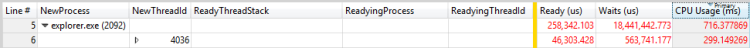

    **Figure 25 Activity by CPU Usage (ms)**

    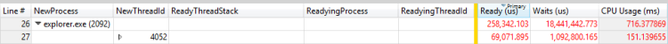

    **Figure 26 Activity by Ready (us)**

    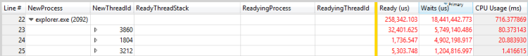

    **Figure 27 Activity by Waits (us)**

3.  Sorting by the **CPU Usage (ms)** column shows a top child row of 299 milliseconds. Sorting by the **Ready (us) \[Sum\]** column shows a top child row of 46ms. Sorting by the **Waits (us) \[Sum\]** column shows a top child row of 5749 milliseconds and a second row of 4902 milliseconds. Because these rows contribute significantly to the delay, you should investigate them further.

4.  Expand the stacks to reveal the readying threads, as shown in the following figures:

    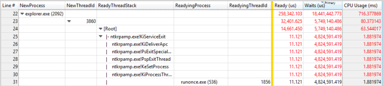

    **Figure 28 Readying Process and Readying Thread for a Thread**

    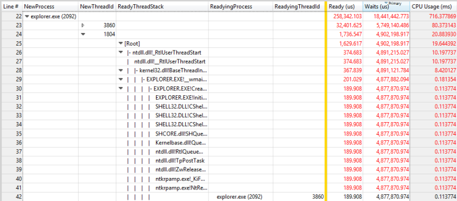

    **Figure 29 Readying Process and Readying Thread for another Thread**

    In this example, the first thread spends most of its time waiting for the RunOnce.exe process to exit. You should investigate why the RunOnce.exe process is taking so much time to complete. The second thread is waiting on the first thread, and is probably an insignificant link in the same wait chain.

5.  Repeat the steps in this procedure for RunOnce.exe. The primary contributing column is **Waits (us)**, and it has four possible contributors.

6.  Expand each contributor to see that the first three contributors are each waiting on the fourth contributor. This situation makes the first three contributors insignificant to the wait chain. The fourth contributor is waiting on another process, TestBootStrapper.exe.

    This scenario is shown in Figure 30 Readying Process and Readying Thread for a Thread in RunOnce.exe:

    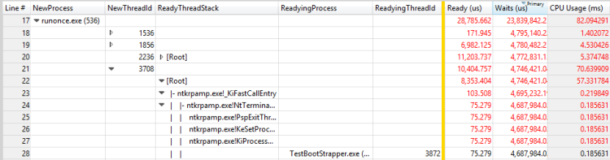

    **Figure 30 Readying Process and Readying Thread for a Thread in RunOnce.exe**

7.  Repeat the steps in this procedure for TestBootStrapper.exe. The results are shown in the following three figures:

    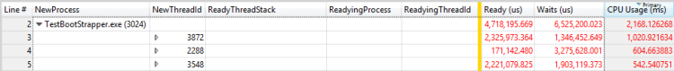

    **Figure 31 Threads by CPU Usage (ms)**

    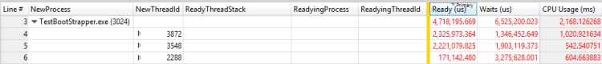

    **Figure 32 Threads by Ready (us)**

    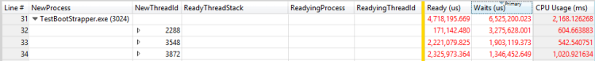

    **Figure 33 Threads by Waits (us)**

    Thread 3872 spent approximately 1 second running, 2 seconds ready, and 1.3 seconds waiting. Because this thread is also the readying thread for thread 3872, the running and ready times probably contribute to the delay. The assessment reports the following issues whose times match the delays:

    -   Thread 3872 of process TestBootStrapper.exe (3024) is preempted for 2.1 second.

    -   Thread 3872 of process TestBootStrapper.exe (3024) starves for 187 milliseconds.

    -   Thread 3872 of process TestBootStrapper.exe (3024) uses 1 second of CPU time.

8.  To find other contributing issues, view the event for which thread 3872 was waiting. Expand **ReadyThreadStack** to view contributors to the 1.3 seconds of waiting, as shown in Figure 34 Contributors to Wait Time:

    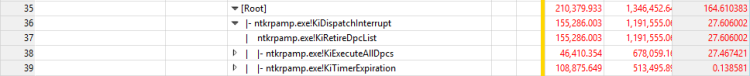

    **Figure 34 Contributors to Wait Time**

    **KiRetireDpcList** is typically I/O-related and **KiTimerExpiration** is a timer. You can view how the I/Os and timer were initiated by removing the **ReadyThreadStack** and then viewing the **NewThreadStack**. This view shows three related functions, as shown in Figure 35 I/Os and Timer on NewThreadStack:

    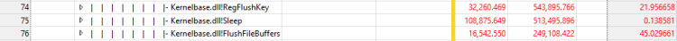

    **Figure 35 I/Os and Timer on NewThreadStack**

    This view discloses the following details:

    -   Thread 3872 of process TestBootStrapper.exe (3024) flushes a registry hive for 544 milliseconds.

    -   Thread 3872 of process TestBootStrapper.exe (3024) sleeps for 513 milliseconds.

    -   Thread 3872 of process TestBootStrapper.exe writes 3.5MB to disk, thereby causing a 178 millisecond delay.

9.  When you started to investigate the critical path, you analyzed the most significant wait cause in Explorer.exe and disregarded any parts of the critical path that occurred after that wait cause. To capture this previously disregarded section of the critical path, you must look at the timeline. Add **CPU Usage (Precise)** and apply the **Timeline by Process, Thread** preset.

10. Filter to include only the processes identified as part of the critical path. The resulting graph is shown in Figure 36 Critical Path Timeline:

    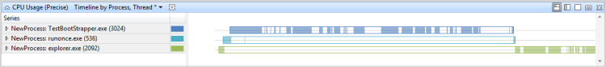

    **Figure 36 Critical Path Timeline**

    Figure 36 Critical Path Timeline shows that Explorer.exe performed more work after it stopped waiting for RunOnce.exe. Zoom to the time period after the previously-analyzed wait chain and perform another analysis. In this case, analysis reveals a large number of threads that are internal to Explorer.exe and no clear trace through the critical path. In this case, further analysis is not likely to yield actionable insights.

### Direct CPU Usage

Activities are often delayed because a thread on the critical path uses significant CPU time. By using the thread state model, you can see that this problem is characterized by a thread on the critical path that spends an exceptional amount of time in the Running state. On some hardware, this heavy CPU usage can contribute to delays.

### Problem Identification

Many assessments use heuristics to identify direct CPU usage-related problems. Significant CPU usage on the critical path is reported as an issue in the following form:

CPU use by process *P* delays the impacted activity *A* for *x* seconds

Where *P* is the process that is running, *A* is the activity, and *x* is the time in seconds.

If these issues are reported for an activity that incurs delays, direct CPU usage might be the cause.

**Investigate Direct CPU Usage**

1.  You can manually identify the problem by looking for individual CPUs that incur 100% CPU usage in the **CPU Usage (Sampled)** graph.

2.  Zoom to an area of interest in the graph and select the **Utilization by Process and Thread** preset.

    By default, the table displays rows at the top that have the highest aggregate CPU usage. These threads also display at the top of the **CPU Usage (Sampled)** graph.

    **Note**  
    On a system that has multiple processors, a thread that uses 100% of a single processor will appear to be consuming 100/(number of logical processors). On this kind of system, only the virtual idle thread (PID 0, TID 0) can show a greater processor utilization than 100/(number of logical processors). If the processes and threads that consume the most CPU correspond to any threads in the critical path, direct CPU usage is probably a factor.

     

**Example of Assessment-Reported Direct CPU Usage issue**

CPU use by the TestUM.exe process (4024) delays the impacted activity, Fast startup shutdown process TestIM.exe, for 2.1 seconds. This example is shown in Figure 37 Thread 3208:

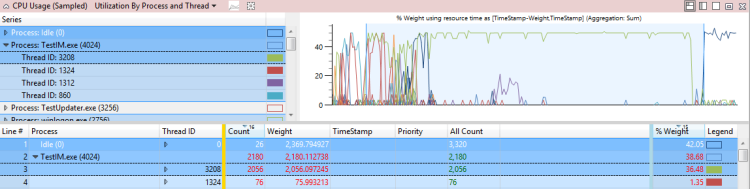

**Figure 37 Thread 3208**

### Investigation

After you discover that direct CPU usage contributes to a delay on the critical path, you must identify the specific modules and functions that contribute to the delay.

**Technique: Review an Assessment-Reported Direct CPU Usage Issue**

You can expand an assessment-reported direct CPU usage issue to display the critical path that is impacted by the direct CPU usage. If you expand the node that is associated with the CPU usage, the stacks that are associated with the CPU usage and associated modules will display. This view is shown in Figure 38 Expanded CPU Usage Segment:

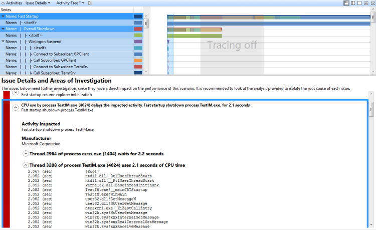

**Figure 38 Expanded CPU Usage Segment**

**Technique: Manually Explore the Stacks of a Direct CPU Usage Issue**

If the assessment did not report an issue, or if you require additional verification, you can use the **CPU Usage (Sampled)** graph to manually collect information on the modules and functions that are involved in a CPU usage issue. To do this, you must zoom to the area of interest and view the stacks that are sorted by CPU Usage.

**Manually Explore the Stacks of a Direct CPU Usage Issue**

1.  On the Trace menu, click Load Symbols.

2.  Zoom the timeline to display only the portion of the critical path that is affected by the CPU issue.

3.  Apply the **Utilization by Process and Thread** preset.

4.  Add the **Stack** column to the display, and then drag this column to the right of **Thread ID** (left of the bar).

5.  Expand the process and thread to display the stack trees.

    The rows in the stack are sorted in descending order by **% Weight of CPU Usage**. This puts the most interesting stacks on top. As you expand the stacks, watch the **% Weight** column to make sure that your focus remains on the rows that have the highest usage.

6.  To extract a copy of the stack, select all the rows, right-click, and click **Copy Selection**.

### Resolution

You can apply remedies at both the configuration and component levels to resolve high CPU usage.

Direct CPU usage has higher impact on computers that have lower-end processors. In these cases, you can add more processing power to the computer. Or, you might be able to remove the problem modules from the critical path or from the system. If you can change the components, consider a redesign effort to achieve one of the following results:

-   Remove the CPU-intensive code from the critical path

-   Use more CPU-efficient algorithms

-   Defer or cache work

### Thread Interference

CPU usage by threads that are not on the critical path (and that might be unrelated to the activity), can cause threads that are on the critical path to be delayed. The thread state model shows that this problem is characterized by threads on the critical path that spend an unusual amount of time in the Ready state.

### Problem Identification

Many assessments use heuristics to identify interference-related problems. These are reported in one of the following two forms:

-   Process *P* is starved. The starvation causes a delay to the impacted activity *A* of *x* ms.

-   Process *P* is preempted. The preemption causes a delay to the impacted activity *A* of *x* ms.

Where *P* is the process, *A* is the activity, and *x* is the time in ms.

The first form reflects interference from threads at the same priority level as the thread on the critical path. The second form reflects interference from threads that are at a higher priority level than the thread on the critical path.

If these types of issues are reported for a delayed activity, thread interference can be the cause. You can use the **CPU Usage (Precise)** graph to manually identify the problem.

**Identify Thread Interference Issues**

1.  Zoom to the interval and apply the **Utilization by CPU** preset. A utilization of 100% across all CPUs indicates an interference issue.

2.  Apply the **Utilization by Process, Thread** preset and sort by the first **Ready (us)** column. (This is the column that includes the **Sum** aggregation.)

3.  Expand the process of the activity that is affected and look at the Ready time for threads on the critical path. This value is the maximum time that the delay can be reduced by resolving any thread Interference issue. A value with a magnitude significant relative to the delay being investigated indicates that a thread interference problem exists.

Figure 39 CPU Utilization is Near 100% and Figure 40 Thread Interference Problem represent this scenario:

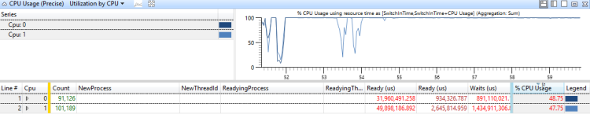

**Figure 39 CPU Utilization is Near 100%**

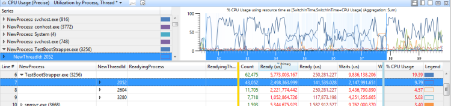

**Figure 40 Thread Interference Problem**

### Investigation

After the issue is identified, you must determine why the affected thread spent so much time in the Ready state.

**Technique: Determine Why a Thread Spent Time in the Ready State**

You can use the **CPU Usage (Precise)** graph to determine why a thread spent time in the Ready state. You must first determine whether the thread is restricted to certain processors. Although you cannot directly obtain this information, you can examine the CPU usage history of a thread during periods of high CPU utilization. This is the period when threads tend to frequently switch between processors.

**Determine a Thread’s Processor Restrictions**

1.  Zoom to the affected region.

2.  Add the **CPU Usage (Precise)** graph and apply the **Utilization by Process, Thread** preset.

3.  Use the **Advanced** dialog to add a **Cpu** column that has a **Unique Count** aggregation mode to the right of **NewThreadId**.

4.  Filter the graph to show only the threads in which you are interested.

    The value in the **Cpu** column reflects the number of processors on which the thread ran during the current time interval. During periods of 100% CPU utilization, this number approximates the number of processors on which this thread is allowed to run. If the value is less than the number of available processors, the thread is probably restricted to certain CPUs.

    Figure 41 Restricted Threads provides an example of this graph:

    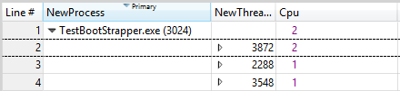

    **Figure 41 Restricted Threads**

After you know a thread’s processor restrictions, you can determine what preempted or starved the thread. To do this, you must identify the intervals that the thread spent in the Ready state and then examine what other threads or processes were running during those intervals.

**Determine what Preempted or Starved the Thread**

1.  Construct a graph that shows when the thread was in the Ready state and apply the **Utilization by Process, Thread** preset.

2.  Open the **View Editor**, click **Advanced**, and select the **Graph Configuration** tab.

3.  Set **Start Time** to **ReadyTime (s)** and set the **Duration** to **Ready (us)**, as shown in Figure 42 Ready Time Columns. Click **OK**.

    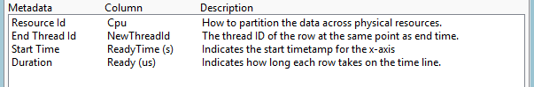

    **Figure 42 Ready Time Columns**

4.  In the **View Editor**, replace the **CPU Usage (%)** column with the **Ready (us) \[Sum\]** column.

5.  Select the thread of interest to produce a graph that is similar to Figure 43 Ready Time Graph:

    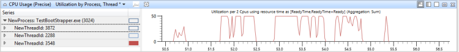

    **Figure 43 Ready Time Graph**

6.  In this case, the thread spent significant time in the Ready state. To determine its typical priority, add an **Average** aggregation to the **NewInPri** column.

    In this case, the thread’s average priority is exactly 8. This number indicates that it is probably a background thread that never receives priority elevations.

7.  After the average priority is known, look at the CPU activity for the CPUs on which the thread is allowed to run.

    In this case, the thread was determined to have affinity for CPU 1 only.

8.  Add another **CPU Usage (Precise)** graph and apply the **Utilization by CPU** preset. Select the relevant CPUs.

9.  Open the **Advanced** view and add a filter for the priority that you found earlier to filter out that thread. This scenario is shown in Figure 44 Thread Filter:

    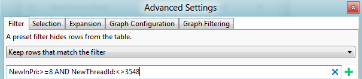

    **Figure 44 Thread Filter**

    In Figure 45 CPU Usage, Ready Time, and Other Thread Activity, the top graph shows the CPU usage of thread 3548. The middle graph shows the time that the thread was ready, and the bottom graph shows activity on the CPUs on which the thread was allowed to run (in this case, Cpu1).

    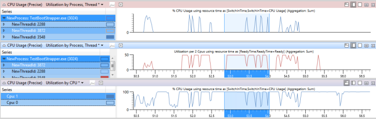

    **Figure 45 CPU Usage, Ready Time, and Other Thread Activity**

10. Zoom into a region where the thread was ready, but did not run, for most of the time during that interval.

11. In the **CPU Usage** graph, add **NewInPri** to the left of the bar and examine the results.

    Threads or processes that have priorities that are equal to the target thread priority show time that the thread was starved. Threads or processes that have higher priority than the target thread priority show time that the thread was preempted. You can calculate the total time that the thread was preempted by adding the times of all preemptive threads and actions.

    Figure 46 Usage by Priority When Target Thread was Ready shows that 730ms of the thread time were preempted, and 300ms of the thread time were starved. (This figure is zoomed to a 1192ms interval.)

    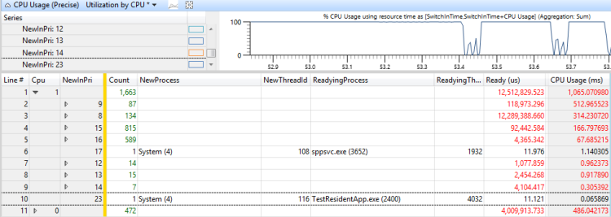

    **Figure 46 Usage by Priority When Target Thread was Ready**

12. To determine which threads are responsible for the preemption and starvation of this thread, add the **NewProcess** column to the right of the **NewInPri** column and review the priority levels at which processes were running. In this case, the preemption and starvation were primarily caused by another thread in the same process and by TestResidentApp.exe. You can assume that these processes receive periodic priority elevations above their base priority.

### Resolution

You can resolve preemption or starvation issues by changing the configuration or components. Consider the following remedies:

-   Remove the problematic processes from the system.

-   Adjust the base priority of the problematic processes…

-   Change the time when the problematic processes run; for example, delay their start time to occur when the computer reboots.

-   If the problem components can be changed, redesign them to be less CPU-intensive or to run at a lower priority.

### DPC/ISR Interference

When excessive processor time is consumed by running DPCs and ISRs, there might not be enough available CPU time left to run threads. This situation can cause similar delays to thread interference. When threads must complete operations at a regular high-frequency rate, such as in video playback or animation, interference by DPCs and ISRs can cause operational problems.

### Problem Identification

Many assessments use heuristics to identify DPC/ISR-related problems. DPC/ISR activity is identified as suspicious when it is reported as an issue in the following form:

DPC *D* exceeds the threshold of *m* milliseconds *x* times during *P*. The *n* instances of this DPC run for a combined total of *t* milliseconds.

Where *D* is the DPC, *m* is the number of milliseconds that sets the threshold, *x* is the number of times that the DPC exceeded the threshold, *P* is the current process, *n* is the number of instances that the DPC ran, and *t* is the total time in milliseconds that the DPC ran over the threshold.

For example, the following issue is reported by an assessment:

**DPC sdbus.sys!SdbusWorkerDpc exceeds the goal of 3.0 milliseconds 153 times during Media Engine Lifetime. The 153 instances of this DPC run for a combined total of 864 milliseconds**

If this issue is reported for an activity that exhibits problem events or delays, DPC/ISR activity might be the cause.

**Manually Identify DPC/ISR Interference**

1.  To manually identify DPC/ISR interference, open a trace in WPA and identify the problem events of interest. These are assessment-specific generic events such as **Microsoft-Windows-Dwm-Core:SCHEDULE\_GLITCH** or **Microsoft-Windows-MediaEngine:DroppedFrame**.

2.  Next to the graph of events, add the **DPC/ISR Duration by CPU** graph. If peaks in the **DPC/ISR Duration by CPU** graph line up with the problem events, DPC/ISRs might be a factor in causing the problems.

3.  For additional data, zoom into the time period that occurs 100ms before several problem events display. If significant DPC/ISR activity displays on one or more processors in the 100ms region before the problem events occurred, you can conclude that the problem events were caused by the DPC/IRS activity.

4.  To determine whether DPC/ISR interference is causing delays, zoom to a region that shows a running thread. Make a note of the CPU or CPUs on which this thread is running.

5.  In the DPC/ISR graph, apply the **DPC/ISR Duration by CPU** preset and view the DPC/ISR activity on the relevant CPUs in that time range.

Figure 47 Problem Events and DPC/ISR Activity shows that thread 864 of iexplore.exe is relevant to the affected activity. Thread 864 is in the Running state on CPU2 for 10.65% of the time range in view. However, the DPC/ISR graph shows that CPU2 was busy executing DPC/ISRs for 10% of that time.

**Note**  
Most DPC/ISRs do not have as high an impact as that shown in this example.

 

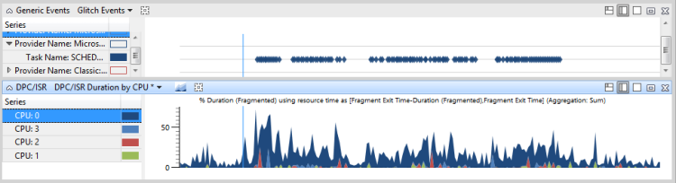

**Figure 47 Problem Events and DPC/ISR Activity**

In Figure 48 DPC/ISR Unrelated to Problem Events, DPC/ISRs are shown to not be related to performance problems:

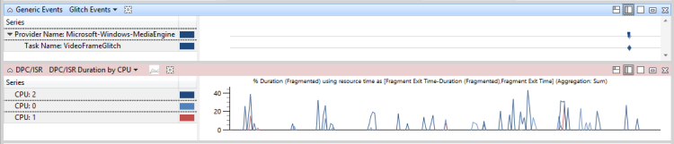

**Figure 48 DPC/ISR Unrelated to Problem Events**

In Figure 49 Delay caused by DPC/ISR Interference, DPC/ISRs are shown to cause performance problems:

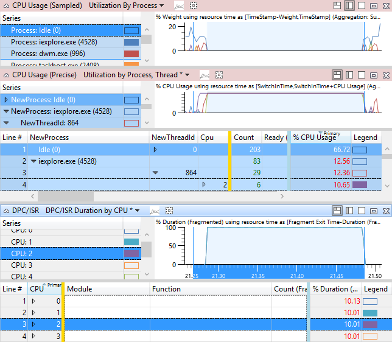

**Figure 49 Delay caused by DPC/ISR Interference**

### Investigation

After you determine that DPCs/ISRs are related to problems or delays, you must determine which specific DPCs/ISRs are involved and why they occur frequently or of run for an excessive length of time.

**Technique: Review an Assessment-Reported DPC/ISR Issue**

In assessment-reported DPC/ISR issues, you can expand the issue that displays the major processes that are preempted by the DPC or ISR. Expand the stack to view the DPC activity for the process that is most related to the impacted activity, as shown in, expand the stack to understand what the DPC was doing. Figure 50 Expanded DPC Stack shows the expanded stack:

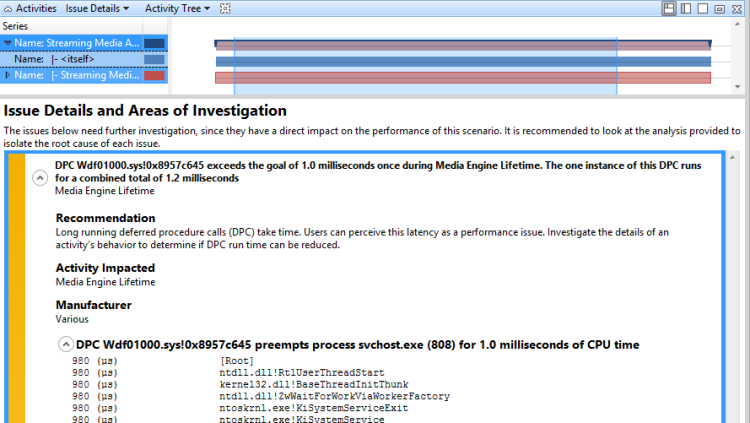

**Figure 50 Expanded DPC Stack**

**Technique: Find the Highest Duration DPCs/ISRs and Review the Stacks**

If an assessment does not report the DPC/ISR to be an issue, you can use the **DPC/ISR** and **CPU Usage (Sampled)** graphs to get stack information for the most relevant DPCs. We recommend that you find a DPC/ISR of interest, note its module and function, and then find the samples in the **CPU Usage (Sampled)** graph to get complete stack information.

**Find the Highest Duration DPCs/ISRs and Review the Stacks**

1.  Zoom to the interval of interest.

2.  In the DPC/ISR graph, select the preset **DPC/ISR Duration by Module, Function**.

    If symbols are loaded, DPC/ISR events are sorted by total duration and are then broken down by Module and Function. The top rows in the list contain the DPC/ISR events that probably caused the event problems. Make a note of the module and function names.

3.  In the **CPU Usage (Sampled)** graph, select the **Utilization by Process** preset. By default, this preset hides DPC/ISR activity.

4.  Open the **View Editor**, and click **Advanced**.

5.  On the **Filter** tab, change the **Hide rows that match the filter** setting to **Keep rows that match the filter**. This will enable DPC/ISR activities to be display.

6.  Remove the **Process** column and add the **Stack** column to view DPCs/ISRs sorted by stack.

7.  Clear the current row selection.

8.  Right-click a cell in the **Stack** column and then click **Find in this column**.

9.  Enter a module and function that you noted in Step 2 of this procedure.

10. Check **Add to current selection**, and click **Find All** to select all instances of the function.

11. After all the rows are selected, right-click and click **Butterfly/View Callees**.

This view shows the activities of this particular function, sorted by total duration. The view is similar to a stacks display in the detailed view of an assessment-reported issue. The **Weight** column approximates the inclusive time that is spent by each function on the stack, in milliseconds.

This view is shown in Figure 51 Callees of a DPC Sorted by Approximate Duration:

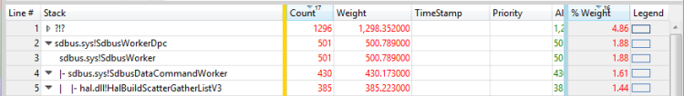

**Figure 51 Callees of a DPC Sorted by Approximate Duration**

**Technique: Review Long-Running DPCs/ISRs**

The total duration of DPCs/ISRs is important, but long-running individual DPCs/ISRs are more likely to cause delays. In the DPC/ISR graph, the **Inclusive Duration (ms)** column, sorted in descending order, displays the maximum durations of individual DPC/ISRs. The preset **Long DPCs/ISRs** that is available in some assessment profiles lets you filter this view to display only DPCs/ISRs that have an inclusive duration that is greater than 1ms.

**Note**  
If this preset is not available, you can open the **View Editor**, **Advanced** section, to add a filter.

 

### Resolution

DPC/ISR activity often reflects a hardware or software problem that must be corrected at the hardware or component level. At a configuration level, you can replace the hardware or upgrade the related driver to a fixed version. At a component level, hardware and drivers should follow best practices for DPCs/ISRs from MSDN, and should use threaded DPCs when possible. Threaded DPCs do not run at the dispatch level on client editions of Windows. For more information about best practices for DPCs/ISRs, see Guidelines on ISR and DPC behavior and Introduction to Threaded DPCs.

## Related topics


[Introduction to Threaded DPCs](http://go.microsoft.com/fwlink/?LinkId=254752)

[ISRs and DPCs, The Silent Killers](http://go.microsoft.com/fwlink/?LinkId=254751)

[Loading Symbols](loading-symbols.md)

[Power Management and ACPI - Architecture and Driver Support](http://go.microsoft.com/fwlink/?LinkId=263460)

[PPM in Windows Vista and Windows Server 2008](http://go.microsoft.com/fwlink/?LinkId=254745)

[Scheduling Priorities](http://go.microsoft.com/fwlink/?LinkId=254748)

[Scheduling, Thread Context, and IRQL](http://go.microsoft.com/fwlink/?LinkId=254750)

[Windows Internals, Sixth Edition](https://www.microsoft.com/learning/book.aspx?ID=12069)

[Windows Performance Analyzer](windows-performance-analyzer.md)

[Windows Performance Toolkit Technical Reference](windows-performance-toolkit-technical-reference.md)

 

 


