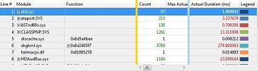

# Data Tables

In many cases, a graph is the best way to view system activity to analyze performance. However, in some cases, a tabular view is preferable. When you drag a graph onto the **Analysis** tab, it appears by itself. To view the same data in tabular form with the graph shrunk to a thumbnail, click the right-most layout icon on the graph title bar. If you want to see the data table and the graph at full size, click the left-most layout icon on the graph title bar.

The following illustration shows a WPA data table.

If you do not see the vertical gold bar when you first open a data table, scroll to the right.

The Legend column on the right of the table corresponds to the **Legend** control to the left of the associated graph. If you select one or more items in the **Legend** control, the corresponding rows of the table are selected, and vice versa.

The data table and the associated graph are dynamically synchronized. If you make changes to the data table, the graph reflects these changes. If you expand or collapse a node in the graph **Legend** control, it is also expanded or collapsed in the data table, and vice versa. If you zoom in to a time interval on the graph, the table shows only data pertaining to the selected time interval.

For information on making changes to a data table, see [Customize a Data Table](customize-a-data-table.md) and [Apply, Create, or Delete a Preset Combination of Columns to Display](apply-create-or-delete-a-preset-combination-of-columns-to-display.md).

For information on searching and filtering data, see [Search or Filter Data](search-or-filter-data.md).

## Data Table Layout

The left-most column is always the line-number column, and the right-most column is always the Legend column, which corresponds to the **Legend** control of the corresponding graph. Between these two outside columns are the following areas, from left to right:

-   Key area

-   Data area

-   Graphing element area

### Key Area

This is the area on the left side of the table, between the line-number column and the vertical gold bar.

Drag any column in the data area to the left of the vertical gold bar to make it a key.

### Data Area

This is the area in the center of the table, between the vertical gold bar and the vertical blue bar.

The data for columns that appear in the data area is neither grouped nor graphed. Cells in these columns are aggregated (if an aggregation for the column has been specified) when they are to the right of a group. Cells in these columns show the data for individual rows of the table that cannot be expanded.

### Graphing Element Area

This is the area on the right side of the table, between the vertical blue bar and the Legend column. If you drag a column to this area, the data in that column generates lines or bars on the graph.

If the graph is a Gantt chart, each column that you move to the graphing elements area must contain only timestamp values. A mark in one of the horizontal bars in the Gantt chart represents one timestamp value.

## Related topics

[WPA Features](wpa-features.md)

 

 

