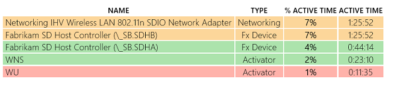
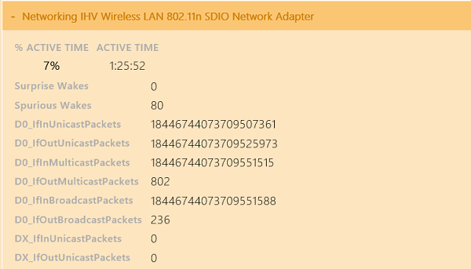

# Exercise 1 - Identify Problems with Spurious Wakes

Devices should avoid unexpectedly waking up the SoC through interrupts (for example, interrupt storms, bad debouncing, etc.). Waking up the SoC causes the system to exit **DRIPS**, increases the average power floor and reduces battery life. This is known as a spurious wake.

The analysis process related to spurious wakes is fairly straightforward.

1.  Download the pre-generated **sleepstudy-report\_1.html** report [here](http://download.microsoft.com/download/2/6/6/2662D67D-58CC-4823-8812-AD215DD9778F/sleepstudy-report_1.mdl).

2.  Open **sleepstudy-report\_1.html** with your favorite browser.

3.  Click on **Session 2**. The system consumes 1.818 Watts of energy during 19 hours and the **DRIPS %** is 92%.

    

4.  Look at the **Top Offenders** table. The networking wireless device is listed as active 7% of the time during the session.

    

5.  Click on the networking device row to obtain details about this offender.

    

Spurious wakes are clearly identified by the report. There are 80 of them in this example. A follow-up discussion should happen with the IHV to determine why the wireless adapter is waking up the SoC unexpectedly. The underlying problem could be a bad device firmware implementation.

 

 

