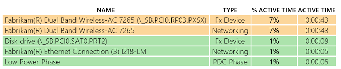

# Exercise 3 - Identify Problems with Missing Constraints

The SoC power state is the sum of the states of all the devices.

Windows keeps a list of devices and their states that are critical to reach low power – they are called constraints. Windows will wait for all constraints to be met before engaging resiliency and entering **DRIPS**. The constraints are specified by an OEM and the SoC vendor through the ACPI firmware.

The ACPI firmware must be modified if an OEM changes the SoC vendor reference design and constraints must reflect those changes accurately.

Missing constraints, or having too many constraints, can cause a variety of problems that increase power drain during standby.

1.  Download the pre-generated **sleepstudy-report\_2.html** report [here](http://download.microsoft.com/download/3/2/E/32E8B553-47F6-4E2A-9109-C6D678FE0EE8/sleepstudy-report_2.mdl).

2.  Open **sleepstudy-report\_2.html** with your favorite browser.

3.  Click on **Session 12**.

    -   The system consumes 1.307 Watts of energy during 11 minutes

    -   The **DRIPS %** is 92%.

    -   The hardware **DRIPS %** is 19%.

    

4.  Look at the **Top Offenders** table

    -   The wireless networking device is listed as active only 7% of the time during the session.

    -   This problem can’t account for the 19% HW **DRIPS** rate.

    

Large discrepancies between software **DRIPS %** (for example, 92%) and hardware **DRIPS %** (for example, 19%) is usually symptomatic of a missing constraint in the ACPI firmware.

Simply stated, Windows assumes the system is ready to enter **DRIPS**, but some hardware component is still active and prevents the SoC package from entering S0 low power idle.

The next logical step is to try to isolate and identify which hardware component is still in D0 and consuming power by using either a power instrumented platform or your silicon partner debugging tools.

**Note**  
The missing constraint issue surfaced by the software and hardware **DRIPS** discrepancy is different than the Wireless device 7% active time problem shown in the top offenders table. This issue should be investigated separately.

 

 

 

