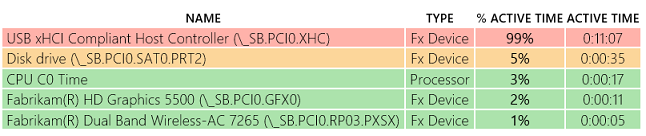
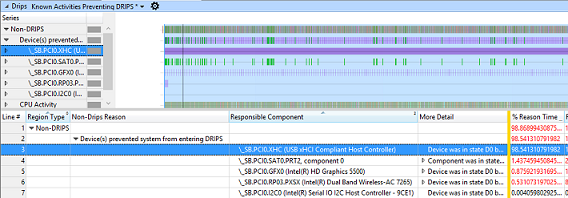
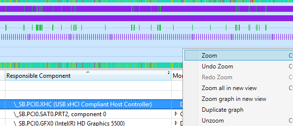
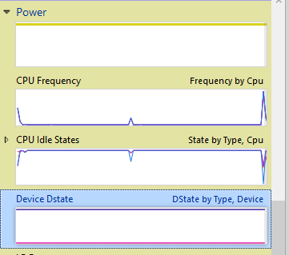
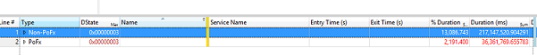
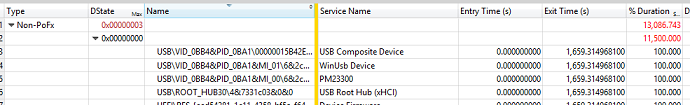

# Exercise 4 - Identify Problems with USB Devices

The USB host controllers can power down only after all of the devices connected to them have entered a low power state. This means that USB devices must support selective suspend on Modern Standby devices to ensure that the SoC can enter **DRIPS** while the screen is off.

## Part 1: Use a SleepStudy report to identify problems

1.  Download the pre-generated **sleepstudy-report\_2.html** report [here](http://download.microsoft.com/download/3/2/E/32E8B553-47F6-4E2A-9109-C6D678FE0EE8/sleepstudy-report_2.mdl).

2.  Open **sleepstudy-report\_2.html** with your favorite browser.

    -   Notice that the system is able to consume as little as 120 mW during Standby (e.g. see Standby Session 6).

    

3.  Click on **Session 10**. The system consumes 2.83 Watts of energy during 11 minutes and the **DRIPS %** is 0.

    

4.  Look at the **Top Offenders** table.

    1.  The USB host controller (**\_SB.PCI0.XHC**) is active for 99% of the session duration.

    2.  XHC is the USB 3.0 host controller.

When the USB bus controller is active for minutes at a time in Modern Standby, it usually means that one USB device attached to the bus is not entering selective suspend, possibly because it doesn’t support selective suspend. The next logical step is to determine which USB device is staying in D0 by looking at an ETL trace.

For more information on selective suspend, see the [USB Selective Suspend](https://msdn.microsoft.com/library/windows/hardware/ff540144) topic on MSDN.

## Part 2: Use an ETL trace to identify problems

In order to further the USB investigation, an ETL trace was captured on the same system where the **SleepStudy** was generated.

To investigate USB issues, you’ll use the **DState** graph and table.

1.  Download the pre-generated **USBProblem.etl** trace [here](http://download.microsoft.com/download/5/1/C/51CB1607-D3A8-455B-828A-244A56B06791/USBProblem.etl).

2.  Open **USBProblem.etl** with **WPA**.

3.  Drag and drop the **DRIPS** graph in the **analysis** tab.

4.  Look at the **Non-Drips Reasons**, and find the USB xHCI Host controller as a device preventing the system from entering **DRIPS**.

    -   You can see that the device is active for 98% of the trace (as shown in the **% Reason time** column).

        

5.  Zoom in the region where the USB xHCI Host controller is active.

    1.  Select the device in the table.

    2.  Right-click on the light blue interval in the graph, and select zoom.

    3.  The **% Reason time** should now be 100%.

    

6.  Find the **Device Dstate** graph under the **Power** category of the **Graph Explorer**.

    

7.  Drag and drop the **Device Dstate** graph in the **analysis** tab.

    -   The **Device DState** graph shows the effective D-States of devices over time. You can use the data to determine if a specific device enters the appropriate D-state while the system is in Modern Standby.

        -   **PoFx type**: Used for devices managed by the Windows Power Management Framework.

        -   **Non-PoFx type**: Used for USB-attached devices.

8.  Move the **DState** column right next to the **Type** column. Your viewport should look like this:

    

9.  Expand the **Non-PoFX** category.

10. Expand the **Dstate** row with the 0x0 value (D0 state, or active).

11. Sort by the **Name** column and find the USB devices.

    

The data in the D-state table shows that, while the system was in standby, a USB composite device was still in state D0 for 100% of the time. The hardware id of the composite device is USB\\VID\_0BB4&PID\_0BA1\\00000015B42EE80F0000000000000000. This is the device that was preventing the XHCI controller from powering down.

If the device is managed by a driver authored by Microsoft, please report the issue to Microsoft. If not, then this information must be reported to the hardware vendor who owns the driver to find a solution and ensure that the device enters selective suspend.

 

 

