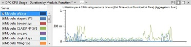
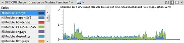
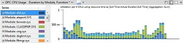
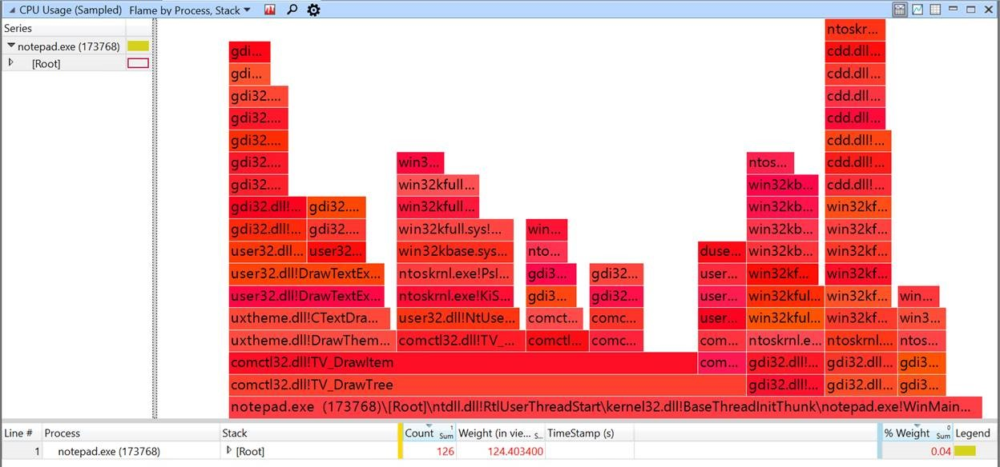
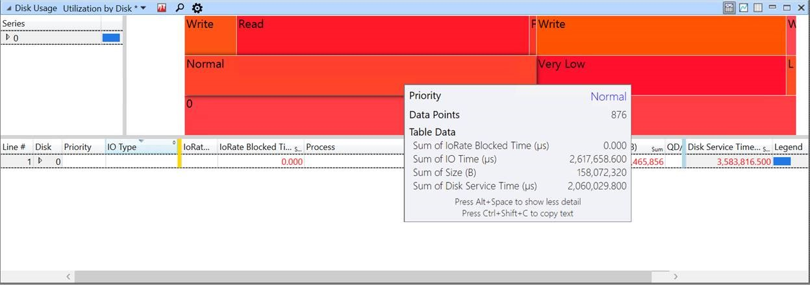
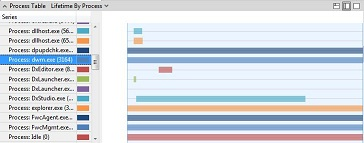
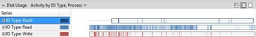
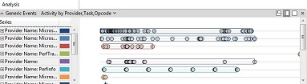

# Graphs

Windows Performance Analyzer (WPA) provides the following types of graphs:

-   [Line graphs](#line_stacked_bar)
-   [Stacked-line graphs](#line_stacked_bar)
-   [Stacked-bar graphs](#line_stacked_bar)
-   [Flame graphs](#flame_graphs)
-   [Lifetime graphs](#lifetime_graphs)
-   [Activity type graphs](#activity_type_graphs)
-   Sequential resource trails
-   [Generic events graphs](#generic_events_graphs)

## Line, Stacked-Line, and Stacked-Bar Graphs

When you drag a line, stacked-line, or stacked-bar graph from the **Graph Explorer** window to the **Analysis** tab, it appears as a line graph, as shown in the following illustration

To change the appearance of the graph, click the right-most drop-down arrow on the graph title bar and select either **Stacked Lines** or **Stacked Bars**.

The following illustration shows the same graph as a stacked-line graph.

The following illustration shows the same graph as a stacked-bar graph.

You can specify from 4 to 100 intervals for a stacked-bar graph.

## Flame graphs

*Flame graph* is a graphing mode that allows you to quickly compare data values from the table. The width of each *flame group* is determined by its weight value in the view. For example, with CPU stacks, the weight of each frame is displayed by its width. This mode is best when you have filtered data to a specific set.

To switch to flame graph, make sure the table is configured with columns to the left of the gold bar and a single numeric column to the right of the blue bar with SUM aggregation, and then select **Flame** from the graph menu at the top of the graph. Alternatively, use the built-in **Flame by Process, Stack** preset in **CPU Usage (Sampled)** graph.

 

The following illustration is an example of CPU Sampled and the stacks filtered down to Notepad.exe. In the graph, **comctl32.dll!TV_DrawTree** is the largest frame in the current filtered view. From here, you can walk the stack to find where the most amount of work is performed.

The names of the flame groups are displayed when the text has a minimum height to be readable. To display a tooltip with the data, hover the mouse pointer over an item in the flame graph. To select the correspond data in the table, click a flame group to expand it in the table, or to filter it in-table, right-click and then click **Filter To Flame** in the data view. 

Flame graphs can be configured with any order of grouping columns to the left of the Gold Bar. The following illustration shows grouping of disk usage and disk service time. The tooltip for **Normal**, shows the name and values of the flame group under the mouse pointer.

## Lifetime Graphs

Lifetime graphs show individual categories, such as processes, as horizontal bars that define the lifetime of the category.

The following illustration shows a process lifetime graph.

## Activity Type Graphs

Activity type graphs use horizontal bars to show types of activity. On each bar, the time of the activity is shaded. If you zoom in to sufficient detail on this type of graph, you can see, for example, how long each disk read or write took.

The following illustration shows input and output by type.

## Generic Events Graphs

Generic event graphs show all Crimson events in the recording.

The following illustration is an example of a generic events graph.

## Related topics

[WPA Features](wpa-features.md)

 

 

