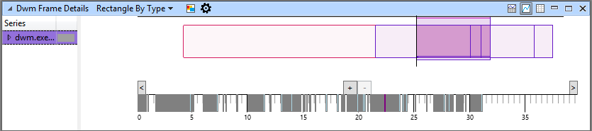
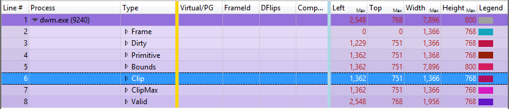

# How to Use the Rectangle Viewer

In Windows Performance Analyzer (WPA), you use the rectangle viewer to see what happened on the screen during the trace for a specific point in time.

The rectangle viewer also provides the following benefits:

-   Look at one point in time (or a frame), as opposed to plotting values over time
-   Filter out certain rows so they won’t be graphed. So, if you only want to see unfiltered frames ("dirty frames"), you can filter down to that and see just that.
-   View the selection as it moves through the graphs ("scrubs through time")

**Note**  By default, this feature is in the DWM Frame Details and the HTML Frame Details graphs as a pair of presets. The points in time (frames in this case) display on the timeline.

 

**To use the rectangle viewer**

1.  Click **&gt;** in the lower left corner of the graph (near the origin, 0,0, of the graph) to move forward in time, or hold it down to move through time.

    

2.  Zoom in or out by left-clicking and holding from left to right until you capture the frame you want to view then left-click the selected rectangle area (highlighted in blue) and click **Zoom**.

    When you select an area using the rectangle viewer, you can hover over it to view a tooltip that specifies information dependent on the table. For example, in the DWM Frame Details graph, the tooltip would display the duration, and start and end times (in seconds) of the selected area of the trace.

## Gold bar indicator of the rectangle viewer

In the following example, you can see the rectangle dimensions to the right of the gold bar (plus the frame start/stop defined in the graph configuration).

If you filter out specific rows, WPA will not graph them. So, if you want to only see unfiltered frames ("dirty frames"), you can filter down to the unfiltered frames. This feature works with other graphs in your tab, allowing you to see your selection propagated throughout the graphs, but also see the time selection move as you scrub through time.

## Related topics

[Zoom In on a Time Interval](zoom-in-on-a-time-interval.md)

 

 

