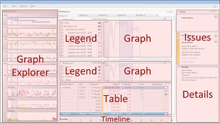

# Introduction to the WPA User Interface

The Windows Performance Analyzer (WPA) user interface (UI) consists of a collection of docked windows that surround a central workspace. This central workspace contains **Analysis** tabs. All windows can be undocked or moved and docked in a different location. To open a closed window, select the window on the **Window** menu.

The following illustration shows the WPA UI. The Diagnostic Console window is not shown.

## Graph Explorer Window

When you open a recording in WPA, thumbnails of all the graphs that apply to that recording appear in the Graph Explorer window, grouped under several nodes. To expand a node, click the small triangle next to the node name.

To see the full graph, drag the graph to the **Analysis** tab. You can drag multiple graphs to the **Analysis** tab.

For more information, see [Graph Explorer](graph-explorer.md).

## Analysis Tab

When you drag a graph from the Graph Explorer window to the **Analysis** tab, the graph appears together with a **Legend** control on the left. The **Legend** control explains the meaning of the lines or bars in the graph. If you want to see the same data in tabular form, click the right-most layout icon on the graph title bar. This opens the associated data table and reduces the graph to a thumbnail. If you want to see both the full-size graph and the data table, click the left-most layout icon.

You can use the right drop-down arrow on the graph title bar to change from a line graph to a stacked-line graph or a stacked-bar graph.

You can use the left drop-down arrow on the graph title bar to select different parameters for the graph, if more parameters are available. For example, you can view CPU usage by process, by CPU, or by process and thread.

All graphs on the **Analysis** tab share a single timeline. To view graphs that have a different timeline, open another **Analysis** tab by selecting **New Analysis View** on the **Window** menu.

For more information, see [Analysis Tab](analysis-tab.md).

## Analysis Assistant Window

When you select a specific graph or data table, information about that specific graph and table displays in the Analysis Assistant. Use this as a guide during your analysis.

For more information, see [Analysis Assistant](analysis-assistant.md).

## Issues Window

If you created the recording in the Assessment Platform, the Issues window lists issues that the assessment identifies. This window is docked on the upper-right corner. If you did not create the recording in the Assessment Platform, this window is minimized because there is no data.

When you click an issue in this window, details for that issue appear in the Details window. All identified issues appear on the **Analysis** tab below any graphs that you have opened.

For more information, see [Issues Window](issues-window.md).

## Details Window

If you created the recording in the Assessment Platform, the Details window appears below the Issues window in the lower-right corner of the workspace. The Details window provides details about the selected issue and recommended solutions.

For more information, see [Details Window](details-window.md).

## Diagnostic Console Window

The Diagnostic Console window is docked at the bottom of the workspace. This window provides a list of exceptions in the recording and details related to symbol loading and decoding.

For more information, see [Diagnostic Console Window](diagnostic-console.md).

## Classic Menu and Rich Menu

By default, WPA uses the Classic menu when you open a recording. Like most applications, the Classic Menu displays menus (File, Trace, etc.) at the top. If you prefer a more compact, intuitive, and modern UI, you can use the Rich Menu. The Rich Menu:

-   Pulls together the old menus from the Classic Menu
-   Features shortcuts to menus you frequently use, such as Open, Apply Profile, Load Symbols, etc.
-   Uses only one menu (File) as the entry point to all of the menu options

For more information on the differences between the Classic Menu and Rich Text menu and how to switch back-and-forth between them, see [Classic versus Rich Menu](classic-versus-rich-menu.md).

## Related topics

[WPA Quick Start Guide](wpa-quick-start-guide.md)

 

 

