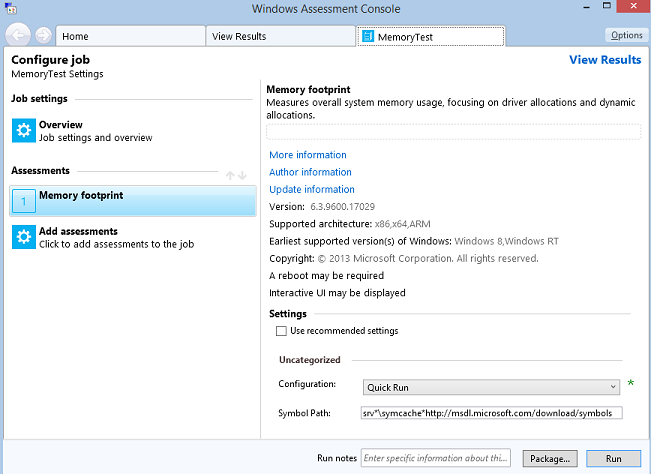
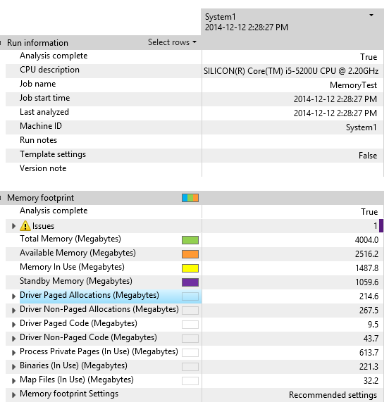
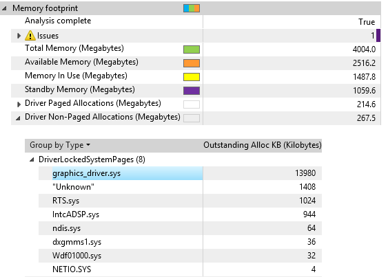
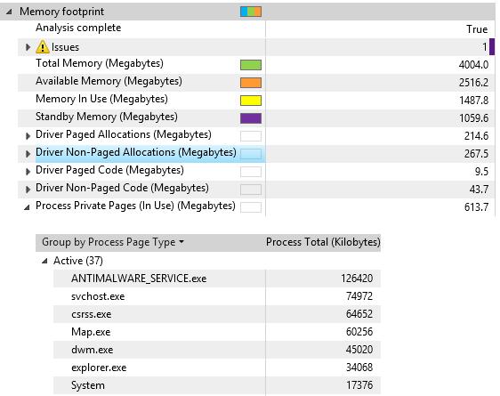
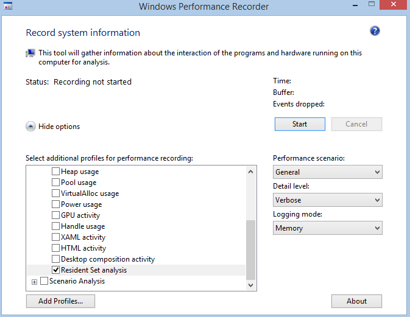
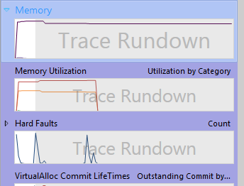
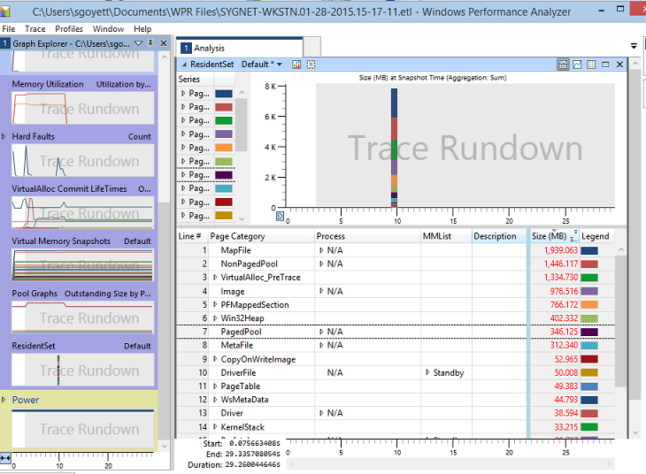
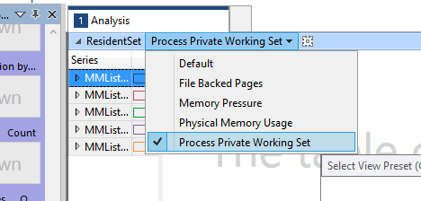
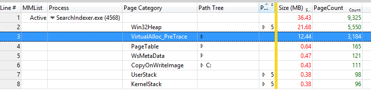

# Exercise 1 - Identify Processes with Large Working Sets

The methodology used to analyze the data can take several approaches and differs based on the circumstances under which the investigation was started. This exercise discusses and presents some example methodologies along with the different views presented by various column arrangements.

The data referred to as the Resident Set is the set of pages that currently reside in physical memory (RAM). The Resident Set is a snapshot of the current memory state at the end of a trace capture with **Windows Performance Recorder (WPR)** or the Assessment Toolkit Memory assessment. It is not possible to collect multiple snapshots in a single trace.

Resident Sets provide a holistic and instantaneous snapshot of the memory composition on the system. Investigations into Resident Set analysis are typically done for the following reasons:

-   To understand physical memory usage, especially when physical memory usage is higher than expected.

-   To understand the sources of process private working set, especially when the process private working set is larger than expected.

-   System responsiveness issues due to paging activity.

## Step 1: Collect data using the Assessment Toolkit

The **Windows Assessment Toolkit** contains a test to measure the memory footprint after boot. You can use the **Memory Footprint** assessment results to gather a baseline of the image software preload. Many processes and services are always in use and take up memory. This assessment helps you to see how drivers and applications (that always run) impact the boot process.

1.  Open **Windows Assessment Console (WAC)** from the **Start** menu.

2.  Open the **Options** menu and select **New Job…**

    1.  Enter **MemoryTest** as the job name.

    2.  Select **Create a custom job.**

3.  Click on **Add Assessments.**

    -   Add the **Memory Footprint** assessment by clicking on the “+” symbol

4.  Click on the newly added **Memory Footprint** assessment to enter the test configuration.

5.  Unselect **Use recommended settings** and select **Quick Run** for the configuration.

    -   **Quick Run** allows the test to complete in a shorter amount of time at the expense of data accuracy.

    

6.  With **Quick Run** selected, you have two options:

    1.  **Package** the job in order to create a folder that has all the test resources and copy it to another test system. (Click on the **Package…** button in the bottom right corner to choose this option.)

    2.  **Run** the job directly on the system. (Click on the **Run** button in the bottom right corner to choose this option.)

        -   This restarts the system to gather a trace.

        -   This test can take some 15-20 minutes to complete.

    We want the **Run** option.

## Step 2: Visualize the Memory Footprint assessment results using WAC

Once the assessment is done, you can open the results XML file that contains a summary of the memory usage on the system.

### Step 2.1: Open the memory report

1.  In **WAC**, open the **Options** menu and select **Open Results…**

    -   You can also press **CTRL+R** on the keyboard.

2.  Click on the **Browse…** button.

3.  Navigate to the folder where you stored the assessment you created in Step 1.

4.  Open the assessment you created in Step 1.

    The report contains different categories to help you understand the driver and process contributions to the overall memory footprint.

    The report should look something like this.

    

5.  Take the time to familiarize yourself with the report by looking at the **Driver** and **Process Private Pages** categories.

In the preceding example, 1487 MB of memory is used out of 4 GB of physical RAM.

-   Memory In Use = Process working sets + non-paged memory + modified pages

-   Available memory = Standby memory + free memory

In the preceding example, the biggest consumers of memory usage are driver allocations with 267 MB for non-paged, and 613 MB for process private pages (private working sets).

For more information about the metrics, see the [Results for the Memory Footprint Assessment](https://go.microsoft.com/fwlink/?linkid=619204) topic on MSDN.

### Step 2.2: Review driver non-paged allocations

This metric is similar to the paged allocations except that these allocations use physical memory that cannot be paged out. This reflects physical memory that is pinned and therefore unavailable for paged memory or use by other processes and services. Acquiring too much non-paged memory reduces the amount of memory that backed memory can use.

1.  Expand the **Driver Non-Paged Allocations** category by clicking on the arrow on the left.

2.  Expand the **DriverLockedSystemPages** category.

    -   This is memory loaded in from paged memory and then locked by the driver until it is no longer useful.

3.  Identify the driver with the biggest memory usage.

    

You can influence this metric by swapping out hardware or software drivers that have lower memory requirements.

The driver vendor has the most influence over this metric by the way the driver is designed. Look for large memory allocations in the results presented in **WAC**. In addition, the driver vendors can be given performance traces (stored in the same directory as the assessment results and can be analyzed with **WPA**) of this assessment to find areas of heavy memory allocation that are candidates for investigations into reducing memory use.

### Step 2.3: Review process private working sets

The largest users of the overall memory footprint are apps that may always be running in the background without the user’s knowledge. To view the amount of memory that processes use, you can use the **Process Private Pages** category in the report.

1.  Expand the **Process Private Pages** category by clicking on the arrow on the left.

2.  Expand the **Active** category. The list shows the binaries and their usage of active memory.

    Your view should look something like this:

    

3.  Identify the process that uses the most memory.

You can influence this metric by reducing the number of “run always” applications, which are applications in the **Run** registry key or **Startup** folder. Analyze the impact of added apps.

Driver and software vendors have the most influence over this metric by the way their code is designed. Look for large memory allocations in the results presented in the **WAC**. In addition, software vendors can be given performance traces (stored in the same directory as the assessment results) of this assessment to find areas of heavy memory allocations that are candidates for investigations into reducing memory use. Careful analyses of allocations, even small ones, can help the developer to find allocations that add up.

## Step 3: Collect Resident Set data using WPR

In steps 1 and 2, you learned how to gather memory traces using the **Assessment Toolkit Memory Footprint** assessment. This assessment can solely capture a trace for the boot scenario. You can capture traces for any scenario (app launch, web browsing, etc.) using the **Windows Performance Recorder (WPR)**

Follow these steps to gather a trace with Resident Set data.

1.  Open **Windows Performance Recorder** from the **Start** menu.

2.  Select the **"First Level Triage"** and **"Resident Set analysis"** recording profiles, but keep the default values for the other options.

3.  Click **Start** and wait a few seconds.

    

4.  Click **Save** and save the **ETL** trace to disk.

You now have a snapshot of the system memory composition.

## Step 4: Interpret Resident Set data using WPA

Follow this procedure:

1.  Launch **Windows Performance Analyzer** from the **Start** menu.

2.  Open the **ETL** trace you just gathered (**File** menu, **Open…**).

3.  Expand the **Memory** set in the **Graph Explorer**.

    

4.  Drag and drop the **Resident Set** graph into the Analysis tab.

Your view should look something like this:

Review how the data is presented. Here are some definitions of the most helpful columns to perform top level analysis:

<table>
<colgroup>
<col width="50%" />
<col width="50%" />
</colgroup>
<thead>
<tr class="header">
<th>Column</th>
<th>Definition</th>
</tr>
</thead>
<tbody>
<tr class="odd">
<td><strong>MMList</strong></td>
<td>
The memory management list that contains the pages.

<ul>
<li>
<strong>Active</strong> – Pages currently within a process private working set or kernel working set.
</li>
<li>
<strong>Standby</strong> – Unmodified pages on the standby list. They are part of the available memory.
</li>
<li>
<strong>Modified</strong> – Process private or file backed pages that were modified since last being persisted to permanent storage.
</li>
<li>
<strong>ModifiedNoWrite</strong> – Pages that were modified but will not be persisted to permanent storage.
</li>
<li>
<strong>Transition</strong> – Pages in transition between lists.
</li>
</ul></td>
</tr>
<tr class="even">
<td><strong>Process</strong></td>
<td>
The name of the process that is the owner of the pages. This information is available only for process private pages. Even if they are not shared, all shareable pages are associated with the “Unknown” (-1) process.
</td>
</tr>
<tr class="odd">
<td><strong>Description</strong></td>
<td>
The value represented varies depending on the page category. For example:

<ul>
<li>
For images, drivers, files, etc, it displays the full file path and name.
</li>
<li>
For <strong>Pool</strong> memory, it shows the driver pool tag name.
</li>
</ul></td>
</tr>
<tr class="even">
<td><strong>Page Category</strong></td>
<td>
The type of data contained within the page as defined below. Some of the possible categories are:

<ul>
<li>
<strong>CopyOnWriteImage</strong> – Process private pages created by the patching of an executable images import address table or rebasing of an executable.
</li>
<li>
<strong>Driver</strong> – Code pages for a driver.
</li>
<li>
<strong>DriverFile</strong> – Code pages that were read from the driver executable and mapped as data.
</li>
<li>
<strong>DriverLockedSystemPage</strong> – Kernel mode pages that are locked or pinned in memory, typically by drivers or the kernel.
</li>
<li>
<strong>Image</strong> – Pages from .dll and .exe files loaded as executable images.
</li>
<li>
<strong>MapFile</strong> – Pages of data files or images loaded as data.
</li>
<li>
<strong>NonPagedPool</strong> – Pages that contain data for the non-pageable system pool.
</li>
<li>
<strong>PagedPool</strong> – Pages that contain data for the pageable system pool.
</li>
<li>
<strong>PFMappedSection</strong> – Pages of memory-mapped sections backed by the page file.
</li>
<li>
<strong>SystemPage</strong> – Pages that contain system page table entries used to map system pages such as I/O space, kernel stacks, and memory descriptor lists.
</li>
<li>
<strong>UserStack</strong> – Pages that contain the user mode data for each thread.
</li>
<li>
<strong>VirtualAlloc</strong> – Pages allocated by the VirtualAlloc APIs.
</li>
<li>
<strong>Win32Heap</strong> – Heap pages.
</li>
</ul></td>
</tr>
<tr class="odd">
<td><strong>Size (MB)</strong></td>
<td>
The total size of the pages aggregated in each category.
</td>
</tr>
</tbody>
</table>

 

## Step 6: Identify process working sets that impact the memory footprint

Resident Set data can be displayed in many different ways based on the column arrangements in the summary table. The summary table has several pre-defined column arrangements that you can use as starting points for an investigation.

1.  Select the **Process Private Working Set** preset.

    

2.  Expand the **Active MMList** group.

    1.  Focus on the **Active** category as it is what’s currently impacting memory usage.

    2.  **Standby** pages could be freed under memory pressure.

    3.  **Modified** pages could be written to disk and freed.

3.  Sort by size by clicking on the **Size (MB)** column header.

4.  Identify the processes with the largest usage. You might see **N/A** and **“Unknown (-1)”** as process names.

    -   **N/A** contains pages not associated to any processes such as driver pool memory.

    -   **“Unknown (-1)”** contains shareable pages.

5.  Expand the processes to look at **Page Category**.

    1.  You can now see the composition of the process working set in the following figure.

    2.  Top categories should be VirtualAlloc or Win32Heap, which we’ll analyze in Exercise 2.

    3.  In the example below, **SearchIndexer.exe** uses 21.7 MB of active memory through **Heap** allocations, and 12.4 MB through **VirtualAlloc** API calls.

    

Focus on 3rd-party processes and determine if they need to be launched on boot as part of the preloaded software. As a developer, you should analyze the dynamic allocations your process is making to understand where optimizations can be made.

 

 

