# Exercise 2 - Track User Mode Process Allocations


**Heap** allocations are made directly via **Heap** APIs (**HeapAlloc**, **HeapRealloc**, and C/C++ allocations such as **new**, **alloc**, **realloc**, **calloc**) and are serviced using three types of heaps:

1.  **Mainline NT Heap** – Services allocation requests of sizes less than 64 KB.

2.  **Low Fragmentation Heap** – Composed of sub-segments that service allocation requests of fixed size blocks.

3.  **VirtualAlloc** – Services allocation requests of sizes greater than 64 KB.

**VirtualAlloc** is used for large dynamic memory allocations that are made directly via the **VirtualAlloc** API. The typical usage is usually for bitmaps or buffers. You can use **VirtualAlloc** to reserve a block of pages and then make additional calls to **VirtualAlloc** to commit individual pages from the reserved block. This enables a process to reserve a range of its virtual address space without consuming physical storage until it is needed.

There are two concepts to understand in this area:

1.  **Reserved memory**: Reserves an address range for usage but does not acquire memory resources.

2.  **Committed memory**: Ensures that either physical memory or page file space will be available if the addresses are referenced.

In this exercise, you will learn how to gather traces to investigate how a user mode process allocates memory.

The exercise focuses on a dummy test process called **MemoryTestApp.exe** that allocates memory through:

1.  The **VirtualAlloc** API to commit large memory buffers.

2.  The C++ **new** operator to instantiate small objects.

You can download **MemoryTestApp.exe** from [here](http://download.microsoft.com/download/9/C/8/9C88C0A1-1200-416A-B92B-2EBB128E4A4B/MemoryTestApp.exe).
## Step 1: Gather a virtualAlloc/heap trace using WPR


Large memory allocations are usually the ones that impact the footprint of a process and are serviced by the **VirtualAlloc** API. This is where all investigations should begin, but it is also possible that a process misbehaves with smaller allocations (e.g. memory leaks using **new** operator in C++, etc.). Heap tracing becomes useful when this situation happens.

### <a href="" id="step-1-1---prepare-the-system-for-heap-tracing"></a>Step 1.1: Prepare the system for heap tracing

Heap tracing should be considered optional and done when **VirtualAlloc** analysis does not provide any relevant explanation for a memory usage issue. Heap tracing tends to produce larger traces, and it is recommended to enable tracing only for the individual processes that you’re investigating.

Add the registry key for the process of interest (**MemoryTestApp.exe** in this case); heap tracing is then enabled for every subsequent process creation.

``` syntax
reg add "HKLM\Software\Microsoft\Windows NT\CurrentVersion\Image File Execution Options\MemoryTestApp.exe" /v TracingFlags /t REG_DWORD /d 1 /f
```

### <a href="" id="step-1-2--capture-a-trace-using-wpr-"></a>Step 1.2: Capture a trace using WPR

In this step, you’ll gather a trace using **WPR** that contains **VirtualAlloc** and **Heap** data.

1.  Open **WPR** and modify the tracing configuration.

    1.  Select the **VirtualAlloc** and **Heap** providers.

    2.  Select **general** as the **performance scenario**.

    3.  Select **general** as the **logging mode**.

        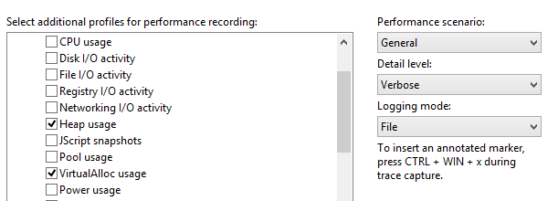

2.  Click **Start** to start tracing.

3.  Launch **MemoryTestApp.exe**, and wait for the process to terminate (it should take around 30 seconds).

4.  Return to **WPR**, save the trace, and open it with **Windows Performance Analyzer (WPA)**.

5.  Open the **Trace** menu and select **Configure symbols path**.

    -   Specify the path of the symbol cache. For more information on symbols, see the [Symbol Support](https://go.microsoft.com/fwlink/?linkid=623019) page on MSDN.

6.  Open the **Trace** menu and select **Load symbols**.

You now have a trace that contains all memory allocation patterns for the **MemoryTestApp.exe** process during its lifetime.

## Step 2: Review VirtualAlloc dynamic allocations


The detailed **VirtualAlloc** data is exposed via the **‘VirtualAlloc Commit Lifetimes’** graph in WPA. The key columns of interest are the following:

<table>
<colgroup>
<col width="50%" />
<col width="50%" />
</colgroup>
<thead>
<tr class="header">
<th>Column</th>
<th>Description</th>
</tr>
</thead>
<tbody>
<tr class="odd">
<td><strong>Process</strong></td>
<td><p>The name of the process that performs memory allocations through <strong>VirtualAlloc</strong>.</p></td>
</tr>
<tr class="even">
<td><strong>Commit Stack</strong></td>
<td><p>The call stack that shows the code path leading to memory being allocated.</p></td>
</tr>
<tr class="odd">
<td><strong>Commit Time</strong></td>
<td><p>The timestamp of when memory was allocated.</p></td>
</tr>
<tr class="even">
<td><strong>Decommit Time</strong></td>
<td><p>The timestamp of when memory was freed.</p></td>
</tr>
<tr class="odd">
<td><strong>Impacting Size</strong></td>
<td><p>The size of outstanding allocations or the size difference between the start and end of the selected time interval. This size adjusts based on the selected view port.</p>
<p>The <strong>Impacting Size</strong> value will be zero if all memory allocated by a process is freed by the end of the visualized interval in <strong>WPA.</strong></p></td>
</tr>
<tr class="even">
<td><strong>Size</strong></td>
<td><p>The cumulative sum of all allocation during the selected time interval.</p></td>
</tr>
</tbody>
</table>

 

Follow these steps to analyze **MemoryTestApp.exe**

1.  Find the **VirtualAlloc Commit Lifetimes** graph in the **Memory** category of the **Graph Explorer**.

2.  Drag and drop the **VirtualAlloc Commit Lifetimes** onto the **Analysis** tab.

3.  Organize the table to show these columns. Right-click on the column headers to add or remove columns.

    1.  **Process**

    2.  **Impacting Type**

    3.  **Commit Stack**

    4.  **Commit Time** and **Decommit Time**

    5.  **Count**

    6.  **Impacting Size** and **Size**

4.  Find **MemoryTestApp.exe** in the process list.

5.  Apply a filter to keep only **MemoryTestApp.exe** on the graph.

    -   Right-click, and select **Filter** to Selection.

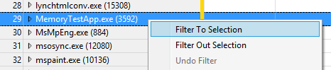

Your analysis viewport should look similar to this:


In the preceding example, two values are of interest:

-   **Size** of 126 MB: This indicates that **MemoryTestApp.exe** allocated a total of 125 MB over the course of its lifespan. It represents the cumulative sum of all **VirtualAlloc** API calls made by the process and its dependencies.

-   **Impacting Size** of 0 MB: This indicates that all of the memory allocated by the process is freed by the end of the time interval being currently analyzed. The system didn’t suffer from an increase of its steady state memory usage.

### Step 2.1: Analyze steady state memory usage

When investigating memory allocation, you should try to answer the question: “Why is the steady state memory usage growing for this scenario?” In the **MemoryTestApp.exe** example, you can see that it has about 10 MB of steady state memory allocated at the beginning, and then it increases to 20 MB halfway through.

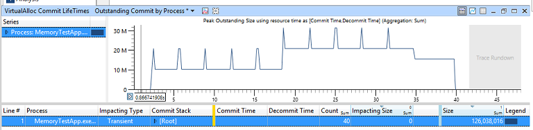

To investigate this behavior, narrow the zoom to around the time interval when the sudden increase occurs in the middle of the trace.

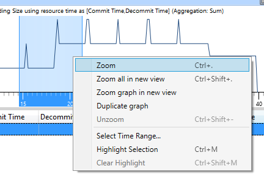

Your viewport should look like this.

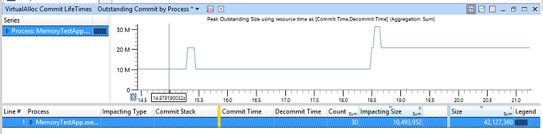

As you can see, the **Impacting Size** is now **10 MB**. This means that, between the start and the end of the time interval being analyzed, there’s a 10 MB increase in steady state memory usage.

1.  Sort by **Impacting Size** by clicking on the column header.

2.  Expand the **MemoryTestApp.exe** row (in the **Process** column).

3.  Expand the **Impacting** row (in the **Impacting Type** column).

4.  Navigate through the process **Commit Stack** until you find the function that allocated 10 MB of memory.

    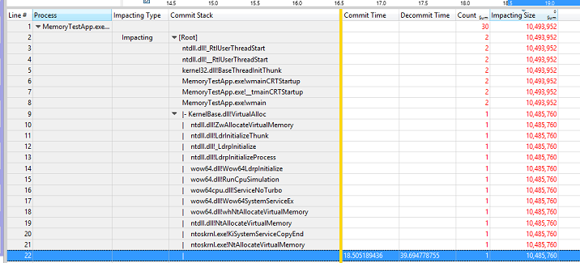

In this example, the **Main** function of **MemoryTestApp.exe** allocates 10 MB of memory in the middle of the workload by directly calling **VirtualAlloc**. In the real world, the application developer should determine if the allocation is reasonable or if the code could be rearranged to minimize the steady state memory usage increase.

You can now **unzoom** the viewport in WPA.

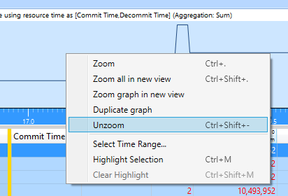

### Step 2.2: Analyze transient (or peak) memory usage

When investigating memory allocations, you should try to answer the question: “Why is there a transient peak in the memory usage for this part of the scenario?” Transient allocations cause spikes in memory usage, and can lead to fragmentation and push valuable content out of the system Standby cache when there’s memory pressure.

In the **MemoryTest** example, you can see that there are 10 different spikes of memory usage (of 10 MB) evenly scattered across the trace.


Narrow the zoom to the last four spikes, to focus on a smaller region of interest and reduce noise from non-relevant behaviors.

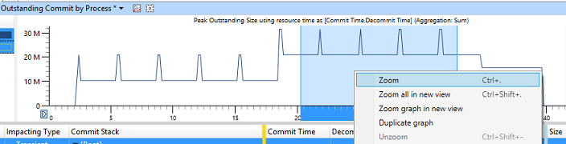

Your viewport should look like this:

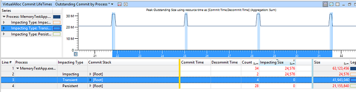

1.  Sort by **Size** by clicking on the column header.

2.  Expand the **MemoryTestApp.exe** row (in the **Process** column).

3.  Click on the **Transient** row (in the **Impacting Type** column).

    -   This should highlight in blue all the spikes of memory usage in the viewport.

4.  Note the value of the different columns:

    1.  **Count** = 4: This indicates that four transient memory allocations were made during that time interval.

    2.  **Impacting Size** = 0 MB: This indicates that all four transient memory allocations were freed by the end of the time interval.

    3.  **Size** = 40 MB: This indicates that sum of all four transient memory allocations amount to 40 MB of memory.

5.  Navigate through the process **Commit Stack** until you find the functions that allocated 40 MB of memory.

    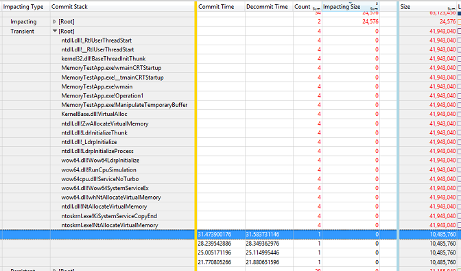

In this example, the **Main** function of **MemoryTestApp.exe** calls a function named **Operation1**, which in turn calls a function named **ManipulateTemporaryBuffer**. This **ManipulateTemporaryBuffer** function then directly calls **VirtualAlloc** four times, creating and freeing a 10 MB memory buffer every time. The buffers only last 100 ms each. The buffers' allocation and free times are represented by the **Commit Time** and **Decommit Time** columns.

In the real world, the application developer would determine if those short-lived transient temporary buffer allocations are necessary, or if they can be replaced by using a permanent memory buffer for the operation.

You can now **unzoom** the viewport in **WPA**.

## Step 3: Review heap dynamic allocations


So far, the analysis has only focused on large memory allocations that are serviced by the **VirtualAlloc** API. The next step is to determine if there are issues with other small allocations made by the process, using the Heap data initially gathered.

The detailed Heap data is exposed via the **“Heap Allocations”** graph in WPA. The key columns of interest are the following:

<table>
<colgroup>
<col width="50%" />
<col width="50%" />
</colgroup>
<thead>
<tr class="header">
<th>Column</th>
<th>Description</th>
</tr>
</thead>
<tbody>
<tr class="odd">
<td><strong>Process</strong></td>
<td>The name of the process that is performing memory allocation.</td>
</tr>
<tr class="even">
<td><strong>Handle</strong></td>
<td><p>The identifier of the Heap that is used to service the allocation.</p>
<p>Heaps can be created, so there could be multiple heap handles for the process.</p></td>
</tr>
<tr class="odd">
<td><strong>Stack</strong></td>
<td>The call stack that shows the code path that leads to memory being allocated.</td>
</tr>
<tr class="even">
<td><strong>Alloc Time</strong></td>
<td>The timestamp of when memory was allocated.</td>
</tr>
<tr class="odd">
<td><strong>Impacting Size</strong></td>
<td>The size of outstanding allocations or the difference between the start and end of the selected viewport. This size adjusts based on the selected time interval.</td>
</tr>
<tr class="even">
<td><strong>Size</strong></td>
<td>The cumulative sum of all allocations/deallocations.</td>
</tr>
</tbody>
</table>

 

Follow these steps to analyze **MemoryTestApp.exe**

1.  Find the **Heap Allocations** graph in the **Memory** category of the **Graph Explorer**.

2.  Drag and drop the **Heap Allocations** onto the **Analysis** tab.

3.  Organize the table to show these columns:

    1.  **Process**

    2.  **Handle**

    3.  **Impacting Type**

    4.  **Stack**

    5.  **AllocTime**

    6.  **Count**

    7.  **Impacting Size** and **Size**

4.  Find **MemoryTestApp.exe** in the process list.

5.  Apply a filter to keep only **MemoryTestApp.exe** on the graph.

    -   Right-click and select **Filter** to Selection.

Your viewport should look like this:

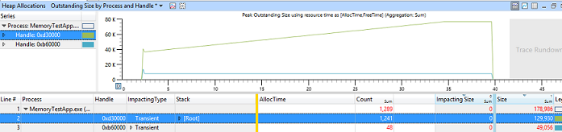

In this example, you can see that one of the heaps is steadily increasing in size over time at a constant rate. There are 1200 memory allocations on that heap, accounting for 130 KB of used memory by the end of the interval.

1.  Zoom in on a smaller interval (for example, 10 seconds) in the middle of the trace.

2.  Expand the head **Handle** that shows the largest amount of allocations (as shown in the **Impacting Size** column).

3.  Expand the **Impacting** type.

4.  Navigate through the process **Stack** until you find the function that is responsible for allocating all this memory.

    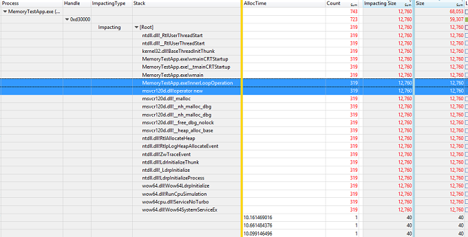

In this example, the **Main** function of **MemoryTestApp.exe** calls a function named **InnerLoopOperation**. This **InnerLoopOperation** function then allocates 40 bytes of memory 319 times through the C++ **new** operator. This memory remains allocated until the process is terminated.

In the real world, the application developer should then determine if this behavior implies a possible memory leak and fix the issue.

## Step 4: Clean up the test system


Once the analysis is complete, you should clean up the registry to make sure that heap tracing is disabled for the process. Run this command on an elevated command prompt:

``` syntax
reg delete "HKLM\Software\Microsoft\Windows NT\CurrentVersion\Image File Execution Options\MemoryTestApp.exe" /v TracingFlags /f
```

 

 


