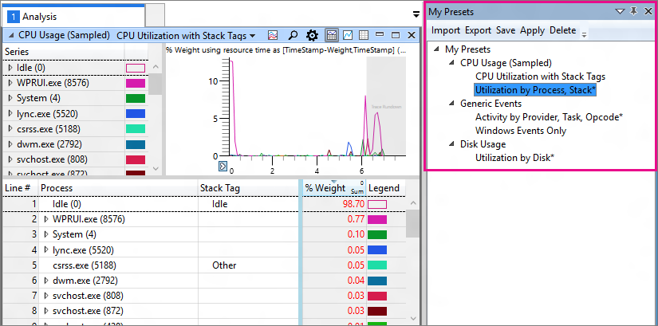

# My Presets

WPA stores the presets that you have modified or explicitly saved and displays them in the **My Presets** window so that you can reuse them easily. **My Presets** consists of a toolbar and a tree display. The content of the window is shared across uses of WPA and across concurrently open instances (with the exception of unsaved presets, which are not shared across open instances).

The tree display has an entry for your saved or newly modified presets. Under this entry, presets are grouped by the graph they come from. An asterisk next to a preset's name indicates that it has been modified but not saved. A gray, unavailable name indicates that the current trace has no data for the corresponding graph. After applying a profile, that profile is displayed in a separate entry, along with the graphs and presets it contains.

You can access the commands for presets on the toolbar or by right-clicking a preset, and then selecting an option described in the following table.

| Option | Description |
|---|---|
| **Import** | Imports presets from a presets (.WpaPresets) file or the open presets from a profile (.WpaProfile) file. |
| **Export** | Exports the selected presets to a file so that you can share the presets. The file has the extension *.WpaPresets*. |
| **Save** | Saves the current state of the preset. If the preset is a built-in preset that has been modified, then WPA displays a **Save As** dialog, because built-in presets cannot be overwritten. Note that if multiple instances of the same preset are open, the most recently modified instance is saved. |
| **Apply** | Applies the preset in the most recently used **Analysis View** or **Comparative Analysis View**. You can also apply a preset by double-clicking its name. |
| **Delete** | Deletes the preset from this view, and reverts any instances of this presets that are open in a graph. |
 

The presets in this view stay synchronized with the non-default presets for each graph (accessed by the drop-down menu next to the trace name on an open graph). Saving, modifying, or deleting a preset in one location affects the other.
