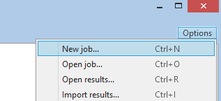
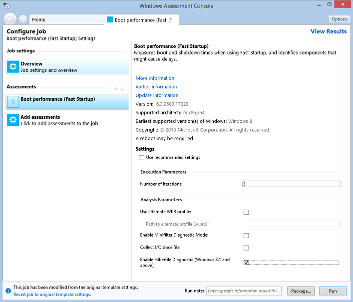
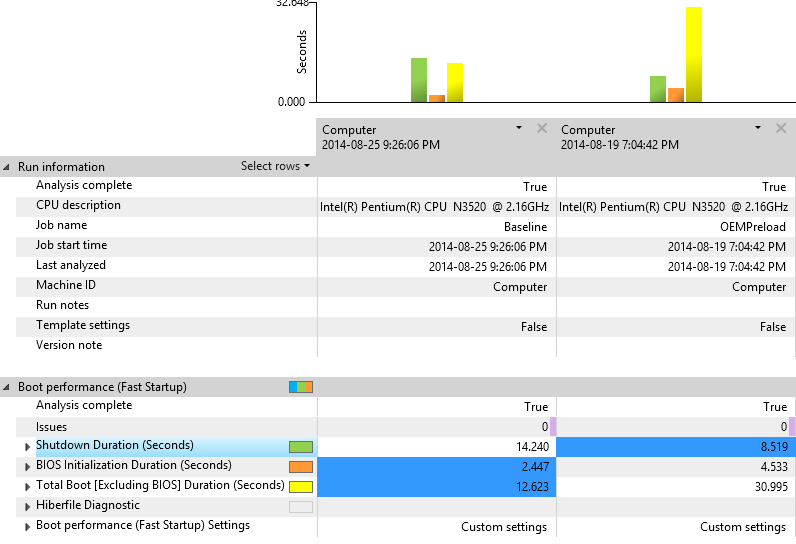
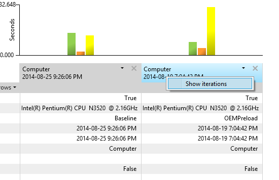
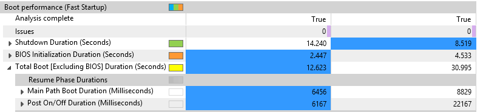
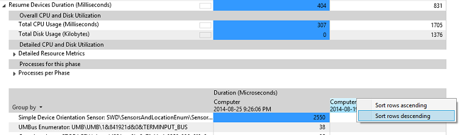
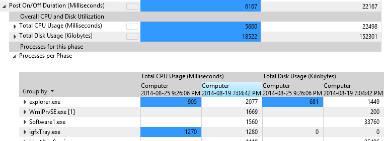
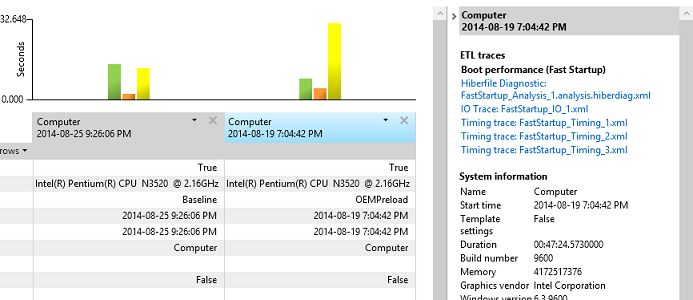

# Exercise 1 - Evaluate Fast Startup Using the Assessment Toolkit

Boot time is a common benchmark that is often used to measure Windows performance. Over the lifetime of a system, longer boot times can be an indicator of system problems such as inefficient configuration, device conflicts, and malware.

## Step 1: Collect data using the Windows Assessment Tookit

The Windows Assessment Toolkit contains a test to measure the Fast Startup time. You can use this assessment to understand the impact drivers, devices, and the software preload have on the Fast Startup time. Fast Startup time can be negatively affected by processes and services that are loaded in memory at startup, processes and services that run in the background, or resources that are used to initialize devices.

1.  Open **Windows Assessment Console (WAC)** from the **Start** menu.

2.  Open the **Options** menu and select **New Job…**

    1.  Enter **FastStartupTest** as the job name.

    2.  Select **Create a custom job.**

3.  Click on **Add Assessments.**

    -   Add the **Boot Performance (Fast Startup)** assessment by clicking on the “+” symbol.

4.  Click on the newly added **Boot Performance (Fast Startup)** assessment to enter the test configuration.

5.  Unselect **Use recommended settings** and select **Enable Hiberfile Diagnostics** for the configuration.

    -   **Enable Hiberfile Diagnostics** allows you to analyze the contents of the hiberfile and identify the memory pages that contribute to its size.

6.  You have two options:

    1.  **Package** the job in order to create a folder with all the test resources and copy it on another test system. (Click on the **Package…** button in the bottom right corner to choose this option.)

    2.  **Run** the job directly on the system. (Click on the **Run** button in the bottom right corner to choose this option.)

        -   This restarts the system to gather a trace.

        -   This test can take 30 minutes to complete.

    We want the **Run** option.

    

## Step 2: Visualize the assessment results using WAC

Once the assessment execution is completed, you can open the resultant XML report with **WAC** and start evaluating the **Fast Startup** times.

This step uses two XML reports:

-   **Baseline report** (**FastStartup\_Baseline.xml**): The Baseline report is a pre-generated XML report that can be downloaded [here](http://download.microsoft.com/download/3/6/F/36FDC105-5ECC-4C8A-98E4-385B940F74B5/FastStartup_Baseline.xml).

    It was generated by executing the **Fast Startup** assessment on a clean Windows retail image with a full set of drivers. A baseline enables you to understand the best case scenario for a system without any added 3rd party apps.

-   **Local report**: This is the report that you generated in Step 1. The delta between the baseline report and this report allows you to quantify the impact that added apps have on boot times.

1.  In **WAC**, in the upper-right corner, open the **Options** menu and select **Open Results…**.

    -   You can also press **CTRL+R** on the keyboard.

2.  Click on the **Browse…** button and navigate to the folder where you saved the two XML reports.

3.  Select both **FastStartup\_Baseline.xml** and your **Local report** at the same time, and click **Open**.

    The two results open side-by-side in the Windows Assessment Console. Your console should look something like this:

**Note**  
Because your **Local report** was generated on a different system from the one used to generate the **Local reports** shown in the screenshots throughout this exercise, the specific entries shown in the screenshots will probably differ from the ones you see on your machine.

 

## Step 3: Review the Fast Startup report

The assessment results section provides the data you will use to understand how a system is performing and to identify issues. Most metric values are numbers you can use to compare against other metrics or computers.

| Phase                                      | Description                                                                                                                                                               |
|--------------------------------------------|---------------------------------------------------------------------------------------------------------------------------------------------------------------------------|
| **Shutdown Duration (seconds)**            | The time the computer takes to shut down. You can expand this node to expose additional metrics for deeper understanding and investigation.                               |
| **BIOS Initialization Duration (seconds)** | The time the BIOS takes to initialize. The assessment does not offer analysis and remediation information for this metric.                                                |
| **Total Boot (seconds)**                   | The time the computer takes to boot after the BIOS phase has completed. You can expand this node to expose additional metrics for deeper understanding and investigation. |

 

**User Tip:  **

**Assessments** often run workloads or scenarios multiple times. We refer to each of these runs as an “iteration,” and the values collected are averaged across multiple iterations. For example, **Fast Startup** has three iterations by default. To view the individual iteration’s values, right-click the computer name in the top column heading and then select **Show Iterations**.

The Boot Performance (Fast Startup) assessment provides boot metrics in a number of phases and components.

1.  In the **WAC**, find the **Total Boot \[Excluding BIOS\] Duration (Seconds)** metric, and compare the baseline and local results. You may see a large (i.e. greater than 18 seconds) regression time between the two.

2.  Click the chevron next to this metric to show the sub-metrics.

    -   **Main Path Boot Duration**: Shows the time Windows takes to resume from the end of **BIOS Initialization** to when the desktop is visible to the user.

    -   **Post On/Off Duration**: Shows the time Windows takes to complete all startup tasks after the desktop appeared.

    The other metric areas (**Resource Consumption** and **Resume Process Details**) provide CPU and disk usage data and will not be investigated within this guide.

    

## Step 4: Examine the Resume Devices Duration

Device drivers may become a source of boot delays. To identify drivers that have issues, drill down into the **Resume Devices Duration** metrics to find problems.

1.  Click the chevron next to the **Main Path Boot Duration** to expand it.

2.  Find the **Resume Devices Duration** metric, expand the node by clicking on the chevron, and then view the sub-metrics under the **Processes Per Phase** metric.

3.  Right-click the computer name column header of the test results column and then select **Sort Descending**. This sorts the data so that the largest numbers are at the top. This allows you to focus on the tasks that have the longest duration.

4.  Each row represents the amount of time a device took to resume to an active power state.

    

## Step 5: Determine the Hiberfile size

1.  Click the chevron next to the **Hiberfile Read Duration** to expand it.

    The **Hiberfile size** metric represents the amount of data read from disk to restore the system context through the hibernation stack.

    -   The larger the size of the file, the longer it takes for the system to boot. The size of the file is directly impacted by memory usage from services and drivers.

    -   To get an estimate of the disk read throughput (in MB/s), you can divide **Hiberfile size** by the **Hiberfile Read Duration** metric. If there’s a significant discrepancy between this throughput and the drive’s specification, this might indicate a problem with the driver or the BIOS storage read routines.

2.  To analyze the content of the hiberfile and determine what software components contribute to its size, expand the **Hiberfile Diagnostic** metric. Two types of memory contribute to the hiberfile size:

    -   Driver non-paged pool memory

    -   Process working sets

## Step 6: Examine the Post On/Off Duration

The **Post On/Off Duration** value represents the time it takes for the computer to reach an idle state after the desktop is displayed to the user. During this time, user responsiveness can be affected because system startup is completing in the background. The **Post On/Off** process completes after five seconds of low priority CPU and storage usage are accumulated.

1.  Expand the **Post On/Off Duration (Milliseconds)** node.

2.  Expand the **Processes Per Phase** node to display a sub-table with metrics on the individual apps and services that use CPU and storage during this phase.

3.  Right-click the last column heading of that table, and then select **Sort descending**.

You can now identify processes that contribute to the phase duration. The more resources the process consumes, the more likely it affects the phase duration and should be investigated further.

## Step 7: Open Fast Startup trace with WPA

The **Fast Startup** assessment generates three types of iterations traces:

| Iteration Type | Description                                                                                                                                                                                          |
|----------------|------------------------------------------------------------------------------------------------------------------------------------------------------------------------------------------------------|
| Training       | The assessment reboots the system six times to make sure that all OS components involved in the boot process are optimized (prefetcher, superfetch, etc.).                                           |
| Timing         | These traces (gathered) are used to compute the average measurement displayed in the XML report. The default number of iterations is three, but can be adjusted though the assessment configuration. |
| Analysis       | A single trace is captured that contains detailed events and stacks in order to allow deep dive investigation into performance issues. The trace is larger in size.                                  |

 

If you want to open one of the traces generated by the assessment, follow these steps:

1.  Click on the report table header cell.

    The right pane in the **WAC** UI updates and shows links to the ETL traces captured by the assessment.

    

2.  Click on the **Analysis trace** link.

    **WPA** automatically opens the trace so you can start your investigations. Exercise 2 of this guide will walk you through some analysis methodologies.

 

 

