# Exercise 2 - Evaluate Fast Startup Using Windows Performance Toolkit

While the **Fast Startup** assessment is an easy way to get measurements in an easy to read report, it requires you to install the ADK, which takes some time to execute. It’s possible to quickly capture a **Fast Startup** trace using the **Windows Performance Recorder (WPR)** tool.

## Step 1: Open Fast Startup trace using WPA

1.  Open **Windows Performance Recorder (WPR)** from the **Start** menu

2.  Modify the tracing configuration.

    1.  Select the **First Level Triage** and **CPU Usage** providers.

    2.  Change the **performance scenario** to **Fast Startup**.

    3.  Change the **Number of iterations** to 1 in order to gather a single trace.

        

3.  Click on **Start**.

4.  Enter a path to save the resulting trace, and click on **Save**.

    -   This will force the system to reboot to gather and save the trace.

5.  Once the system reboots, wait 5 minutes for tracing to finish.

You now have a trace that can be analyzed with **Windows Performance Analyzer (WPA)**.

## Step 2: Open Fast Startup trace using WPA

1.  Open **Windows Performance Analyzer (WPA)** from the Start menu.

2.  From the **File** menu, open the trace that you created in Step 1.

3.  Open the **Profiles** menu, and click on **Apply…**

    1.  Click on **Browse Catalog…**

    2.  Select **FastStartup.wpaprofile**.

    3.  Click on **Open.**

You now have applied a visualization profile to the trace in order to get some commonly used graphs (CPU, disk, etc.).

## Step 3: Visualize the activity timeline

1.  Look at the **Regions of Interest** graph in the **Deep Analysis** tab

    -   This view provides a timeline overview of all the **Fast Startup** subphases mentioned in Exercise 1.

        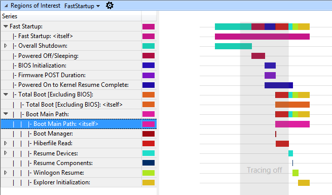

2.  Hovering the mouse over a region bar causes a popup window to appear and provide more information for the region itself.

    -   If you put the mouse over the **Boot Main Path** region, you can see its duration. In the example below, it lasts 13.6 seconds.

        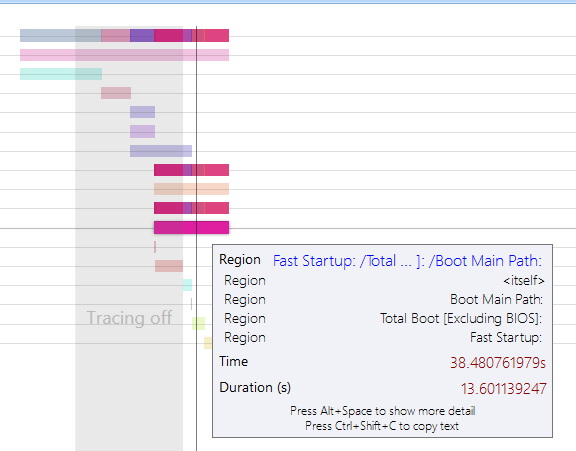

Take the time to navigate through the regions tree, and look at all the subphases to familiarize yourself with it.

The time that **Explorer** takes to initialize and finish is the time it takes to create the Windows desktop and make it visible to the user. This phase (and everything happening after, known as **post on/off**) can be impacted by processes started on boot.

Select a 90 second interval starting at the beginning of Explorer Initialization and zoom in.

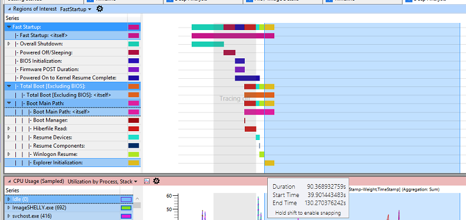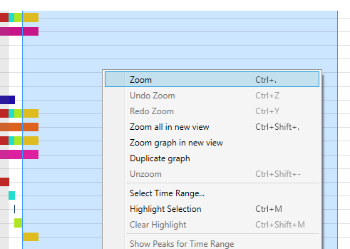

Under the **Regions of Interest** graph, there are two other valuable graphs: **CPU Usage (sampled)** and **Disk usage**. They will be used to evaluate the impact that the software preload has on **post on/off** resource consumption and responsiveness.

High CPU usage by applications and services can contribute to a poor user experience, such as UI unresponsiveness or video and sound glitches. When a single process uses too much CPU, other processes can be delayed because they must compete for system resources.

When a thread uses storage resources, it can increase the duration of the activity. When multiple threads contend for the use of storage, the resulting random disk seeks make delays more significant.

## Step 4: Analyze process CPU usage

In order to evaluate how much CPU time is consumed by a process, focus on the **CPU Usage (sampled)** graph. The data that displays in the **CPU Usage (Sampled)** graph represents samples of CPU activity taken at regular 1 ms sampling intervals. Each row in the table represents a single sample.

Any CPU activity that occurs between samples is not recorded by this sampling method. Therefore, activities of very short duration such as interrupts are not well represented in the **CPU Sampling** graph.

Review the CPU usage for each process to identify the processes that have the highest CPU usage (**Weight** and **%Weight**). To do this, scroll down to the graph **CPU Usage (sampled)**. On the left, view the list of processes. Each active process that is selected on the left displays on the graph.

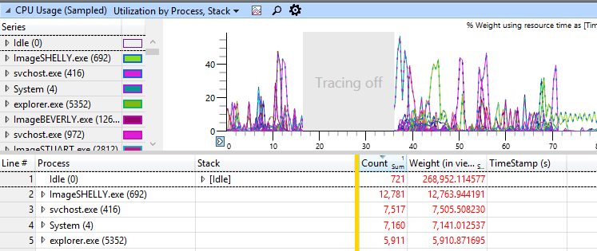

**Tip:  **

While using **WPA** graphs, you can change the view to display both the graph and the table. You can click the **Maximize** button to hide the other graphs displayed on the **Analysis** tab.

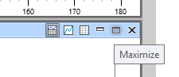

In this example, **ImageSHELLY.exe** consumes 12.4 seconds of CPU time over the interval of 90 seconds currently analyzed. Since the CPU on this system has two cores, this represents a relative percentage of utilization of 6.9%.

Using this information, you can investigate the specific process that is causing this CPU consumption, or forward these details to the developer who owns this process.

You can add additional columns to extract more information (right-click on the table column headers):

-   **Thread ID**: Identifier of the thread causing CPU usage

-   **Stack**: Call stack that highlights the code paths and functions that are causing CPU usage

In the example above, there is only one thread causing most of the CPU usage within the **ImageSHELLY.exe** process: Thread 2612, with 10.77 seconds of CPU activity.

The stack shows that this activity is coming from the **ImageSTACEY.dll** module.

## Step 5: Analyze process disk usage

In order to evaluate how much disk bandwidth is consumed by a process, focus on the **Disk Usage** graph.

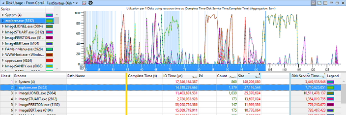

The columns of interest are:

-   **Pri**: Priority of the disk I/O. The three possible priority levels are: normal, low, and very low.

-   **IO Type**: Type of the I/O. The three possible I/O types are: read, write, and flush.

-   **Process**: Identifier of the process that created the disk I/O.

-   **Path Tree**: Structured tree that represents the locations of the files accessed by the I/O.

-   **Size**: Size (in bytes) of the I/O.

-   **Disk Service time**: Amount of time that it takes for the disk to service the I/O.

-   **IO Time**: Amount of time that the I/O spent in the Windows I/O queue.

    -   **IO Time** is always longer than **Disk Service Time** because an I/O can be queued when there is disk contention or when an I/O dispatcher at a higher priority must be completed first.

Add these columns and arrange them to obtain this view:

**Post on/off** only takes into account normal priority I/Os. Investigate the information about those disk reads according to process. Disk reads usually account for more disk access time than disk writes on boot, as a lot of data must be read from disk in order to launch processes and services.

1.  Click the color markers beside the **Pri**: Very Low and **Pri**: Low series so that only the normal priority I/Os are visible on the graph.

    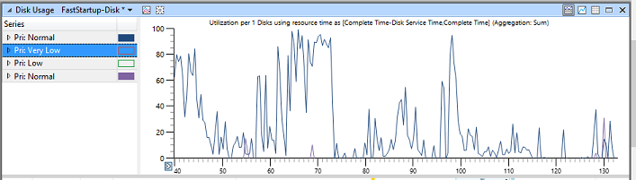

2.  In the table view, expand the **Normal** priority row.

3.  In the table view, expand the rows for **Write**, **Read**, and **Flush**, and then click the header for the **Size** column to sort the contents in decreasing order.

    Your screen should look something like this:

    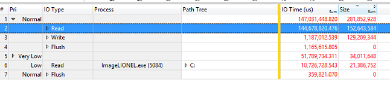

    The preceding example shows the following:

    1.  152 MB of data was read from disk at normal priority.

    2.  129 MB of data was written to disk at normal priority.

        -   Those are mainly disk writes to persist the captured ETL trace file on storage.

4.  In the table view, expand the **Read IO Type** row.

    -   You should now be able to see the processes that caused the largest amount of read disk I/O during **post on/off**.

5.  Identify the top three processes that are contributing to disk reads and that are not Windows components.

    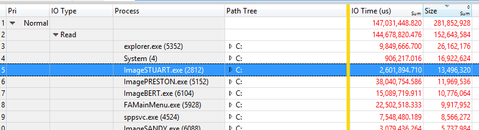

6.  In the table view, expand the **Path Tree** row for **ImageSTUART.exe**, and navigate through it.

    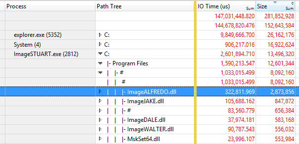

In the preceding example, **ImageSTUART.exe** reads 13.5 MB of data from disk when launched during **post on/off**, and most of the accesses are made reading DLL components in the **Program Files** folder.

Using this information, a software developer should identify his components and processes, and determine if the component size can be reduced, or if the launch code path can be optimized to minimize the amount of data read from disk.

You can also use this data to identify the 3rd party processes that launched on boot and is causing high disk usage. If a process appears to be introducing disk contention, it can then be removed from the image or simply not started at boot time.

 

 

