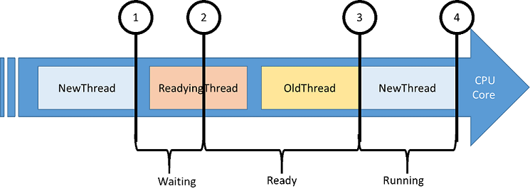
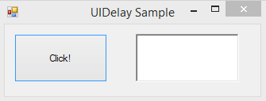
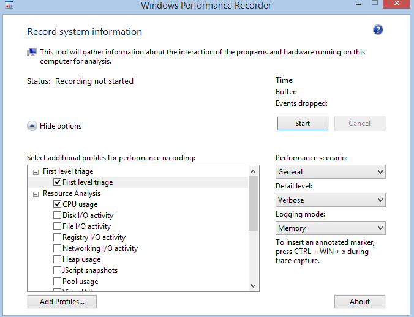
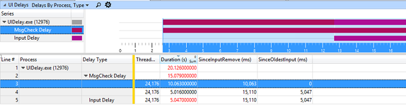
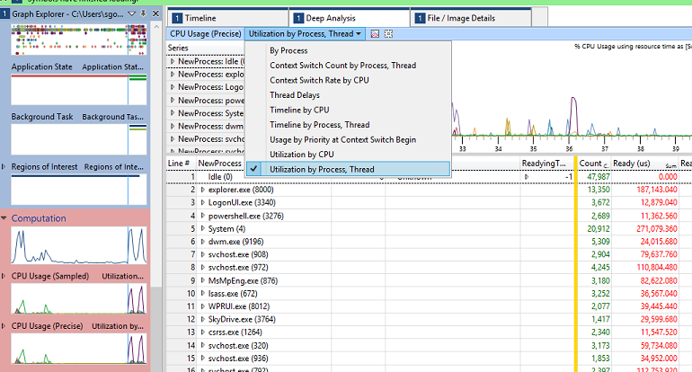
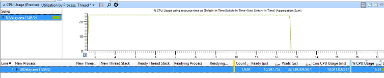
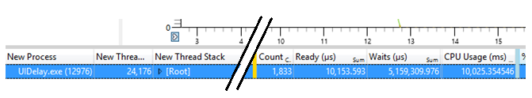
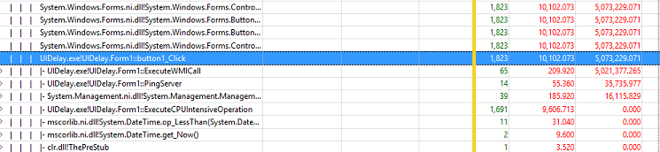
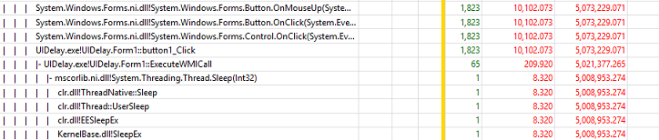
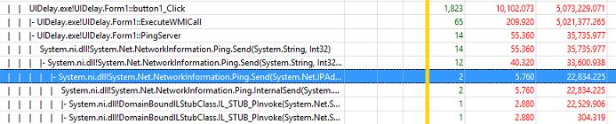

# Exercise 3 - Understand Critical Path and Wait Analysis

Scenarios and activities can be unexpectedly delayed. For example, opening a tab within Microsoft Edge may sometimes take longer than expected.

An activity is defined as a series of operations, some sequential and some parallel, that flows from a start event to an end event. Any start/end event pair in a trace can be viewed as an activity. The longest path through this series of operations is known as the critical path. Reducing the duration of any operation on the critical path directly reduces the duration of the overall activity.

It is recommended that you identify the process and the thread that completed the activity and work backwards from the time the activity completed. Start by analyzing the thread that completed the activity to determine how that thread spent most of its time and in what state: **running**, **ready**, or **waiting**.

Significant running times indicate that direct CPU usage might be contributing to the duration of the critical path. Time spent in the **ready** state indicates that other threads contribute to the duration of the critical path by preventing a thread on the critical path from executing. Time spent **waiting** points to I/O, timers, or other threads and processes on the critical path for which the current thread was waiting.

Each thread that readies the current thread is probably another link in the critical path and can also be analyzed until the duration of the critical path is accounted for.

All the required information is recorded in the **CPU Usage (Precise)** graph and table in **WPA**. CPU usage events that are logged by the dispatcher are associated with context switches. This table focuses on **NewThread** which is the thread that was switched in, and each row represents a context switch. Data is collected for the following event sequence:

1.  **NewThread** is switched out due to a blocking function call.

2.  **NewThread** is made ready to run by the readying thread.

3.  **NewThread** is switched in, thereby switching out an old thread.

4.  **NewThread** is switched out again.

Here are the interesting columns in the **CPU Usage (Precise)** table.

| Column               | Details                                                                                                                                                     |
|----------------------|-------------------------------------------------------------------------------------------------------------------------------------------------------------|
| **% CPU Usage**      | The CPU usage of the new thread after it is switched. This value is expressed as a percentage of the total CPU time over the currently visible time period. |
| **Count**            | The number of context switches that are represented by the row. This is always 1 for individual rows.                                                       |
| **CPU Usage (ms)**   | The CPU usage of the new thread after the context switch.                                                                                                   |
| **NewProcess**       | The process of the new thread.                                                                                                                              |
| **NewThreadId**      | The thread ID of the new thread.                                                                                                                            |
| **NewThreadStack**   | The stack of the new thread when it is switched in. Usually indicates what the thread was blocked or waiting on.                                            |
| **Ready(s)**         | The time that the thread spent in the Ready queue (due to pre-emption or CPU starvation).                                                                   |
| **ReadyingThreadId** | The thread ID of the readying thread.                                                                                                                       |
| **ReadyingProcess**  | The process that owns the readying thread.                                                                                                                  |
| **ReadyThreadStack** | The stack of the readying thread.                                                                                                                           |
| **ReadyTime (s)**    | The time when the new thread was readied.                                                                                                                   |
| **SwitchInTime(s)**  | The time when the new thread was switched in.                                                                                                               |
| **Waits (s)**        | The amount of time a thread waited on a logical or physical resource. The wait ends when **NewThreadId** is signaled by **ReadyingThreadId**.               |

 

## Step 1: Capture and open a trace for a UI delay problem

This exercise will focus on a dummy process with an unresponsive UI. The process is a simple Windows Form application with a button and a text box. When the button is clicked, the UI becomes unresponsive for 20 seconds until the text box is updated. You will analyze the critical path of this operation.

1.  Download **UIDelay.exe** from [here](http://download.microsoft.com/download/9/C/5/9C562A35-2E52-4CAE-A662-753486C13F4A/UIDelay.exe).

2.  Launch **UIDelay.exe**.

3.  Open **WPR** from the **Start** menu.

4.  Modify the tracing configuration.

    1.  Select **First Level Triage** and **CPU Usage**.

    2.  Select **General** as the performance scenario.

    3.  Select **Verbose** as the detail level.

        

5.  Click on **Start**.

6.  In **UIDelay.exe**, click on the **Click** button.

    -   Wait until the text box shows “Done!”

7.  In **WPR**, save the trace and open it with **WPA.**

8.  Open the **Trace** menu and select **Configure symbols path**.

    -   Specify the path of the symbol cache. For more information on symbols, see the [Symbol Support](https://go.microsoft.com/fwlink/?linkid=623019) page on MSDN.

9.  Open the **Trace** menu and select **Load symbols**.

## Step 2: Identify the delayed UI thread

Before performing critical path analysis, you must first identify the activity start and stop events.

1.  Find the **UI Delays** graph in the **System Activity** node of the **Graph Explorer**.

    

2.  Drag and drop the **UI Delays** graph in the analysis tab.

3.  Find the **UIDelay.exe** process.

    1.  Its duration should be around 20 seconds. This indicates that there was a delay of 20 seconds on the UI thread of **UIDelay.exe**.

    2.  The UI thread identifier is shown in the **Thread Id** column. In this example, it is 24174. This value will be different in the trace you’ve captured on your machine. Make sure to note the thread ID.

        

4.  Select the entire **UIDelay.exe** time interval, right-click and zoom in.

    

You should always zoom in the regions you’re trying to analyze. It reduces the amount of noise introduced by unrelated activities.

## Step 3: Analyze the UI delay critical path

Now that you have an analysis starting point with the thread ID and the timestamps, you can start digging into the activity critical path to understand the sequence of events that lead to a 20 seconds delay on the UI thread.

The **NewThreadId** for this step is the thread you identified in Step 2 (Thread 24174 in **UIDelay.exe** process).

1.  Add the **CPU Usage (Precise)** graph to the **analysis** tab and apply the **Utilization by Process, Thread** preset.

    

2.  Right-click the column headers and make the **NewThreadStack**, **ReadyThreadStack**, and **CPU Usage (ms)** columns visible.

3.  Remove the **Ready (us) \[Max\]** and **Waits (us) \[Max\]** columns. Your viewport should now look like this.

    

4.  Find and expand the **UIDelay.exe** process in the **NewProcess** column and sort by **Waits (us) \[Sum\]** by clicking on the column header.

5.  Search for the **NewThreadId** in the **UIDelay.exe** process, and analyze its time spent in the Running, Ready, or Waiting state.

    -   In the following example, you can find that:

        -   The thread is consuming 10.025 seconds of CPU time.

        -   The thread is waiting for 5.159 seconds.

        -   The thread is in the ready state for a negligible amount of time (10ms).

        

    **Note**  
    You can analyze the 10 seconds of CPU activity using the same methodology described in Exercise 2, Step 4 using the **CPU Usage (sampled)** graph and looking at the **UIDelay.exe** process.

     

6.  To discover what the **NewThreadId** was waiting for, expand the **NewThreadId** group to display the **NewThreadStack**.

7.  Expand **\[Root\]** and identify the function calls leading to waits.

    

In this example, **UIDelay.exe** thread ID 24174 is waiting on underlying blocking function calls for 5.073 seconds when the button click function is triggered:

-   5.021 seconds are due to operations underneath the **ExecuteWMICall** function.

-   35 ms are due to operations underneath the **PingServer** function.

### Step 3.1: Look at the ExecuteWMICall code path

If you expand the call stack further under **ExecuteWMICall**, you’ll find that the UI thread is actually sleeping for 5 seconds by explicitly calling **Thread.Sleep**.

This kind of behavior should be avoided at all cost as it directly impacts responsiveness. If the code needs to wait for information, it should do it asynchronously on a separate thread and use an event-driven method.

## Step 3.2: Look at the PingServer code

If you expand the call stack further under **PingServer**, you’ll find that the UI thread has I/O dependencies as it is sending **Ping** commands over the network.

While the delay is very small (35 ms), it should be avoided on a UI thread. Keep in mind that the average person will notice any UI delay larger than 100 ms. This operation could increase the total activity elapsed time above 100 ms, resulting in users having a bad perception of responsiveness.

Those operations should happen asynchronously on a separate thread and not block the UI.

 

 

