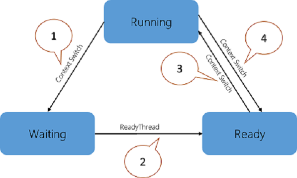

# Optimizing Performance and Responsiveness

Customers expect high-performing and responsive systems. This encompasses a broad scope of scenarios ranging from boot time to fluid user interactions with applications. Analyzing performance problems requires a lot of expertise and domain-specific knowledge. Microsoft provides tools to help you tackle this complex task.

This guide introduces you to the process of measuring, analyzing, and solving the root causes of performance issues in key areas. Topics include:

-   Using the **Windows Performance Toolkit (WPT)**

-   Capturing event trace log (ETL) traces

-   Boot, application launch, and UI delays

-   CPU and disk resource usage analysis

-   Critical path and wait analysis

## Goals

This guide will show you how to perform the following tasks:

-   Gather relevant data to analyze performance problems on any system

-   Understand the analysis process to look at system resource consumption like CPU and disk

-   Identify what can impact the system responsiveness in some key Windows scenarios

## Tools

The Windows Assessment Toolkit in the ADK provides a set of performance-related tests called assessments. The assessment results are used to diagnose potential problems, so that the hardware and software that you develop are both responsive and have a minimal impact on battery life, startup performance, and shutdown time. The same assessments are available to OEM/ISV/IHV partners, enthusiasts, and other members of the community, to establish a common framework to measure, compare, and review aspects of quality.

The **Windows Performance Toolkit** consists of two independent tools: **Windows Performance Recorder (WPR)** and **Windows Performance Analyzer (WPA)**. **WPR** is a powerful recording tool that creates Event Tracing for Windows (ETW) recordings. You can run **WPR** from the user interface (UI) or from the command line (CL). **WPR** provides built-in profiles that you can use to select the events you want to record. **WPA** is a powerful analysis tool that combines a flexible UI with extensive graphing capabilities and data tables that can be pivoted and have full text search capabilities.

## Fast Startup Behavior

Introduced in Windows 8, Fast Startup is the default boot behavior. The shutdown process was updated to include writing data to disk in a way that mirrors how hibernate works. During boot, the system goes through the phases that are described in the following table.

| Phase                       | Description                                                                                                                                                  |
|-----------------------------|--------------------------------------------------------------------------------------------------------------------------------------------------------------|
| **BIOS Initialization**     | The time the operating system takes to initialize the BIOS, including the Pre-Boot Execution Environment (PXE).                                              |
| **Hiberfile Read**          | The time the operating system takes to read the hiberfile from disk. The hiberfile contains all of the system context as written during shutdown.            |
| **Resume Devices**          | The time the operating system takes to resume devices and put them back in the active power state.                                                           |
| **WinLogon Resume**         | The time the operating system takes to resume the Winlogon process.                                                                                          |
| **Explorer Initialization** | The time the operating system takes to initialize the Windows shell (explorer.exe). This phase ends when the desktop or Start screen is visible to the user. |
| **Post On/Off Duration**    | The time Windows takes to complete all startup tasks after the desktop appears, but until CPU and disk resource become idle.                                 |

 

For more information about Fast Startup Behavior, see the [On/Off Transition Performance](http://go.microsoft.com/fwlink/p/?linkid=619168) topic on MSDN.

## CPU Scheduling and Threads

Because the number of processors in a system is limited, all threads cannot be run at the same time. Windows implements processor time-sharing, which allows a thread to run for a period of time before the processor switches to another thread. The act of switching between threads is called a context-switch and is performed by a Windows component called the dispatcher. Each thread exists in a particular execution state at any given time. Windows uses three states that are relevant to performance: **Running**, **Ready**, and **Waiting**.

Threads being executed are in the **Running** state. Threads that can execute, but are currently not running, are in the **Ready** state. Threads that cannot run (because they are waiting for a particular event) are in the **Waiting** state. The following figure illustrates the possible thread transitions.

1.  A thread in the **Running** state initiates a transition to the **Waiting** state by calling a wait function such as **WaitForSingleObject** or **Sleep(&gt; 0)**.

2.  A running thread or kernel operation readies a thread in the **Waiting** state (for example, **SetEvent** or timer expiration).

3.  A thread in the **Ready** state is scheduled for processing by the dispatcher when a running thread waits or reaches the end of its quantum of execution.

4.  A thread in the **Running** state is switched out and placed into the **Ready** state by the dispatcher when it is preempted by a higher priority thread or when its quantum ends.

Thread state becomes an important factor in performance only when a user is waiting for a thread to complete an operation.

For more information about CPU Scheduling, see the [CPU Analysis](http://go.microsoft.com/fwlink/p/?linkid=619178) topic on MSDN.

## Exercises

This guide consists of the following exercises.

-   [Exercise 1 - Evaluate Fast Startup Using the Assessment Toolkit](optimizing-performance-and-responsiveness-exercise-1.md)

-   [Exercise 2 - Evaluate Fast Startup Using Windows Performance Toolkit](optimizing-performance-and-responsiveness-exercise-2.md)

-   [Exercise 3 - Understand Critical Path and Wait Analysis](optimizing-performance-and-responsiveness-exercise-3.md)

 

 

