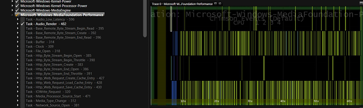
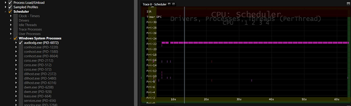
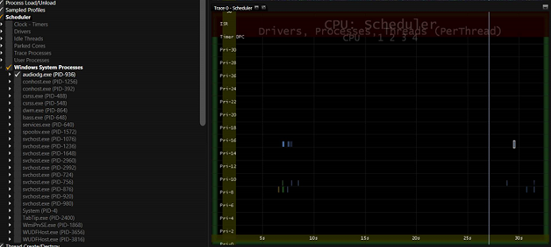

# Exercise 3 - Use MXA to Verify that Audio is Offloaded During Full Screen Video Playback


Offloading audio processing on chipsets that support audio offload results in longer battery life during audio and audio/video playback scenarios that leverage the Media Engine in Windows. This exercise uses the **Media eXperience Analyzer (MXA)** tool to determine whether or not audio was offloaded to hardware during full screen video playback.

## Step 1: Load an ETW trace that was captured during full screen video playback


1.  Install **MXA** which can be downloaded [here](https://go.microsoft.com/fwlink/?linkid=525711).

2.  Right-click on the **Start** menu and click on **Command Prompt (Admin)**.

3.  Navigate to the folder where you installed **MXA**.

4.  Download **AudioNotOffloaded.etl** [here](http://download.microsoft.com/download/A/5/D/A5D6F588-EE12-4FBA-B54C-E6D1E554F19C/AudioNotOffloaded.etl).

5.  Run the following command:

    ``` syntax
    xa -i <AudioNotOffloaded.etl location>\AudioNotOffloaded.etl
    ```

    For example, if you downloaded **AudioNotOffloaded.etl** to C:\\Performance\\Media\\, you would type the following command:

    ``` syntax
    xa -i C:\Performance\Media\AudioOffload\AudioNotOffloaded.etl
    ```

6.  Press the **Turn Symbols Off** button to turn off symbol lookup.

## Step 2: Verify audio was rendered when the ETW trace was collected


1.  Once the trace loads, drag and drop the **Microsoft-Windows-MediaFoundation-Performance** provider into a panel.

2.  Deselect all events in the **Microsoft-Windows-MediaFoundation-Performance** provider by clicking the checkbox next to this dataset two times.

3.  Enable the **Task Audio\_Render – 482 events**.

4.  If your audio render events are fired throughout the trace, audio was playing when the trace was collected.



As we can see in the screenshot above, audio render events in the **Microsoft-Windows-MediaFoundation-Performance** provider (**Task Audio\_Render – 482**) are logged throughout the entire trace. This verifies that audio was playing back.

## Step 3: Determine whether audio was offloaded to hardware


1.  Drag and drop the **CPU Scheduler** dataset into a panel.

2.  Deselect all events by clicking on the checkbox at the root of the **CPU Scheduler** dataset twice.

3.  Expand the **CPU Scheduler** dataset and **Windows System Processes** node.

4.  Select the **audiodg.exe** process by clicking the checkbox once.

5.  If there is **audiodg.exe** thread activity occurring every 10 ms throughout the entire playback session, then audio is not being offloaded. For an example, see MXA Screenshot \#1.

6.  If there is **audiodg.exe** thread activity only during start-up and shutdown, then audio is being offloaded. For an example, see MXA Screenshot \#2.

7.  Download the **AudioOffloaded.etl** trace file [here](http://download.microsoft.com/download/7/A/9/7A9935AE-DD3C-4714-9457-FF86BD5A6F05/AudioOffloaded.etl).

8.  Repeat steps 1, 2, and 3 using the **AudioOffloaded.etl** trace instead of **AudioNotOffloaded.etl**.

### <a href="" id="mxa-screenshot--1--trace-taken-on-a-system-where-audio-is-not-being-offloaded"></a>MXA Screenshot \#1: Trace taken on a system where audio is NOT being offloaded

Notice that the **audiodg.exe** is waking up every 10ms to process audio samples throughout the entire trace.



### <a href="" id="mxa-screenshot--2--trace-taken-on-a-system-where-audio-is-being-offloaded"></a>MXA Screenshot \#2: Trace taken on a system where audio is being offloaded

Notice the very low thread activity in the **audiodg.exe** process exists at start-up and shutdown phases of playback. Notice also that there is no thread activity during steady state.



 

 


