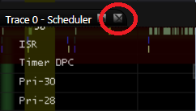
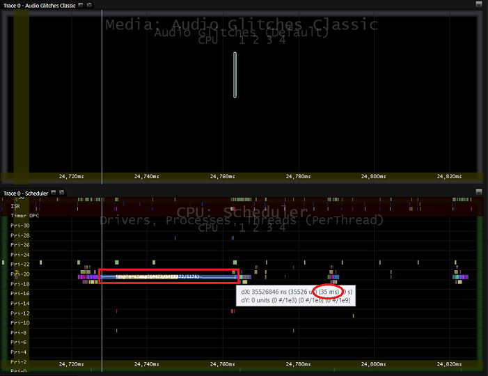
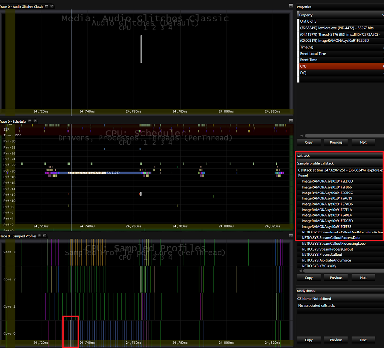

# Exercise 4 - Use MXA to Analyze Audio Glitches


In this lab, you’ll analyze audio glitches. Audio glitches are often caused by one of the following issues:

-   A Deferred Procedure Call (DPC) or an Interrupt Service Routine (ISR) that runs longer than 1 millisecond.

-   A driver or kernel thread that runs at dispatch level for 1 millisecond or longer.

-   Data cannot be read from the disk or the network isn’t fast enough because of high disk or network utilization.

-   The hardware or software decoder cannot decode and process the stream faster than real-time.

## Step 1: Open the trace in MXA and drag the pertinent datasets into panels


1.  Install **Media eXperience Analyzer (MXA)** which can be downloaded [here](https://go.microsoft.com/fwlink/?linkid=525711).

2.  Right-click on the **Start** menu and click on **Command Prompt (Admin)**.

3.  Navigate to the folder where you installed **MXA**.

4.  Set the **MXA** symbol paths on your PC.

5.  Download **AudioGlitches\_ThreadsAtDispatchLevel.etl** from [here](http://download.microsoft.com/download/9/6/0/96000C33-FB05-44B7-96A1-9C0CF5EE865B/AudioGlitches_ThreadsAtDispatchLevel.etl).

6.  Open the **AudioGlitches\_ThreadsAtDispatchLevel.etl** trace file by typing the following command:

    ``` syntax
    xa.exe -i <AudioGlitches_ThreadsAtDispatchLevel.etl location>\AudioGlitches_ThreadsAtDispatchLevel.etl
    ```

    For example, if you downloaded **AudioGlitches\_ThreadsAtDispatchLevel.etl** to C:\\Performance\\Media, you would type the following command:

    ``` syntax
    xa.exe -i C:\Performance\Media\AudioGlitches_ThreadsAtDispatchLevel.etl
    ```

7.  On the **MXA** splash screen, press the **Turn Symbols Off** button to turn off symbol lookup.

    

8.  Once the trace is loaded, close any open panels that appear in the center of the application by pressing the small X next to the name of each panel.

9.  Add 3 new panels. Click **View** &gt; **New Panel** or press **CTRL+N**.

10. Drag and drop the **Audio Glitches Classic** dataset under the **Media** node into the top panel.

11. Drag and drop the **Scheduler** dataset under the **CPU** node into the 2nd panel from the top.

12. Drag and drop the **Sampled Profiles** dataset under the **CPU** node into the 3rd panel from the top.

13. Filter the idle processes out of the view so that you can see the other thread activity more clearly. In the dataset tree, expand the **Scheduler** dataset in the **CPU** node and click the **Idle Threads** node checkbox twice to deselect it. Clicking the checkbox once highlights the data in the graph; clicking it twice deselects it.

## Step 2: Identify the region of the trace where an audio glitch occurred


You can look at the audio engine data from the event trace log (.etl) files to see a visual timeline of when these glitches occurred and compare the timeline to other sets of data to look for patterns.

1.  Zoom in on an audio glitch by clicking and dragging the mouse over one of the bars in the **Audio Glitches Classic** panel at the top.

2.  Notice that the **iexplore.exe** process in the **Scheduler** dataset in the 2nd panel was running for a long time (~20-35ms) just before the audio glitch.

3.  Press escape to zoom out 100% then repeat the previous two steps to verify the pattern where the **iexplore.exe** process was running for long durations (~20-35 ms) prior to every audio glitch.

4.  To measure time within the panel, press the **SHIFT** key while you drag your mouse from one end of the **iexplore.exe** process bar to the other. The tooltip over the mouse cursor shows you how many milliseconds you are measuring on the timeline. In the **MXA** screenshot below, the process was running for about 35 milliseconds.

    

## Step 3: Identify the cause of the delays in the pipeline


Before this audio glitch, the long-running **iexplore.exe** process was running on one of the cores. To find out how the **iexplore.exe** thread is stalling the audio pipeline, you can look at the corresponding **Sampled Profiles** dataset in the **CPU** node.

1.  If the **CallStack** dataviewer is not visible in the **MXA** window, click **View** &gt; **Data Viewers** &gt; **CallStack** to open it.

2.  In the **Sampled Profiles** panel (3rd from the top), hover over the sample profile events that match the same color of the long running **iexplore.exe** thread.

3.  The **CallStack** window shows the callstack for each sample. Notice that a specific driver, **ImageRAMONA.sys**, is at the top of the **CallStack** when you hover over most of the samples in the core that **iexplore.exe** is running on.

4.  Although the **audiodg.exe** thread is running at a higher priority (priority 22) than the **iexplore.exe** thread (priority 19), the **iexplore.exe** thread calls into a driver (**ImageRAMONA.sys**), which raises the IRQL level of the processor. As a result, **audiodg.exe**, which is waiting on a DPC retained by the dispatcher doesn’t have a chance to run on its regular 10ms cadence, resulting in audio glitches.

5.  Hold down the **SHIFT** key to freeze the **CallStack** and **Properties Data Viewers** and move your mouse to the **CallStack**. Press **Copy**.



 

 


