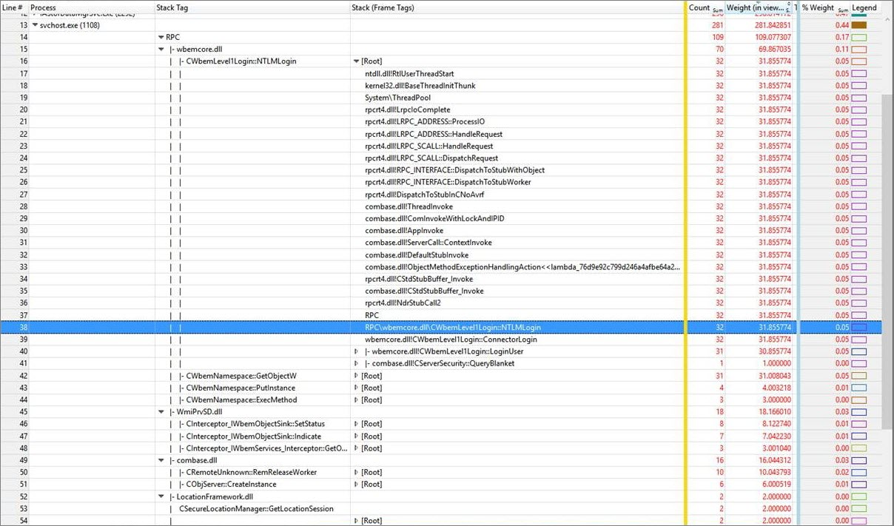

# Stack Tags

In the Windows® Performance Analyzer (WPA), stack tags is a feature that lets you create labels (tags) to help you better identify which parts of the call stack(s) are affected.

## Understanding differences between stack tags and stack frame tags

You can think of **stack (frame tags)** and **stack** tags as two views of the same data available in the **Stack** column. You can configure a stack column to be viewed as a stack tag or stack column (frame tag) in the View Editor.

A call stack consists of a list of frames. If a call stack is in the form of A -&gt; B -&gt; C, then there are three frames: A, B, and C. Stack columns (frame tags) map each and every call stack frame to a tag or defaults to *module*!*method* if no tag is present.

For example, call stack A -&gt; B -&gt; C-&gt; D, in **Stack (Frame Tags)** view can become A -&gt; FrameTagB -&gt; FrameTagC -&gt; D. Each of the frame tags can have a hierarchy based on the hierarchy of definition of the tags in the \*.stacktags file (for example, FrameTagB's actual value can be "HTML\\Script\\OM").

A stack tag summarizes an entire call stack by using a single tag name. For example, the bottom most mapped frame tag is typically made the stack tag unless there is priority specified for tags. Using the same A -&gt; B -&gt; C -&gt; D example, where frame tag view is A -&gt; FrameTagB -&gt; FrameTagC -&gt; D, the stack tag view is just: FrameTagC.

Besides normal Tag for exactly matching module and method, you can also define HintTag with HintOperator as Callee or Caller. For example, a HintTag with HintOperator as Callee is defined for B. The call stack A -&gt; B -&gt; C -&gt; D in **Stack (FrameTags)** view can become A -&gt; FrameTagB -&gt; ModuleOfC -&gt; D and its StackTag view is FrameTagB -&gt; ModuleOfC. The module of C is dynamically created as a new stack tag. Explicitly setting the *OnlyShowModule* attribute of HintTag as false would make C as a new stack tag rather than ModuleOfC. *OnlyShowModule* attribute is true by default. The typical use case is to automatically attribute RPC server functions. Their direct caller function is rpcrt4.dll!Invoke\_epilog1\_start. You can define a HintTag for this common caller function to achieve this.

## Identify the cost of a common function by defining a hint tag

Normally, the **Stack Tag** column identifies the cost of a single function in a single module. However, WPA can consolidate the cost ofall of the functions called by that function if you define a *hint tag* and a *hint operator*. The hint tag is a label for the common function and the group of functions that it calls, and the hint operator identifies the common function as either the calling function, the *caller*, or the called function, the *callee*.

The typical use case is to define a hint tag so that WPA automatically attributes RPC server functions. You also might want to define a hint tag, for example, to show the lock holders or the functions that are allocating heaps.

### Defining hint tags

Hint tags and hint operators are defined in XML in the following syntax with the attributes and values described in the following table.

<pre>
	&lt;HintTag
		Name="<i>string-label</i>"
		Priority="<i>integer</i>"
		HintOperator="<i>caller-or-callee</i>"
		OnlyShowModule="<i>Boolean</i>"&gt;
		&lt;Entrypoint 
			Module="<i>module-name</i>" 
			Method="<i>method-name</i>"/&gt;
	&lt;/HintTag&gt;
</pre>

<table>
<thead>
<tr class="header">
<th>Element</th>
<th>Attribute</th>
<th>Description</th>
</tr>
</thead>
<tbody>
<tr class="odd">
<th rowspan="4">HintTag</th>
<td><i>Name</i></td>
<td>String to be used as the label</td>
</tr>
<tr class="even">

<td><i>Priority</i></td>
<td>Integer. Default is zero.</td>
</tr>
<tr class="odd">

<td><i>HintOperator</i></td>
<td>Value is &quot;Caller&quot; or &quot;Callee&quot; for the calling or called function, respectively.</td>
</tr>
<tr class="even">

<td><i>OnlyShowModule</i></td>
<td>Boolean, optional. Default value is true.</td>
</tr>
<tr class="odd">
<th rowspan="2">Entrypoint</th>
<td><i>Module</i></td>
<td>Name of the module that contains <i>Method</i>.</td>
</tr>
<tr class="even">

<td><i>Method</i></td>
<td>Name of the method that is the entry point.</td>
</tr>
</tbody>
</table>

To add the hint tags that you have defined in an XML file, use the procedure in [Adding stack tags to the Stack Tags Definition File](#adding-stack-tags-to-the-stack-tags-definition-file), later in this topic.

### Example of using a hint tag

Consider the example data shown in the following figure.

In this example, there are 4 RPC functions called in WbemCore.dll:

-   **CWbemLevel1Login::NTLMLogin**
-   **CWbemNamespace::GetObjectW**
-   **CWbemNamespace::PutInstance**
-   **CWbemNamespace::ExecMethod**

Being able to consolidate the cost of calling these functions is useful for determining the cost of RPC server-side functions, because WPA displays the total expense as **RPC** in the **Stack Tag** column.

With the **rpcrt4.dll!Invoke** function defined as the entry point for the hint tag **RPC**, and the hint operator specified as the callee, WPA represents **rpcrt4.dll!Invoke** with **RPC**, and **wbemcore.dll!CWbemLevel1Login::NTLMLogin** with **RPC\\wbemcore.dll\\CWbemLevel1Login::NTLMLogin**. So, in the **Stack Tag** column, WPA displays the cost of **wbemcore.dll!CWbemLevel1Login::NTLMLogin**, the RPC server-side function, as 31.855774ms. In WbemCore.dll, **NTLMLogin** is the top RPC function in the hierarchy of called functions.

The hint tag **RPC** is defined by the following XML.

<pre>
	&lt;HintTag Name="RPC" HintOperator="Callee"&gt;
		&lt;Entrypoint Module="rpcrt4.dll" Method="Invoke"/&gt;
	&lt;/HintTag&gt;
</pre>

## Adding stack tags to the Stack Tags Definition file

To add a stack tag definition to the Stack Tags Definition file, do the following:

1.  In the menu, choose **Trace**, then select **Trace Properties**. The **Trace Properties** tab opens.

2.  In the Stack Tags Definition area, click **Add** to the desired location.

3.  Navigate to the area that contains the stack tags file, select it, and then click **Open**.

## Removing a stack tag from the stack tags definition file

To remove a stack tag definition from the Stack Tags Definition file, do the following:

1.  In the menu, choose **Trace**, then select **Trace Properties**. The **Trace Properties** tab opens.

2.  In the Stack Tags Definition area, select the stack tag definitions you want to remove then click **Remove**.

    **Warning**  Make sure you want to remove the selected stack tag definition(s), as you will not have the option to cancel once you click **Remove**.

     

## Reloading the stack tags definition file

To reload a stack tag definition to the Stack Tags Definition file, do the following:

1.  In the menu, choose **Trace**, then select **Trace Properties**. The **Trace Properties** tab opens.

2.  In the Stack Tags Definition area, click **Reload**. You can load multiple stack tags by pressing and holding down the Shift key and left-clicking each stack tags definition.

## Troubleshooting your stack tags file

To investigate issues within your stack tags file in WPA, do the following:

-   In the menu, click **Window**, then select **Diagnostic Console**. The WPA display splits into two - with the **Graph Explorer** and **Analysis** in the top half of the screen and the **Diagnostic Console** on the bottom half of the screen.

    **Tip**  You can also access the Diagnostic Console in the lower left corner of WPA by clicking **Diagnostic Console**. Once open, you can also drag it out to a separate window or dock it at the top or side.

    The Diagnostic Console lists information about exceptions that occur during analysis workflow. You can diagnose symbol decoding issues from this console

## Related topics

[Introduction to the WPA User Interface](introduction-to-the-wpa-user-interface.md)

[Diagnostic Console](diagnostic-console.md)

 

 

