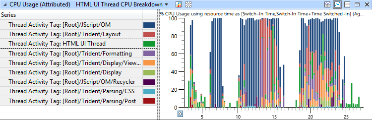
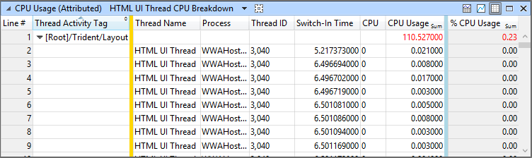
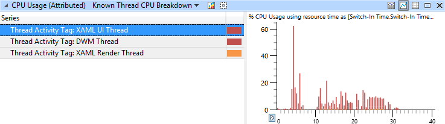

# Windows Store App Analysis

WPA now includes capabilities that help you analyze Windows Store app performance. Watch the video below for a quick overview of some of these features:

<iframe src="https://hubs-video.ssl.catalog.video.msn.com/embed/bf588be3-5aa0-4679-9f00-7dcaa93df127/IA?csid=ux-en-us&MsnPlayerLeadsWith=html&PlaybackMode=Inline&MsnPlayerDisplayShareBar=false&MsnPlayerDisplayInfoButton=false&iframe=true&QualityOverride=HD" width="720" height="405" allowFullScreen="true" frameBorder="0" scrolling="no"></iframe>

[Send feedback on this video, or request new performance analysis videos.](mailto:lhdocfb@microsoft.com?subject=HCKTestLevelsVIDEO&body=%0D%0A%0D%0AMicrosoft%20uses%20your%20feedback%20to%20improve%20its%20products,%20services%20and%20documentation.%20While%20we%20are%20investigating%20the%20issue%20you%20report,%20we%20may%20send%20e-mail%20to%20you%20to%20ask%20for%20further%20details%20or%20clarification%20on%20the%20feedback%20you%20send%20to%20us,%20and%20we%20may%20send%20e-mail%20to%20you%20to%20let%20you%20know%20that%20your%20feedback%20has%20been%20addressed.%C2%A0%20We%20do%20not%20use%20your%20e-mail%20address%20for%20any%20other%20purpose.%0D%0AFor%20technical%20support,%20contact%20http://go.microsoft.com/fwlink/?LinkId=143702.%0D%0A%0D%0A%20For%20further%20information%20about%20the%20Microsoft%20Online%20Privacy%20Statement,%20please%20see%20http://go.microsoft.com/fwlink/?LinkId=143701.)

## Windows Store App Profiles

WPA includes a set of profiles that help jumpstart your Windows Store app analysis. These profiles are contained in the **Profile Catalog** that can be found when you apply a profile to an open trace:

-   AppLaunch – Contains presets in a view that is geared for app launch analysis.

-   XAMLApplicationAnalysis – Contains all the presets and views necessary to get started with analyzing your XAML-based Windows Store app.

-   HTMLApplicationAnalysis – Contains all the presets and views necessary to get started with analyzing your HTML-based Windows Store app.

For more information about profiles, see [View Profiles](view-profiles.md).

For more information, including videos that get you started with the Windows store app analysis profiles, see the following links:

-   [Big Picture](big-picture.md)

-   [Frame Analysis](frame-analysis.md)

## Attributed CPU Usage

In the **Attributed CPU Usage** graph, CPU usage is attributed to different activities. For example, one section of activity might be attributed to drawing content on the screen, while another section might be attributed to processing JavaScript code. These identifying tags help you to more easily identify how your app is spending time.

The Attributed CPU Usage graph contains the following presets that break down CPU usage in your Windows Store app:

-   DWM Thread CPU Breakdown

-   HTML Render Thread CPU Breakdown

-   HTML UI Thread CPU Breakdown

-   Known Thread CPU Breakdown

-   Utilization by Process, Thread, Activity

-   XAML Render Thread CPU Breakdown

-   XAML UI Thread CPU Breakdown

If you hover over the bars in the graph, you can see additional metadata for the corresponding activity.

In the **Attributed CPU Usage** table, the **Thread Name** column helps you quickly identify key threads in your app. In the screenshot below, you can see the **HTML UI Thread**, a named thread that does some work during the **Layout** activity:

**Warning**  
The **Attributed CPU Usage** table relies on regions of interest definitions to attribute CPU usage to different activities. When you use multiple regions files, different regions of interest can overlap and conflict. When these conflicts occur, WPA is unable to accurately attribute a single activity to a given thread in a given time range. To avoid these potential conflicts, use only one region definition file at a time.

 

## Thread Naming

Windows Store apps use different threads to do different types of work. For example, the XAML UI thread passes work to the render thread to draw to the screen. WPA uses descriptive thread names to clearly identify what the thread is doing. Knowing which of the many threads in your table is the render thread and which is the XAML UI thread allows you to look for particular patterns of behavior, especially between threads.

The image above shows activity from the XAML UI thread, the XAML Render thread, and the Desktop Window Manager (DWM) thread.

 

 

