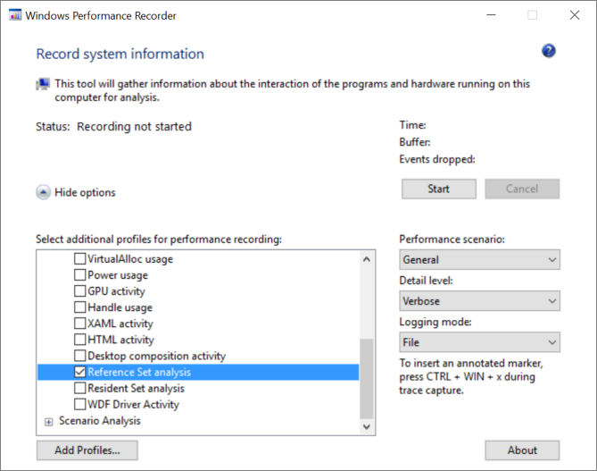
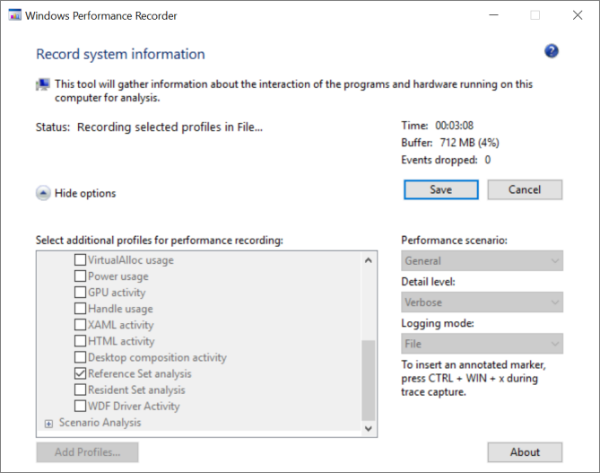
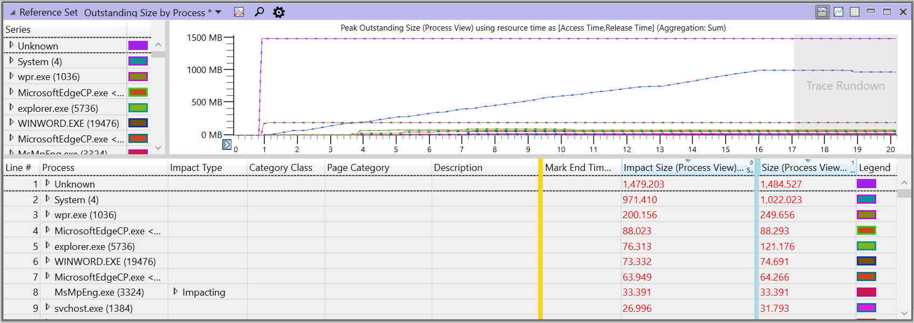
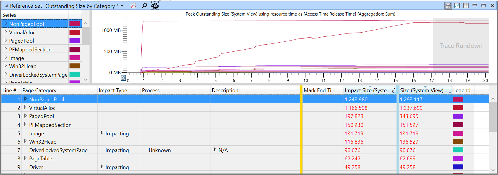
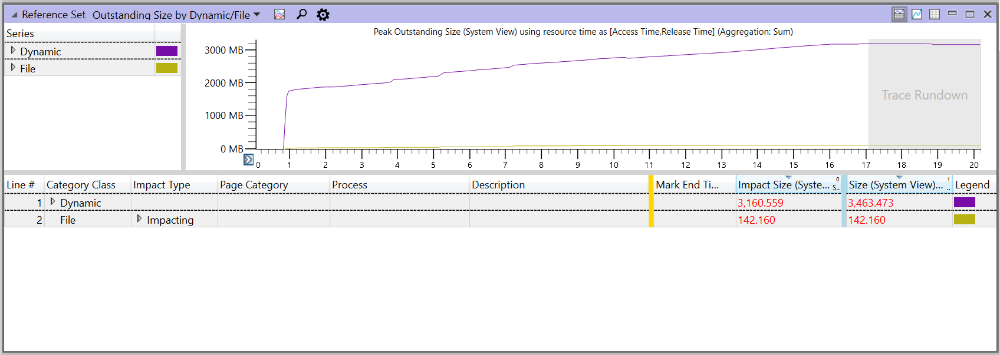

# Reference sets and the system-wide effects on memory use 

A *reference set* is the recommended way to understand the real effects
of a process on the memory availability of the system as a whole.

Traditionally, memory use has been measured by the *working set* of the
process at a given time. The working set of a process is the set of
pages in the virtual address space of the process that are currently
resident in physical memory. (For more details about working sets, see
[Working Set](https://msdn.microsoft.com/en-us/library/windows/desktop/cc441804.aspx)
on Windows Dev Center.)

## Limitations of a working set

A working set provides limited information, because it does not show
all of the memory that is used to support the process, such as cached
files and the memory used by system services that the process utilizes.
In addition, a working set is highly dependent upon the state of the
machine, its amount of RAM, and the level of activity required of the
memory subsystem to supply all processes on the system with the memory
they request (the level of *memory pressure*). Also, a working set is
greatly affected by the trimming policies of the OS. So, a working set
is a momentary measurement only, and omits effects outside the targeted
process.

## Advantages of a reference set

In contrast, a reference set is a measurement of the system-wide set
of memory pages that any process or activity on the system has accessed
during a given scenario. It includes all pages accessed on behalf of the
component being investigated, no matter which process accessed the page.
The reference set does not vary based on RAM size, memory pressure, or
OS trimming policies. Measuring a reference set is an extremely
accurate way to assess memory usage across the system for any workload,
because the pages that are currently in the working set of any process,
or that are accessed by system processes or drivers, are included in the
reference set. A reference set is specific to a scenario, not to a
moment: it is not valid to ask, *What is the reference set of my process
at this moment?* However, it is valid to ask, *What is the reference set
of the system in this scenario?* or *What is the reference set of my
process in this scenario?*

The idea behind a reference set is simple: to give an accurate picture of
the memory that is referenced system wide during the scenario, pages are counted
when accessed and when released. This method provides a comprehensive
view into the peaks of memory use, as well as into what is outstanding
at the end of the scenario (that is, *steady-state use*).

<blockquote>
<b>Note</b>&nbsp;&nbsp;&nbsp;Only the first reference of a page is captured.
</blockquote>

A reference set can be roughly regarded as a measure of the amount of
memory that might be taken away from the rest of the system during
execution of the scenario or, equivalently, the amount of memory that
would need to be faulted and read from disk in order to execute the
scenario (if other parts of the system have caused the memory to be
paged out). Therefore, a reference set is valuable for determining the
*performance impact* of memory use.

# How to collect reference set data

You can use two different command-line tools to collect reference set
data: Windows Performance Recorder (WPR) and Xperf. You can also use the
WPR's GUI interface.

WPR and Xperf are part of the Windows Performance Tookit, which is included 
in the Windows Assessment and Deployment Kit (ADK). You can download the ADK for Windows 10 
from the following link: [Windows Assessment and Deployment Kit](http://go.microsoft.com/fwlink/p/?LinkId=526740). 

<blockquote>
<b>Note</b>&nbsp;&nbsp;&nbsp;Use an elevated command prompt when collecting reference set data.
</blockquote>

## Collect data with WPR

To collect data with WPR, enter:

&nbsp;&nbsp;&nbsp;&nbsp;&nbsp;**wpr -start referenceset -filemode**

Run your scenario, and then stop collecting data by entering:

&nbsp;&nbsp;&nbsp;&nbsp;&nbsp;**wpr -stop**&nbsp;<i>file-name</i><b>.etl</b>

## Collect data with Xperf

When using Xperf to collect memory traces, specify the same size for
both minimum and maximum buffers to ensure that there is a consistent
amount of system memory reserved for Event Tracing for Windows (ETW).
This consistency makes comparison between runs easier due to decreased
variability. (These buffers are automatically set to the same size when
using WPR.)

To collect data with Xperf, enter:

<blockquote>
<b>xperf -on referenceset -minbuffers 50 -maxbuffers 50 -buffersize 1024 -stackwalk PageAccess+PageRelease+PageRangeAccess+PageRangeRelease+PagefileMappedSectionCreate+VirtualFree+PagefileMappedSectionDelete -start user -on Win32HeapRanges -minbuffers 10 -maxbuffers 10 -buffersize 1024</b>
</blockquote>

Run your scenario, and then stop collecting data by entering:

&nbsp;&nbsp;&nbsp;&nbsp;&nbsp;**xperf -stop user -stop -d**&nbsp;<i>file-name</i><b>.etl</b>

## Collect data with the WPR desktop app

You can also collect data by using the WPR desktop app, wprui.exe. In
the GUI, under **Resource Analysis**, select **Reference Set analysis**.
(If you do not see this option, you might need to click **More
Options**, and then expand **Resource Analysis**.)

To start recording, click **Start**, and then run your scenario.

To stop recording and save the trace data, click **Save**.

# How reference set tracing works

When WPR starts collecting the trace of a reference set, the system
immediately removes all memory pages from the working sets of all
processes, including the system. In addition, all pages that remain in
the working sets of either a process or the system are recorded to
account for pages that are locked or marked as non-pageable. After that, on the first access
of a page that was moved to the standby list, the system records a soft
fault in the trace of the reference set, the page is added to the
working set of the process, and the process continues running.
Subsequent accesses to a page in the working set of the process or
system will not cause another soft page fault, because the page is
already in the working set. As a result, execution continues without
recording any additional accesses to pages in a working set, and
therefore, the total number of accesses to a page is not recorded in the
trace.

Likewise, the first access of any other page in the same process is
recorded in the trace, including newly allocated pages. Pages that are
released (such as by **HeapFree**), and files that are deleted have
their *outstanding size* removed from the reference set at the end of
the measurement interval, but they are still shown as accessed. Files
that are closed, or executables that are removed from memory are not
removed from the outstanding size, because they are not purged from RAM
on closure or removal. If a page is shared between two or more
processes, the trace will record the first access to that page in each
process that touches it.

<blockquote>
<b>Note</b>&nbsp;&nbsp;&nbsp;Recording the trace of a reference set can have a significant effect on system performance, because all processes must fault large numbers of pages back into their working sets after their working sets are emptied.
</blockquote>

# Reference set visualizations

WPA offers the following views of reference set data:

-  [Reference Set Outstanding Size by Process](#reference-set-outstanding-size-by-process)
-  [Reference Set Outstanding Size by Category](#reference-set-outstanding-size-by-category)
-  [Reference Set Outstanding Size by Dynamic/File](#reference-set-outstanding-size-by-dynamic-file)

## Reference Set Outstanding Size by Process

This shows memory divided by process for the viewport. This is a good
place to start if you are investigating the effect on memory of a
particular application.

For the meanings of the columns in this view, see [Important column definitions](#important-column-definitions), later in this topic.

## Reference Set Outstanding by Category

This shows memory pages by category for the viewport.

For an explanation of page categories, see [Page Category (Dynamic)](#page-category-dynamic) and [Page Category (File)](#page-category-file), later in this topic.

## Reference Set Outstanding by Dynamic/File

This shows memory categorized by whether it is memory-backed or file-backed for the viewport.

<blockquote>
<b>Note</b>&nbsp;&nbsp;&nbsp;<i>Memory-backed pages</i> are backed by the page file, or in the case of non-paged pool, never paged out. Memory-backed pages include stack, heap, VirtualAlloc and other page categories that don't directly map to a file on disk. <i>File-backed pages</i> are backed by individual files on disk such as module images.
</blockquote>

# Understanding reference set data

As mentioned before, the reference set represents the memory that was
touched during the execution of the scenario of interest. In this
regard, the reference set is the actual cost of executing the workload
and represents the most accurate accounting of the memory footprint of
the workload.

Typically, you are interested in the memory footprint of a particular
process, so you will want to start with the *Reference Set Outstanding
by Process* table. You will want to examine the places where the memory
usage increased or decreased, as well where it peaked and where it was
steady.

## Peak vs. steady state

Since the reference set is the measurement of the amount of memory that
is referenced during a scenario, it may not be intuitive that its size
can ever decrease. When memory is freed and returned to the system to be
used for other purposes, it is subtracted from the reference set to
reflect the fact that it can subsequently be reused.

This causes a scenario to have two primary reference set metrics:
*steady state* and *peak*.

<table>
<tr><th>Metric</th><th>Description</th></tr>
<tr><td>Steady&nbsp;state</td><td>
A baseline cost of the app or scenario. This can
be measured by executing a scenario (or multiple scenarios) and then
waiting for the system to reach an idle state again. By minimizing
the number of pages that your app accesses in a steady state across
various scenarios, you can see the scenarios execute faster (for
example, resume more quickly) and provide an experience that is
better for your user, since you'll be reducing the memory pressure
on the system.
</td></tr>
<tr><td>Peak</td><td>
Transient high usage of memory, which can push more
valuable information out of physical memory. By reducing the
frequency and magnitude of any peaks of usage, your app or feature
will be a better "system citizen" by decreasing the potential for
the swapping out or termination of other processes.
</td></tr>
</table>

## Important column definitions

When examining the trace of a reference set in WPA, the following
columns in the table view are especially important:

-  [Impact Type](#impact-type)
-  [Size and Impact Size](#size-and-impact-size)
-  [Category Class](#category-class)
-  [Page Category (Dynamic)](#page-category-dynamic)
-  [Page Category (File)](#page-category-file)
-  [Allocation stack](#allocation-stack)
-  [Impacting stack](#impacting-stack)

If one of these columns is missing from your view in WPA, you can add it by right-clicking a column heading in the current view and then selecting the missing column from the list.

All three reference set views provide 4 different columns providing sizes of the memory being counted:

-  **Size (Process View)**: the total set of pages referenced by the given process
-  **Size (System View)**: the set of pages referenced by 
-  **Impact Size (Process View)**
-  **Impact Size (System View)** 

Different views show different columns by default, but they’re all available in all of the refset views if you look for them, and they add up sizes the same way no matter which views you use them in.

### Impact Type

The **Impact Type** column identifies the type of effect that a memory
allocation has on the memory currently in use: **Impacting**, **Transient**, and **Persistent**.

<table>
<tr><th>Impact&nbsp;Type</th><th>Description</th></tr>
<tr>
<td>Impacting</td>
<td>
Memory that was (A) allocated before
the start of your viewport and freed during your viewport (allocated
outside and freed inside) or (B) allocated during your viewport and
freed after the end of your viewport (allocated inside and
freed outside). An impacting allocation affects the memory in use at
the end of the viewport.
</td>
</tr>
<tr>
<td>Transient</td>
<td>
Memory that was allocated and freed
during your viewport (allocated inside and freed inside). A
transient allocation is active only within the current viewport.
Transient allocations typically contribute to any peaks in usage
within a viewport.
</td>
</tr>
<tr>
<td>Persistent</td>
<td>
Allocations that were allocated before the
start of the viewport and freed after the end of it (allocated
outside and freed outside). A persistent allocation is active during
the entirety of the viewport.
</td>
</tr>
</table>

### Size and Impact Size

The **Size** column of **Reference Set Outstanding by Process**
represents the *magnitude* of accesses, independent of the type of
effect (shown in the **Impact Type** column) that an allocation causes,
which could be one of **Impacting**, **Transient**, or **Persistent**.
This is not very valuable for analysis, but it is needed for graphing in
WPA.

**Impact Size** represents the effect on the size from the starting
timestamp to the ending timestamp for the current zoom level. A
comparison of the graphed values at the start and end for the field of
view, in simple terms, corresponds to the delta. Transient or persistent
accesses do not cause the graphed value to change for the zoom window,
and so they do not count.

When two processes reference the same page of physical memory, the page
is counted for each process in the **Size** column. Adding the two values
does not produce a system-wide total for the reference set, because
after the page is added to the working set, subsequent access is not
counted. The page is also counted in the **Impact Size** column, just once,
for the first process that accesses the page. Adding the values in
**Impact Size** for a process produces a valid system-wide total for the
reference set, and it does so without missing or multiplying the count
of any page. Therefore, the values in **Impact Size** represents the
actual system-wide effects on memory. 

Consider an example, from t\_start to t\_end, with the following values:

-   Graph at t\_start: 10 MB

-   New (Impacting) accesses in the window: 10 MB

-   Transient accessed in the window: 10 MB

-   Graph at t\_end: 10 (Persistent) + 10 (Impacting) = 20

-   Size column: 10 (Persistent) + 10 (Transient) + 10 (Impacting) = 30

-   Impact Size column: 10 (Impacting)

<blockquote>
<b>Note</b>&nbsp;&nbsp;&nbsp;Zooming in and out changes the viewport and causes these sizes to be recalculated.
</blockquote>

### Category Class

There are two categories of access for memory pages, identified in WPA
in the **Category Class** column: **Dynamic** or **File**.

<table>
<tr><th>Category&nbsp;Class</th><th>Description</th></tr>
<tr><td>Dynamic</td><td>
These are on-demand allocations of memory that are
associated with a process or system state that do not persist across
a system shutdown. The allocations can be non-paged or backed by the
page file, and they can be <b>Heap</b>, <b>VirtualAlloc</b>, and so on, as
identified in the <b>Page Category</b> column. Shareable dynamic memory
is also identified in <b>Page Category</b> as <b>PFMappedSection</b>.
</td></tr>
<tr><td>File</td><td>
These are files referenced by processing that are backed
by a file on disk. Files loaded as data, files loaded as images
(executable or DLL), and map files.
</td></tr>
</table>

### Page Category (Dynamic)

In the **Page Category** column, when the category class is **Dynamic**,
WPA displays one or more of the categories described in the following
table.

<table>
<thead>
<tr class="header">
<th>Page&nbsp;Category, dynamic allocation</th>
<th>Description</th>
</tr>
</thead>
<tbody>
<tr class="odd">
<td>VirtualAlloc</td>
<td>This page category includes large dynamic allocations (larger than 512 KB or 1 MB, depending on the system) dynamic allocations made by the app (or made by the framework on behalf of the app) by using the virtual allocation APIs.</td>
</tr>
<tr class="even">
<td>Heap</td>
<td>This page category includes small, dynamic allocations made by the app (or made by the framework on behalf of the app) by using the heap allocation APIs.</td>
</tr>
<tr class="odd">
<td>UserStack</td>
<td>User-mode stack for a thread.</td>
</tr>
<tr class="even">
<td>PFMappedSection</td>
<td>Shareable dynamic memory. This page category often measures the amount of memory spent on graphics allocations. From an app perspective, this includes not only images, videos, other “media pipeline” allocations that your app is using, but also includes the basic building blocks of your UI, such as the surfaces used to render a ListView.</td>
</tr>
<tr class="odd">
<td>CopyOnWriteImage</td>
<td>Copy-on-write pages for modules loaded into the process.</td>
</tr>
<tr class="even">
<td>LargePage</td>
<td></td>
</tr>
<tr class="odd">
<td>AWEPage</td>
<td>Physical pages allocated by a process.</td>
</tr>
<tr class="even">
<td>PageTable</td>
<td></td>
</tr>
<tr class="odd">
<td>PagedPool</td>
<td>Kernel heap.</td>
</tr>
<tr class="even">
<td>Non-PagedPool</td>
<td>Non-pageable kernel heap.</td>
</tr>
<tr class="odd">
<td>SessionPrivate</td>
<td></td>
</tr>
<tr class="even">
<td>KernelStack</td>
<td>Kernel mode stack.</td>
</tr>
<tr class="odd">
<td>Driver</td>
<td></td>
</tr>
<tr class="even">
<td>DriverLockedSystemPage</td>
<td></td>
</tr>
<tr class="odd">
<td>System PTEs</td>
<td></td>
</tr>
</tbody>
</table>

### Page Category (File)

In the **Page Category** column, when the category class is **File**,
WPA displays one or more of the categories described in the following
table.

| Page&nbsp;Category, file | Description |
|-----------------------|---------------------------------------------------------------|
| Image                 | A file loaded as an executable, such as a DLL. |
| MapFile               | A file loaded as data. |
| MetaFile              | A directory or a system log. |
| RegistryFile          | A registry file. |
| Prefetcher            | Information that is used to speed up the launching of an app. |
| DriverFile            | A driver that is loaded as an executable. |

### Allocation Stack

The **Allocation Stack** column identifies where the memory is allocated.

### Impacting Stack

The **Impacting Stack** column shows why the memory is accessed.

# Recommendations for measuring and improving performance in a reference set

The following general recommendations are helpful for measuring a
reference set and improving the effects of an app or feature on the
system. Use these recommendations in the following order:

-   [Examine steady-state use and peak use of memory](#examine-steady-state-use-and-peak-use-of-memory)

-   [Focus on the process with the greatest effects](#focus-on-the-process-with-the-greatest-effects)

-   [Characterize and categorize memory pages](#characterize-and-categorize-memory-pages)

<blockquote><b>Note</b>&nbsp;&nbsp;&nbsp;Tracing uses memory, which is visible as non-paged pool with the description "ETWB" for <strong>ETW buffers</strong>.</blockquote>

## Examine steady-state use and peak use of memory

Two aspects are important: (1) the amount of memory usage that is in a
steady state at the end of the scenario, and (2) where the usage peaks
occur in the reference set and why. Your analysis should focus first on
the steady-state impact of the scenario, and then look at any specific
peaks in the graphs of the reference set.

## Focus on the process with the greatest effects

Focus on processes that have the greatest effect on the reference set,
including the process of interest as well as other system processes.

## Characterize and categorize memory pages

Characterization needs to be for both category classes of memory pages,
dynamic and file, and further divided into subcategories.

### Examine memory pages in the File category

The best way to examine file accesses is usually to group them by path
tree and then identify system-related file accesses (like DLLs) and
process-specific file accesses (like local databases, text files, JPEGs,
and so on).

Minimizing process-specific file accesses reduces the size of the
reference set. It also improves performance to start testing before the
application or feature being tested is loaded (a *cold scenario*).

Essentially, diagnosing the file portion of a reference set requires
knowing which DLLs are unique to your scenario and why they are being
loaded, as well as any files that your application or feature accesses
(for example, image files when decoding for a slideshow).

### Examine memory pages in the Dynamic category

Use the following sequence to analyze the trace of a reference set:

-   [Classify by page category](#classify-by-page-category)

-   [Apply stack tags](#apply-stack-tags)

-   [Perform heap-specific tracing](#perform-heap-specific-tracing)

-   [Examine allocations stacks that have high usage](#examine-allocations-stacks-that-have-high-usage)

-   [Examine system processes that have significant effects](#examine-system-processes-that-have-significant-effects)

-   [Categorize to analyze costs and identify options for reduction.](#categorize-to-analyze-costs-and-identify-options-for-reduction)

 

#### Classify by page category

Classify by page category into the following: **Win32Heap**, **VirtualAlloc**,
or **PFMappedSection**. The category can be directly attributed to the
process.

System-specific categories can usually be ignored for initial analysis,
although major contributions (more than 2-3 MB) from the paged pool or
kernel stack are usually worth examining, because such volume often
indicates an overuse of threads or components, such as the registry.

#### Apply stack tags

Applying stack tags to categorize memory usage by stack can be very
helpful to identify where your memory usage is coming from.

#### Perform heap-specific tracing

While stack tags for a reference set can give you a general idea of
which processes are using the heap, you often need to do heap-specific
tracing if heap usage has a significant effect in your scenario. A
reference set does not provide the necessary granularity to analyze the
heap from an allocation standpoint, because the reference set only
identifies which memory pages are referenced. A heavily fragmented heap
may show a large steady-state footprint for heap usage even if the heap
allocations themselves are small but scattered throughout the heap.

#### Examine allocations stacks that have high usage

VirtualAlloc: Examine specific allocation stacks that have high usage of
**VirtualAlloc**. Viewing **VirtualAlloc Commit LifeTimes** in the
**Analysis** tab displays details on commit usage by process.

#### Examine system processes that have significant effects

Are there other system processes that have greater effects on memory as
a result of this scenario? Examples of candidates include services, app
brokers, and antivirus scanners.

#### Categorize to analyze costs and identify options for reduction

After you have worked through the preceding recommendations, then use the
following procedure to analyze the stacks that have the greatest effect
on the system and explore ways to reduce memory costs.

1.  Identify the stacks that have the highest costs.

2.  Use annotations to categorize the stacks with a name for what each is supposed to do.

3.  Consider whether the cost for each category and stack is an expected amount for the scenario.

4.  Consider whether you can reduce the peaks in the active scenario by, for example, allocating memory only when necessary.

5.  Consider whether you can reduce steady-state use of memory. For example, can you release resources during steady state that are scenario-specific and not required? Examples may include caches and pooled resources. Releasing resources may decrease the steady-state memory footprint.
